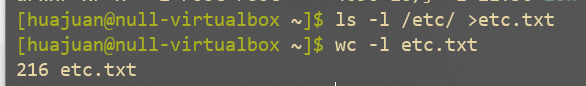

# Linux开发环境基础知识

<table><tr><td bgcolor=#E6E6FA>
 学习建议 ：《鸟哥的Linux私房菜（基础学习篇）》
</td></tr></table>


## 1. 如何登陆Linux

  Linux登录方式主要有两种：

  - 本地登录：只要启动虚拟机即可，类似于打开自己电脑直接连接显示器的方式；可以通过`Ctrl + Alt + F[1-6]`在6个虚拟控制台之间进行切换。需要注意的是，远程实验平台不能用本地登录。
  - 远程登录：对于Windows用户来说，可以通过MobaXterm、Windows Terminal、putty等工具远程登录。

## 2. shell简介
  Shell意思为命令行界面，是运行命令行的应用程序，它本身是一个用C语言编写的程序。shell是用户使用Linux的桥梁，用户通过shell来控制Linux系统，Linux系统通过shell展示系统信息。

  常见的shell有：`bash`、`sh`、`csh`、`ksh`等，可以在创建用户时指定用户的登录shell，也可以输入shell名称打开一个新的shell。

<div align="center">  </div>

openEuler用户的默认登录shell是`bash`。

系统提示符默认表示的是：`[当前登录用户@主机名 当前所在位置]$`


!!! warning "注意事项"
    root用户最后一个提示符通常是#，普通用户最后一个提示符通常是$。
    
    上图`[cs@localhost \~]$`，其中`\~`符号表示是个人目录的地址，因为每个用户都有自己的个人目录地址，所以用`\~`作为统一替代这个根据不同用户而不同但又有规律可循的地址，以确保某些情况下的兼容问题。例如，以root用户登录，`\~`代表`/root/`，如果以cs用户登录，`\~`代表`/home/cs/`。


## 3. Linux用户

root是Linux系统中的一个特殊管理员，通常称为超级管理员，类似于Windows系统中的Administrator。root用户拥有最高权限，甚至可以无限的破坏系统！除非必要，请勿使用root用户！

可以通过命令提示符清楚了解当前是root用户（`#`）还是普通用户（`$`）。

常用的管理用户的命令如下：

- `useradd name`：增加用户，需要在root权限下，通过useradd命令可以为系统添加新用户信息
- `su - username`：切换用户
- `sudo`：允许普通用户执行管理员账号才能执行的命令
- `id` 查看当前用户名
  

如果该用户在root下没有权限（一般来说，系统当然不会允许任何用户都能够以超级用户的身份运行命令），需要在root下给该用户添加权限。

<div align="center">  </div>

!!! warning ""
    下面以openEuler系统为例，介绍如何添加用户权限。使用远程实验平台的同学可以忽略这一小节。

到openEuler虚拟机里，输入

```shell
# visudo
```

进入vi编辑器，输入`/Allow root`，定位到`## Allow root to run any commands anywhere`，接着按下`i`键，进行编辑模式（最下面一行显示`-- INSERT --`），增加：

```bash
cs	ALL=(ALL)	ALL
```

授权cs用户在任何主机上执行任何命令。第一个ALL表示所有计算机；第二个ALL表示所有用户，第三个ALL表示所有命令。


<div align="center">  </div>

编辑完成后，按`Esc`键退出编辑模式，再输入`:wq`，回车，保存并退出。（输入`:q!`是不保存并退出）

再到cs用户下，执行sudo命令，这时就能够执行sudo命令了。

<div align="center">  </div>


## 4. 修改密码

可以通过`passwd`修改自己的密码。

openEuler系统修改用户密码时需要满足密码复杂度要求，密码的复杂度要求如下：

- 口令长度至少8个字符。

- 口令至少包含大写字母、小写字母、数字和特殊字符的任意3种。

- 口令不能和账号一样。

- 口令不能使用字典词汇。


## 5. 查看系统信息

- 查看系统信息：`cat /etc/os-release`
- 查看 CPU 信息：`lscpu`
- 查看内存信息：`free`
- 查看磁盘信息：`fdisk -l`
- 查看系统资源实时信息：`top`
- 显示当前的日期和本地时间：`date`
- 显示当前的日期和 UTC 时间：`date --utc/--u`

## 6. bash shell快捷的操作

- `tab`

可以使用`tab`键补全功能，快速输入命令或参数

- `history`

`history`工具记录了历史命令，可以使用history查看历史命令。

- 上下键

可以按上下键快速翻阅历史命令

- `home`与`end`

当想要将光标快速移动到当前行首或行尾时，可以按home或end键。

- `clear`与`Ctrl + L`

当页面被字符充满，想快速清屏时，可以输入clear或者按下Ctrl + L组合键快速清屏。

- `Ctrl + C` 终止当前程序的执行
- `Ctrl + Z` 挂起当前程序
- `Ctrl + D` 终止输入（若正在使用 Shell，则退出当前 Shell）


## 7. 基础命令

### 7.1 `ls` 显示内容

Linux `ls`（英文全拼：list files）命令用于显示指定工作目录下之内容（列出目前工作目录所含之文件及子目录)。

``` bash
 ls [-alrtAFR] [name...]
```

- `-a` `--all`的缩写，显示所有文件及目录，包括隐藏文件(以`.`开头的文件)
- `-l` 除文件名称外，亦将文件型态、权限、拥有者、文件大小等资讯详细列出
- `-r` 将文件以相反次序显示(原定依英文字母次序)
- `-t` 将文件依建立时间之先后次序列出
- `-A` `--almost-all`的缩写，显示所有的文件，包括隐藏文件，但不包括表示当前目录`.` 和上级目录`..` 这两个文件。
- `-F` 在列出的文件名称后加一符号；例如可执行档则加`*`, 目录则加`/`
- `-R` 若目录下有文件，则以下之文件亦皆依序列出

示例：

假设一个目录下有文件`foo`, `bar`, `foobar`, `.foo`, `.bar`和子目录`baz`, `.foobar`，那么输入

```bash
$ ls
```

则结果是

```bash
bar  baz  foo  foobar
```

以“.”开头的文件是隐藏文件或目录，因此不在这里显示。若要显示隐藏项，则需要加上`-a`或`-A`参数。这两者的区别是，前者会显示`.`和`..`这两个特殊的目录，后者则不显示。下面给出一段`bash`输入输出示例

```bash
$ ls -a
.  ..  .bar  bar  baz  .foo  foo  .foobar  foobar
$ ls -A
.bar  bar  baz  .foo  foo  .foobar  foobar
```

有的时候，我们需要显示文件和目录的详细信息，如访问权限、所有者、文件大小、修改时间等，这时需要用到`-l`参数

```bash
$ ls -l
total 4
-rw-rw-r-- 1 camel camel    0 Sep 16 23:31 bar
drwxrwxr-x 2 camel camel 4096 Sep 16 23:32 baz
-rw-rw-r-- 1 camel camel    0 Sep 16 23:31 foo
-rw-rw-r-- 1 camel camel    0 Sep 16 23:31 foobar
```

同前面一样，`ls`默认不显示隐藏文件或目录。如果需要同时显示隐藏文件或目录的详细信息，应该再加上`-a`或`-A`参数，可以输入`ls -la`, `ls -lA`, `ls -l -a`, `ls -l -A`等。参数的顺序在这里不重要。


### 7.2 `mkdir` 建立文件夹

Linux `mkdir`（英文全拼：make directory）命令用于创建目录。

默认情况下，使用`mkdir`创建目录需要一层一层建立。假如要创建`/home/cs/work/test`，必须要有`/home/cs/work`目录，才能在work目录下创建test子目录。

`-p`选项：系统会自动依序建立/home、/home/cs、/home/cs/work、/home/cs/work/test，如果该目录本来已存在，系统也不会显示错误信息。建议常用-p选项
。

``` shell
$ mkdir [-p] dirName
```

示例：在一个不包含任何文件和子目录的目录下，创建目录`foo`和`foo/bar/foobar`。

```bash
$ ls
$ mkdir foo
$ ls
foo
$ mkdir foo/bar/foobar
mkdir: cannot create directory 'foo/bar/foobar': No such file or directory
$ mkdir -p foo/bar/foobar
$ ls -R
.:
foo

./foo:
bar

./foo/bar:
foobar

./foo/bar/foobar:
```

在这里，我们先创建了目录`foo`，再尝试创建目录`foo/bar/foobar`，但是后面一个目录无法直接创建，这是因为`mkdir`默认情况下只能在上级目录（这里是`foo/bar`）已存在的时候创建指定目录。如果希望能逐级将`foo`、`foo/bar`和`foo/bar/foobar`依次创建，则需要加上`-p`参数，即运行`mkdir -p foo/bar/foobar`。后面使用`ls -R`命令依次列出当前目录及其所有子目录下面包含的内容，可以说明前面命令成功执行。

### 7.3 `rmdir` 删除文件夹

Linux `rmdir`（英文全拼：remove directory）命令删除空的目录。

如同上述`mkdir`一样，`rmdir`删除目录也需要一层一层删除，而且被删除的目录里面不能存在其他的目录或文件，即只能删除空目录。

`-p`选项：可以递归删除指定的多级目录，但是要求每个目录也必须是空目录。

```shell
$ rmdir [-p] dirName
```


### 7.4 `rm` 删除命令

上述rmdir命令只能删除空目录，当要删除非空目录时，就要使用带有`-r`选项的`rm`命令。

Linux `rm`（英文全拼：remove）命令用于删除一个文件或者目录。

``` shell
$ rm [options] name...
 -i 删除前逐一询问确认。
 -f 即使原档案属性设为唯读，亦直接删除，无需逐一确认。
 -r 将目录及以下之档案亦逐一删除。
```

如果需要将一个目录及其所有内容都删除，则可以使用`rm -r`。

### 7.5 `cd` 切换目录

Linux `cd`（英文全拼：change directory）命令用于切换当前工作目录。

其中 dirName 表示法可为绝对路径或相对路径。若目录名称省略，则变换至使用者的 home 目录 (也就是刚 login 时所在的目录)。

另外，`~` 也表示为 个人目录的地址， `.` 则是表示目前所在的目录， `..`则表示目前目录位置的上一层目录。

``` shell
$ cd [dirName]
```

- dirName：要切换的目标目录。

### 7.6 `vi` 文本编辑模式

``` shell
$ vi/vim/bash
```

### 7.7 `echo` 命令

- 显示普通字符串:  

```bash
 $ echo "It is a test"  
```

   输出  It is a test

- 显示转义字符  

  ```bash
   $ echo "\"It is a test\""
  ```

   输出  "It is a test"

- 显示结果定向至文件

  ```bash
  $ echo "It is a test" > myfile
  ```

- 显示变量 

```bash
$ export temp_var=haha
$ echo $temp_var
```

其中，`export`命令用于定义变量。之后，若需要在`echo`中使用到之前的定义，应在变量名前加上\$符号。

###  7.8 `cat` 打印文件

`cat`（英文全拼：concatenate）命令用于连接文件并打印到标准输出设备上。

```bash
$ cat [-AbeEnstTuv] [--help] [--version] fileName
```

- `-n` 或 `--number`：由 1 开始对所有输出的行数编号。
- `-b` 或 `--number-nonblank`：和 -n 相似，只不过对于空白行不编号。
- `-s` 或 `--squeeze-blank`：当遇到有连续两行以上的空白行，就代换为一行的空白行。
- `-v` 或 `--show-nonprinting`：使用 ^ 和 M- 符号，除了 LFD 和 TAB 之外。
- `-E` 或 `--show-ends` : 在每行结束处显示 $。
- `-T` 或 `--show-tabs`: 将 TAB 字符显示为 ^I。
- `-A`, `--show-all`：等价于 -vET。
- `-e`：等价于"-vE"选项；
- `-t`：等价于"-vT"选项；

示例：显示某个文件内容（如`ln.c`文件），并将其各行进行编号

```bash
$ cat -n ln.c
     1  #include "kernel/types.h"
     2  #include "kernel/stat.h"
     3  #include "user/user.h"
     4
     5  int
     6  main(int argc, char *argv[])
     7  {
     8    if(argc != 3){
     9      fprintf(2, "Usage: ln old new\n");
    10      exit(1);
    11    }
    12    if(link(argv[1], argv[2]) < 0)
    13      fprintf(2, "link %s %s: failed\n", argv[1], argv[2]);
    14    exit(0);
    15  }
```


### 7.9 `cp` 复制文件

Linux `cp`（英文全拼：copy file）命令主要用于复制文件或目录。

```shell 
$ cp [options] source dest
或
$ cp [options] source... directory
```

- `-a`：此选项通常在复制目录时使用，它保留链接、文件属性，并复制目录下的所有内容。其作用等于dpR参数组合。
- `-d`：复制时保留链接。这里所说的链接相当于Windows系统中的快捷方式。
- `-f`：覆盖已经存在的目标文件而不给出提示。
- `-i`：与-f选项相反，在覆盖目标文件之前给出提示，要求用户确认是否覆盖，回答"y"时目标文件将被覆盖。
- `-p`：除复制文件的内容外，还把修改时间和访问权限也复制到新文件中。
- `-r`：若给出的源文件是一个目录文件，此时将复制该目录下所有的子目录和文件。
- `-l`：不复制文件，只是生成链接文件。

### 7.10 `mv` 改名或移动文件

Linux `mv`（英文全拼：move file）命令用来为文件或目录改名、或将文件或目录移入其它位置。

```bash
$ mv [options] source dest
$ mv [options] source... directory
```

- `-b`: 当目标文件或目录存在时，在执行覆盖前，会为其创建一个备份。
- `-i`: 如果指定移动的源目录或文件与目标的目录或文件同名，则会先询问是否覆盖旧文件，输入 y 表示直接覆盖，输入 n 表示取消该操作。
- `-f`: 如果指定移动的源目录或文件与目标的目录或文件同名，不会询问，直接覆盖旧文件。
- `-n`: 不要覆盖任何已存在的文件或目录。
- `-u`：当源文件比目标文件新或者目标文件不存在时，才执行移动操作。

示例：假设有个文件`foo`，现需要将它重命名为`bar`

```bash
$ ls
foo
$ mv foo bar
$ ls
bar
```


### 7.11 `find` 查找文件

Linux `find` 命令用来在指定目录下查找文件。任何位于参数之前的字符串都将被视为欲查找的目录名。如果使用该命令时，不设置任何参数，则 `find` 命令将在当前目录下查找子目录与文件。并且将查找到的子目录和文件全部进行显示。

```bash
$ find path -option [ -print ] [ -exec -ok command ] {} \;
```

示例:

```bash
$ find . -name "*.c"
```

上述示例功能：寻找当前目录及其各级子目录下.c后缀的文件。


Linux locate命令用于查找符合条件的文档，他会去保存文档和目录名称的数据库内，查找合乎范本样式条件的文档或目录。

一般情况我们只需要输入`locate your_file_name`即可查找指定文件。

```bash
locate [-d ][--help][--version][范本样式...]
```

示例:

查找 passwd 文件，输入以下命令：

```bash
locate passwd
```

**PS:** *locate 与 find 不同: find 是去硬盘找，locate 只在 /var/lib/slocate 资料库中找。*

`locate` 的速度比 `find` 快，它并不是真的查找，而是查数据库，一般文件数据库在 `/var/lib/slocate/slocate.db` 中，所以 `locate` 的查找并不是实时的，而是以数据库的更新为准，一般是系统自己维护，也可以手工升级数据库 ，命令为：

```shel
updatedb
```


### 7.12 `grep` 正则匹配文件内容

Linux `grep` 命令用于查找文件里符合条件的字符串。

`grep` 指令用于查找内容包含指定的范本样式的文件，如果发现某文件的内容符合所指定的范本样式，预设 `grep` 指令会把含有范本样式的那一列显示出来。若不指定任何文件名称，或是所给予的文件名为 **-**，则 grep 指令会从标准输入设备读取数据。

```bash
grep [-abcEFGhHilLnqrsvVwxy][-A<显示列数>][-B<显示列数>][-C<显示列数>][-d<进行动作>][-e<范本样式>][-f<范本文件>][--help][范本样式][文件或目录...]
```

示例:

```bash
grep test *file 
```

结果如下:

```bash
$ grep test test* #查找前缀有“test”的文件包含“test”字符串的文件  
testfile1:This a Linux testfile! #列出testfile1 文件中包含test字符的行  
testfile_2:This is a linux testfile! #列出testfile_2 文件中包含test字符的行  
testfile_2:Linux test #列出testfile_2 文件中包含test字符的行 
```


### 7.13 `man` 帮助命令

`man`命令是Linux下的帮助指令，通过`man`指令可以查看Linux中的指令帮助、配置文件帮助和编程帮助等信息。

```bash
man [options] [args]
```

- `-a`：在所有的man帮助手册中搜索；
- `-f`：等价于whatis指令，显示给定关键字的简短描述信息；
- `-P`：指定内容时使用分页程序；
- `-M`：指定man手册搜索的路径。

示例：查询`ps`命令的手册

```bash
man ps
```

### 7.14 `diff`比较差异

Linux `diff`命令用于比较文件的差异。

`diff`以逐行的方式，比较文本文件的异同处。如果指定要比较目录，则diff会比较目录中相同文件名的文件，但不会比较其中子目录。

```
diff [-abBcdefHilnNpPqrstTuvwy][-<行数>][-C <行数>][-D <巨集名称>][-I <字符或字符串>][-S <文件>][-W <宽度>][-x <文件或目录>][-X <文件>][--help][--left-column][--suppress-common-line][文件或目录1][文件或目录2]
```

示例：有两个文件`foo.txt`和`bar.txt`，内容分别为

```bash
$ cat -n foo.txt
abc
def
$ cat -n bar.txt
abd
def
ghj
```

使用`diff`命令比较它们的不同

```bash
1c1
< abc
----
> abd
2a3,
> ghj
```


### 7.15 `ps`查看进程状态

Linux `ps` （英文全拼：process status）命令用于显示当前进程的状态.

```bash
ps [options] [--help]
```

- -A 列出所有的行程
- -w 显示加宽可以显示较多的资讯
- -au 显示较详细的资讯
- -aux 显示所有包含其他使用者的行程

### 7.16 `top`任务管理器

Linux `top`命令用于实时显示 process 的动态。

```bash
top [-] [d delay] [q] [c] [S] [s] [i] [n] [b]
```


### 7.17 `tar`打包和解包

Linux `tar`（英文全拼：tape archive ）命令用于备份文件。

`tar` 是用来建立，还原备份文件的工具程序，它可以加入，解开备份文件内的文件。

首先要弄清两个概念：打包和压缩。打包是指将一大堆文件或目录变成一个总的文件；压缩则是将一个大的文件通过一些压缩算法变成一个小文件。

为什么要区分这两个概念呢？这源于Linux中很多压缩程序只能针对一个文件进行压缩，这样当你想要压缩一大堆文件时，你得先将这一大堆文件先打成一个包（tar命令），然后再用压缩程序进行压缩（gzip bzip2命令）。

linux下最常用的打包程序就是tar了，使用tar程序打出来的包我们常称为tar包，tar包文件的命令通常都是以.tar结尾的。生成tar包后，就可以用其它的程序来进行压缩。


打包命令示例:

```bash
tar -cvf log.tar log2012.log

tar -zcvf log.tar.gz log2012.log

tar -jcvf log.tar.bz2 log2012.log

zip FileName.zip DirName
```

tar -cvf log.tar log2012.log  仅打包，不压缩.

tar -zcvf log.tar.gz log2012.log  打包后，以 gzip 压缩 

tar -jcvf log.tar.bz2 log2012.log 打包后，以 bzip2 压缩 


解包示例:

```bash
tar -zxvf file.tar.gz //解压tar.gz

tar -jxvf file.tar.bz2 //解压 tar.bz2

unzip file.zip //解压zip
```

### 7.18 ln链接

`ln`命令用于创建链接，分为硬链接和软链接。

创建硬链接的方式为

```bash
ln file_name link_name
```

创建软链接的方式为

```bash
ln -s file_name link_name
```

### 7.19 `ip addr` 显示或设置网络状态

可以使用 `ip addr`命令查看IP地址

```bash
# ip addr
1: lo: <LOOPBACK,UP,LOWER_UP> mtu 65536 qdisc noqueue state UNKNOWN group default qlen 1000
    link/loopback 00:00:00:00:00:00 brd 00:00:00:00:00:00
    inet 127.0.0.1/8 scope host lo
       valid_lft forever preferred_lft forever
    inet6 ::1/128 scope host
       valid_lft forever preferred_lft forever
2: ens33: <BROADCAST,MULTICAST,UP,LOWER_UP> mtu 1500 qdisc fq_codel state UP group default qlen 1000
    link/ether 00:0c:29:61:40:aa brd ff:ff:ff:ff:ff:ff
    inet 192.168.163.134/24 brd 192.168.163.255 scope global dynamic noprefixroute ens33
       valid_lft 1729sec preferred_lft 1729sec
    inet6 fe80::3b1e:b490:7d7f:ebd0/64 scope link noprefixroute
       valid_lft forever preferred_lft forever
```

上述命令结果显示两部分，lo和ens33，如果有多块网卡，每块网卡都会显示一部分。

1.  `lo`：全称loopback，是回环地址，经常被分配到`127.0.0.1`地址上，用于本机通信，经过内核处理后直接返回，不会在任何网络中出现。
2. `ens33`：网卡名，如果有多块网卡，会有多个ens 或其它名称。上述IP地址是`192.168.163.134/24`


## 8. Linux重定向和管道  

```bash
command < input.txt 1> output.txt 2>err.txt  
command1 | command2 | command3 | ...  
```

### 8.1 重定向

<center>

| 命令            | 说明                                               |
| :-------------- | :------------------------------------------------- |
| command > file  | 将输出重定向到 file。                              |
| command < file  | 将输入重定向到 file。                              |
| command >> file | 将输出以追加的方式重定向到 file。                  |
| n > file        | 将文件描述符为 n 的文件重定向到 file。             |
| n >> file       | 将文件描述符为 n 的文件以追加的方式重定向到 file。 |
| n >& m          | 将输出文件 m 和 n 合并。                           |
| n <& m          | 将输入文件 m 和 n 合并。                           |
| << tag          | 将开始标记 tag 和结束标记 tag 之间的内容作为输入。 |

</center>

一般情况下，每个 Unix/Linux 命令运行时都会打开三个文件：

- 标准输入文件(stdin)：stdin的文件描述符为0，Unix程序默认从stdin读取数据。
- 标准输出文件(stdout)：stdout 的文件描述符为1，Unix程序默认向stdout输出数据。
- 标准错误文件(stderr)：stderr的文件描述符为2，Unix程序会向stderr流中写入错误信息。

默认情况下，`command > file` 将 stdout 重定向到 file，`command < file` 将stdin 重定向到 file。

如果希望 stderr 重定向到 file，可以这样写：

```shell
$ command 2 > file
```

如果希望 stderr 追加到 file 文件末尾，可以这样写：

```shell
$ command 2 >> file
```

### 8.2 管道

若想统计 /etc目录下文件的详细信息，正常的使用需要两个步骤。

<div align="center">  </div>

显然，etc.txt 作为中间buffer，没有二次使用的需要，为省略这种麻烦，同时提高代码效率，我们需要使用管道这个功能。

<div align="center">  </div>

对比以上两种方法，我们也可以理解为，管道本质上就是一个文件，前面的进程以写方式打开文件，后面的进程以读方式打开。这样前面写完后面读，于是就实现了通信。实际上管道的设计也是遵循UNIX的“一切皆文件”设计原则的，它本质上就是一个文件。Linux系统直接把管道实现成了一种文件系统，借助VFS给应用程序提供操作接口。

虽然实现形态上是文件，但是管道本身并不占用磁盘或者其他外部存储的空间。在Linux的实现上，它占用的是内存空间。所以，Linux上的管道就是一个操作方式为文件的内存缓冲区。

