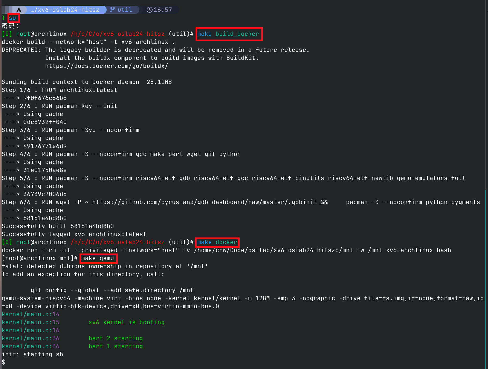

# 实验平台搭建以及环境配置

&emsp;&emsp;本课程为同学们提供了 **远程实验平台** ，以便于进行实验操作。同时，我们也鼓励同学们尝试自行搭建实验环境（传统手动安装或者Docker容器化部署），体验一下自己动手的乐趣: ) 

&emsp;&emsp;以下是三种实验环境的对比：

| **特性/环境类型**   | **远程实验平台**     | **手动安装本地实验环境**   | **Docker容器化实验环境**     |
| ------------------ | ------------------ | ------------------ | ------------------ |
|便利性               | 高，即开即用        |	低，需要手动配置    |	中，需要构建Docker镜像  |
|控制性             |低，无root安装权限         |	高，完全控制        |	中，受限于容器限制  |
|性能               |标准                   |	高，可利用全部硬件资源|	中，比虚拟机更轻量  |
|稳定性	            |依赖于服务器           |	高，本地控制        |	中，依赖于Docker配置    |
|访问性             |依赖校园网	            |完全本地访问	        |依赖Docker环境         |

## 1. 远程实验平台

&emsp;&emsp;远程实验平台已在实验中心的服务器上部署了XV6实验环境，并且所有依赖配置都已预先搭建完毕。同学们只需要下载xv6实验包即可完成实验，无需再进行安装（当然，大家也没有root权限来安装）。无论你的电脑性能如何，只要你还能连上校园网，无论你是在宿舍、实验室还是自习室，你都可以通过远程平台完成实验。更多关于远程实验平台的使用方法和技巧，请参考[远程实验环境使用指南](../remote_env/)。

!!! warning
    尽管我们已经采取了一些措施以确保远程环境的稳定性，但在某些特殊情况下，我们无法保证不会出现故障。为了安全起见，建议同学们及时将代码上传至git仓库或下载到本地进行保存。

## 2. 自行部署的本地实验环境

!!! note
    虽然远程实验平台已经部署好了所需的实验环境，你只需根据实验要求编写代码即可。但实际上，你将无法了解项目的所有细节，也难以掌握整个项目的架构。因此，我们建议同学们自己动手搭建实验环境，这样你得到的收获才是最大的: )

!!! tip "部署实验平台所需工具"

    对于本课程的实验平台搭建，我们需要用到几个工具：

    - WSL2

    &emsp;&emsp;如果你的电脑安装的是Windows 10或Windows 11，推荐使用WSL2（Windows Subsystem for Linux 2）来搭建Linux环境。WSL2不仅能够在Windows系统中高效运行Linux内核，而且相比于WSL1具有更好的性能和完全的Linux系统调用兼容性。WSL2支持运行主流的Linux发行版（如Ubuntu、Debian等），并能够直接访问Windows的文件系统，可以通过Windows自带的文件资源管理器，像操作Windows的文件那样操作WSL上的文件，并且可以在WSL和Windows之间直接进行文件拖拽。通过WSL2可以避免使用虚拟机，占用的系统资源更少，操作也更加便捷。

    &emsp;&emsp;如何安装WSL并使用WSL进行开发？请参阅官方文档[WSL文档](https://learn.microsoft.com/zh-cn/windows/wsl/)。

    - VirtualBox虚拟机

    &emsp;&emsp;如果你的电脑装的是Windows系统，那么你也可以选择能运行Linux系统的虚拟机。VirtualBox是一款开源虚拟机软件，相对VMWare等其他虚拟机来说，速度稍慢，灵活性较差，但免费！

    - Linux发行版

    &emsp;&emsp;Linux发行版是由Linux内核、GNU工具、附加软件和软件包管理器组成的操作系统。所谓“发行”，是由某些机构“发行”了Linux内核以及所有必要的软件及实用程序，使其可以作为一个操作系统使用。主流的Linux发行版有Ubuntu、Debian、Fedora、Centos等，国产Linux发行版有openEuler、Deepin等。

    - RISC-V工具链

    &emsp;&emsp;包括一系列交叉编译的工具，如gcc、binutils、glibc等，用于把源码编译成机器码。

    - QEMU模拟器

    &emsp;&emsp;用于在X86架构的电脑上模拟RISC-V架构的CPU。在实验中，我们将通过QEMU模拟器观察xv6的运行过程。QEMU通过模拟取指、译码、执行等步骤来仿真RISC-V处理器的操作。回想我们在《计算机设计与实践》的CPU实验，是不是有似曾相识的感觉: )

!!! warning "注意事项"
    &emsp;&emsp;请确保你的计算机已经安装有ubuntu、Centos或Debian等其他Linux发行版。如果你使用的是Windows系统，推荐利用WSL2来安装并运行Linux环境，或者通过虚拟机来安装Linux。下面的XV6环境配置安装指导以Ubuntu系统为例。若你计划安装其他Linux系统，请参考详细的XV6环境安装指南: https://pdos.csail.mit.edu/6.S081/2020/tools.html。

### 2.1 XV6环境配置

#### 2.1.1 安装依赖包

!!! warning "注意事项"
    在执行以下命令时，不需要复制输入命令前的“#”或"$"符号，只需输入符号后的命令。

&emsp;&emsp;安装XV6需要用到的依赖包

```shell
$ sudo apt-get install git build-essential gdb-multiarch qemu-system-misc gcc-riscv64-linux-gnu binutils-riscv64-linux-gnu
```

#### 2.1.2 安装RISC-V GNU编译器工具链

```shell
$ git clone --recursive https://github.com/riscv/riscv-gnu-toolchain
```

&emsp;&emsp;如果下载速度太慢，你可以直接使用已经下载好的包。下载完成后，将riscv-gnu-toolchain.tar.gz上传至Linux系统中并解压：

> 下载地址（校内网）： https://mirrors.osa.moe/misc/， 选择riscv-gnu-toolchain.tar.gz。下载完成后，需要将riscv-gnu-toolchain.tar.gz上传至Linux系统中，上传方法详见MobaXterm(SSH工具)这一节中的[文件传输SFTP服务](../tools/#12-sftp)。上传到Linux系统中，需要对RISC-V GNU编译器工具链进行解压，解压命令如下：

> ```shell
> $ tar zxvf riscv-gnu-toolchain.tar.gz
> ```

&emsp;&emsp;接下来，下载编译工具链所需的依赖包：

```shell
$ sudo apt-get install autoconf automake autotools-dev curl libmpc-dev libmpfr-dev libgmp-dev gawk build-essential bison flex texinfo gperf libtool patchutils bc zlib1g-dev libexpat-dev
```

&emsp;&emsp;安装RISC-V GNU编译器工具链

```shell
$ cd riscv-gnu-toolchain
$ ./configure --prefix=/usr/local
$ sudo make
$ cd ..
 
$ rm riscv-gnu-toolchain.tar.gz
rm: remove regular file 'riscv-gnu-toolchain.tar.gz'? y
$ 
```

#### 2.1.3 安装QEMU

&emsp;&emsp;下载QEMU

```shell
$ wget https://download.qemu.org/qemu-5.1.0.tar.xz
$ tar xf qemu-5.1.0.tar.xz
```

安装

```shell
$ cd qemu-5.1.0
$ ./configure --disable-kvm --disable-werror --prefix=/usr/local --target-list="riscv64-softmmu"
$ make
$ make install
$ cd ..
 
$ rm qemu-5.1.0.tar.xz
rm: remove regular file 'qemu-5.1.0.tar.xz'? y
$ 
```

检查安装是否成功

```shell
$ riscv64-unknown-elf-gcc --version
riscv64-unknown-elf-gcc (GCC) 10.2.0
...

$ qemu-system-riscv64 --version
QEMU emulator version 5.1.0
```

### 2.2 运行XV6

```shell
$ git clone https://gitee.com/ftutorials/xv6-oslab24-hitsz.git
Cloning into 'xv6-oslab24-hitsz'...
...
# 如果是初次运行git，设置你自己的gitee用户信息
$ git config --global user.email "you@example.com"
$ git config --global user.name "Your Name"
...
$ cd xv6-oslab24-hitsz
$ git checkout util
$ make qemu
# ... lots of output ...
init: starting sh
$
```

&emsp;&emsp;当可以看到“`init: starting sh`”的字样表示xv6已经正常启动，此时在“`$`”提示符后可输入xv6支持的shell命令。

&emsp;&emsp;请记住QEMU的退出方法：**同时按下Ctrl + a，全部松开，再按下x以退出QEMU**。

&emsp;&emsp;至此，XV6已经能够正常运行了: )


## 3. Docker容器化实验环境

&emsp;&emsp;使用Docker来设置xv6的实验环境确实是一个方便且高效的选择，可以避免手动安装复杂依赖和配置：）

&emsp;&emsp;Docker 是一个开源的平台，旨在简化应用程序的开发、测试和部署。它使用容器化技术，将应用程序及其依赖环境打包到一个标准化的单元（称为容器）中，从而确保应用程序可以在任何地方一致运行，无论是开发环境、测试环境还是生产环境。

### 3.1 Docker的关键概念

- **镜像 (Image)** ：镜像是Docker容器的只读模板。它包含应用程序所需的所有文件、依赖库、配置等。开发者可以基于现有的镜像创建新的镜像。
- **容器 (Container)** ：容器是从镜像创建的运行实例。每个容器都是独立的，彼此之间隔离，可以拥有自己的文件系统、进程、网络等。容器轻量且启动迅速。
- **Dockerfile** ：Dockerfile 是一个包含一系列指令的文本文件，定义了如何构建一个镜像。通过Dockerfile，开发者可以描述应用程序及其依赖项的构建步骤。
- **Docker Hub** ：这是一个在线仓库，用于存储和共享Docker镜像。开发者可以从Docker Hub下载公共镜像，也可以上传自己创建的镜像。

### 3.2 Docker的优点

- **跨平台兼容** ：容器中的应用程序不依赖于主机的操作系统环境，可以跨平台运行。
- **高效资源利用** ：容器比虚拟机更轻量，启动速度更快，能够高效利用系统资源。
- **易于管理和部署** ：Docker可以将应用程序及其依赖打包在一起，简化了部署过程，减少了环境配置问题。

### 3.3 通过Docker启动xv6

&emsp;&emsp;以下是一个基本的步骤指南，帮助你在Linux环境下使用Docker来构建和运行xv6的Docker容器。

#### 3.3.1 Docker安装

&emsp;&emsp;首先，确保你的Linux系统上安装了Docker。你可以通过访问Docker的官方网站或使用包管理器来安装Docker。

&emsp;&emsp;参考官网[安装指南](https://docs.docker.com/get-started/get-docker/)。

#### 3.3.2 启动xv6

&emsp;&emsp;获取xv6-oslab24-hitsz实验包，详见[XV6实验框架代码](../#3-xv6)。

&emsp;&emsp;我们在 xv6-oslab24-hitsz 目录下配好了 Dockerfile，只需要在 Linux 命令行中进入该目录：

1. 切换到util分支。
2. 使用 `su` 命令进入 root 用户。
3. 使用 `make build_docker` 构建 docker 镜像（仅需构建一次）。
4. 使用 `make docker` 启动容器进入 bash 终端。
5. 使用 `make qemu` 命令启动 xv6。


