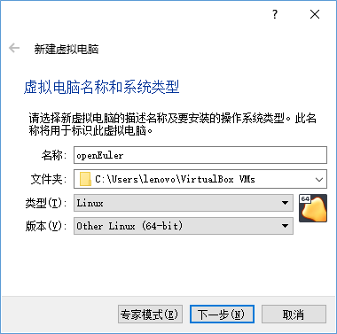
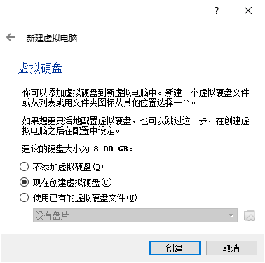
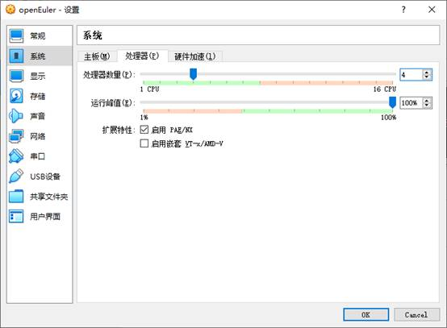
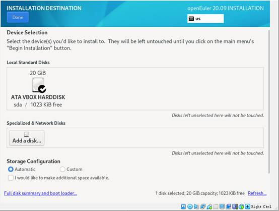
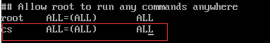
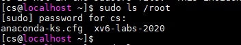

# 实验平台搭建以及环境配置

本课程实验提供了 **远程实验平台** 供同学们做实验。当然，同学们也可以尝试自己部署实验环境，体验一下自己动手的乐趣：）

## 1. 远程实验平台

远程实验平台已经将XV6实验环境部署在实验中心的服务器上，我们把所有依赖的配置都已经事先搭建完毕。无论你的电脑性能如何，无论你是在宿舍、实验室还是自习室，只要你还能连上校园网，你就能完成你的实验。

!!! warning
    虽然我们已经做了一些方案保证远程环境的可靠性，但在某些特殊情况下，也不能确保不出故障，为安全起见，建议同学们将代码及时上传到git仓库或者下载到本地保存。

## 2.  自行部署的实验环境

!!! tip "用于部署实验平台的实验工具"

    对于本课程的实验平台搭建，我们需要用到几个工具：

    - VirtualBox虚拟机

    如果你的电脑装的是Windows系统，那么必须要装一个能运行Linux系统的虚拟机。VirtualBox是一款开源虚拟机软件，相对VMWare等其他虚拟机来说，速度稍慢，灵活性较差，但免费！

    - Linux发行版

    Linux发行版是由Linux内核、GNU工具、附加软件和软件包管理器组成的操作系统。所谓“发行”，是由某些机构“发行”了Linux内核以及所有必要的软件及实用程序，使其可以作为一个操作系统使用。主流的Linux发行版有Ubuntu、Debian、Fedora、Centos等，国产Linux发行版有openEuler、Deepin等，为支持国产Linux发行版，我们建议同学们使用华为公司发行的 openEuler 作为实验平台，以此揭开openEuler的神秘面纱：）

    - RISC-V工具链

    包括一系列交叉编译的工具，用于把源码编译成机器码，如gcc、binutils、glibc等。

    - QEMU模拟器

    qemu模拟器用于在电脑（X86）上模拟RISC-V架构的CPU。在实验中，我们将通过qemu模拟器来观察xv6的运行过程。QEMU本质上是通过C语言来模拟仿真RISC-V处理器，对于每一个CPU核，QEMU都会运行这么一个循环：
    (1)取指：读取4/8字节的RISC-V指令；
    (2)译码：解析RISC-V指令，并找出对应的OP code；
    (3)执行：在软件中执行相应的指令。
    QEMU主循环里也需要有寄存器文件，用于维护寄存器的状态。回想我们在《计算机设计与实践》的CPU实验，是不是有似曾相识的感觉：）


对于想在自己的电脑上安装实验环境的同学，本实验提供了两种安装方法：

- 本地虚拟机
- 自行部署实验环境
  
### 2.1  本地虚拟机

本实验提供VirtualBox + openEuler的镜像，我们也帮你把所有依赖的配置都已经事先搭建完毕，你只需要下载、导入虚拟机即可使用。步骤如下：

**Step1** . Virtualbox和openEuler镜像下载： http://10.249.14.14:8000/index.php/s/7vlEVZPKaMTIpi0

Virtualbox安装文件： VirtualBox-6.1.10-138449-Win.exe

openEuler镜像：openEuler.zip

**Step2** . VirtualBox安装以及镜像导入。

安装好VirtualBox后，解压openEuler.zip，直接双击openEuler(.vbox)文件，即可打开openEuler系统虚拟机，

镜像系统提供有两个用户，大家最好使用cs用户登录。

用户名 ：root，密码：openeuler@123

用户名 ：cs，密码：openeuler@123

**Step3** . 下载运行xv6代码

详见[2.2.4.5 运行XV6](#2245-xv6)

### 2.2  自行部署实验环境

!!! tip ""
    无论是远程实验平台，还是本地虚拟机，都是我们已经部署好的实验环境，你只需要按照实验要求编写相应的代码就行。但实际上，你无法知道项目里的所有细节，难以掌握整个项目的架构。因此，我们希望同学们能够自己动手搭建实验环境，这样你得到的收获才是最大的：）

你需自行下载并安装所有工具链（有的工具需要你自己编译），下列步骤主要以openEuler为例：

!!! warning "注意事项"
    如果你已经装有ubuntu、Centos或Debian等其他Linux系统，你可以跳过本小节，直接安装XV6的运行环境，具体安装步骤请参考:https://pdos.csail.mit.edu/6.S081/2020/tools.html

#### 2.2.1 创建虚拟机

本节假定你已经安装好Oracle VM VirtualBox 软件，打开该软件，选择“新建”按钮，进行创建虚拟机。


创建虚拟机时，请选择Linux类型和64-bit版本，也可以不安装在C盘：



为了在运行系统时有较快的速度，内存设置为8GB（或以上）：


现在就创建硬盘：



这里硬盘类型为VHD：


磁盘容量“动态分配”：


为保证足够的空间，为宿主机配置20GB大小的容量：


#### 2.2.2 对虚拟机的部分配置进行调整

**系统信息概览：**

仅保留从光驱和硬盘启动：


注意将CPU至少设置成4核以提高系统的运行速度：



设置两张网卡，一张时默认的NAT模式（以便从虚拟机中访问外网）：


一张是Host-only模式（以便从该虚拟机的宿主机访问它）：


这是此时的整个虚拟机概况：


#### 2.2.3 安装openEuler操作系统

##### 2.2.3.1 将openEuler20.09_x86-64镜像装载到光驱

需要下载好操作系统镜像到自己的本地电脑：

• openEuler 20.09安装镜像：

https://repo.openeuler.org/openEuler-20.09/ISO/x86_64/openEuler-20.09-x86_64-dvd.iso 

下载完成后，打开VirtualBox虚拟机。


点击如上图所示“openEuler.vhd”（光驱）文字按钮。


点击“选择虚拟盘”然后选择先前自己下载到本地磁盘的openEuler安装镜像。


操作完毕后光驱中会显示该镜像的名称。

##### 2.2.3.2 安装操作系统

启动虚拟机，移动键盘的上下键选择“Install openEuler 20.09”菜单项并按下回车键进入安装界面：


选择英文版安装：


进入如下界面


保持安装磁盘的默认设置：



其他选项保持默认设置：

**设置Root Password**

注意：只需要设置root账户密码即可，root账户密码必须设置。

推荐密码：**openeuler@123**


点击“开始安装”按钮开始安装：


安装完成后点击“重启系统”按钮：


再次进入菜单选择界面时，移动键盘的上下键以将系统停留在该界面：


这时需要关机虚拟机：


移出光驱中的镜像：


若提示是否强行移出则选择强行移出：

重启虚拟机，系统进入openEuler启动界面，用上下键选择第一个菜单项并按回车键启动（默认也是以第一个菜单项启动）：


先在VirtualBox中以root用户登录openEuler操作系统：


至此，已完成虚拟机openEuler安装。

#### 2.2.4 XV6环境配置

##### 2.2.4.1 安装依赖包

安装openEuler提供的Development Tools

!!! warning "注意事项"
    第一个字符“#”或"\$"不需要输入，只需要输入“#”或"\$"后的字符串。

```console
# yum group install -y "Development Tools"
```

安装XV6需要用到的依赖包

```console
# yum install autoconf automake curl gawk bison flex texinfo gperf libtool patchutils bc expat-devel pixman-devel
```

##### 2.2.4.2 新建用户

使用root用户操作系统是一件很危险的事情，因为root用户拥有最高权限，可以为所欲为，一旦出错很难定位和恢复。因此，建议同学们新建普通用户。

!!! note "root用户"
    一个用户代表一个实体，它有权限运行用户进程，对文件拥有所有权。用户机制主要用于权限管理，在一定限制下，用户可以终止和改变他的进程的行为，但是，对于其他用户的进程无权干预。root用户可以终止其他用户的进程，读取系统中的任何文件。虽然root用户权限很高，但是还是在用户模式而非内核模式中运行。

新建cs用户名和密码。

```console
# useradd cs
# passwd cs
Changing password for user cs.
New password:
Retype new password:
```

记住你的用户密码和root密码。

```console
# su cs
```

切换至cs用户下运行。


!!! note "回退到root用户"
    <font size=3>在cs用户模式下，输入exit，则退出cs用户模式，回退到root用户模式。</font>

一般来说，系统不会允许任何用户都能够以超级用户的身份运行命令。下图中，当我们输入sudo提权时，显示cs用户不能运行sudo命令，那么我们需要在root下给cs用户添加权限。


修改方法如下：

到openEuler虚拟机里，输入

```console
# visudo
```

进入vi编辑器，输入”/Allow root“，定位到”## Allow root to run any commands anywhere“，接着按下”i“键，进行编辑模式（最下面一行显示-- INSERT --），增加：

```bash
cs	ALL=(ALL)	ALL
```

授权cs用户在任何主机上执行任何命令。第一个ALL表示所有计算机；第二个ALL表示所有用户，第三个ALL表示所有命令。



编辑完成后，按”Esc“键退出编辑模式，再输入”:wq“，回车，保存并退出。

再到cs用户下，执行sudo命令，这时就能够执行sudo命令了。




##### 2.2.4.3 安装RISC-V GNU Compiler Toolchain

```console
$ git clone --recursive https://github.com/riscv/riscv-gnu-toolchain
```

如果下载太慢，可以直接用已经下载好的包。

下载地址： http://10.249.14.14:8000/index.php/s/7vlEVZPKaMTIpi0， 选择riscv-gnu-toolchain.tar.gz。下载完成后，需要将riscv-gnu-toolchain.tar.gz上传至Linux系统中，上传方法详见MobaXterm(SSH工具)这一节中的[文件传输SFTP服务](../tools/#12-sftp)。

解压命令

```console
$ tar zxvf riscv-gnu-toolchain.tar.gz
```

 解压后安装

```console
$ cd riscv-gnu-toolchain
$ sudo ./configure --prefix=/usr/local
$ sudo make
$ cd ..
 
$ sudo rm riscv-gnu-toolchain.tar.gz
rm: remove regular file 'riscv-gnu-toolchain.tar.gz'? y
```

##### 2.2.4.4 安装QEMU

下载QEMU

```console
$ wget https://download.qemu.org/qemu-5.1.0.tar.xz
$ tar xf qemu-5.1.0.tar.xz
```

安装

```console
$ cd qemu-5.1.0
$ sudo ./configure --disable-kvm --disable-werror --prefix=/usr/local --target-list="riscv64-softmmu"
$ sudo make
$ sudo make install
$ cd ..
 
$ sudo rm qemu-5.1.0.tar.xz
rm: remove regular file 'qemu-5.1.0.tar.xz'? y
```

检查安装是否成功

```console
$ riscv64-unknown-elf-gcc --version
riscv64-unknown-elf-gcc (GCC) 10.2.0
...
 
$ qemu-system-riscv64 --version
QEMU emulator version 5.1.0
```

##### 2.2.4.5 运行XV6

```console
$ git clone https://gitee.com/hitsz-lab/xv6-labs-2020.git
Cloning into 'xv6-labs-2020'...
...
# 如果是初次运行git，设置你自己的gitee用户信息
$ git config --global user.email "you@example.com"
$ git config --global user.name "Your Name"
...
$ cd xv6-labs-2020
$ git checkout util
$ make qemu
# ... lots of output ...
init: starting sh
$
```
当可以看到“init: starting sh”的字样表示xv6已经正常启动，此时在“$”提示符后可输入xv6支持的shell命令。

!!! tip "QEMU退出方法"
    先按“Ctrl+a”组合键，接着全部松开，再按下“x”键

至此，XV6已经能够正常运行了：）