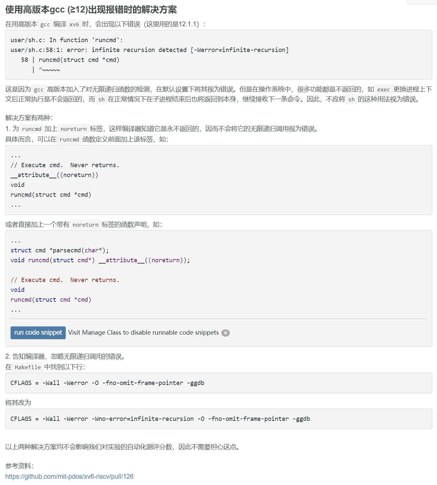
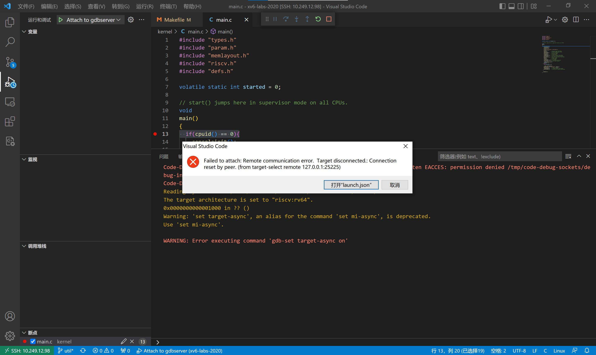
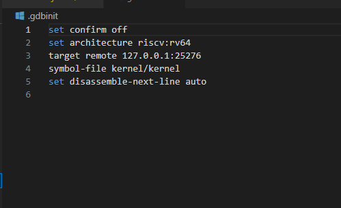
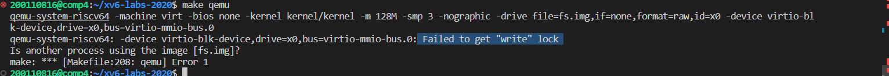
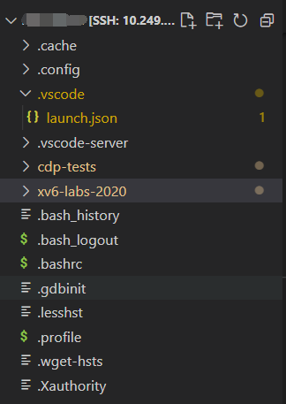

!!! tip "温馨提示"
    本文档会不定时更新同学们在实验过程中可能会出现的问题以及对应的解决办法，供同学们参考。特别感谢给本课程实验反馈问题、建议以及意见的同学。

# 实验环境问题

## 1. xv6如何在QEMU>=6.0.0上启动？

具体解决方案详见piazza ：https://piazza.com/class/l7fs47nofoc4pm/post/8


Patch文件：[pmp.patch](code/pmp.patch)

该问题的解决方案来自20级某位大佬的分享，非常感谢这位大佬的贡献~~

## 2. 使用高版本gcc (≥12)出现报错

具体解决方案详见piazza ：https://piazza.com/class/l7fs47nofoc4pm/post/22 




## 3. 远程实验平台图形化无法调试：Failed to attch: Remote communication error？

VSCode远程调试时，提示如下错误：



具体解决方案详见piazza ：https://piazza.com/class/l7fs47nofoc4pm/post/20

打开xv6工作目录下的.gdbint文件，将第三行“target remote 127.0.0.1:***”用“#”注释掉。




## 4. 远程平台make qemu报错：Is another process using the image [fs.img]?

如图：



用ps或top命令查看一下是不是已经开启了qemu？如果qemu已经在运行，请先结束该进程。

注意：该问题出现的原因，主要是没有正常退出QEMU，请务必记得QEMU的退出方法。

!!! tip "QEMU退出方法"
    先按“Ctrl+a”组合键，接着全部松开，再按下“x”键

具体解决方案详见piazza ：https://piazza.com/class/l7fs47nofoc4pm/post/23 


## 5. 远程平台调试时VSCode报错：Failed to attach: 127.0.0.1:XXX: Connection timed out. (from target-select remote 127.0.0.11:XXX)?

如图：


原因：

没有在终端输入make qemu-gdb，直接点了VSCode的debug的三角形符号进行调试。


## 6. 远程平台调试时VSCode报错：Failed to attach: Truncated register 37 in remote 'g' packet?

如图：


原因：

VSCode工作区路径不是XV6路径，嵌套了外面一层文件夹。



解决方法：

首先 **确认你的VS Code工作区路径是否是你的xv6路径，没有额外嵌套一层文件夹** 。按下`` Ctrl+` ``，呼出终端，输入`ls`。你应该会看到如下情景：

```console
ldap_example@OSLabExecNode0:~/xv6-labs-2020$ ls
conf  fs.img  grade-lab-util  gradelib.py  gradelib.pyc  kernel  LICENSE  Makefile  mkfs  README  user
```

如果不是，打开新的工作区，选择xv6所在的文件夹打开即可。
