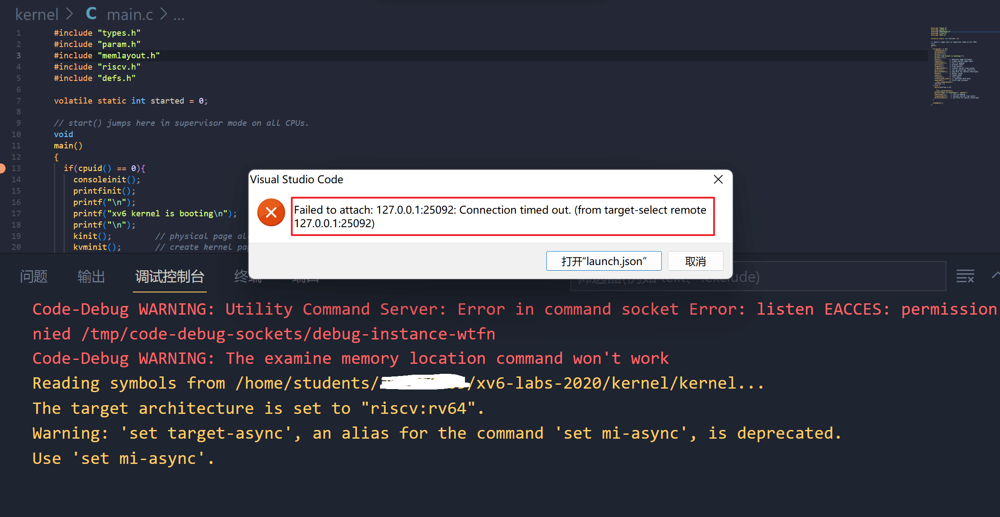
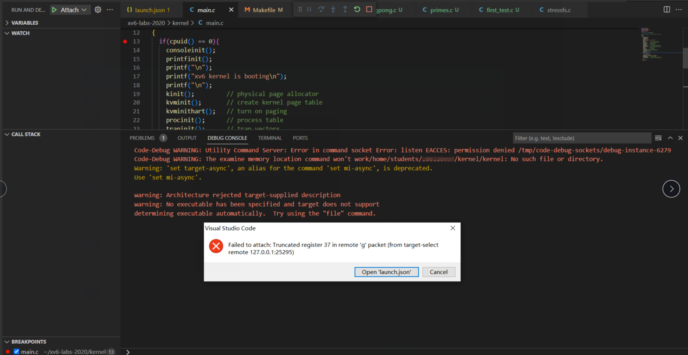

!!! tip "温馨提示"
    本文档会不定时更新同学们在实验过程中可能会出现的问题以及对应的解决办法，供同学们参考。特别感谢给本课程实验反馈问题、建议以及意见的同学。

# 实验环境问题

## 1. 高版本工具兼容问题

### 1.1 xv6如何在QEMU>=6.0.0上启动？

具体解决方案详见piazza ：https://piazza.com/class/l7fs47nofoc4pm/post/8


Patch文件：[pmp.patch](code/pmp.patch)

该问题的解决方案来自20级某位大佬的分享，非常感谢这位大佬的贡献~~

### 1.2 使用高版本gcc (≥12)出现报错

具体解决方案详见piazza ：https://piazza.com/class/l7fs47nofoc4pm/post/22 


------

## 2. VSCode无法连接实验平台

### 2.1  VS Code连接远程实验平台时提示`ssh: connect to host 10.249.12.98 port 22: Connection timed out`？

端口号写错了，请参考实验指导书要求来连接。

https://hitsz-cslab.gitee.io/os-labs/remote_env/

远程实验平台IP地址： `10.249.12.98` ，端口号： `6666`

### 2.2 VS Code连接远程实验平台时出现`bad owner or permission`报错？

解决方法：进入路径`C:\Users\用户名\.ssh`，右击config文件进入属性中高级安全管理，选择禁止继承，并且删除所有此对象中继承的权限。

具体可以查看：https://www.cnblogs.com/Akkuman/p/11187776.html

### 2.3 在远程实验平台上clone xv6-labs-2020失败？

如图：


原因：

远程实验平台给每位同学做了资源限额管理，出现这个问题的同学，有可能是之前的《计算机设计与实践》实验包`cdp-tests`占用了太多空间，你需要删除`cdp-tests/waveform`目录下的所有波形图文件（主要是波形图文件太大了）。

使用mobaxterm登录，输入如下命令：


使用`rm -rf *`删除后，应该就能clone xv6-labs-2020。


### 2.4 VS Code连接远程实验平台时提示`mkdir: cannot create directory '/home/students/XXX'`

如图：


原因：

与上述问题一样，也是因为资源限额的问题。之前的《计算机设计与实践》实验包`cdp-tests`占用了太多空间，你需要删除`cdp-tests/waveform`目录下的所有波形图文件（主要是波形图文件太大了）。

使用mobaxterm登录，输入如下命令：


------
## 3. VSCode无法用GDB图形化调试

### 3.1 远程实验平台图形化无法调试`Failed to attach: Remote communication error`？

VSCode远程调试时，提示如下错误：


具体解决方案详见piazza ：https://piazza.com/class/l7fs47nofoc4pm/post/20

打开xv6工作目录下的.gdbint文件，将第三行`target remote 127.0.0.1:***`用`#`注释掉。


### 3.2 远程平台调试时VSCode报错`Failed to attach: 127.0.0.1:XXX: Connection timed out. (from target-select remote 127.0.0.11:XXX)`?

如图：



原因：

没有在终端输入make qemu-gdb，直接点了VSCode的debug的三角形符号进行调试。

或者，请检查launch.json的GDB端口号是否写对？

### 3.3 远程平台调试时VSCode报错`Failed to attach: Truncated register 37 in remote 'g' packet`?

如图：



原因：

VSCode工作区路径不是XV6路径，嵌套了外面一层文件夹。


解决方法：

首先 **确认你的VS Code工作区路径是否是你的xv6路径，没有额外嵌套一层文件夹** 。按下`` Ctrl+` ``，呼出终端，输入`ls`。你应该会看到如下情景：

```console
ldap_example@OSLabExecNode0:~/xv6-labs-2020$ ls
conf  fs.img  grade-lab-util  gradelib.py  gradelib.pyc  kernel  LICENSE  Makefile  mkfs  README  user
```

如果不是，打开新的工作区，选择xv6所在的文件夹打开即可。正确的工作区应该如下显示：


------

## 4 xv6运行报错

### 4.1 远程平台make qemu报错`Is another process using the image [fs.img]`?

如图：


用ps或top命令查看一下是不是已经开启了qemu？如果qemu已经在运行，请先结束该进程。

具体解决方案详见piazza ：https://piazza.com/class/l7fs47nofoc4pm/post/23 

另外一种解决方案：输入在xv6-labs-2020目录下输入`make clean`清除fs.img，然后再运行`make qemu`


------
