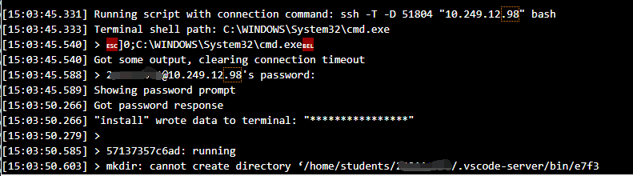
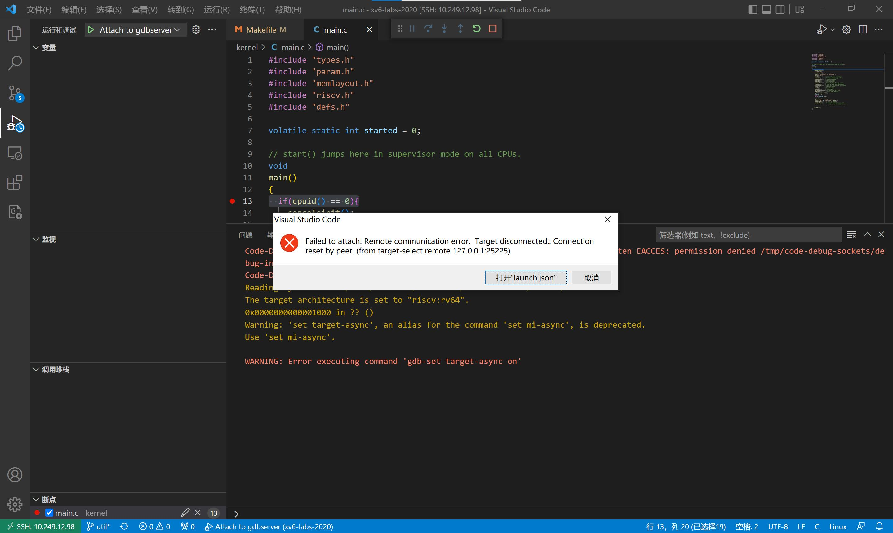

!!! tip "温馨提示"
    本文档会不定时更新同学们在实验过程中可能会出现的问题以及对应的解决办法，供同学们参考。特别感谢给本课程实验反馈问题、建议以及意见的同学。

# 实验环境问题

## 1. 高版本工具兼容问题

### 1.1 xv6如何在QEMU>=6.0.0上启动？

具体解决方案详见piazza ：https://piazza.com/class/l7fs47nofoc4pm/post/8


Patch文件：[pmp.patch](../code/pmp.patch)

该问题的解决方案来自20级某位大佬的分享，非常感谢这位大佬的贡献~~

### 1.2 使用高版本gcc (≥12)出现报错

具体解决方案详见piazza ：https://piazza.com/class/l7fs47nofoc4pm/post/22 


------

## 2. VSCode无法连接实验平台

### 2.1  VS Code连接远程实验平台时提示`ssh: connect to host 10.249.12.98 port 22: Connection timed out`？

端口号写错了，请参考实验指导书要求来连接。

https://hitsz-cslab.gitee.io/os-labs/remote_env/

远程实验平台IP地址： `10.249.12.98` ，端口号： `6666`

### 2.2 VS Code连接远程实验平台时出现`bad owner or permission`报错？

解决方法：进入路径`C:\Users\用户名\.ssh`，右击config文件进入属性中高级安全管理，选择禁止继承，并且删除所有此对象中继承的权限。

具体可以查看：https://www.cnblogs.com/Akkuman/p/11187776.html

### 2.3 在远程实验平台上clone xv6-labs-2020失败？

如图：


原因：

远程实验平台给每位同学做了资源限额管理，出现这个问题的同学，有可能是之前的《计算机设计与实践》实验包`cdp-tests`占用了太多空间，你需要删除`cdp-tests/waveform`目录下的所有波形图文件（主要是波形图文件太大了）。

使用mobaxterm登录，输入如下命令：


使用`rm -rf *`删除后，应该就能clone xv6-labs-2020。


### 2.4 VS Code连接远程实验平台时提示`mkdir: cannot create directory '/home/students/XXX'`

如图：




原因：

与上述问题一样，也是因为资源限额的问题。之前的《计算机设计与实践》实验包`cdp-tests`占用了太多空间，你需要删除`cdp-tests/waveform`目录下的所有波形图文件（主要是波形图文件太大了）。

使用mobaxterm登录，输入如下命令：


------
## 3. VSCode无法用GDB图形化调试

### 3.1 远程实验平台图形化无法调试`Failed to attach: Remote communication error`？

VSCode远程调试时，提示如下错误：



具体解决方案详见piazza ：https://piazza.com/class/l7fs47nofoc4pm/post/20

打开xv6工作目录下的.gdbint文件，将第三行`target remote 127.0.0.1:***`用`#`注释掉。


### 3.2 远程平台调试时VSCode报错`Failed to attach: 127.0.0.1:XXX: Connection timed out. (from target-select remote 127.0.0.11:XXX)`?

如图：


原因：

没有在终端输入make qemu-gdb，直接点了VSCode的debug的三角形符号进行调试。

或者，请检查launch.json的GDB端口号是否写对？

### 3.3 远程平台调试时VSCode报错`Failed to attach: Truncated register 37 in remote 'g' packet`?

如图：


原因：

VSCode工作区路径不是XV6路径，嵌套了外面一层文件夹。


解决方法：

首先 **确认你的VS Code工作区路径是否是你的xv6路径，没有额外嵌套一层文件夹** 。按下`` Ctrl+` ``，呼出终端，输入`ls`。你应该会看到如下情景：

```console
ldap_example@OSLabExecNode0:~/xv6-labs-2020$ ls
conf  fs.img  grade-lab-util  gradelib.py  gradelib.pyc  kernel  LICENSE  Makefile  mkfs  README  user
```

如果不是，打开新的工作区，选择xv6所在的文件夹打开即可。正确的工作区应该如下显示：


------

## 4 xv6运行报错

### 4.1 远程平台make qemu报错`Is another process using the image [fs.img]`?

如图：


用ps或top命令查看一下是不是已经开启了qemu？如果qemu已经在运行，请先结束该进程。

具体解决方案详见piazza ：https://piazza.com/class/l7fs47nofoc4pm/post/23 

另外一种解决方案：输入在xv6-labs-2020目录下输入`make clean`清除fs.img，然后再运行`make qemu`


------

## 5 git常见问题

### 5.1 无法推送怎么办？

如果你尝试推送到远程仓库，或者从远程仓库拉取，但是git却显示出这样的错误：

```console
git@gitee.com: Permission denied (publickey).
fatal: Could not read from remote repository.

Please make sure you have the correct access rights 
and the repository exists
```

这表明你没有权限推送到这个远程仓库。一般而言，这是由于你没有设置好自己的ssh密钥造成的。请参照[3.4节 ssh密钥设置](../../tools/#34-ssh)，设置自己的ssh密钥。

### 5.2 我怎么知道我修改了哪些文件？

通常而言，实验要求同学们提交 **所有** 被修改过的文件。通过将当前工作路径与上游仓库（课程实验提供的仓库）对应分支的内容相比较，可以方便地知道自己曾经修改过哪些文件，并打包提交。这里，我们将当前分支与上游仓库的`syscall`分支相比较：

```console
lgz_admin@OSLabExecNode0:~/git_demo/xv6-labs-2020$ git fetch --all
Fetching origin
Fetching upstream
lgz_admin@OSLabExecNode0:~/git_demo/xv6-labs-2020$ git diff --stat upstream/syscall *
 kernel/kalloc.c  | 2 ++
 kernel/syscall.c | 1 +
 kernel/syscall.h | 1 +
 kernel/sysinfo.h | 1 +
 4 files changed, 5 insertions(+)
```

要比较其他分支，将第二条指令中的`syscall`改为对应分支名即可。

!!! warning "请先在本地切换到对应分支！"
	在比较的时候，你需要将本地分支与上游对应分支进行比较。举例而言，你不会想比较本地的`util`分支和远程的`syscall`分支，因为这两个不是一个实验的。请先使用`git checkout 分支名`以切换到对应分支，并在使用`git diff --stat upstream/分支名 *`时指定 **同一个** 上游分支。

!!! warning "未设置上游仓库？"
	如果git报告“`fatal: ambiguous argument 'upstream/分支名': unknown revision or path not in the working tree.`”，说明你尚未设置上游仓库。请先按本指南中的[3.1-同步上游仓库](../../tools/#31)一节完成上游仓库的设置与同步，再进行比较。

### 5.3 为什么我不能切换分支（checkout）？

通常而言，不能切换分支的主要原因是你当前有尚未保存的修改，此时checkout的话会触发以下错误：

```console
lgz_admin@OSLabExecNode0: ~/git_demo/xv6-labs-2020$ git checkout util                                                                                                ─╯
error: Your local changes to the following files would be overwritten by checkout:
        Makefile
Please commit your changes or stash them before you switch branches.
Aborting
```

通过`git status`指令，我们可以检查当前git的状态。如果你的输出如下所示：

```console
lgz_admin@OSLabExecNode0: ~/git_demo/xv6-labs-2020$ git status
On branch syscall
Your branch is up to date with 'origin/syscall'.

Changes not staged for commit:
  (use "git add <file>..." to update what will be committed)
  (use "git restore <file>..." to discard changes in working directory)
        modified:   Makefile

no changes added to commit (use "git add" and/or "git commit -a")
```

这说明当前你的工作区有尚未保存的更改。请参考[3.3.1 使用命令行完成操作](../../tools/#331)或者[3.3.2 使用VS Code内建的图形化界面完成操作](../../tools/#332-vs-code)节，完成commit操作。
或者，如果你希望直接放弃掉上一次commit后的 **所有更改** ，那么你也可以使用`-f`选项强制切换分支，例如`git checkout -f syscall`。
