# Lab1常见问题

## 1. sleep

### 1.1 执行sleep报错

检查一下是否修改Makefile

## 2. pingpong

### 2.1 检验pingpong时出现如下报错

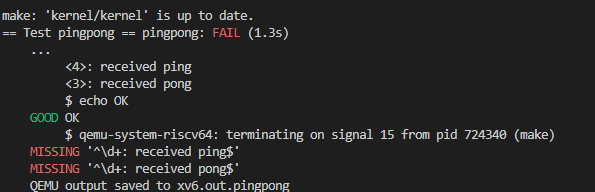

解决方案：

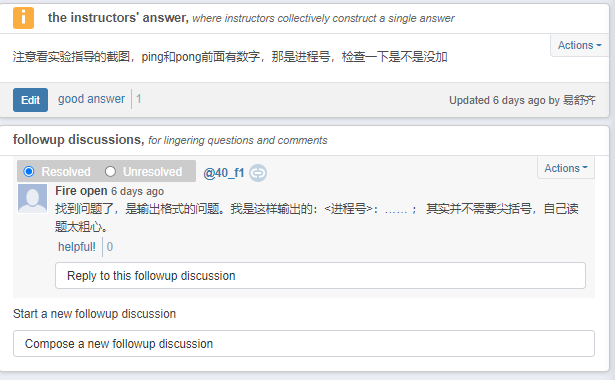

### 2.2 pingpong出现usertrap()报错

1. 数组越界、内存溢出（scause=13）  
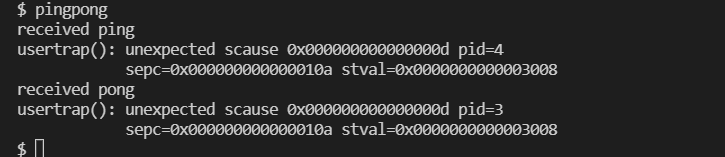  
解决方案：  
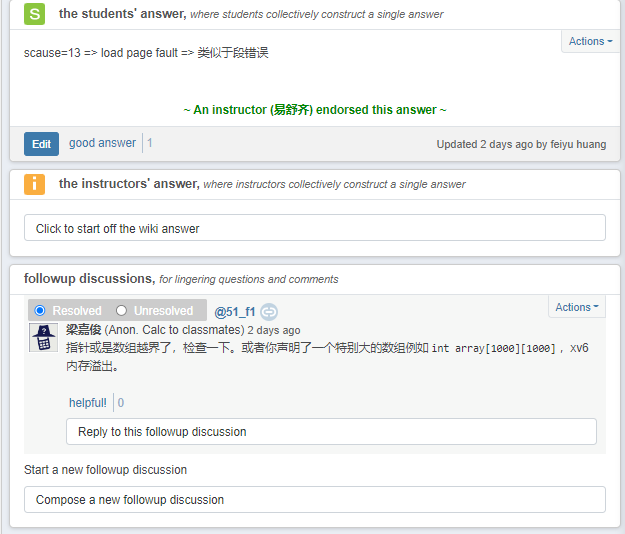
2. 用户程序退出时使用return（scause=2）  
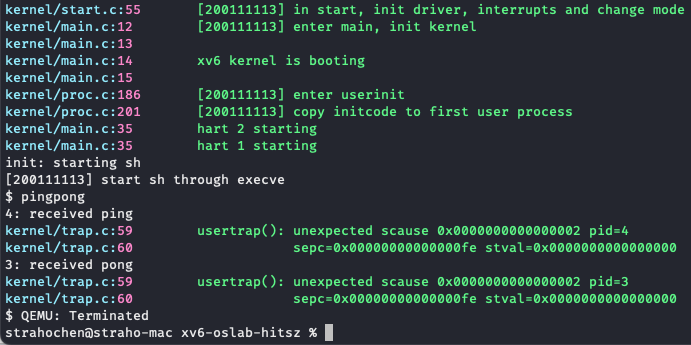  
解决方案：用户程序退出时使用 `exit()` 函数退出，不要使用 `return` 返回。

### 2.3 pingpong测试不通过

在手动输入命令时能打印出来，但是测试的时候显示不通过

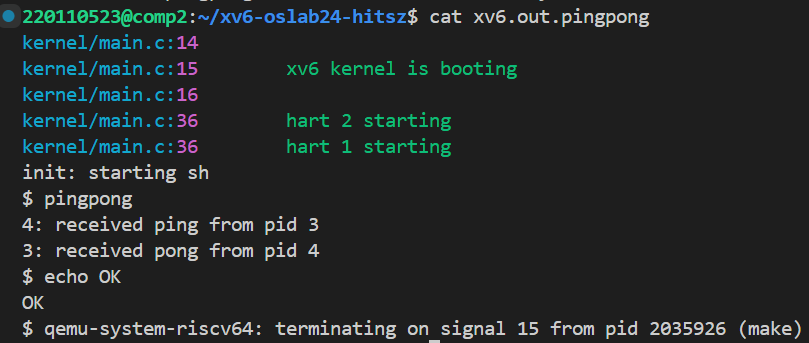 

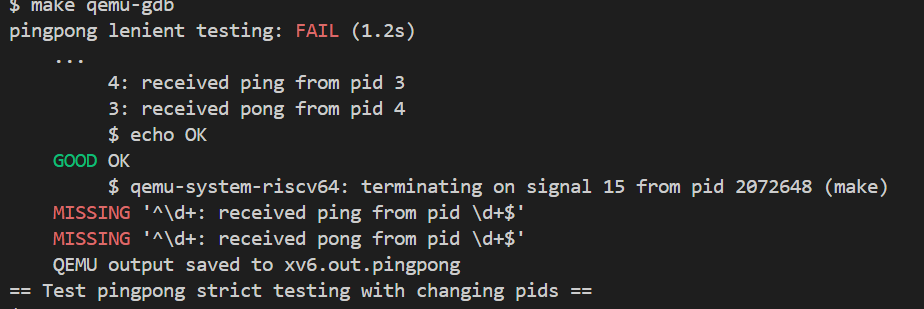 

查看xv6.out.pingpong文件，可知输出的字符串有很多空字符。

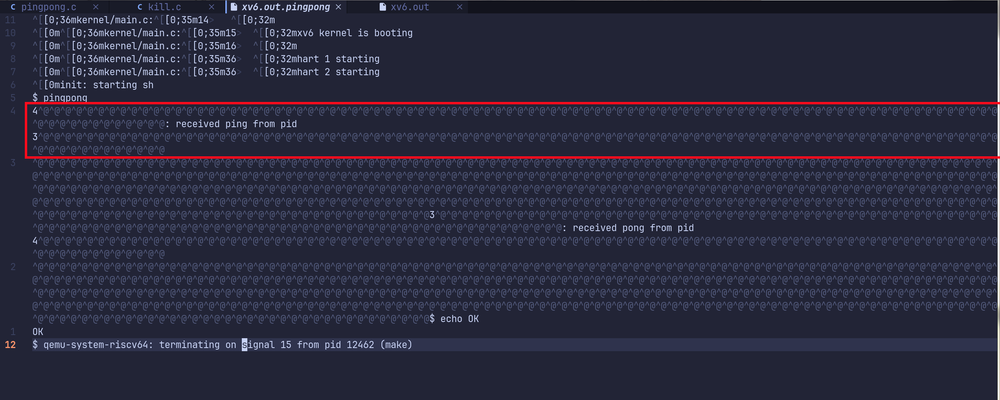 

该同学在pingpong程序中，向标准输出输出的时候直接用`write(1, pid, sizeof(pid)); `这种输出，导致把整个pid数组写到了标准输出。这种方式的输出在终端上看不出来，但用编辑器打开输出文件就清楚有哪些不可见字符。

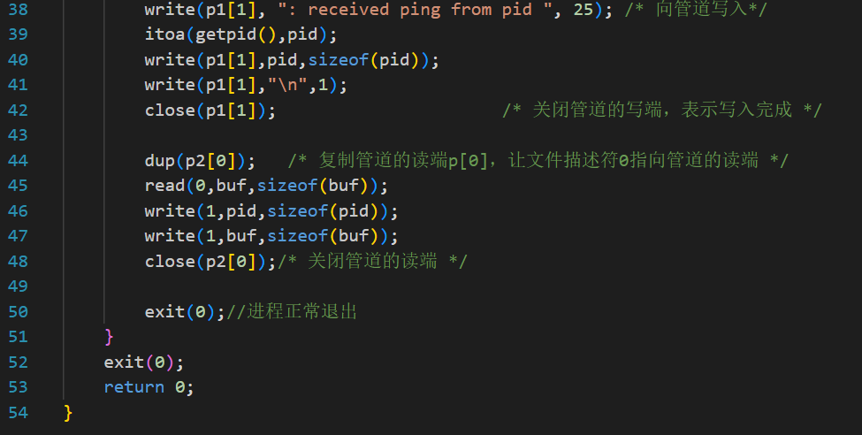 

一般向标准输出打印字符串是用`printf`函数，`printf`逐位打印字符数组，直到遇见"\0"字符就停止。

解决方案：换成`printf`函数。

## 3. primes

### 3.1 primes输出发生奇怪的错误

不知道为什么第二个输出带着奇怪的$符号

解决方案：

### 3.2 prime 内核中输出正确，但是测试时不通过？

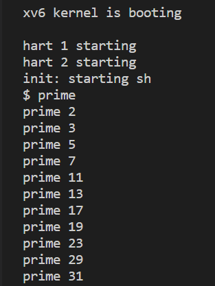

解决方案：

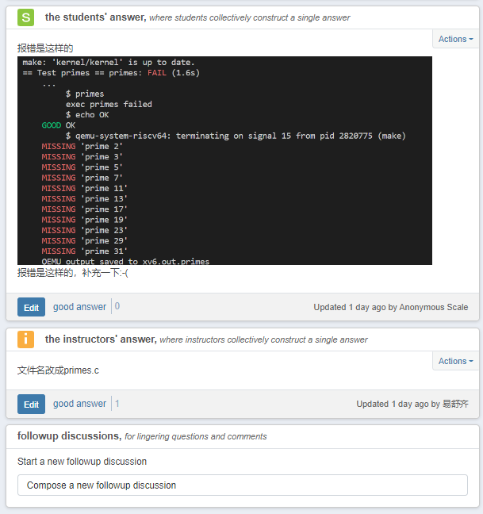
