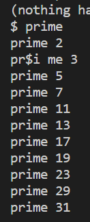

# Lab1常见问题

## 1. sleep

### 1.1 执行sleep报错

检查一下是否修改Makefile

## 2. pingpong

### 2.1 检验pingpong时出现如下报错

解决方案：

### 2.2 pingpong出现如下报错usertrap()

解决方案：

## 3. primes

### 3.1 primes输出发生奇怪的错误

不知道为什么第二个输出带着奇怪的$符号

解决方案：

### 3.2 prime 内核中输出正确，但是测试时不通过？

解决方案：

