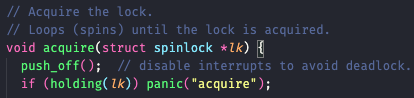
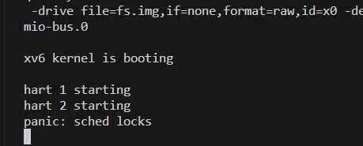

# Lab3常见问题

本节总结了一些目前遇到的问题供大家参考：

## 1. 问题：panic init exiting
    
内存分配出问题，导致第一个用户进程崩溃

(1)可能是kinit修改错误，导致同一个空闲物理页重复出现在freelist；

(2)也可能是没能理解kalloc的含义，返回值错误或者链表操作错误。

    

## 2. 问题：panic freeing free block"

很可能是bget函数锁的使用不正确，一定需要保证bget函数的原子性(指导书有提及)，否则同一磁盘块可能在缓存重复出现，造成二次释放。

## 3. 问题：运行时出现如下图的错误

以上的意思是： **`sepc`地址对应的那条指令，由于对`stval`这个地址进行了不合法的`scause`(读/写/执行）操作，导致内核panic**

以下是这几个寄存器意义的解释

### scause

如下图所示，上图中scause为0xd即13，对应的就是`Load page fault`，即发生了不合法的读操作；

### sepc

- 如果`sepc`为0x000000008000xxxx，则说明是内核态的指令地址，需要从`kernel/kernel.asm`反汇编代码中去查看对应的指令，如下图所示：

- 如果`sepc`是类似0x00000000000xxxx这种格式，那说明是用户态的指令地址，需要从`user`目录下对应的用户程序的反汇编代码(`xxx.asm`)中去查找

### stval

指对哪个地址发生了不合法的操作，上图示例中是对0x50这个地址发生了不合法的读操作

## 4. 问题：panic: acquire

panic的位置可以通过vscode查到：在`spinlock.c: acquire()`中

在该函数当中报错是因为holding函数会检查当前的CPU是否持有想要的锁，如果是的话，就会产生panic。由于xv6没有实现可重入锁，所以如果将该panic注释掉会死锁，也就是自己拿着锁但是又想获取该锁。所以同学们需要检查自己的代码当中是否对同一个锁获取了两次。

## 5. 问题：panic: sched locks

这个报错一般是持有自旋锁的情况下发生了进程切换：

1. 检查push_off后面有没有对应的pop_off 
2. 检查有没有持有锁忘记释放了
