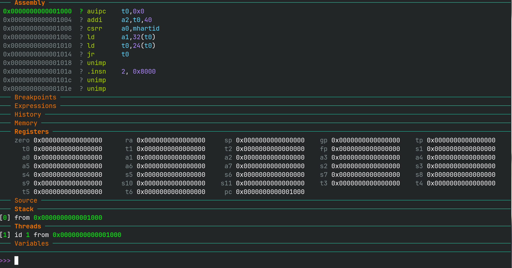

# GDB 调试指南

## 1. gdb-dashboard 安装

由于原始 GDB 命令行过于简陋，为方便调试，我们需要下载 [gdb-dashboard](https://github.com/cyrus-and/gdb-dashboard) 插件。

```
mv ~/.gdbinit ~/.gdbinit.bak    # 将原有配置重命名
wget -P ~ https://gitee.com/ftutorials/gdb-dashboard/raw/master/.gdbinit    # 将 .gdbinit 下载到家目录
```

（可选）为启用语法高亮，我们还需要下载 [Pygments](http://pygments.org/)

```
pip install --no-cache-dir pygments
```

## 2. 命令行调试步骤

1. 打开终端，到 xv6-oslab24-hitsz 目录下输入：

    ```
    make qemu-gdb CPUS=1
    ```

    可在这个终端查看正常 QEMU 的输出

    

    !!! info "注意"
        为便于调试， `make qemu-gdb`时使用`CPUS=1`，以单核模式启动。

2. 新开一个终端，在相同目录下输入

    ```
    make gdb
    ```

    进入这个界面，即可进行正常调试

    


## 3. gdb 调试介绍


### 基础命令

#### help 命令

!!! info "注意"
    想了解命令行工具的使用，最方便的永远是其自带的手册。

对于 gdb 来说，首先需要学会使用 `help` 命令。


遇到不知道的命令，可以 `help cmd` 的方式查看它的基本用法。

比如 `help n` 就告诉我们：

- `n` 这个命令是 `next` 命令的缩写
- 功能是步过一行，不会进入函数调用中
- 可以使用 `n 3` 的方式跳过 3 行。


!!! note "小实验"
    `help help` 会发生什么？


#### 退出 gdb

输入 `q` （最好这样，会保存在 .gdb_history 中） 或 按下 `ctrl+d` 来退出 gdb

#### 单步调试

- `step` 一次运行一行代码。当有函数调用时，它将步进到被调用的对象函数。
- `next` 也是一次运行一行代码。但当有函数调用时，它不会进入该函数。
- `stepi` 和`nexti`对于汇编指令是单步调试。

所有命令都可以采用一个数字参数来指定重复执行的次数。按回车键将重复上一个命令（回车同样不会保存在 .gdb_history 中）。

#### 运行调试

- `continue`运行代码，直到遇到断点或使用`<Ctrl-c>`中断它
- `finish`运行代码，直到当前函数返回
- `advance <location>`运行代码，直到指令指针到达指定位置

#### 断点

- `break <location>`在指定的位置设置断点。 位置可以是内存地址(*0x7c00)或名称(monbacktrace，monitor.c:71)
- 如需修改断点请使用`delete`，`disable`，`enable`

#### 条件断点

- `break <location> if <condition>`在指定位置设置断点，但仅在满足条件时中断。
- `cond <number> <condition>`在现有断点上添加条件。

#### 监视点

类似于断点，但条件更为复杂。

- `watch <expression>`每当表达式的值更改时，将停止执行
- `watch -l <address>`每当指定内存地址的内容发生变化时，就会停止执行。
- `rwatch [-l] <expression>`将在读取表达式的值时停止执行。

#### 检查命令

- `x`以您指定格式（`x/x`表示十六进制，`x/i`表示汇编，等等）打印内存的原始内容。
- `print`计算一个C表达式并将结果以合适的类型打印。它通常比`x`更有用
- 使用`p *((struct elfhdr *) 0x10000)`的输出比`x/13x 0x10000`的输出好得多

#### 其他检查命令

- `info registers`打印每个寄存器的值
- `info frame`打印当前栈帧
- `list <location>`在指定位置打印函数的源代码
- `backtrace` 打印函数调用栈


### 调试技巧

#### 暂停

可以在 gdb 按下 `ctrl+c` 暂停当前程序的执行

#### 历史与脚本

gdb 命令历史保存在 .gdb_history 文件（位于启动 gdb 的位置，一般在 xv6-oslab24-hitsz 目录下启动 gdb）。

!!! tip "注意事项"
    1. 需要退出 gdb 才能将调试指令刷新到 .gdb_history 文件中
    2. 最好使用 `q` 指令退出 gdb，这样上次调试过程所有指令就是两次 q 指令之间的所有指令，不要用 `ctrl+d` 退出

如果想恢复上次调试的位置，可以

1. 从 .gdb_history 文件中获取上次调试的所有指令
2. 创建一个文本文件，文件内容为调试指令序列，文件名任意，比如 commands.gdb
3. 重新启动 qemu 和 gdb，
4. 在 gdb 命令行输入 `source commands.gdb` 即可重新执行 commands.gdb 里的所有调试命令

#### 调试用户态程序

下面我们以调试 ls 程序作为例子：

1. 启动 qemu 与 gdb 调试
2. gdb 输入 `c` 命令继续程序的运行
3. 在 qemu 出现 sh 命令行时，在 gdb 按下 `ctrl+c` 中断程序运行
4. 在 gdb 输入 `add-symbol-file user/_ls` 命令添加 ls 程序的调试符号
5. gdb 输入 `b user/ls.c:main` 在 ls 的 main 函数入口打断点，输入 `c` 继续内核运行
6. 在 xv6 命令行输入 `ls` 运行 ls 程序
7. 在 gdb 中调试 ls 程序 

!!! warning "在调试 ls 前先看这里"
    由于 gdb 是在指令内存地址打断点，而 ls 程序的 main 函数地址可能与 sh 程序的某些指令地址重复，导致 gdb 可能在 sh 程序中暂停，但错误的显示成了 ls 程序的 debug 信息。说明这个断点不是我们想要的 ls 程序的断点，这时可以使用 `c` 命令来继续执行到真正 ls 程序的断点


## 4. gdb-dashboard 介绍

### dashboard tui 介绍


这张图隐去了某些不常用的区域，比如`history`、`memory`等，在此只介绍最常用的区域

- `assembly`：显示汇编代码，绿色区域为当前那行代码对应的汇编指令，其中深绿色代表下一条要执行的汇编指令
- `registers`：显示基本寄存器的值，如果寄存器的值变为绿色说明这些寄存器的值得到了修改
- `source`：显示源代码，绿色表示当前正在执行的代码
- `stack`：显示函数调用栈，图上为 `_entry` 函数调用了 `start` 函数
- `threads`：多核各个CPU目前停留的代码位置，图上为单核启动，因此只有一行
- `variables`：显示当前作用域内变量的值，有些变量值由于编译优化而看不见
- `history`：显示最近打印的输出

### dashboard 命令介绍

安装了上述 gdb-gdashboard 插件，则可以使用 `dashboard` 命令，使用 `help dashboard` 查看详细信息：

```
>>> help dashboard
Redisplay the dashboard.

List of dashboard subcommands:

dashboard -configuration -- Dump or save the dashboard configuration.
dashboard -enabled -- Enable or disable the dashboard.
dashboard -layout -- Set or show the dashboard layout.
dashboard -output -- Set the output file/TTY for the whole dashboard or single modules.
dashboard -style -- Access the stylable attributes.
dashboard assembly -- Configure the assembly module, with no arguments toggles its visibility.
dashboard breakpoints -- Configure the breakpoints module, with no arguments toggles its visibility.
dashboard expressions -- Configure the expressions module, with no arguments toggles its visibility.
dashboard history -- Configure the history module, with no arguments toggles its visibility.
dashboard memory -- Configure the memory module, with no arguments toggles its visibility.
dashboard registers -- Configure the registers module, with no arguments toggles its visibility.
dashboard source -- Configure the source module, with no arguments toggles its visibility.
dashboard stack -- Configure the stack module, with no arguments toggles its visibility.
dashboard threads -- Configure the threads module, with no arguments toggles its visibility.
dashboard variables -- Configure the variables module, with no arguments toggles its visibility.

Type "help dashboard" followed by dashboard subcommand name for full documentation.
Type "apropos word" to search for commands related to "word".
Type "apropos -v word" for full documentation of commands related to "word".
Command name abbreviations are allowed if unambiguous.
```

GDB 会在命令没有歧义的时候支持短命令，所以 `da` 或者 `dash` 与 `dashboard` 等价。一些命令解释：


- `dashboard`：dashboard 不会固定高度，所以你输入的命令会把 dashboard 挤压掉，所以需要这个命令让 dashboard 位置复原
- `dashboard history`（或者把 history 换成类似的区域名称）：显示/隐藏 那个区域
- `dashboard -layout assembly source`：只显示 assembly 和 source 区域
    - `dashboard -layout assembly breakpoints expressions !history memory registers source stack !threads variables`： 在不需要的区域前写 `!` 来排除掉那些区域，比如排除掉 history 和 threads
    - `dash -layout !`：恢复默认的布局，显示所有区域
- `dashboard -configuration ~/.gdbinit.d/init`：可将将当前所显示的布局保存到配置文件，下次开启 GDB 只会显示它们。 需要手动创建 ~/.gdbinit.d 目录。通常修改区域之后，使用这一步来永久化
- 搭配 `tui` 命令：
    - dashboard 可以同时观察到不同角度的调试信息，但如果想单独查看源码的上下文，可以使用 `tui focus src` 来专注于查看当前源码的上下文，在那里上下方向键和翻页键直接控制源码页面，然后 `tui disable` 回到 dashboard。
