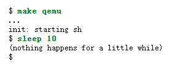
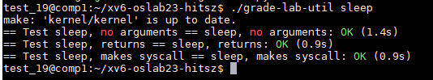
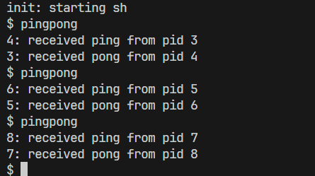
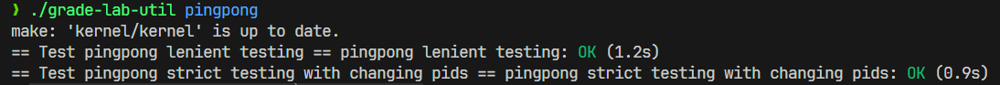
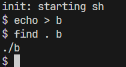
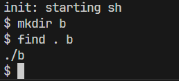
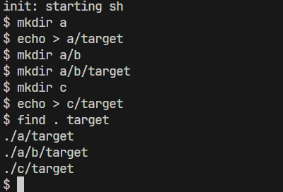
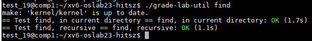
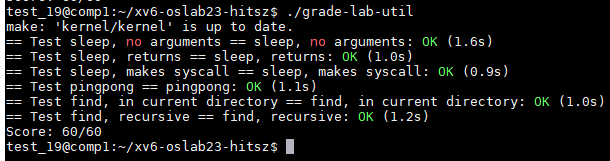
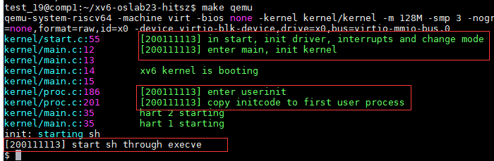

# 实验概述

!!! warning "关于[Academic Intergrity](https://integrity.mit.edu/)"
    所有课程实验都需要 **独立完成** 。你应当 **主动避免阅读、使用任何人/互联网上的XV6实验代码** 。在实验中碰到问题很正常，发现问题时需沉着冷静，认真阅读实验指导书，查阅[MIT 6.S081的官方网站](https://pdos.csail.mit.edu/6.828/2024/index.html)以及[XV6 book](https://pdos.csail.mit.edu/6.828/2024/xv6/book-riscv-rev4.pdf)，尝试自己调试解决，也可以向同学/助教/老师请教调试的技巧。只有这样，你才能够得到真正的训练与收获！

!!! tip "关于第一次实验课考核"
    我们选择基于Linux系统的XV6作为操作系统实验的教学平台，因为它开源、自由，也有丰富的文档/课程资源（能让我们了解它内部的实现）。在做实验之前，首先必不可少地是实际动手操作Linux系统。为了激发同学们的学习热（压）情（力），我们将 **在第一次实验课上进行Linux系统基础知识的考核** （助教会一对一地问一些简单的问题来确保同学们真正了解了，虽然考核分数不多，也请大家认真对待），要求同学们能提前学习如下内容：

    （1） 请认真阅读[实验概述](../index.md)中的内容，掌握实验平台/工具的使用、Linux开发环境基础知识；
    
    （2） 请认真阅读实验一中的内容，了解xv6源码的运行环境，做好实验前的[准备工作](../part3/#2)。
    
    遇到凡（考）事（核）不要慌，当你能完成上述要求时，相信一定能通过本次考核! 

!!! note "实验说明"
    该部分说明了该实验需要完成的任务，以及要求达到怎样的目标。需要注意，本章实验上手很难，但是内容简单，大家需要 **耐心理清楚** 实验指导书的脉络。

    特别推荐同学们观看由我校OS课题组、各级学长助教们合力为大家录制的XV6讲解视频，希望能够让大家对整个XV6系统有一个更为直观的认识，推荐大家按需观看：
    
    1. 【HITSZ操作系统课程组讲解XV6（一）启动过程】 			 
    
    	- 视频链接: https://www.bilibili.com/video/BV1mK411S7N9?share_source=copy_web&vd_source=225a99017e082147ac525beeddd6e3e2
    	- 课程PPT: [点这里下载](https://gitee.com/hitsz-cslab/os-labs/tree/master/references/xv6原理简析1-进程管理.pdf)
    2. 【HITSZ操作系统课程组讲解XV6（二）进程管理】 
    
    	- 视频链接: https://www.bilibili.com/video/BV1ge4y1J7Je?share_source=copy_web&vd_source=225a99017e082147ac525beeddd6e3e2
    	- 课程PPT: [点这里下载](https://gitee.com/hitsz-cslab/os-labs/tree/master/references/xv6原理简析2-内存管理.pdf)
    3. 【HITSZ操作系统课程组讲解XV6（三）内存管理】 
    
    	- 视频链接: https://www.bilibili.com/video/BV1Te4y1i77z?share_source=copy_web&vd_source=225a99017e082147ac525beeddd6e3e2
    	- 课程PPT: [点这里下载](https://gitee.com/hitsz-cslab/os-labs/tree/master/references/xv6原理简析3-启动过程.pdf)
    
    也可以观看B站上的[MIT 6.S081/Fall 2020课程视频](https://www.bilibili.com/video/BV19k4y1C7kA?p=1)，通过学习这门课程可以让你对xv6操作系统有一个全面的认识。如果你觉得视频太长且全是英文，这里有视频的[中文版逐字翻译](https://mit-public-courses-cn-translatio.gitbook.io/mit6-s081)

## 1.  实验目的

- 认识xv6操作系统，并熟悉其运行环境。
- 复习并巩固系统调用、进程等理论知识，掌握在xv6上编写用户程序的方法，要求实现sleep、pingpong和find用户程序。
- 理解和掌握xv6的启动流程，包括资源初始化、第一个进程的诞生等，要求在启动流程涉及到的start、main等函数中增加打印输出你的学号以及该函数的作⽤。
 
## 2.  实验学时

本实验为4学时。

## 3.  实验内容及要求

**与xv6原有的实验不一样的是，本次实验需要实现3个Unix实用程序和xv6启动流程实验** 。这里展示的是程序功能和实验测试的最终效果，更多详细的介绍可在后续章节中阅读。为了降低难度，在[实验步骤](../part3/)中给出了每个实验的提示。

### 3.1 sleep

了解xv6上用户程序sleep的实现。sleep程序会等待用户指定的时间。请将代码写在user/sleep.c文件中。运行效果应该如下：

输入命令后，命令行会 ”暂停“ 一段时间 (10个ticks，ticks由内核定义)，然后输出"(nothing happens for a little while)"。

在xv6-oslab24-hitsz中，执行下面指令`./grade-lab-util sleep`，测试程序

### 3.2 pingpong

在xv6上实现pingpong程序，即两个进程在管道两侧来回通信。你需要使用两个管道(可以命名为`c2f`和`f2c`)，其中`c2f`用于子进程向父进程传输数据，`f2c`用于父进程向子进程传输数据。（思考一下能不能用一个管道实现呢？）

父进程向管道中写入数据，子进程从管道将其读出并打印`<pid>: received ping from pid <father pid>` ，其中`<pid>`是子进程的进程ID, `<father pid>`是父进程的进程ID。

子进程从父进程收到数据后，通过写入另一个管道向父进程传输数据，然后由父进程从该管道读取并打印`<pid>: received pong from pid <child pid>`，其中`<pid>`是父进程的进程ID, `<child pid>`是子进程的进程ID。

请将代码写在user/pingpong.c文件中。运行效果应该如下：

在xv6-oslab24-hitsz中，执行下面指令`./grade-lab-util pingpong`，测试程序

### 3.3 find

在xv6上实现用户程序find，即在目录树中查找名称与字符串匹配的所有 **文件或目录**，输出文件的相对路径。该程序的 **命令格式为“find <path\> <name\>”** (注：这与Linux中的find命令格式略有不同，Linux中的对应格式为`find <path> -name <name>`)。请将代码写在user/find.c文件中。

在根目录新建 **文件b** 时，当cwd(Current Working Directory)为根目录时，在根目录下查询b的输出效果应该如下：

在根目录新建 **目录b** 时，当cwd(Current Working Directory)为根目录时，在根目录下查询b的输出效果应该如下：

另外，你还应当实现 **递归查询** ，当要查询的文件`target`在根目录的某个子文件夹中时，你也应该将结果显示出来

在xv6-oslab24-hitsz中，执行下面指令`./grade-lab-util find`，测试程序

如果上述3个程序都能正常运行，可以用如下指令测试：

### 3.4 xv6启动流程实验

在xv6从执⾏entry.S之后到第⼀个shell程序启动过程中的每⼀个函数中输出该函数的作⽤以及你的学号。在xv6-oslab24-hitsz中，执行下面指令`make qemu`，运⾏的效果应该如下：

上图红色框框内的信息是你要打印的内容，格式为：`[你的学号] 该函数的作用`，总共是5条打印信息。前4条是在内核态下打印，上图中已经给出了具体的文件名以及打印语句所在的代码行数。最后1条要在用户态下执行`sh`进程之前打印。

建议你在实验前观看由我校录制的XV6讲解视频[HITSZ操作系统课程组讲解XV6（⼀）启动过程](https://www.bilibili.com/video/BV1mK411S7N9?share_source=copy_web&vd_source=225a99017e082147ac525beeddd6e3e2)视频，这会帮助你更好的理解xv6的启动流程。

