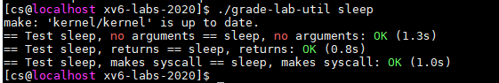

# 实验概述

!!! warning "关于[Academic Intergrity](https://integrity.mit.edu/)"
    所有课程实验都需要 **独立完成** 。你应当 **主动避免阅读、使用任何人/互联网上的XV6实验代码** 。在实验中碰到问题很正常，发现问题时需沉着冷静，认真阅读实验指导书，查阅MIT 6.S081的官方网站以及XV6 book，尝试自己调试解决，也可以向同学/助教/老师请教调试的技巧。只有这样，你才能够得到真正的训练与收获！

!!! tip "关于第一次实验课考核"
    我们选择基于Linux系统的XV6作为操作系统实验的教学平台，因为它开源、自由，也有丰富的文档/课程资源（能让我们了解它内部的实现）。在做实验之前，首先必不可少地是实际动手操作Linux系统。为了激发同学们的学习热（压）情（力），我们将 **在第一次实验课上进行Linux系统基础知识的考核** （助教会一对一地问一些简单的问题来确保同学们真正了解了，虽然考核分数不多，也请大家认真对待），要求同学们能提前学习如下内容：

    （1） 请认真阅读[实验概述](../index.md)中的内容，掌握实验平台/工具的使用、Linux开发环境基础知识；
    
    （2） 请认真阅读实验一中的内容，了解xv6源码的运行环境，做好实验前的[准备工作](../part3/#2)。
    
    遇到凡（考）事（核）不要慌，当你能完成上述要求时，相信一定能通过本次考核! 
    </font>

!!! note "实验说明"
    该部分说明了该实验需要完成的任务，以及要求达到怎样的目标。需要注意，本章实验上手很难，但是内容简单，大家需要 **耐心理清楚** 实验指导书的脉络。

    特别推荐同学们观看B站上的[MIT 6.S081/Fall 2020课程视频](https://www.bilibili.com/video/BV19k4y1C7kA?p=1)，通过学习这门课程可以让你对xv6操作系统有一个全面的认识。

## 1.  实验目的

- 认识xv6操作系统，并熟悉其运行环境。
- 复习并巩固系统调用、进程等理论知识，掌握在xv6上编写用户程序的方法。

## 2.  实验学时

本实验为4学时。

## 3.  实验内容

本次实验需要实现5个Unix实用程序。这里展示的是程序功能和实验测试的最终效果，更多详细的介绍可在后续章节中阅读。

（1）了解xv6上用户程序sleep的实现。sleep程序会等待用户指定的时间。请将代码写在user/sleep.c文件中。运行效果应该如下：


输入命令后，命令行会 ”暂停“ 一段时间 (10个ticks，ticks由内核定义)，然后输出"(nothing happens for a little while)"。

在xv6-labs-2020中，执行下面指令，测试程序



（2）在xv6上实现pingpong程序，即两个进程在管道两侧来回通信。父进程将”ping”写入管道，子进程从管道将其读出并打印。子进程从父进程收到字符串后，将”pong“写入另一个管道，然后由父进程从该管道读取并打印。请将代码写在user/pingpong.c文件中。运行效果应该如下：


在xv6-labs-2020中，执行下面指令，测试程序


（3）在xv6上使用管道实现“质数筛选”, 输出2~35之间的而所有质数。请将代码写在user/primes.c文件中。运行效果应该如下：


在xv6-labs-2020中，执行下面指令，测试程序


（4）在xv6上实现用户程序find，即在目录树中查找名称与字符串匹配的所有文件，输出文件的相对路径。该程序的 **命令格式为“find path file_name”** 。请将代码写在user/find.c文件中。运行效果应该如下：


在xv6-labs-2020中，执行下面指令，测试程序


（5）在xv6上实现用户程序xargs，即从标准输入中读取行并 **为每行运行一次** 指定的命令，且将该行作为命令的参数提供。请将代码写在user/xargs.c中。运行效果应该如下：


```shell
$ make qemu
...
$ echo 3 4|xargs echo 1 2
1 2 3 4
$
```

在xv6-labs-2020中，执行下面指令，测试程序


（6）完成上述5个小实验后，在xv6-labs-2020目录下，新建time.txt文件，在该文件中写入你做完这个实验所花费的时间（估算一下就行，单位是小时），只需要写一个整数即可。

如果上述5个程序都能正常运行，可以用如下指令测试5个程序：

