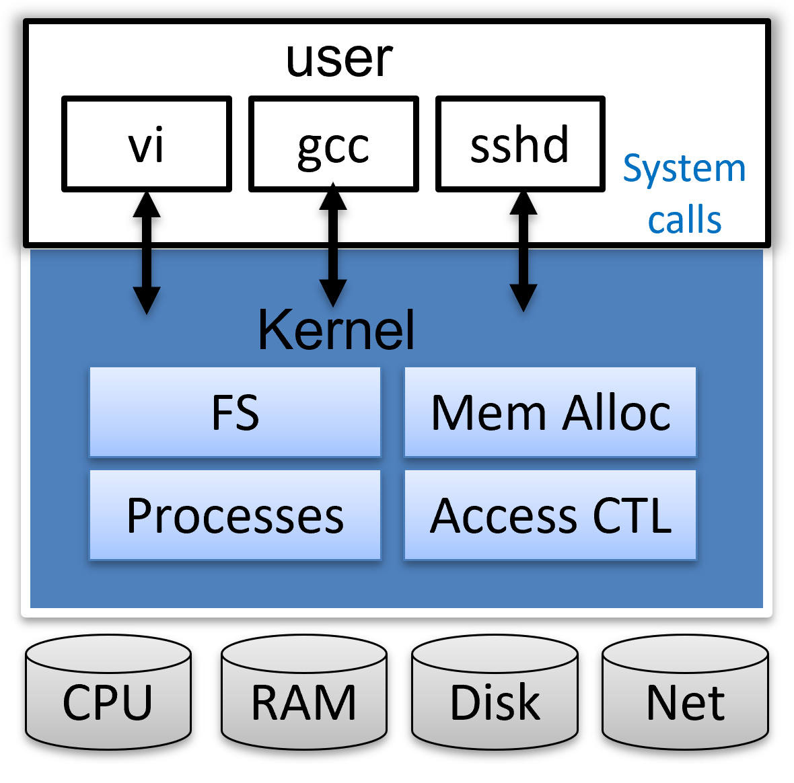

# 实验原理

!!! note "提示"
    本部分我们将理解实验中的操作系统xv6的相关模型，这些模型看起来非常抽象，因此在介绍完之后，我们将加入一章” **我们需要注意的** “，来将其串通。
    


## 1. MIT 6.S081/2020

### 1.1 参考资料

XV6是由麻省理工学院(MIT)开发的一个教学目的的操作系统，它是在x86处理器上用ANSI标准C重新实现的Unix第六版(即v6)，课程编号为6.828。2019年被移植到RISC-V之上，并设置了6.S081。

XV6的主要特征：

- 开源，精简，代码仅两万行左右；
- 功能完善，可全面理解操作系统的原理及实现；
- 基于RISC-V、X86等架构，有利于深入理解体系结构；
- 类Unix系统，可延伸学习其他常见操作系统，例如Linux、MacOS等。
  
1) 官方网站：https://pdos.csail.mit.edu/6.828/2020/index.html

2) xv6 book：https://pdos.csail.mit.edu/6.828/2020/xv6/book-riscv-rev1.pdf


这份官方文档，是阅读xv6源码过程中最好的参考资料，在完成所有xv6相关实验的过程中，若对源码有任何的疑问，可随时查看这份文档进行学习。


3) 6.S081所有实验项目（针对每个实验，都有详细的指导和提示）：


### 1.2 XV6总统架构简介

与大多数Unix操作系统一样，XV6采用宏内核结构，它包含操作系统一些最基本的要素，包括系统调用、进程调度、内存管理、中断处理和文件系统等。XV6区分内核态和用户态，代表应用程序的用户态进程运行在CPU的用户态（又称非特权模式，用户模式），无法直接访问系统硬件和操作系统中的系统数据，而操作系统运行在CPU的核心态（又称特权模式，内核模式），可以访问系统硬件和核心数据。



## 2. 用户程序

### 2.1 用户程序的使用

我们一般通过 **命令行** （shell）来使用没有图形化界面的操作系统（如Linux）。当我们向shell输入命令时，shell会解释命令并执行对应的 **用户程序** 。实际上，输入命令中的第一个字符串用于指示我们希望执行的用户程序，而后续的字符则为我们希望传递给用户程序的参数。例如在Linux的shell中输入如下命令：

```shell
$ cp file_a file_b
```

其中"cp"表示我们希望执行目录/usr/bin下的用户程序cp，该程序用于复制文件。而"file_a"和"file_b"将作为参数传递给程序cp，用以告知复制的源文件和目的文件。需要注意的是，第一个字符串实际上代表可执行文件所在的位置，即该命令和命令"/usr/bin/cp file_a file_b"是完全等价的。因为目录"/usr/bin"在 **环境变量** PATH中，所以我们可以简写为"cp"，交由操作系统通过环境变量寻找可执行文件。

### 2.2 用户程序的实现

用户程序相当于用户使用操作系统的桥梁，用户通过命令行执行用户程序，用户程序则使用系统提供的一系列服务完成我们想要的功能。这里”系统提供的服务“即所谓的 **系统调用** （syscall）。本次实验就需要利用xv6提供的系统调用实现一些实用的用户程序。

用户程序在执行前通常需要接收一些参数，如上文提及的“file_a”和“file_b”。正常情况下，C语言中main函数的定义为：

```c
int main(int argc, char* argv[]);
```

其中argc就表示参数的数量，argv则为存储参数所在地址的数组。在命令行中输入的参数将作为 **字符串** 存储于用户栈，而argv存储的字符串指针则分别指向这些参数。

例如在执行命令“cp file_a file_b”时，程序cp的main函数接收到的参数为：argc=3，argv=["cp", "file_a", "file_b"，null]。

argv的最后一个元素必须为空指针（即数值0），用以标志参数的结束。argv的第一个元素则为需要执行的程序。


## 3. xv6的系统调用接口

系统调用被封装为函数以向用户提供接口，用户程序可以通过函数调用的方式请求操作系统的服务，常见的系统调用接口定义如下：（系统调用接口头文件user/user.h）

| **系统调用接口名**                | **描述**                      |
| --------------------------------- | ----------------------------- |
| int fork(void)          | Create a process, return child’s PID. |
| int exit(int status)                  | Terminate the current process; status reported to wait(). No return. |
| int wait(int *status)                 | Wait for a child to exit; exit status in *status; returns child PID. |
| int kill(int pid)                     | Terminate process PID. Returns 0, or -1 for error. |
| int getpid(void)                      | Return the current process’s PID. |
| int sleep(int n)                      | Pause for n clock ticks. |
| int exec(char *filename,char *argv[]) | Load a file and execute it with arguments; only returns if error. |
| char* sbrk(int n)                       | Grow process’s memory by n bytes. Returns start of new memory. |
| int open(char* filename, int flags)             | Open a file; flags indicate read/write; returns an fd (file descriptor). |
| int read(int fd, void* buf, int n)             | Read n bytes into buf; returns number read; or 0 if end of file. |
| int write(int fd, void* buf, int n)            | Write n bytes from buf to file descriptor fd; returns n. |
| int close(int fd)                         | Release open file fd.                                        |
| int dup(int fd)                           | Return a new file descriptor referring to the same file as fd. |
| int pipe(int p[])                           | Create a pipe, put read/write file descriptors in p[0] and p[1]. |
| int chdir(char *dirname)                    | Change the current directory. |
| int mkdir(char *dirname)                    | Create a new directory. |
| int mknod(char *name, short major, short minor) | Create a device file. |
| int fstat(int fd, struct stat *st)                         | Place info about an open file into *st. |
| int link(char *f1, char\*f2)                      | Create another name (file2) for the file file1. |
| int unlink(char* filename)                  | Remove a file.                                               |

图表摘自《xv6 book》P11，具体信息可以参阅。


## 4.管道

!!! 管道机制简介
    管道是一种父子进程间或子子进程间的进程间通信机制，它由xv6操作系统提供，并可通过直接编程或在shell程序下轻松把不同进程的输入和输出连接起来。
    
    直接编程方式：xv6提供了pipe系统调用接口，我们可以在本节实验中直接使用。
    
    shell命令方式：“|”是管道符号，即两个命令之间的一道竖杠。我们可以通过管道符号组合的命令，实现不同进程（父子进程间或子子进程间）的通信，从而在不改变应用程序代码的情况下，让操作系统具有进程间信息交互和功能组合的能力。详见[管道](../../Linux/#82)


管道（pipe）是一种最基本的进程间通信机制。管道分为 **读出端** 和 **写入端** 两个部分，进程可以向写端写入数据，也可以从读端读出数据。通过pipe系统调用，内核会为用户进程创建管道，同时返回两个文件描述符，用以描述管道的读写端，例如：

```C
int p[2];
int ret;
ret = pipe(p); /*正常创建后，p[1]为管道写入端，p[0]为管道读出端*/ 
```

通过文件描述符，程序可以按读写文件的形式读写管道，例如：

```c
int w_len = write(p[1], buffer, n);
int r_len = read(p[0], buffer, n);
```

!!! 文件描述符
    Unix/Linux中一切皆文件，包括标准输入设备（键盘）和标准输出设备（显示器）在内的所有计算机硬件都是文件。同样地，xv6也会给每个文件分配一个整数的ID，也就是文件描述符（File Descriptor），它代表了一个内核管理的对象，进程可对这个对象进行读写操作。文件描述符都是从0开始计数，按照约定，其中0是标准输入，1是标准输出，2是标准错误输出。shell程序中始终打开了这三个文件描述符，作为控制台的默认文件描述符。

| 文件描述符 | 文件名 | 类型             | 硬件   |
| ---------- | ------ | ---------------- | ------ |
| 0          | stdin  | 标准输入文件     | 键盘   |
| 1          | stdout | 标准输出文件     | 显示器 |
| 2          | stderr | 标准错误输出文件 | 显示器 |

管道实际上是内核开辟的一段长度有限的缓冲区，管道的读写就是对缓冲区的读写。需要注意的是，管道的读取是阻塞的：如果管道的写入端一直未写入数据，那么调用read时进程会一直等待，直至管道内有数据可读时才会完成读取并返回读取的长度。同样，管道的写入也是阻塞的：如果管道被写满，那么调用write时进程也会陷入等待，直至数据被读出端读出。当然，读写管道不会永远地阻塞，如果读管道时发现 **所有** 写入端已经关闭，那么读函数将不会等待，而是直接返回。写管道时也具备类似的性质。

进程通常只持有某个管道的读出端或者写入端，因此使用的时候需要将另一端关闭，例如：

```c
/* 子进程读管道，父进程写管道 */
int ret = fork();
if (ret == 0) { 
    /* 子进程 */
    close(p[1]); // 关闭写端
    ...
    read(...);
    ...
    close(p[0]); // 读取完成，关闭读端
} else if (ret>0) { 
    /* 父进程 */
    close(p[0]); // 关闭读端
    ...
    write(...);
    ...
    close(p[1]); // 写入完成，关闭写端
}
```

管道详细信息可以参阅《xv6 book》P15~P17。

## 5. 质数筛选的模型

利用进程管道实现，其逻辑伪码为：

```
p = get a number from left neighbor
print p
loop:
	n = get a number from left neighbor
	if (p does not divide n)
		send n to right neighbor
```


筛选思路：使用系统调用pipe创建管道，使用系统调用fork创建子进程。主进程将所有数据（例2~11）输入到管道的左侧，第一个子进程从管道读出并筛选出2，排除掉2的倍数，其他数字再写入下一管道；第二个子进程读出并筛选出3，排除掉3的倍数，其他数字写入到下一管道；第三个子进程读出筛选出5，依次类推……如下图所示：


上图中，首先将2的整数倍的数去掉，再将3的整数倍的数去掉，依次类推。

使用管道筛选质数是由Unix管道的发明者Doug Mcllroy提出来的，详见：[Bell Labs and CSP Threads](https://swtch.com/~rsc/thread/)


## 6.我们需要注意的：xv6入门指南的入门指南

前四个部分的叙述非常抽象，我们在这一部分将其 **融会贯通** 起来，看看其间的关系。

xv6是一个操作系统，但是在这一章我们 **不打算修改** 操作系统，而是编写应用程序，去 **使用** 操作系统。我们编写的最简单的应用程序如下：

```c
int main(){
    printf("Hello world");
    return 0;
}
```

这段代码对我们来说太过熟悉，以至于我们会以为这与操作系统毫无关系。实际上， *printf* 这个函数调用了操作系统的服务，这个就是第三部分提到的”系统调用接口“，长得和函数一样，用起来也和函数一样。

现在我们来看看xv6里面的简单程序长啥样：

```C
#include "user.h"
int main(int argc, char* argv[]){
    printf("Hello world");
    exit(0);
}
```

这就是最简单的xv6应用程序啦，下面我们来一一介绍每一行的意义：

- 第一行include了xv6自带的库函数，打开它你会看到里面有两种函数，一种是system call，即第三部分提到的”系统调用接口“，另一种就是我们平常用到的辅助函数，xv6帮你写好的那种，比如 *strlen* 。今后我们可能也会用到别的库，自己引用进来就好。
- 第二行，发现怎么有两个参数啊？这其实就是第二部分[用户程序的实现](#21)所说的。当我们启动一个程序的时候，需要给它一些信息，这样程序就知道它被启动的目的是什么了。
- 第三行，调用的就是一个系统调用了。在之后的程序编写中，我们需要操作系统帮忙的时候，我们就要 **使用第三部分中罗列的各种系统调用，以函数的形式使用它** 。
- 第四行的exit一定不要漏了，现代操作系统中linux和windows都可以用return 0退出程序，这是它设计的好的缘故，但是xv6则 **需要使用系统调用exit显式的退出程序** ，要不然这个程序就没完了。

知道了基本程序该如何编写后，各种应用程序也就只是逻辑的问题了，如果不放心，自己编个应用程序试试看先，也不错。

下面，我们就正式进入到各实验的细节中。