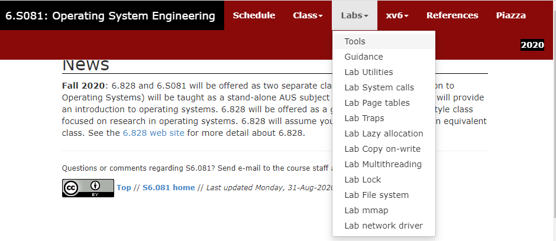

# 实验原理

!!! note "提示"
    本部分我们将理解实验中的操作系统xv6的相关模型，这些模型看起来非常抽象，因此在介绍完之后，我们将加入一章” **我们需要注意的** “，来将其串通。
    


## 1. MIT 6.S081/2020

### 1.1 参考资料

XV6是由麻省理工学院(MIT)开发的一个教学目的的操作系统，它是在x86处理器上用ANSI标准C重新实现的Unix第六版(即v6)，课程编号为6.828。2019年被移植到RISC-V之上，并设置了6.S081。

XV6的主要特征：

- 开源，精简，代码仅两万行左右；
- 功能完善，可全面理解操作系统的原理及实现；
- 基于RISC-V、X86等架构，有利于深入理解体系结构；
- 类Unix系统，可延伸学习其他常见操作系统，例如Linux、MacOS等。
  
1) 官方网站：https://pdos.csail.mit.edu/6.828/2020/index.html

2) xv6 book：https://pdos.csail.mit.edu/6.828/2020/xv6/book-riscv-rev1.pdf


<div align="center">  </div>

这份官方文档，是阅读xv6源码过程中最好的参考资料，在完成所有xv6相关实验的过程中，若对源码有任何的疑问，可随时查看这份文档进行学习。


1) 6.S081所有实验项目（针对每个实验，都有详细的指导和提示）：



### 1.2 XV6总统架构简介

与大多数Unix操作系统一样，XV6采用宏内核结构，它包含操作系统一些最基本的要素，包括系统调用、进程调度、内存管理、中断处理和文件系统等。XV6区分内核态和用户态，代表应用程序的用户态进程运行在CPU的用户态（又称非特权模式，用户模式），无法直接访问系统硬件和操作系统中的系统数据，而操作系统运行在CPU的核心态（又称特权模式，内核模式），可以访问系统硬件和核心数据。


<div align="center">  </div>

## 2. 用户程序

### 2.1 用户程序的使用

我们一般通过 **命令行** （shell）来使用没有图形化界面的操作系统（如Linux）。当我们向shell输入命令时，shell会解释命令并执行对应的 **用户程序** 。实际上，输入命令中的第一个字符串用于指示我们希望执行的用户程序，而后续的字符则为我们希望传递给用户程序的参数。例如在Linux的shell中输入如下命令：

```shell
$ cp file_a file_b
```
其中，"cp"表示我们希望执行的用户程序，用于复制文件。"file_a"和"file_b"是传递给cp程序的参数，指定了源文件和目标文件。实际上，第一个字符串"cp"指的是可执行文件的位置。因为/usr/bin目录包含在 **环境变量** PATH中，所以我们可以直接使用简写"cp"，操作系统会通过PATH变量自动找到/usr/bin/cp并执行它。也就是说，该命令与`/usr/bin/cp file_a file_b`是完全等价的。（这也就是为什么安装java、python等编程语言时需要设置环境变量）

### 2.2 用户程序的实现

用户程序相当于用户使用操作系统的桥梁，用户通过命令行执行用户程序，用户程序则使用系统提供的一系列服务完成我们想要的功能。这里”系统提供的服务“即所谓的 **系统调用** （syscall）。本次实验就需要利用xv6提供的系统调用实现一些实用的用户程序。

用户程序在执行前通常需要接收一些参数，如上文提及的“file_a”和“file_b”。正常情况下，C语言中main函数的定义为：

```c
int main(int argc, char* argv[]);
```

其中argc就表示参数的数量，argv则为存储参数所在地址的数组。在命令行中输入的参数将作为 **字符串** 存储于用户栈，而argv存储的字符串指针则分别指向这些参数。

例如在执行命令“cp file_a file_b”时，程序cp的main函数接收到的参数为：argc=3，argv=["cp", "file_a", "file_b"，null]。

**argv的最后一个元素必须为空指针** （即数值0），用以标志参数的结束。argv的第一个元素则为需要执行的程序。


## 3. xv6的系统调用接口
系统调用（System Call）是程序向操作系统请求服务的方式。当你编写C语言程序时，某些操作（比如文件操作、网络通信、内存分配）需要访问硬件资源或与操作系统交互。因为直接访问硬件的权限被操作系统控制，程序不能直接操作硬件。这时候，程序就需要通过系统调用向操作系统发出请求，由操作系统来完成这些操作。

系统调用被封装为函数以向用户提供接口，用户程序可以通过函数调用的方式请求操作系统的服务，常见的系统调用接口定义如下：（系统调用接口头文件user/user.h）

| **系统调用接口名**                | **描述**                      |
| --------------------------------- | ----------------------------- |
| int fork(void)          | Create a process, return child’s PID. |
| int exit(int status)                  | Terminate the current process; status reported to wait(). No return. |
| int wait(int *status)                 | Wait for a child to exit; exit status in *status; returns child PID. |
| int kill(int pid)                     | Terminate process PID. Returns 0, or -1 for error. |
| int getpid(void)                      | Return the current process’s PID. |
| int sleep(int n)                      | Pause for n clock ticks. |
| int exec(char *filename,char *argv[]) | Load a file and execute it with arguments; only returns if error. |
| char* sbrk(int n)                       | Grow process’s memory by n bytes. Returns start of new memory. |
| int open(char* filename, int flags)             | Open a file; flags indicate read/write; returns an fd (file descriptor). |
| int read(int fd, void* buf, int n)             | Read n bytes into buf; returns number read; or 0 if end of file. |
| int write(int fd, void* buf, int n)            | Write n bytes from buf to file descriptor fd; returns n. |
| int close(int fd)                         | Release open file fd.                                        |
| int dup(int fd)                           | Return a new file descriptor referring to the same file as fd. |
| int pipe(int p[])                           | Create a pipe, put read/write file descriptors in p[0] and p[1]. |
| int chdir(char *dirname)                    | Change the current directory. |
| int mkdir(char *dirname)                    | Create a new directory. |
| int mknod(char *name, short major, short minor) | Create a device file. |
| int fstat(int fd, struct stat *st)                         | Place info about an open file into *st. |
| int link(char *f1, char\*f2)                      | Create another name (file2) for the file file1. |
| int unlink(char* filename)                  | Remove a file.                                               |

图表摘自《xv6 book》P11，具体信息可以参阅。在本次实验中，你需要用到上面列举的部分系统调用。在Linux中，你也可以使用类似`man read.2`命令查看Linux上read系统调用的说明（`.2`表示man手册的第2章，用于描述系统调用）。

## 4.文件描述符和IO操作

这一部分是对下一节介绍管道做铺垫，有助于理解管道和完成pingpong实验任务。

文件描述符是一个小整数，表示由内核管理的对象，进程可以从该对象读取数据或向其写入数据。进程可以通过打开文件、目录或设备，创建管道，或者复制一个已有的描述符来获取文件描述符。为了简便起见，我们通常将文件描述符指向的对象称为“文件”；文件描述符接口将文件、管道和设备的差异抽象为字节流，因此它们看起来都是字节流。我们将输入和输出简称为I/O。

在xv6操作系统中，文件描述符是内核用来管理每个进程的打开文件的机制。每个进程都有一个独立的 **文件描述符表** ，内核使用文件描述符作为这个表的索引。这个文件描述符表记录了当前进程打开的文件或I/O资源。因为文件描述符是从零开始编号的，所以每个进程都有一个从0开始的“私有”文件描述符空间，这些编号不会与其他进程的文件描述符冲突。

按照惯例，进程从文件描述符0（标准输入）读取数据，将输出写入文件描述符1（标准输出），并将错误信息写入文件描述符2（标准错误）。待会我们将看到，shell利用这种惯例来实现I/O重定向和管道操作。shell会确保始终打开三个文件描述符（参见user/sh.c的main函数），默认情况下，这些文件描述符指向控制台。。

read和write系统调用从由文件描述符命名的打开文件中读取字节或向其写入字节。调用`read(fd, buf, n)`时，最多从文件描述符fd中读取n字节，将它们复制到buf中，并返回读取的字节数。每个指向文件的文件描述符都有一个与之关联的偏移量。read从当前文件偏移量处读取数据，然后将该偏移量向前移动读取的字节数：后续的读取操作将返回紧跟在第一次读取返回的字节之后的字节。当没有更多字节可读时，read返回零，以表示文件的结束。

调用`write(fd, buf, n)`时，将buf中的n字节写入文件描述符fd，并返回写入的字节数。只有在发生错误时，写入的字节数才会少于n字节。与read类似，write在当前文件偏移量处写入数据，然后将该偏移量向前移动写入的字节数：每次写入从上一次写入结束的地方继续。

以下程序片段（它构成了程序cat的核心）将数据从标准输入复制到标准输出。如果发生错误，它会将消息写入标准错误。
```c
char buf[512];
int n;
for (;;) {
    n = read(0, buf, sizeof buf);
    if (n == 0)
        break;
    if (n < 0) {
        fprintf(2, "read error\n"); /*向文件描述符2（标准错误输出）打印错误信息"*/
        exit(1);
    }
    if (write(1, buf, n) != n) {
        fprintf(2, "write error\n");
        exit(1);
    }
}
```

需要注意的是，cat并不知道它是从文件、控制台还是管道中读取数据。同样，cat也不知道它是在向控制台、文件或其他什么地方打印数据。文件描述符的使用以及文件描述符0代表输入、文件描述符1代表输出的惯例，使得cat的实现变得非常简单。

close系统调用释放文件描述符，使其可以被未来的open、pipe或dup系统调用重新使用（见下文）。新分配的文件描述符总是当前进程中编号最小的未使用描述符。

文件描述符和fork的交互使得实现I/O重定向变得非常容易（请好好理解这一段，因为这涉及pingpong实验的原理）。**fork会复制父进程的文件描述符表及其内存，因此子进程启动时具有与父进程完全相同的已打开文件** 。当调用 exec 来运行新程序时，exec 会替换子进程的程序代码和数据（内存），但不会改变文件描述符表。也就是说，已经打开的文件仍然保持打开状态。这种机制允许 shell 通过 fork 创建一个子进程，然后在子进程中根据需要修改文件描述符（比如将输入或输出重定向到文件或管道），再调用 exec 来运行新程序，最终实现 I/O 重定向。下面是shell在执行命令cat < input.txt时的简化代码示例：

```c
char* argv[2];
argv[0] = "cat";                 /* 设置要执行的命令为"wc" */
argv[1] = 0;                     /* 参数数组以NULL结尾，表示没有更多参数 */
if (fork() == 0) {
    close(0);                    /* 关闭标准输入 */
    open("input.txt", O_RDONLY); /* O_RDONLY 是 read only 只读的意思 */
    exec("cat", argv);           /* 执行 "cat" 命令 */
}
```

当子进程关闭文件描述符0（标准输入）后，紧接着的open系统调用打开新的input.txt文件返回的文件描述符一定是0，这是因为文件描述符 0 已经被关闭，而操作系统总是分配当前最小的可用文件描述符，因此，input.txt 会被分配到文件描述符 0。随后，cat程序以文件描述符 0 指向input.txt的方式执行，也就是说，cat 程序的标准输入将会是 input.txt 文件的内容。父进程的文件描述符不会受到这些操作的影响，因为这些改变只发生在子进程中，父进程的文件描述符保持不变。

xv6 shell中实现I/O重定向的代码正是以这种方式工作的（见user/sh.c:78）。在代码执行到这一行时，shell已经fork了子进程（见user/sh.c:155），并且runcmd将会调用exec来加载新程序。

dup系统调用复制一个现有的文件描述符，返回一个引用自同一个底层I/O对象的新文件描述符。两个文件描述符共享一个偏移量，就像fork复制的文件描述符一样。

```c
fd = dup(1); /*使用dup函数复制文件描述符1，即标准输出。返回的文件描述符存储在fd变量中*/
write(1, "hello ", 6);
write(fd, "world\n", 6);
```

当这段代码运行时，它会在终端上显示“hello world”。

## 5.管道

!!! 管道机制简介
    管道是一种父子进程间或子子进程间的进程间通信机制，它由xv6操作系统提供，并可通过直接编程或在shell程序下轻松把不同进程的输入和输出连接起来。
    
    直接编程方式：xv6提供了pipe系统调用接口，我们可以在本节实验中直接使用。
    
    shell命令方式：“|”是管道符号，即两个命令之间的一道竖杠。我们可以通过管道符号组合的命令，实现不同进程（父子进程间或子子进程间）的通信，从而在不改变应用程序代码的情况下，让操作系统具有进程间信息交互和功能组合的能力。详见[管道](../../Linux/#82)

管道（pipe）是操作系统提供的一个小型缓冲区，它通过两个文件描述符与进程进行交互，一个用于读取数据，另一个用于写入数据。当你往管道的一端写入数据时，数据可以从管道的另一端被读取。管道为进程之间提供了一种通信方式。

下面是一个示例，它通过管道将wc（word count）程序的标准输入连接到管道的读取端，这样wc程序可以通过read系统调用从管道中读取数据。最终，程序会在终端上输出“hello world”的字数统计信息。


```C
int p[2];        /* 存储管道的两个文件描述符 */
char *argv[2];
argv[0] = "wc";  /* 设置要执行的命令为"wc" */
argv[1] = 0;     /* 参数数组以NULL结尾，表示没有更多参数 */
pipe(p);         /* 创建管道，p[0]是管道的读端，p[1]是管道的写端 */

if (fork() == 0) { 
    /* 子进程 */
    close(0);    /* 关闭标准输入（文件描述符0） */
    dup(p[0]);   /* 复制管道的读端p[0]，让文件描述符0指向管道的读端 */
    close(p[0]); /* 关闭不再需要的管道读端 */
    close(p[1]); /* 关闭不再需要的管道写端 */
    exec("/bin/wc", argv); /* 执行"wc"程序 */
} else {
    /* 父进程 */
    close(p[0]);                      /* 关闭管道的读端 */
    write(p[1], "hello world\n", 12); /* 向管道写入"hello world\n" */
    close(p[1]);                      /* 关闭管道的写端，表示写入完成 */
}

```

程序中，pipe系统调用创建了一个新的管道，并将读端和写端的文件描述符保存在数组`p`中。fork之后，父进程和子进程都拥有对同一个管道的访问权。

子进程通过`close`和`dup`操作，使文件描述符0（标准输入）指向管道的读端，然后子进程关闭不再需要的文件描述符，接着调用`exec`去运行wc程序。当wc程序从默认的文件描述符 0 读取数据时，它实际上是在从管道读取数据。

父进程关闭管道的读端，然后向管道的写端写入数据，最后关闭写端，表示写入完成。。

如果管道中没有数据可读，read操作会等待，直到有数据被写入，或者直到所有指向管道写端的文件描述符都被关闭。如果所有写端的文件描述符都被关闭，read操作会返回0，表示读到文件的末尾。

正因为read会等待新数据，这也是为什么在这个例子中，子进程在执行wc之前必须先关闭管道的写端。否则，如果wc程序还持有管道的写端文件描述符，它永远不会检测到文件结束信号，程序就会一直等待新数据而不会结束。（这也是编写pingpong程序时常见的一个问题）


## 6.我们需要注意的：xv6入门指南的入门指南

前四个部分的叙述非常抽象，我们在这一部分将其 **融会贯通** 起来，看看其间的关系。

xv6是一个操作系统，但是在这一章我们 **不打算修改** 操作系统，而是编写应用程序，去 **使用** 操作系统。我们编写的最简单的应用程序如下：

```c
int main(){
    printf("Hello world");
    return 0;
}
```

这段代码对我们来说太过熟悉，以至于我们会以为这与操作系统毫无关系。实际上， *printf* 这个函数调用了操作系统的服务，这个就是第三部分提到的”系统调用接口“，长得和函数一样，用起来也和函数一样。

现在我们来看看xv6里面的简单程序长啥样：

```C
#include "user.h"
int main(int argc, char* argv[]){
    printf("Hello world");
    exit(0);
}
```

这就是最简单的xv6应用程序啦，下面我们来一一介绍每一行的意义：

- 第一行include了xv6自带的库函数，打开它你会看到里面有两种函数，一种是system call，即第三部分提到的”系统调用接口“，另一种就是我们平常用到的辅助函数，xv6帮你写好的那种，比如 *strlen* 。今后我们可能也会用到别的库，自己引用进来就好。
- 第二行，发现怎么有两个参数啊？这其实就是第二部分[用户程序的实现](#21)所说的。当我们启动一个程序的时候，需要给它一些信息，这样程序就知道它被启动的目的是什么了。
- 第三行，调用的就是一个系统调用了。在之后的程序编写中，我们需要操作系统帮忙的时候，我们就要 **使用第三部分中罗列的各种系统调用，以函数的形式使用它** 。
- 第四行的exit一定不要漏了，现代操作系统中linux和windows都可以用return 0退出程序，这是它设计的好的缘故，但是xv6则 **需要使用系统调用exit显式的退出程序** ，要不然这个程序就没完了。

知道了基本程序该如何编写后，各种应用程序也就只是逻辑的问题了，如果不放心，自己编个应用程序试试看先，也不错。

下面，我们就正式进入到各实验的细节中。