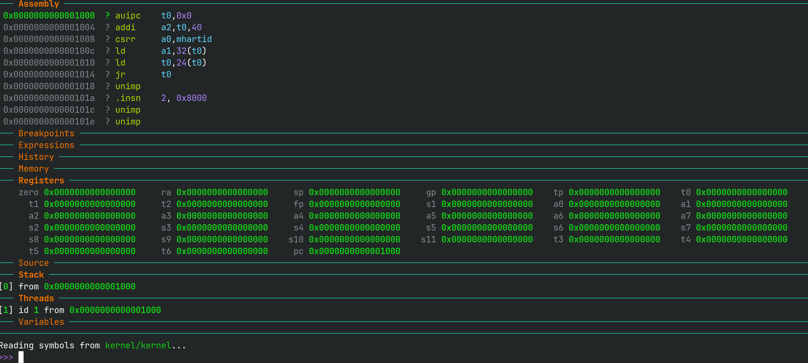
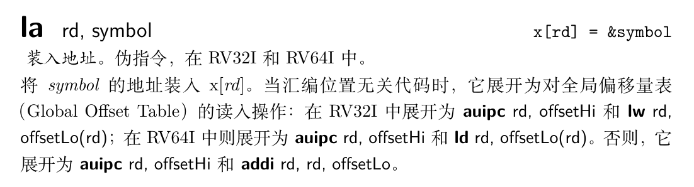
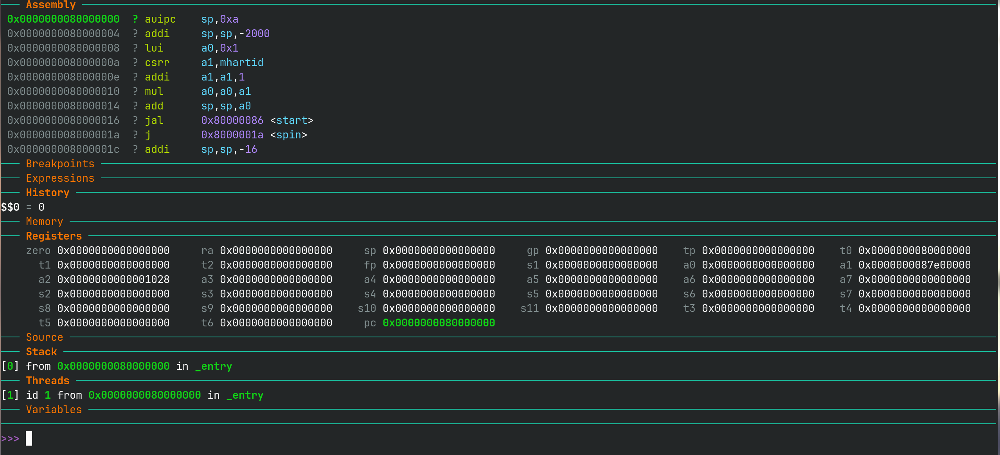
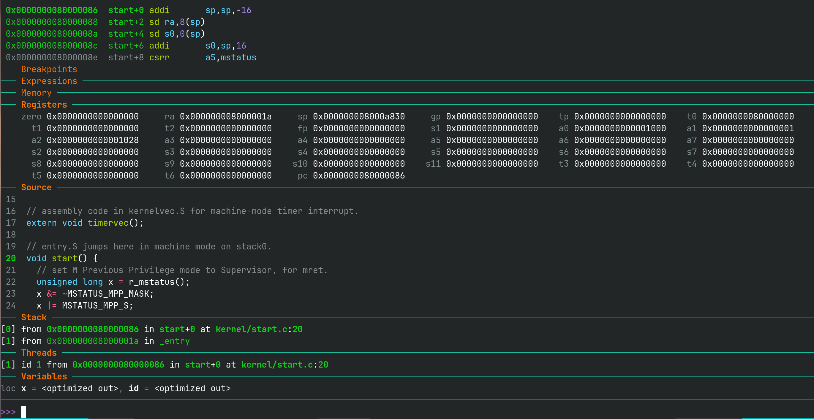
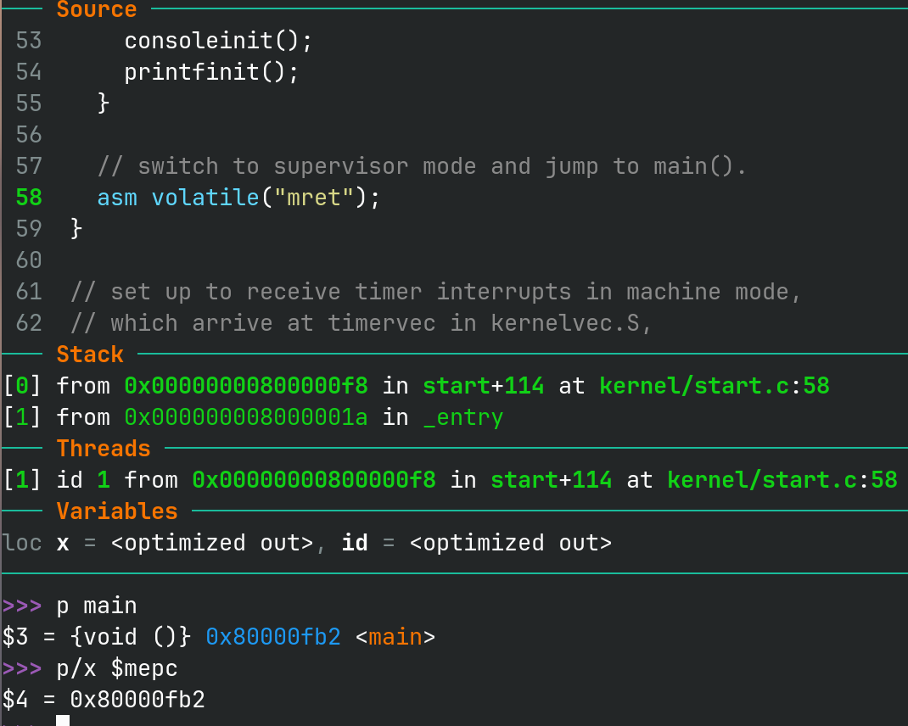
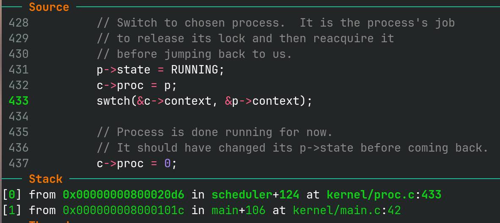

# 实验步骤

下面，我们就正式进入到各实验的细节中，并给出实验实现的一些提示。大家需要依照实验指导书的[实验概述](../part1/)中提到的要求进行实现。同时，还需要回答指导书给出的[问题](../part3/#33)。

### 1. 部署实验环境

实验环境主要分为三部分：xv6运行环境、xv6源码、xv6的编译与运行。

#### 1.1 xv6运行环境

xv6运行环境详见[实验平台及环境配置](../../env/)。

#### 1.2 xv6源码

请clone最新代码到本地进行实验：

```shell
git clone https://gitee.com/ftutorials/xv6-oslab24-hitsz.git
```

每个实验项目都在不同的分支上完成，请 **注意切换分支** ，例如，实验一需切换到util分支后进行开发：

```shell
git branch -a
git checkout util
```

`git branch`表示列出当前仓库中的所有 本地分支。加上`-a`这个选项后，会显示所有分支，包括本地分支和远程分支。
<div align="center">  </div>

另外，由于我们的[官方仓库](https://gitee.com/ftutorials/xv6-oslab24-hitsz.git) **随时可能更新**，所以做实验前需要先拉取最新的代码：先切到对应的分支（util），然后：

```shell
git pull
```

xv6的代码结构：

<div align="center">  </div>

#### 1.3 编译并运行xv6

Step1 在代码总目录xv6-oslab24-hitsz下输入`make qemu`， 编译并运行xv6;

Step2 当可以看到“init: starting sh”的字样表示xv6已经正常启动，此时在“$”提示符后可输入xv6支持的shell命令。

<div align="center">  </div>

!!! warning "qemu退出方法"
    先按`ctrl+a`组合键，接着完全松开，再按`x`

### 2. 准备工作

本次实验需要编写[实验内容](../part1/#3)中介绍的3个Unix实用程序。初次接触操作系统实验的你可能会感到不知所措，因此不妨先体验一下这些程序的运行效果。实际上，Linux中具备本次实验要实现的一些程序，例如sleep、find。你可以先尝试在Linux中使用这些命令，充分体会功能后再开始编程。当然，Linux中命令的功能较为复杂，我们仅要求实现简化版。

实验开始之前，我们 **强烈建议** 你先完成以下工作：

!!! tip ""
    1. 熟悉常见命令的使用，如 `echo`、`xargs`、`find`。
    - 了解目录的使用。了解 `.`、`..`、`/`分别表示什么，熟悉常见的目录操作命令，如`mkdir`、`cd`。
    - 了解重定向的使用，重定向即命令中的`<`和`>`，用于修改右侧命令的标准输入/输出。例如`echo Hello world > file_a`会将字符串`Hello world`输出至文件`file_a`，而不是打印在终端。
    - 了解管道的使用。管道即命令中的`|`，用于将左侧命令的标准输出传递给右侧命令的标准输入。
    - 了解常见系统调用的使用。如 `fork`、`exit`、`wait`、`open`、`close`、`read`/`write`、`pipe`、`dup`。

### 3. 编写用户程序

#### 3.1 代码示例sleep

为帮助同学们理解xv6用户程序的编写方法，我们提供了一个sleep用户程序示例，你需要理解其代码并成功将其运行：

Step1. 新建user/sleep.c文件，编写如下代码，理解代码和注释；

<div align="center">  </div>

Step2. 由于sleep.c为新增的用户程序文件，请在Makefile文件中找到UPROGS，在`UPROGS`上增加一行`$U/_sleep`：

!!! info "UPROGS的含义"
    `UPROGS`变量(User Programs)列出了所有需要编译、链接并打包到文件系统镜像中的用户程序。每一项都对应一个最终的可执行文件。例如，`$U/_cat`(`$U`是user目录的路径)表示cat命令的可执行文件，这个文件会被编译并生成，然后放入文件系统镜像`fs.img`中，以便在系统启动时可以访问和运行。

<div align="center">  </div>

Step3. 编译xv6并运行sleep。

<div align="center">  </div>

Step4. 回答3.3中的[相关问题](#33)。

#### 3.2 实验提示

在做完sleep实验后，相信你已经明白如何在xv6中添加一个用户程序了。请同学们根据以下提示，再添加pingpong和find两个用户程序。

需要注意的是，xv6中用户程序开发无法使用C语言中的标准库（例如`stdio.h`等），因为xv6是一个极简的操作系统，无法完整提供标准库所需的功能。你能使用的库函数主要在`user/ulib.c`中

##### 3.2.1 pingpong

请在`user/pingpong.c`中实现[pingpong程序](../part1/#32-pingpong)。建议你在做之前着重理解实验原理中[文件描述符和IO操作](../part2/#3-xv6)和[管道](../part2/#5)这两节。

a) 使用`pipe()`创建管道；请思考，需要用到几个管道呢？

b) 使用`fork()`创建子进程，注意根据返回值，判断父子进程；

c)   利用`read()`, `write()`系统调用对管道进行读写。你可能还需要用到`close()`、`getpid()`等等[系统调用](../part2/#3-xv6)。

d)   如果你需要在数字和字符串之间进行转换，`user/ulib.c`提供了`atoi`和`itoa`函数（a for ASCII, i for Integer)。

e) 修改`Makefile`，将程序添加到`UPROGS`。

##### 3.2.2 find

a) 可查看`user/ls.c`以了解如何读取目录；

b) 可参照`user/ls.c`的逻辑实现；

c) 使用递归允许`find`进入到子目录；

d) 不要递归进入`.`和`..`；

e) 测试时需要创建新的文件和文件夹，可使用`make clean`清理文件系统，并使用`make qemu`再编译运行。

**提示：**

- 关于以上2个Unix实用程序的实现亦可参考MIT官方的实验指导完成实验[Lab: Xv6 and Unix utilities](https://pdos.csail.mit.edu/6.828/2020/labs/util.html)

- 系统调用接口的示例可查阅《xv6 book》chapter 1的内容， **尤其是1.2、1.3节的内容** 。

#### 3.3 回答问题

一、阅读sleep.c，回答下列问题

1. 当用户在xv6的shell中，输入了命令`sleep hello world\n`，请问argc的值是多少？argv数组大小是多少？
2. 请描述main函数参数argv中的指针指向了哪些字符串，它们的含义是什么？
3. 哪些代码调用了系统调用为程序sleep提供了服务？

二、了解管道模型，回答下列问题

1. 简要说明你是怎么创建管道的，又是怎么使用管道传输数据的。
2. fork之后，我们怎么用管道在父子进程传输数据？
3. 试解释，为什么要提前关闭管道中不使用的一端？（提示：结合管道的阻塞机制）

### 4. xv6 启动流程分析

当我们输入`make qemu`后，就能启动 qemu，从控制台参数加载资源，将 xv6 整体加载到物理内存中。xv6 启动涉及 kernel 目录下的 entry.S、start.c 与 main.c 等少数几个文件，entry、start 两个函数运行在机器态（类似于 BIOS），main 运行在内核态（特权级），后面的用户程序运行在用户态。

!!! info "RISC-V 特权级机制"
    特权级机制的实现旨在增强计算机系统的安全性，特别是防止应用程序的错误导致操作系统乃至整个系统的不稳定。操作系统和应用程序的安全性需求不同，操作系统需要在受保护的环境中运行，以避免被应用程序破坏，而应用程序则运行在一个受限的环境中。

    为此，处理器通常设计成支持两个主要的执行环境：

    - 用户态：用于运行应用程序，限制其访问某些敏感的资源和执行可能破坏系统的指令。
    - 内核态：用于操作系统的执行，拥有完全的系统控制权限，可以访问和操作所有硬件资源。

    特权级机制通过硬件和软件的协同设计来实现。处理器会在执行指令前检查特权级，确保用户态程序无法执行内核态指令。这样即使应用程序出现问题，也不会影响操作系统的稳定性。

    为了在安全的前提下允许应用程序调用操作系统的服务，RISC-V 提供了两个关键指令：

    - `ecall`（Execution Environment Call）：用于从用户态切换到内核态，执行操作系统提供的服务。
    - `sret`（Supervisor Return）：用于从内核态返回到用户态，恢复应用程序的执行。
    这种设计保证了应用程序只能通过操作系统的控制来执行高权限的操作，从而提高系统整体的安全性和稳定性。

    更深入了解请访问 https://rcore-os.cn/rCore-Tutorial-Book-v3/chapter2/1rv-privilege.html#riscv-priv-arch

启动流程步骤如下:

按照[GDB 调试指南](../gdb.md)启动 qemu 并进行调试：

1. qemu 将执行位于 0x1000 地址处的一小段汇编指令，最终跳转到 0x8000_0000 位置，开始运行 xv6 的首个函数：\_entry (kernel/entry.S)

    !!! note "调试技巧"
        可以使用 `si` 单步调试汇编指令。请同学们试试 `help si` 会输出什么？`si` 指令的全称是什么？

    

2. \_entry 函数设置当前 CPU 的栈寄存器(sp)，拥有栈后就可以调用函数了，最后会进入 start 函数。

    !!! info "RISC-V 伪指令"
        RISC-V 伪指令是为了方便编程而设计的，它们不是处理器直接支持的原生指令，编译器或汇编器会将其转化为一个或多个真实的机器指令。

        仔细对比 entry.S 中的代码与 gdb 中汇编代码的区别
        我们注意到 _entry 函数中第一行汇编指令 `la sp, stack0` 被翻译为了 `auipc sp,0xa` 和 `addi sp,sp,-2000` 这两条指令。
        

    

3. start 函数进行了如下操作：

    - 初始化机器态特权寄存器
    - 启用时钟中断
    - 把当前 CPU 的 id 放入 tp 寄存器
    - 将 main 函数地址写入特权级寄存器 `mepc`，在 start 函数末尾 `mret` 指令会跳转到 `mepc` 寄存器所存的地址，也就是 main 函数，同时完成机器态特权级到内核态特权级的切换

    !!! note "调试技巧"
        我们终于看见 C 语言代码了！
        在调试C语言程序时可以使用 `n` 与 `s` 单步执行代码。

        - `n` (`next`)：单步步过，即跳过函数内部的执行，直接到函数返回后的一行代码。
        - `s` (`step`)：单步步入，即进入函数的内部执行代码。

    

    !!! tip "试试看"
        找到 start 函数末尾行号为 58， 使用 `u 58` 命令跳转到第 58 行。

        在 start 函数末尾分别打印 main 函数地址与 `mepc` 寄存器的值，发现他们相同。

        使用 `si` 指令，发现会跳转到 main 函数。

        

    !!! note "调试技巧"
        `p` 在 GDB 中，p 命令（即 print）用于显示表达式的值，是最常用的调试命令之一。它可以用于查看变量、寄存器、表达式的值以及内存中的内容。下面是 p 命令的几个主要用法：

        - `p variable`：打印变量的值
        - `p expression`：打印表达式的结果
        - `p *pointer`：打印指针指向的内容
        - `p struct.member`：打印结构体成员
        - `p &variable`：打印变量地址
        - `p $register`：打印寄存器的值
        - `p/u expression`：打印值的无符号整型表示
        - `p/x expression`：打印值的十六进制表示

4. main 函数初始化了各种外设的驱动、内存模块、进程模块、文件系统。

5. 在 main 函数调用的 userinit 里面，xv6 在内核初始化了第一个用户程序 initcode，只有不到 100 字节。这个程序运行时只占用一个内存页（数据来自 initcode），这个页兼具代码段、数据段、栈的功能。

6. 从 main 函数进入 scheduler 函数（调度器）之后，scheduler 通过 swtch (kernel/swtch.S) 汇编函数调度到初始进程 initcode。

    !!! note "调试技巧"
        由于 swtch 函数是汇编语言函数，因此 `s` 无法直接进入，需要使用 `si` 直到步入跳转指令才能进入该函数调用。

        

7. swtch 函数接受两个参数，将 `ra` 寄存器和被调用者保存寄存器（`sp`、各种`s`寄存器）保存在第一个`context`中，然后从第二个`context`中加载这些寄存器，最后调用 `ret` 指令跳转到 `ra` 寄存器的地址，在进程初次加载运行时会跳转到 forkret 函数。

8. forkret 函数末尾会调用 usertrapret 函数。usertrapret 函数负责从内核态返回到用户态执行用户程序，usertrapret 函数最终会跳转到 userret (kernel/trampoline.S) 汇编函数，最终调用 `sret` 指令返回到用户态执行用户程序，开始执行 xv6 第一个用户态程序也就是 initcode。

    !!! info "RISC-V `sret` 指令"
        `sret` 指令执行过程简述：

        - 切换特权级：`sret `会将当前特权级从 S-mode 降低到 U-mode，即从内核态切换到用户态特权级。
        - 跳转到用户态返回地址：处理器会从`sepc`寄存器中读取程序在陷入之前的地址，这个地址就是用户模式代码要返回的地方，并跳转到此处执行用户态程序。

9. initcode 用户程序只负责运行 `exec("/init")`，将当前进程映像替换为 init 程序。这样，xv6 已经可以正常运行用户程序了，只要用户进程存在就会被 CPU 调度运行

10. init 程序被放在磁盘上，它就是所有进程的祖先（0 号进程）。

    - 从磁盘加载应用程序的过程是 exec 系统调用完成的
    - 它通过 fork+exec 的方式启动控制台程序 sh
    - 它不断地调用 wait(0)来回收所有僵尸进程
    - 它被启动后会输出一行“init: starting sh”
    - sh 程序是控制台进程。它被启动后就会输出'$'

有兴趣的同学可以用GDB在`_entry`函数处打断点，调试跟踪xv6的启动（详见[VSCode图形化调试指南](../../remote_env_gdb)）

在理解xv6的启动流程后，就可以开始编写xv6启动流程实验了，详见[实验内容及要求](../../lab1/part1/#34-xv6)

<div align="center">  </div>
