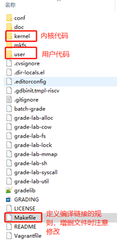
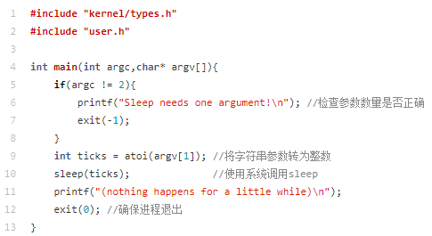

# 实验步骤

下面，我们就正式进入到各实验的细节中，并给出实验实现的一些提示。大家需要依照实验指导书的[实验概述](../part1/)中提到的要求进行实现。同时，还需要回答指导书给出的[问题](../part3/#33)。

### 1. 部署实验环境

实验环境主要分为三部分：xv6运行环境、xv6源码、xv6的编译与运行。

#### 1.1  xv6运行环境

xv6运行环境详见[实验平台及环境配置](../../env/)。

#### 1.2  xv6源码

请clone最新代码到本地进行实验：   

```
$ git clone https://gitee.com/hitsz-lab/xv6-labs-2020
```

每个实验项目都在不同的分支上完成，请 **注意切换分支** ，例如，实验一需切换到util分支后进行开发。

```shell
$ git branch -a
$ git checkout util
```


 xv6的代码结构：



#### 1.3  编译并运行xv6

Step1 在代码总目录xv6-labs-2020下输入“make qemu”， 编译并运行xv6;

Step2 当可以看到“init: starting sh”的字样表示xv6已经正常启动，此时在“$”提示符后可输入xv6支持的shell命令。


!!! warning "qemu退出方法"
    先按`ctrl+a`组合键，接着完全松开, 再按`x`


### 2.  准备工作

本次实验需要编写[实验内容](../part1/#3)中介绍的5个Unix实用程序。初次接触操作系统实验的你可能会感到不知所措，因此不妨先体验一下这些程序的运行效果。实际上，Linux中具备本次实验要实现的一些程序，例如sleep、find、xargs。你可以先尝试在Linux中使用这些命令，充分体会功能后再开始编程。当然，Linux中命令的功能较为复杂，我们仅要求实现简化版。

实验开始之前，我们 **强烈建议** 你先完成以下工作：

!!! tip ""
    1. 熟悉常见命令的使用，如 `echo`、`xargs`、`find`。
    - 了解目录的使用。了解 `.`、`..`、`/`分别表示什么，熟悉常见的目录操作命令，如`mkdir`、`cd`。
    - 了解重定向的使用，重定向即命令中的`<`和`>`，用于修改右侧命令的标准输入/输出。例如`echo Hello world > file_a`会将字符串`Hello world`输出至文件`file_a`，而不是打印在终端。
    - 了解管道的使用。管道即命令中的`|`，用于将左侧命令的标准输出传递给右侧命令的标准输入。
    - 了解常见系统调用的使用。如 `fork`、`exit`、`wait`、`open`、`close`、`read`/`write`、`pipe`、`dup`。


### 3.  编写用户程序

#### 3.1  代码示例

sleep程序已经实现，你需要理解其代码并成功将其运行：

Step1. 阅读user/sleep.c文件，理解代码和注释；



Step2. 由于sleep.c为新增的用户程序文件，请在Makefile文件中找到UPROGS，在UPROGS上增加一行`$U/_sleep`：


Step3. 编译xv6并运行sleep。


Step4.回答3.3中的[相关问题](#33)。

#### 3.2  实验提示

**1)**   **pingpong**

a)   使用`pipe()`创建管道，详见[实验原理](../part2/)；

b)   使用`fork()`创建子进程，注意根据返回值，判断父子进程；

c)    利用`read()`, `write()`函数对管道进行读写。

d)   请在`user/pingpong.c`中实现。

e)   修改`Makefile`，将程序添加到`UPROGS`。

**2)**   **primes**

a)    根据需求利用`fork()`创建子进程;

b)    利用多个`pipe()`创建的管道在父子进程间进行数据的传输；

c)    可以使用`dup()`复制文件句柄（管道的写入、读出端），用来节省资源：

例如，将”hello world”写入到标准输入。

```c
fd = dup(1);
write(fd, “hello”, 6);
write(fd, “world\en”, 6); //此时fd!=1，但字符串仍然会写入标准输出
```

!!! tip "提示"
    由于xv6的文件描述符和进程数量有限（详见`kernel/param.h`），请注意关闭进程不需要的文件描述符，否则，你的程序在xv6上运行会在第一个进程到达35之前耗完资源。

    ```c
    // kernel/param.h
    #define NPROC        64  // maximum number of processes
    #define NOFILE       16  // open files per process
    #define NFILE       100  // open files per system
    ```

d)    管道`read`是一直阻塞，直到管道有数据写入；如果绑定在这个管道的写端口关闭了，`read`返回0。注意及时关闭管道的写端，否则读出端无法判断传输的结束。

e)	要确保子进程先退出，父进程再退出。要不然容易出现如下错误，即`$`符号先打印出来，但是子进程还在运行状态中。如下图所示。


f)	建议直接将32位（4字节）int写入管道，而不是使用格式化的ASCII I/O。即往管道中写32位的整数，无需转换位字符串。

**3)**   **find**

a)    可查看`user/ls.c`以了解如何读取目录；

b)    可参照`user/ls.c`的逻辑实现；

c)    使用递归允许`find`进入到子目录；

d)    不要递归进入`.`和`..`；

e)    测试时需要创建新的文件和文件夹，可使用`make clean`清理文件系统，并使用`make qemu`再编译运行。

**4)**   **xargs**

a)    xv6中的`xargs`基本功能演示：

示例1：

```shell
$ xargs echo good   # 指定要执行的命令：echo，同时输入参数'good'
bye                 # 换行后继续输入echo的参数'bye'
good bye			# 执行"echo good bye"，输出"good bye"
hello too           # 换行后输入参数'hello too'
good hello too      # 执行"echo good hello too"，输出"good hello too"
# 通过ctrl+D结束输入
$
```

`echo`命令用于将接收到的参数作为字符串输出。示例中，每输入一行字符串`string`，程序就会执行一次`echo good string`。用户输入`ctrl+D`的时候，`gets`等函数返回为空。

需要注意的是，Linux中`xargs`具备`"-n"`选项，用于选择每次执行命令需要接收的参数数量，例如：

```shell
$ xargs -n2 echo good   # 设置选项-n为2，表示接收两个参数（两行输入）；指定要执行的命令：echo，并输入参数'good'
bye                     # 换行后输入参数'bye'
hello too               # 换行后继续输入参数'hello too'，至此接收两个参数
good bye hello too      # 执行"echo good bye hello too"，输出"good bye hello too"
# 通过ctrl+D结束输入
$
```

为了简化实现，我们不要求实现选项`"-n"`，实现时请 **默认该选项为`"-n1"`** ，即 **每接收一行就执行一次指定的命令** 。

示例2：

```shell
$ make qemu
...
$ echo 3 4|xargs echo 1 2
1 2 3 4
$
```

本示例中，管道左侧`echo`的输出为`"3 4"`，通过管道和`xargs`，它被传递给右侧的echo，即右侧echo实际得到的参数为"1"、"2"、"3"、"4"。最终结果等价于执行命令`"echo 1 2 3 4"`。实验中你不必考虑管道的实现与使用，你的程序可以直接从标准输入中读取管道传递给你的字符串。

b)    使用`fork()`和`exec()`系统对每一行输入调用命令；exec接收的二维参数数组argv，`argv[0]`必须是该命令本身，最后一个参数`argv[size-1]`必须为0，否则将执行失败。


c)    使用`wait()`等待子进程运行完命令；

d)    可以使用`kernel/param.h`中定义的`MAXARG`来声明`argv`的长度；

e)    可使用`make clean`和`make qemu`清理文件系统并重新运行。


**提示：**

1)   关于以上5个Unix实用程序的实现亦可参考MIT官方的实验指导完成实验[Lab: Xv6 and Unix utilities](https://pdos.csail.mit.edu/6.828/2020/labs/util.html)

2)   系统调用接口的示例可查阅《xv6 book》chapter 1的内容， **尤其是1.2、1.3节的内容** 。


#### 3.3 回答问题

一、阅读sleep.c，回答下列问题

1) 当用户在xv6的shell中，输入了命令`sleep hello world\n`，请问argc的值是多少，argv数组大小是多少。  
   
2) 请描述main函数参数argv中的指针指向了哪些字符串，他们的含义是什么。
   
3) 哪些代码调用了系统调用为程序sleep提供了服务？
   

二、了解管道模型，回答下列问题

1) 简要说明你是怎么创建管道的，又是怎么使用管道传输数据的。  
   
2) fork之后，我们怎么用管道在父子进程传输数据？ 
   
3) 试解释，为什么要提前关闭管道中不使用的一端？（提示：结合管道的阻塞机制）

