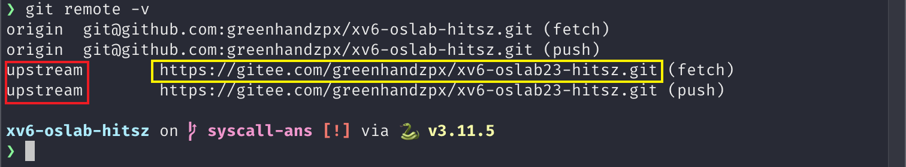

# 实验提交

实验一提交<font color=red>  **实验报告** </font> 和 <font color=red> **实验代码(只提交commit.patch文件)** </font> 。

## 1. 实验报告会纳入评分（虽然不多） 

实验报告要求 **[回答实验中的问题](../part3/#33)，并写出实验设计思路和运行结果** 。

实验报告也是证明实验是独立完成的重要依据，有分数追求的大佬（juanwang）们不要只放代码和指导书的截图。

## 2. 实验代码（只提交commit.patch文件）

不需要提交完整的代码包，只需要提交commit.patch文件即可，操作步骤如下：

- 编写好3个程序(sleep、pingpong、find)后，在xv6-oslab24-hitsz项目目录下，运行make grade，查看是否都能通过。
- 做完xv6启动流程实验后，将gdb命令脚本命名为 **commands.gdb**，放在xv6-oslab24-hitsz项目包里，具体要求详见：[关于 gdb 命令脚本如何导出](../part1/#34-xv6)。
- 在完成上述两个步骤之后，将当前分支上的所有更改进行提交（commit，具体方法参考[git使用教程](#3-git)）。
- 在仓库的目录下使用`make diff`命令导出更改文件（commit.patch）。
- 将 **生成的commit.patch文件** 与 **实验报告** 一起打包提交到作业提交平台即可。

<div align="center">  </div>

------

在实验过程中，大家注意保存好自己的代码，保存代码的两个方法：

（1）**强烈推荐** 将代码提交到自己的Github/Gitee等代码托管服务器上，具体操作详见[将代码发布至自己的远程仓库](../../tools/#32)。

（2）把整个xv6-oslab24-hitsz目录打包，然后用scp或者mobaXterm工具的sftp拷贝出来，自行保存好整个工程文件，以备下次实验使用。

------

## 3. git使用教程

&emsp;&emsp;git作为开发者常用的开源分布式版本控制系统，在使用远程仓库进行开发时具有不可或缺的作用。

&emsp;&emsp;**这里给大家推荐一个有趣的Git闯关游戏，解锁Git技能**  。通过一系列刺激的关卡挑战，可以帮助大家理解Git的分支究竟是怎么回事：“Learning Git Branching” ，https://learngitbranching.js.org/?locale=zh_CN

- 如果你想要建立自己的远程仓库并且同步自己的代码、建立一整套完整的工作流，那么请直接阅读[将代码发布至自己的远程仓库](../../tools/#32)，那里非常详细地介绍了整个流程。

- 如果你只是想要提交实验代码，那么按照下面的流程即可。

### 配置git

在使用git提交之前需要进行配置：

```shell
git config --global user.name "你的用户名"
git config --global user.email "你的邮箱"
```

用户名和邮箱具体是什么不重要，但不能没有，随意填写即可。

### 提交本地修改

在[部署实验环境](../part3/#1)部分大家已经将实验的官方仓库clone下来、并且在该仓库里完成了实验，那么提交我们的代码时，只需要将自己所做的改动暂存(add)并提交(commit)即可，在项目的根目录执行如下命令：

```shell
git add .
git commit -m "你的提交日志"
```

良好的提交日志有助于别人快速的了解你的工作，并且便于后续的版本管理和仓库的维护。如果你想学习如何写好commit日志，我们建议你查看[commit规范](https://zhuanlan.zhihu.com/p/182553920)。

### 获取所做的改动

当我们提交完代码后，我们的项目便存储了一个新的版本，这个时候我们通过如下命令即可获取这个新的版本跟原先版本之间的差异，即我们所做的改动，也就是这次实验需要提交的东西：

```shell
make diff
```

<!--
!!! info  "注意"
    如果该命令执行出现报错：
    `fatal: ambiguous argument syscall-base': unknown revision or path not in the working tree.`
    那么证明你当前的仓库并没有获取到我们在远程仓库里面冻结的仓库版本，也就是`syscall-base`这个tag，我们所有的更改都是跟这个tag来比对出来的。
    
    所以你需要将远程仓库中的tag获取下来，我们建议你直接`fetch`远程仓库的所有更改：
    `git fetch 远程仓库在本地的标志`
    这个 **远程仓库在本地标志** 指的是：
    
    上图中的 **红色方框** 内的就是远程仓库在本地的标志，但是要注意的是，我们有多个远程仓库的时候需要注意`fetch`的对象一定是跟 **黄色方框** 中的网址一样的（也就是我们的远程实验代码仓库，不是自己的远程仓库）！
-->
    
执行完该命令后会在项目目录下生成一个 **commit.patch** 文件，该文件记录了这次实验我们所做的所有更改，也就是本次实验你需要提交的 **代码部分**，将其拷贝到本地电脑，再跟实验报告一起打包上传至作业提交平台即可。


