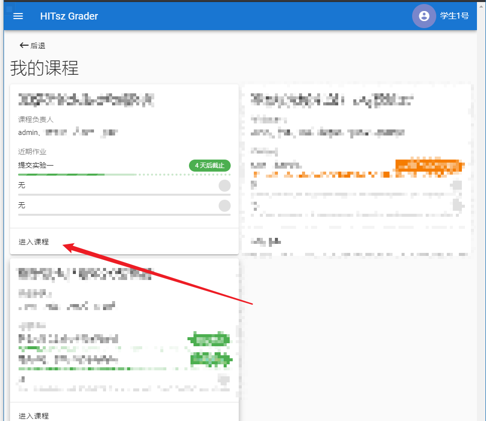
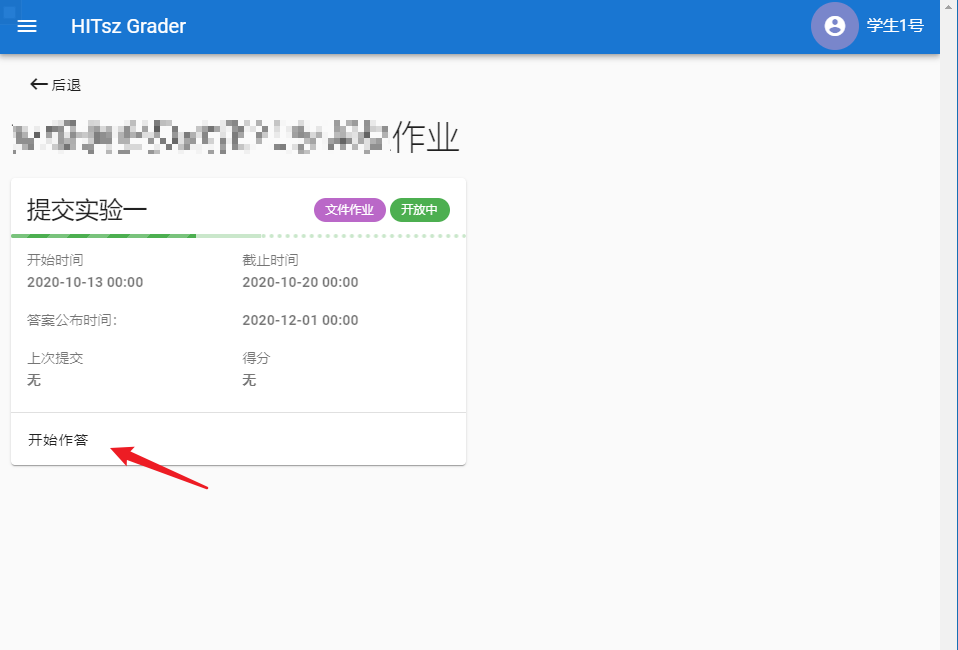
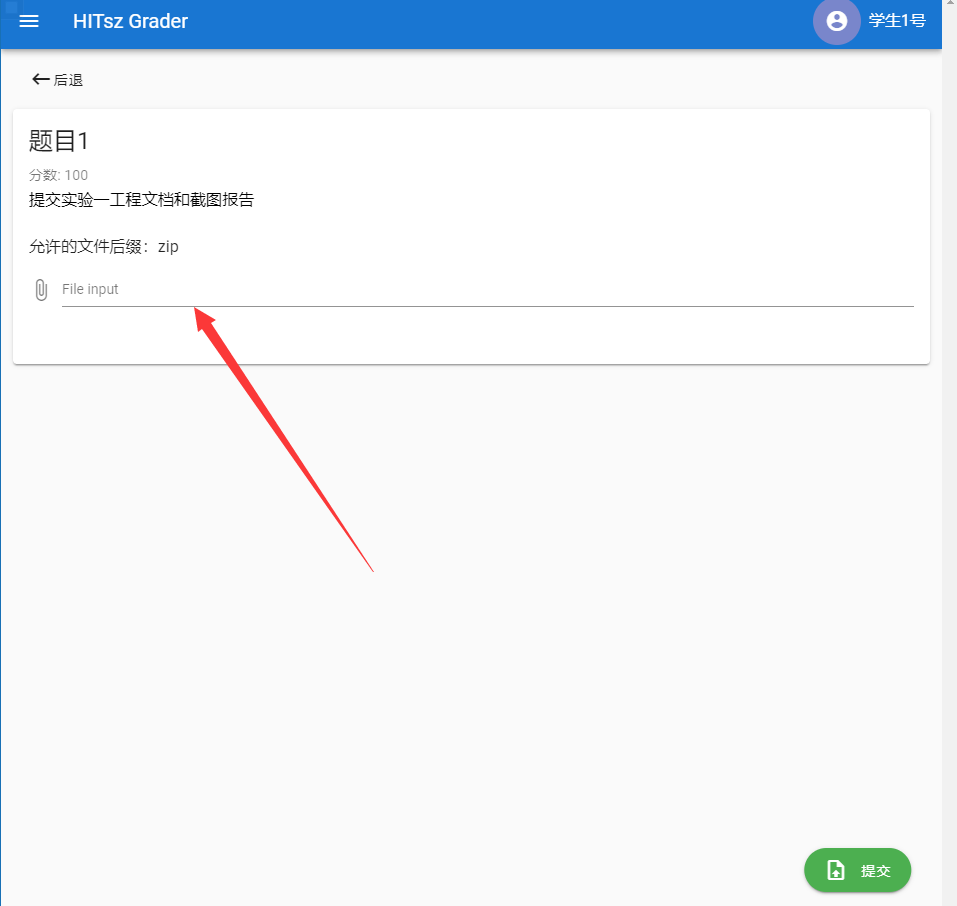

# 实验提交

实验一提交 **实验设计报告** 和 **实验代码** 。

## 1 实验设计报告会纳入评分（虽然不多） 

实验设计报告要求 **[回答实验中的问题](../part3/#33)，并写出实验设计思路和运行结果** 。

实验设计报告也是证明实验是独立完成的重要依据，有分数追求的大佬（juanwang）们不要只放代码和指导书的截图。

## 2 实验代码

只需要 **提交所有修改过的代码** 即可，比如pingpong实验，需要提交pingpong.c和Makfile。

在实验过程中，大家注意保存好自己的代码，保存代码的两个方法：

（1）把整个xv6-riscv-fall目录打包，然后用scp或者mobaXterm工具的sftp拷贝出来，自行保存好整个工程文件，以备下次实验使用。

（2）**强烈推荐** 将代码提交到自己的Github/Gitee等代码托管服务器上，具体操作系统详见[将代码发布至自己的远程仓库](../../tools/#32)。

## 3 代码及报告提交方式

**Step1**：登录[HITsz Grader](http://10.249.12.98:8000/#/login)，用户名和密码都是学号（若学号中有字母，则为大写）。

**Step2**：进入课程

**Step3**：进入作业作答页面

**Step4**：点击选择文件

**Step5**：点击提交

