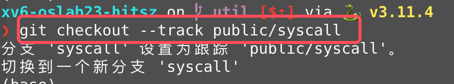
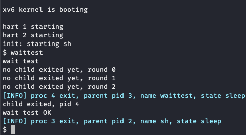

# 实验概述

!!! warning "温（守）馨（住）提（红）示（线）"
    本课程实验已引入代码自动查重系统，请同学们保持[学术诚信](https://integrity.mit.edu/)！

!!! note   "提示"
    本节实验与理论课的 **“导论与操作系统结构”** 和 **“进程与线程：进程”** 这两章课程内容相关，在开始实验前，请复习这两章课程内容。
    

## 1.  实验目的

本节实验的目的是对操作系统的系统调用模块进行修改，尽可能在真正修改操作系统之前，先对操作系统有一定的了解。

1. 了解xv6系统调用的工作原理。
2. 熟悉xv6通过系统调用给用户程序提供服务的机制。
3. 熟悉进程上下文切换的过程。
4. 了解进程的完整生命周期。

## 2.  实验学时

本实验为4学时。

## 3.  实验内容及要求

实验要求可以参考`MIT XV6 lab2`和`lab4`提供的部分官方说明：[[Lab: System calls(mit.edu)]](https://pdos.csail.mit.edu/6.828/2020/labs/syscallhtml) [[Lab: Trap(mit.edu)]](https://pdos.csail.mit.edu/6.S081/2020/labs/traps.html)， **但请以指导书为准，否则可能无法通过测试！** 

### 3.1 切换分支

!!! warning   "请先同步上游远程仓库，并注意切换到syscall分支进行试验"
    本次实验基于syscall分支，请同学们注意切换。

    **Step 1.** 首先，保存实验一的代码，请参考实验实用工具的[3.3.1 使用命令行完成操作](../../tools/#331)或者[3.3.2 使用VSCode内建的图形化界面完成操作](../../tools/#332-vs-code)这两小节，完成commit操作。或者， **如果你希望直接放弃掉上一次commit后的所有更改** ，那么你也可以使用-f选项强制切换分支，例如`git checkout -f syscall`。

    **Step 2.** 切换的方法可以参考实验 -> 实验实用工具 -> [3.1同步上游仓库 ~ 3.3.3 合并冲突更改](../tools.md#31)。

同学们也可以参考下面的图片进行分支切换：



我们建议同学们在切换分支之后进行`make clean`将上一个分支的`fs.img`删除，不然会出现无法启动qemu的问题（会显示fs.img被其他的进程占用）。

本次实验需要为xv6实现一些必要的系统调用和功能，在完成这些之后，你就可以正常使用`exittest`, `waittest`和`yieldtest`测试程序。具体来说，本实验有三部分：


### 3.2 任务一：进程信息收集

在该任务中，你需要在理解xv6的`exit`系统调用的基础上，实现 **进程在退出时打印自己的父进程和子进程的信息** 这一功能。

**具体要求：在exit系统调用当中寻找合适的输出时间点，在相应的函数内进行父子进程信息的打印。** 

#### 3.2.1 exit系统调用的功能

` void exit(int status)`

1. **参数`status`** ：退出状态，0表示正常退出，-1（大部分）表示异常退出。  
2. **返回值** ：无，函数调用exit之后该进程在内核态进行exit相关的资源回收之后，对应进程终止，不会返回。  
3. **功能** ：回收进程资源，回收完毕之后终止进程。  
（1）exit系统调用在处理当前进程的资源时，大致流程为：关闭所有打开文件 -> **将当前进程的所有子进程交给初始进程init** -> 更改当前进程状态 -> 手动进入调度器（等待回收）。详细原理请参考[实验原理](../part2/#3)部分。  
（2）**需要完成** 的信息输出格式：  
当前进程的父进程的信息输出格式： `proc PID exit, parent pid PID, name NAME, state STATE`；  
当前进程的子进程的信息输出格式：`proc PID exit, child CHILD_NUM, pid PID, name NAME, state STATE`。  
其中，PID代表进程的进程号，CHILD_NUM表示该信息是第几个子进程的信息，NAME表示进程名，STATE表示进程状态。

!!! note  "提示"
    大家不要使用printf输出，这样会影响到其他实验， **请使用我们为大家封装好的`exit_info`函数输出**  
    该函数的使用方法与printf一样，例如：`exit_info("proc %d exit\n", p->pid);`。

#### 3.2.2 运行结果

实验提供了一个exittest（见 `user/exittest.c`）用户级应用程序，该程序首先通过fork系统调用创建3个子进程，并通过sleep保证父进程在退出时子进程还没有退出，然后父进程先退出，3个子进程再退出。

!!! note   "提示"
    大家不要修改 `user/exittest.c`应用程序，它只是用于测试[3.2.1 exit系统调用的功能](#321)。

在你实现完上述功能之后，运行用户程序 exittest运行正确的情况下，你可以看到以下输出：

```
[cs@localhost xv6-oslab23-hitsz]$ make qemu

/* 一大波输出 …… */

xv6 kernel is booting

hart 1 starting
hart 2 starting
init: starting sh
$

/* 手动输入exittest */

$ exittest
exit test
[INFO] proc 3 exit, parent pid 2, name sh, state run
[INFO] proc 3 exit, child 0, pid 4, name exittest, state runble
[INFO] proc 3 exit, child 1, pid 5, name exittest, state runble
[INFO] proc 3 exit, child 2, pid 6, name exittest, state runble
$ [INFO] proc 4 exit, parent pid 1, name init, state run
[INFO] proc 5 exit, parent pid 1, name init, state run
[INFO] proc 6 exit, parent pid 1, name init, state run
```

<!-- 1. 在 **第一个例子** 中，`trace 32 grep hello README`，其中，trace表示我们希望执行用户态应用程序trace（见user/trace.c），后面则是trace应用程序附带的入参：

    - `32`是"1 << SYS_read"，表示只追踪系统调用read；  
    - `grep`是trace应用程序中通过"exec"启动的另一个程序（见 user/grep.    c）；  
    - `hello README`则是grep程序的入参；  
    - 该命令的作用是使用grep程序查找README文件中匹配"hello"的行，并将其所使用到的read系统调用的信息打印出来，打印的格式为：`PID: sys_read(read系统调用的arg0) -> read系统调用的return_value`。

- 在 **第二个例子** 中，trace也是启动了`grep`程序，同时追踪所有的系统调用其中`2147583647`是`31`位bit全置一的十进制整型。可以看出，打的第一条信息就是系统调用trace，其第一个参数即命令行中输入2147583647。

- 在 **第三个例子** 中，启动了`grep`程序，但是没有使用trace，所以什么trace都不会出现。

- 在 **第四个例子** 中，trace启动了`usertests`程序中`forkforkfork`（见 user/usertests.c），追踪系统调用了fork，每次fork后代都会打印对的进程id。
    - 该例中的fork实际上并没有参数，方便起见，你可以直接打印用于传该参数的寄存器的值，它可能是任意值。
    
    - forkforkfork 会一直不停的fork子进程，直到进程数超过`NPROC`，其定义见kernel/param.h。
    
    - usertests是实验提供的用于测试xv6的系统调用，详见user/usertests.c。
    
      ```c
      /* user/usertest.c */
      //Tests xv6 system calls.  usertests without arguments runs them all
      // and usertests <name> runs <name> test. The test runner creates for
      // each test a process and based on the exit status of the process,
      // the test runner reports "OK" or "FAILED".  Some tests result in
      // kernel printing usertrap messages, which can be ignored if test
      // prints "OK".
      ```
     -->
我们先不着急动手，先看看结果长什么样。在输出当中，存在两种不同的输出：  
对当前进程的父进程的信息的输出：
```
proc 3 exit, parent pid 2, name sh, state run
```
以及  
对当前进程的子进程的信息的输出：
```
proc 3 exit, child 0, pid 4, name exittest, state runble
```
同时可以看到3号进程的子进程，在3号进程死后，它们的父进程都变成了init进程：
```
$ proc 4 exit, parent pid 1, name init, state run
proc 5 exit, parent pid 1, name init, state run
proc 6 exit, parent pid 1, name init, state run
```
关于这点我们会在[实验原理](../part2/#3)当中详细介绍。  
你需要使用尝试在与exit相关的函数当中找到 **合适的位置** 来进行输出，我们建议你先阅读[实验原理](../part2/#3)，这会帮助你更好的了解系统调用和exit的工作流程。
      

### 3.3 任务二：wait系统调用的非阻塞选项实现

在该任务中，你需要 **对wait系统调用进行更改，使其增加一个参数`int flags`，用以表示是否需要进行阻塞等待**。

原版阻塞实现的wait：`int wait(int *status)`，其中参数status表示存储子进程退出状态的地址。在`kernel/proc.c`当中的wait函数内的结尾处，xv6通过以下代码实现wait的阻塞等待：
```
// Wait for a child to exit.
sleep(p, &p->lock);  // DOC: wait-sleep
```
在父进程调用该函数之后，通过sleep进行睡眠，无法再执行其他任务，也就是阻塞在这里。

同学们需要实现的wait：`int wait(int *status, int flags)`，其中flags参数用以 **表示是否阻塞等待** 子进程退出。用户态的wait接口我们已经帮同学们更改了，同学们需要将内核态的wait系统调用的更改。  

具体来说，同学们需要：

1. 尝试在`kernel/sysproc.c`的`sys_wait`函数中获取新添加的参数；
2. 更改头文件中的wait的定义；
3. 更改wait函数以满足当前的语义。


<!-- sysinfo只需要一个参数，这个参数是结构体 `sysinfo`的指针， **这个结构体在kernel/sysinfo.h** 可以找到。xv6内核的工作就是把这个结构体填上应有的数值。下面介绍结构体每个成员的含义

```c
 1  struct sysinfo {
 2    uint64 freemem;   // amount of free memory (bytes)
 3    uint64 nproc;     // number of process
 4    uint64 freefd;    // number of free file descriptor
 5  };
```

- `freemem`：当前剩余的内存 **字节** 数
- `nproc`： **状态为UNUSED** 的进程个数
- `freefd`：当前进程可用文件描述符的数量，即 **尚未使用** 的文件描述符数量 -->

实验提供了一个`waittest`用户级应用程序（见`user/waittest.c`）。

完成任务后，你可以在xv6中运行`waittest`程序，通过测试会显示如下内容：

<!--  -->



### 3.4 任务三：实现yield系统调用

在该任务中，你需要实现一个新的系统调用`yield`，它可以使当前进程让出CPU，从而使CPU可以调度到别的进程，当然，该进程只是暂时被挂起，根据我们在课上学过的进程调度算法，如Round-Robin即时间片轮转调度算法，该进程很快便会再次被CPU调度到，从而从yield系统调用中返回，继续执行该进程后面的代码；另外我们的实验还有些额外要求。

具体来说，当调用`yield`系统调用时：

1. 需要打印此时用户态的pc值，也就是陷入内核的那条指令地址，按如下格式：
```shell
start to yield, user pc 0x???????
```
   也就是在某个位置，添加上这样一句代码：
```c
printf("start to yield, user pc %p\n", pc);
```
2. 将当前进程让出CPU，从而调度到别的进程

3. 另外注意一点，该任务测试的时候需要 **设置CPU的数量为1** ，即使用如下命令运行xv6:
```shell
make qemu CPUS=1
```


### 3.5 测试

当完成上述的两个任务后，与Lab1一样，你也需要在在xv6-oslab23-hitsz目录下，新建time.txt文件，在该文件中写入你做完这个实验所花费的时间（估算一下就行，单位是小时），只需要写一个整数即可。

最后，在命令行输入 `make grade` 进行测试。如果通过测试，会显示如下内容：


