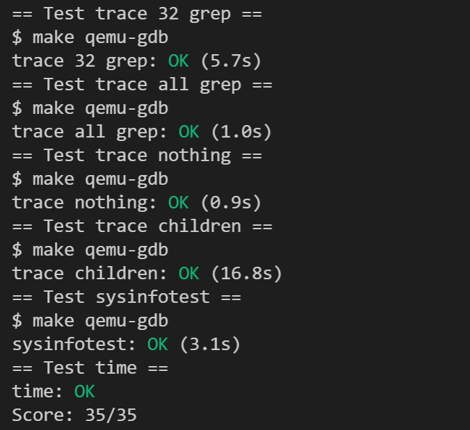

# 实验概述

!!! warning "温（守）馨（住）提（红）示（线）"
    本课程实验已引入代码自动查重系统，请同学们保持[学术诚信](https://integrity.mit.edu/)！

!!! note   "提示"
    本节实验与理论课的 **“导论与操作系统结构”** 和 **“进程与线程：进程”** 这两章课程内容相关，在开始实验前，请复习这两章课程内容。
    

## 1.  实验目的

本节实验的目的是对操作系统的系统调用模块进行修改，尽可能在真正修改操系统之前，先对操作系统有一定的了解。

1. 了解xv6系统调用的工作原理。
2. 熟悉xv6通过系统调用给用户程序提供服务的机制。

## 2.  实验学时

本实验为4学时。

## 3.  实验内容及要求

实验要求可以参考`MIT XV6 lab2`提供的官方说明：[Lab: System calls(mit.edu)](https://pdos.csail.mit.edu/6.828/2020/labs/syscallhtml)， **但请以指导书为准，否则可能无法通过测试！** 

### 3.1 切换分支

!!! warning   "请先同步上游远程仓库，并注意切换到syscall分支进行试验"
    本次实验基于syscall分支，请同学们注意切换。

    切换的方法可以参考实验 -> 实验实用工具 -> [3.1同步上游仓库 ~ 3.3.3 合并冲突更改](../tools.md#31)。

本次实验需要为xv6实现一些必要的系统调用和功能，在完成这些之后，你就可以正常使用`trace`程序和`sysinfotest`测试程序。具体来说，本实验有两部分：


### 3.2 任务一：系统调用信息打印

在该任务中，你需要在xv6加入具有跟踪功能的`trace`系统调用，它可以打印系统调用信息，来帮助你在之后的实验中进行debug。

**具体要求：添加一个名为 *trace* 的系统调用。** 

#### 3.2.1 系统调用接口定义

` int trace(int mask)`

1. **参数`mask`** ：每一位对应一个系统调用，位的比特值与系统调用编号相对应，指示是否需要追踪其对应的系统调用。  
（1）如调用`trace(1 << SYS_fork)`，则代表只追踪系统调用fork，其中SYS_fork是在kernel/syscall.h中定义的fork系统调用的编号。  
（2）如调用`trace(0xffffffff)`，则代表追踪所有系统调用。  
1. **返回值** ：正常执行返回0，异常返回-1。  
2. **功能** ：设置该程序的`mask`。  
（1）设置mask之后，内核每 **处理完一次系统调用后** ，即系统调用返前，若mask指示了该系统调用，则打印对应信息。  
（2）打印格式： `PID: sys_$name(arg0) -return_value`   
其中`$name`为系统调用的名称；`arg0`为系统调用的第一个参数，`return_value`为系统调用的返回值，以十进制型打印。

#### 3.2.2 运行结果

实验提供了一个trace（见 `user/trace.c`）用户级应用程序，该程序首先通过trace系统调用设置需要跟踪的系统调用，然后再启动另一个程序，打印出该程序执行指定系统调用的情况。

!!! note   "提示"
    大家不要修改 `user/trace.c`应用程序，它只是用于测试[3.2.1 新增的trace系统调用](#321)。

在你添加完该系统调用之后，运行用户程序 trace运行正确的情况下，你可以看到以下输出：

```shell
[cs@localhost xv6-labs-2020]$ make qemu

/* 一大波输出 …… */

xv6 kernel is booting

hart 2 starting
hart 1 starting
init: starting sh
$

/* 例子1，手动输入:trace 32 grep hello README */

$ trace 32 grep hello README
3: sys_read(3) -> 1023
3: sys_read(3) -> 966
3: sys_read(3) -> 70
3: sys_read(3) -> 0
$

/* 例子2，手动输入:trace 2147483647 grep hello README */

$ trace 2147483647 grep hello README
4: sys_trace(2147483647) -> 0
4: sys_exec(12240) -> 3
4: sys_open(12240) -> 3
4: sys_read(3) -> 1023
4: sys_read(3) -> 966
4: sys_read(3) -> 70
4: sys_read(3) -> 0
4: sys_close(3) -> 0
$

/* 例子3，手动输入:grep hello README */

$ grep hello README
$


/* 例子4，手动输入:trace 2 usertests forkforkfork */

$ trace 2 usertests forkforkfork
usertests starting
test forkforkfork: 407: syscall fork -> 408
408: sys_fork(-1) -> 409
409: sys_fork(-1) -> 410
410: sys_fork(-1) -> 411
409: sys_fork(-1) -> 412
410: sys_fork(-1) -> 413
409: sys_fork(-1) -> 414
411: sys_fork(-1) -> 415
...
$   
```

我们先不着急动手，先看看结果长什么样。

1. 在 **第一个例子** 中，`trace 32 grep hello README`，其中，trace表示我们希望执行用户态应用程序trace（见user/trace.c），后面则是trace应用程序附带的入参：

    - `32`是"1 << SYS_read"，表示只追踪系统调用read；  
    - `grep`是trace应用程序中通过"exec"启动的另一个程序（见 user/grep.    c）；  
    - `hello README`则是grep程序的入参；  
    - 该命令是使用grep程序查找README文件中匹配"hello"的行，并在此次查找匹配过程中将使用系统调用read信息打印出来：`PID: sys_read(arg0) -return_value`。

- 在 **第二个例子** 中，trace也是启动了`grep`程序，同时追踪所有的系统调用其中`2147583647`是`31`位bit全置一的十进制整型。可以看出，打的第一信息就是系统调用trace，其第一个参数即命令行中输入2147583647。

- 在 **第三个例子** 中，启动了`grep`程序，但是没有使用trace，所以什么trace都不会出现。

- 在 **第四个例子** 中，trace启动了`usertests`程序中`forkforkfork`（见 user/usertests.c），跟踪系统调用了fork，每次fork后代都会打印对的进程id。
    - 该例中的fork实际上并没有参数，方便起见，你可以直接打印用于传该参数的寄存器的值，它可能是任意值。
    
    - forkforkfork 会一直不停的fork子进程，直到进程数超过`NPROC`，其定义见kernel/param.h。
    
    - usertests是实验提供的用于测试xv6的系统调用，详见user/usertests.c。
    
      ```c
      /* user/usertest.c */
      //Tests xv6 system calls.  usertests without arguments runs them all
      // and usertests <name> runs <name> test. The test runner creates for
      // each test a process and based on the exit status of the process,
      // the test runner reports "OK" or "FAILED".  Some tests result in
      // kernel printing usertrap messages, which can be ignored if test
      // prints "OK".
      ```
    
      

### 3.3 任务二：添加系统调用sysinfo

在该任务中，你需要加入一条新的系统调用，叫做`sysinfo`。该系统调用将集xv6运行的一些信息。
sysinfo只需要一个参数，这个参数是结构体 `sysinfo`的指针， **这个结构体在kernel/sysinfo.h** 可以找到。xv6内核的工作就是把这个结构填上应有的数值。下面介绍结构体每个成员的含义

```c
 1  struct sysinfo {
 2    uint64 freemem;   // amount of free memory (bytes)
 3    uint64 nproc;     // number of process
 4    uint64 freefd;    // number of free file descriptor
 5  };
```

- `freemem`：当前剩余的内存 **字节** 数
- `nproc`： **状态为UNUSED** 的进程个数
- `freefd`：当前进程可用文件描述符的数量，即 **尚未使用** 的文件描符数量

实验提供了一个`sysinfotest`用户级应用程序（见`user/sysinfotest.c`），依次测试剩余的内存字节数、UNUSED的进程个数、未被使用的文件描述符数量。

完成任务后，你可以在xv6中运行`sysinfotest`程序，通过测试会显示如内容：


### 3.4 测试

当完成上述的两个任务后，与Lab1一样，你也需要在在xv6-labs-2020目录下，新建time.txt文件，在该文件中写入你做完这个实验所花费的时间（估算一下就行，单位是小时），只需要写一个整数即可。

最后，在命令行输入 `make grade` 进行测试。如果通测试，会显示如下内容：




