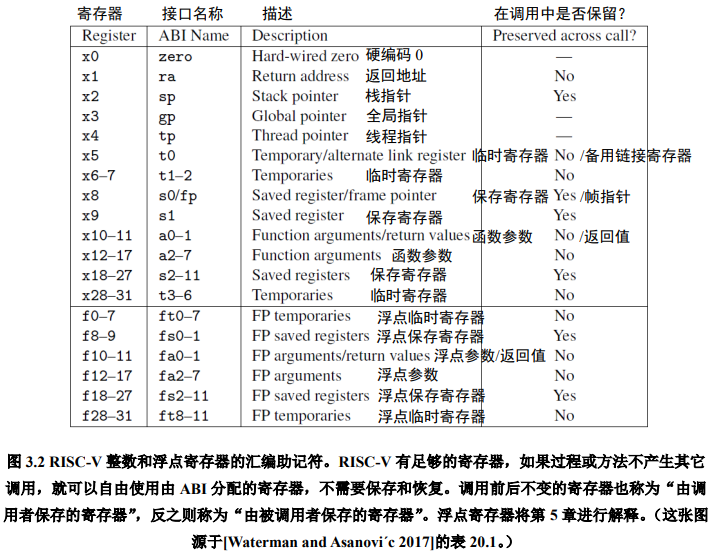
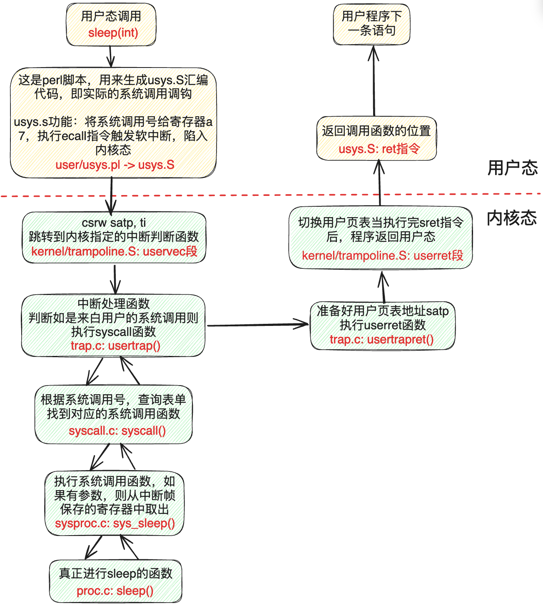
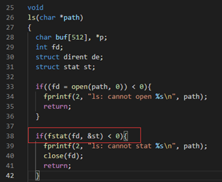
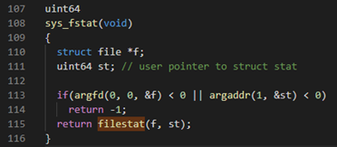
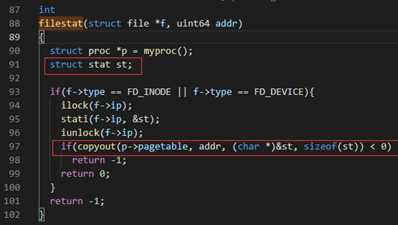

# 实验原理

!!! note "提示"
    这一章讲述本次实验的实验原理，以下知识会大大帮助你理解xv6是如何工作的。但是你需要加以思考，并且将其一个一个串接起来，以形成一个整体的思维。
    

## 1. 系统调用

系统调用就是调用操作系统提供的一系列内核函数。由于用户程序运行在CPU的用户态（又称非特权模式，用户模式），无法直接访问系统硬件和操作系统中的系统数据，用户程序只能发出请求，然后由内核调用相应的内核函数来帮着处理，最后将结果返回给应用程序。

### 1.1 系统调用的使用：用户的权力

在第一个实验中，我们将系统调用和C语言的函数放在一起做了一定的说明。

“系统调用被 **封装** 为函数以向用户提供接口，用户程序可以通过函数调用的方式请求操作系统的服务”。从这里我们需要注意，虽然两者看起来一样，但是这是因为封装的结果。接下来我们简要介绍xv6是怎样封装的。

首先看`user/user.h`文件，我们可以看到对应有许多的函数接口，其中标识了系统调用和用户库（`ulib`）。但是我们只看到了封装的接口，那么实际上系统调用的实现是什么样的呢？
    
### 1.2 系统调用的接口：操作系统内核和用户程序的中间体

现在我们看到`user/usys.pl`文件，该脚本文件会在编译期间被执行，生成一个汇编文件`usys.S`。其对每一个系统调用抽象接口都生成了一个具体的实现，叫做`entry`。

```perl
 1  #!/usr/bin/perl -w
 2
 3  # Generate usys.S, the stubs for syscalls.
 4
 5  print "# generated by usys.pl - do not edit\n";
 6
 7  print "#include \"kernel/syscall.h\"\n";
 8
 9  sub entry {
10      my $name = shift;
11      print ".global $name\n";
12      print "${name}:\n";
13      print " li a7, SYS_${name}\n";
14      print " ecall\n";
15      print " ret\n";
16  }
17
18  entry("fork");
19  entry("exit");
……
```

这段脚本中的print的内容实际就是RISC-V指令集的汇编语言。`$name`就是系统调用的名字，如fork，exit等，当脚本执行时，18行之后entry的内字符串会被填入`$name`。  

系统调用步骤包括以下几步：

- `li a7, SYS_${name}\n`：将系统调用号 `SYS_${name}`（来自`kernel/syscall.h`）传给RISC-V CPU上的`a7`寄存器，这样内核就可以通过`a7`寄存器知道现在要处理的是什么系统调用。 
- `ecall`：特殊指令，用来转入操作系统内核（ **关键** 指令）。  
- `ret`：操作系统内核执行完后会返回到这里，执行ret就结束了用户看到的系统调用，返回至用户程序。   
  你可以在编译后阅读`user/usys.S`，将其与上述脚本对应以便更好地理解。
  

!!! note "拓展"
    在RISC-V指令集架构中，处理器通常分为M (`Machine`)、S (`Supervisor`)、U (`User`) 三种工作模式，这被称为 **特权级** 。一般情况下，用户程序运行在U模式，而操作系统内核运行在S模式。上文中的`ecall (Environment Call)`命令就是不同特权级之间的桥梁，例如用户程序执行`ecall`后，CPU会切换至S模式，同时将PC的值置为一个由内核预设的地址，进而切换至内核的执行流。`ecall`实际上是陷入(`trap`)的一种，想要了解更多细节可以自行阅读RISC-V手册（请到校内网 **实验工具** 下载）
    

### 1.3 系统调用的参数：寄存器传参

这里我们还忽略了一点，那就是系统调用还需要传递参数。实际上，从汇编的角度来看，当我们调用一个函数的时候，传入的参数一般会按照位置依次放在`a0`, `a1`, `a2`等以此类推的寄存器中。想要了解更多关于函数参数的细节可以自行阅读阅读RISC-V手册。
    


也就是说，调用`user/user.h`中的函数接口后，参数已经存储于寄存器了，这个时候我们就原封不动地继续调用`ecall`，操作系统就可以通过a0, a1, a2等寄存器来获取参数了。此外，函数的返回值一般存储于a0寄存器。
    
!!! note "提示"
    根据RISC-V标准规定，函数调用通过寄存器传递参数。在内核中可以通过argint、argaddr等函数获取系统调用的参数，分别对应整数和指针，它们都调用argraw来读取已保存的寄存器。比如，`kernel/sycall.c`中 line 34-54中`argraw`函数所描述的就是取出参数的过程。其中 **trapframe就是用户进程的寄存器状态** （上下文）。
    
### 1.4 系统调用的分发和实现：解耦合

按照之前所述，定义一个系统调用实际上很简单：将系统调用号的宏定义`SYS_${name}`添加在`kernel/syscall.h`，每次系统调用时根据`a7`寄存器传入的值判定具体的系统调用类型即可。
那么接下来我们面临的第一个问题是：内核怎么通过系统调用号（存在`a7`）来执行不同的系统调用函数。

!!! info   "提示"

    我们需要关注`kernel/syscall.c`中的代码，`line 86-130` 定义了一大段看起来就和系统调用有关的部分。这里可以分为两个部分，一个是 `extern` 进行标识的函数接口，另一个是以`syscall`为名的数组。
    
    - 前者实际上声明了这些函数，这些函数的实现不必在这个文件中，而是分布在各个相关的代码文件中（一般放在`sys`开头的文件中，包括`sysproc.c`与`sysfile.c`），我们在这些代码文件中实现好对应的函数，最后就可以编译出对应名字的汇编代码函数， `extern` 就会找到对应的函数实现了。
      
    - 后者则是将这些函数的指针都放在统一的数组里，并且数组下标就是系统调用号，这样我们在分辨不同系统调用的时候就可以很方便地用数组来进行操作了。`kernel/syscall.c`中的 `syscall()` 函数就根据这一方法实现了系统调用的分发（通过不同系统调用号调用不同系统调用函数），请仔细阅读并尝试理解。
      
    - 将两者合起来使用，可以使得系统调用的 **实现** 和系统调用的 **分发** 彼此 **分离** ，这对函数编写者非常友好，但是会让初学者有些迷惑，这是需要注意的。

## 2. 举例：系统调用的实现

现在我们以一个具体的例子，来看看xv6是怎么实现系统调用的。我们准备挑选看起来朴实无华的系统调用`sleep`，因为它实际上暗藏凶险。

先来看张总图把握一下整体流程：



以下只对系统调用过程某几个关键点进行分析，其他相关代码/流程需要大家自行查阅代码：

### 2.1 用户程序调用

xv6关于sleep系统调用接口的声明在user/user.h。

```c
/* user/user.h */

int sleep(int);
```

### 2.2 usys.S汇编

然而，user/user.h只是对函数原型进行了声明。具体做了什么事呢？这个定义是在usys.S中，详见1.2小节。

需要注意的是，usys.S汇编是由usys.pl（perl脚本）自动生成的。也就是，当你要增加新的系统调用时，不要修改usys.S，而是参考其他系统调用接口来修改usys.pl。


### 2.3 uservec汇编

当执行ecall指令后，内核会切换到supervisor mode。接着，内核执行的第一个指令是来自trampoline.S文件的uservec汇编函数。

### 2.4 usertrap

之后，代码跳转到了由C语言实现的usertrap函数中（trap.c），判断如果是来自用户的系统调用则执行syscall函数。

!!! info   "提示"
    一般进入usertrap函数有三种情况：  
    1. syscall系统调用，是由用户进程主动调用ecall指令来实现的。  
    2. exception异常，是用户进程或内核程序的illegal instruction导致的，比如：除0错误，或引用无效的虚拟地址。  
    3. device interrupt设备中断，比如：磁盘设备完成了读写请求操作。

### 2.5 syscall

syscall函数里有一个表单，根据传入的代表系统调用的数字进行查找，并执行具体实现系统调用功能的函数。对于这个例子来说，这个函数就是sys_sleep。

### 2.6 sys_sleep

其代码可见 `kernel/sysproc.c` line55-74：

```c
55  uint64
56  sys_sleep(void)
57  {
58    int n;
59    uint ticks0;
60
61    if(argint(0, &n) < 0)
62      return -1;
63    acquire(&tickslock);
64    ticks0 = ticks;
65    while(ticks - ticks0 < n){
66      if(myproc()->killed){
67        release(&tickslock);
68        return -1;
69      }
70      sleep(&ticks, &tickslock);
71    }
72    release(&tickslock);
73    return 0;
74  }
```

- 参数：系统调用`sleep`有一个参数，用来告知操作系统`sleep`的持续时间。但是这里怎么是`void`？
  
    - 这是因为xv6又进行了一次解耦合，通过一个额外的函数获取参数，他们以`arg`开头，具体见`kernel/syscall.c`。

- 获得进程的状态：执行系统调用的时候，参数不会告诉xv6自己到底是什么程序。因此，xv6需要额外的调用来弄清楚，现在到底是什么程序正在运行？
  
    - 关键的函数是 `myproc()` ，这个函数将返回指向当前进程的PCB（也就是进程控制块）的指针（`struct proc *`），里面有程序的各种信息。

- `sleep`的实现逻辑：这里，主要就是根据各个不同的系统调用，实现自身应的逻辑即可。现在简要介绍`sleep`逻辑。

    - line 61：获取参数
    - line 63：给时钟加锁，获取当前的时间
    - line 65：比较是否到了`sleep`结束的时间
    - line 66-69：进程结束了就退出，什么也不做
    - line 70：否则继续睡眠
    - line 72-73：到时间了则释放时间的锁，返回程序，`sleep`结束。

### 2.7 执行完后返回用户空间

当sleep完成之后，返回至syscall函数。在syscall函数中调用usertrapret，用于完成部分方便在C代码实现的返回用户空间的工作。还有一些工作只能在汇编语言完成，即trampoline.s中的userret函数。最后，这个函数执行sret指令，切回用户空间，执行用户空间ecall的下一条指令ret。当ret执行完后，返回调用函数的位置，执行用户程序的下一条语句。

以上，即是系统调用过程中大致的代码执行流程。

## 3. 内核空间和用户空间交换数据

一些系统调用传递的参数是指针，内核需要使用这些指针来读写用户空间。但由于内核页表的映射和用户页表的映射不一样，内核不能使用普通的指令访问用户空间，这样就涉及到内核空间和用户空间的地址转换问题。在xv6中，我们可以使用`copyout`/`copyin`这两个函数分别完成内核空间到用户空间、用户空间到内核空间的数据拷贝。具体可以查看copyout/copyin的实现细节（kernel/vm.c）。

例如，当shell执行ls命令时，调用`fstat`系统调用（user/ls.c）获取当前目录下的信息。



fstat系统调用陷入内核调用`sys_fstat`，最终执行`filestat`函数，其中`st`是从用户空间传进来的入参（指针）。



在filestat函数中，通过`stati`函数获取到inode节点信息，再调用`copyout`将获取到的信息拷贝给起始地址为filestat函数的入参addr，大小为sizeof(st)的用户空间。



之后，返回`sys_fstat`，即可将内核空间的数据传递至用户空间。

## 4. 参考资料

[1] xv6 book, Sections 4.3 and 4.4 of Chapter 4  
[2] Related source files:  

- The user-space code for systems calls is in `user/user.h` and `user/usys.pl`.  
- The kernel-space code is `kernel/syscall.h`, `kernel/syscall.c`.  
- The process-related code is `kernel/proc.h` and `kernel/proc.c`.  

​    