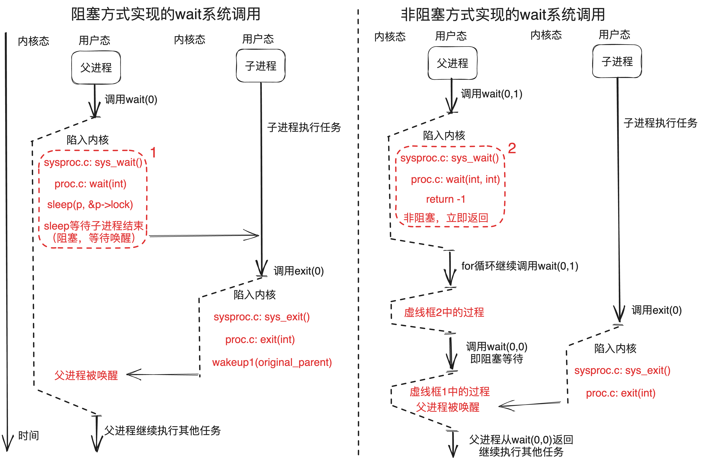
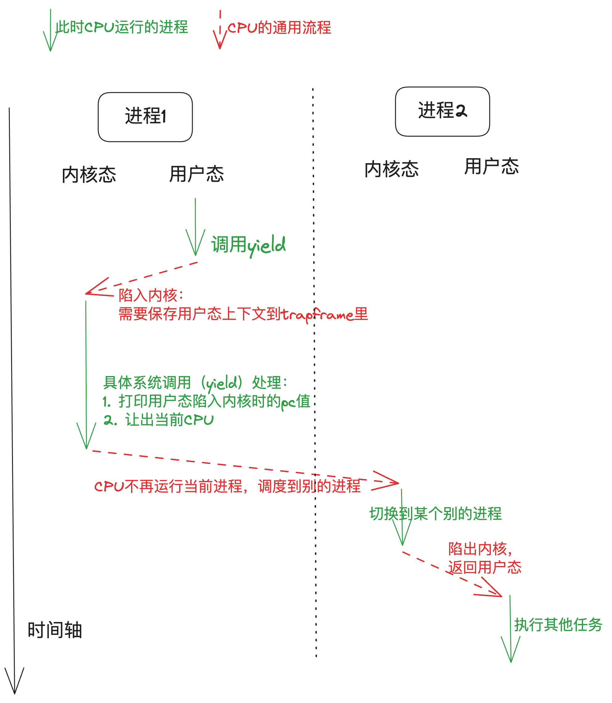

# 实验原理

!!! note "提示"
    这一章讲述本次实验的实验原理，以下知识会大大帮助你理解xv6是如何工作的。但是你需要加以思考，并且将其一个一个串接起来，以形成一个整体的思维。
    

## 1. 系统调用

&emsp;&emsp;系统调用就是调用操作系统提供的一系列内核函数。由于用户程序运行在CPU的用户态（又称非特权模式，用户模式），无法直接访问系统硬件和操作系统中的系统数据，用户程序只能发出请求，然后由内核调用相应的内核函数来帮助处理，最后将结果返回给应用程序。

### 1.1 系统调用的使用：用户的权力

&emsp;&emsp;在第一个实验中，我们将系统调用和C语言的函数放在一起做了一定的说明。

&emsp;&emsp;“系统调用被 **封装** 为函数以向用户提供接口，用户程序可以通过函数调用的方式请求操作系统的服务”。从这里我们需要注意，虽然两者看起来一样，但是这是因为封装的结果。接下来我们简要介绍xv6是怎样封装的。

&emsp;&emsp;首先看`user/user.h`文件，我们可以看到对应有许多的函数接口，其中标识了系统调用和用户库（`ulib`）。但是我们只看到了封装的接口，那么实际上系统调用的实现是什么样的呢？
    
### 1.2 系统调用的接口：操作系统内核和用户程序的中间体

&emsp;&emsp;现在我们看到`user/usys.pl`文件，该脚本文件会在编译期间被执行，生成一个汇编文件`usys.S`。其对每一个系统调用抽象接口都生成了一个具体的实现，叫做`entry`。

```perl  linenums="1"
  #!/usr/bin/perl -w

  # Generate usys.S, the stubs for syscalls.

  print "# generated by usys.pl - do not edit\n";

  print "#include \"kernel/syscall.h\"\n";

  sub entry {
      my $name = shift;
      print ".global $name\n";
      print "${name}:\n";
      print " li a7, SYS_${name}\n";
      print " ecall\n";
      print " ret\n";
  }

  entry("fork");
  entry("exit");
……
```

&emsp;&emsp;这段脚本中的print的内容实际就是RISC-V指令集的汇编语言。`$name`就是系统调用的名字，如fork，exit等，当脚本执行时，18行之后entry的内字符串会被填入`$name`。  

&emsp;&emsp;系统调用步骤包括以下几步：

- `li a7, SYS_${name}\n`：将系统调用号 `SYS_${name}`（来自`kernel/syscall.h`）传给RISC-V CPU上的`a7`寄存器，这样内核就可以通过`a7`寄存器知道现在要处理的是什么系统调用。 
- `ecall`：特殊指令，用来转入操作系统内核（ **关键** 指令）。  
- `ret`：操作系统内核执行完后会返回到这里，执行ret就结束了用户看到的系统调用，返回至用户程序。   
  你可以在编译后阅读`user/usys.S`，将其与上述脚本对应以便更好地理解。
  

!!! note "拓展"
    在RISC-V指令集架构中，处理器通常分为M (`Machine`)、S (`Supervisor`)、U (`User`) 三种工作模式。一般情况下，用户程序运行在U模式，而操作系统内核运行在S模式。上文中的`ecall (Environment Call)`命令就是不同特权级之间的桥梁，例如用户程序执行`ecall`后，CPU会从U模式切换至S模式，同时将PC的值置为一个由内核预设的地址，进而切换至内核的执行流。`ecall`实际上是陷入(`trap`)的一种，想要了解更多细节可以自行阅读[RISC-V手册](https://gitee.com/hitsz-cslab/os-labs/tree/master/references/RISC-V手册.pdf)。
    

### 1.3 系统调用的参数：寄存器传参

&emsp;&emsp;这里我们还忽略了一点，那就是系统调用还需要传递参数。实际上，从汇编的角度来看，当我们调用一个函数的时候，传入的参数一般会按照位置依次放在`a0`, `a1`, `a2`等以此类推的寄存器中。想要了解更多关于函数参数的细节可以自行阅读[RISC-V手册](https://gitee.com/hitsz-cslab/os-labs/tree/master/references/RISC-V手册.pdf)。
    


&emsp;&emsp;也就是说，调用`user/user.h`中的函数接口后，参数已经存储于寄存器了，这个时候我们就原封不动地继续调用`ecall`，操作系统就可以通过a0, a1, a2等寄存器来获取参数了。此外，函数的返回值一般存储于a0寄存器。
    
!!! note "提示"
    根据RISC-V标准规定，函数调用通过寄存器传递参数。在xv6内核中可以通过`argint`(argument integer)、`argaddr`(argument address)等函数获取系统调用的参数，分别对应整数和指针，它们都调用`argraw`(argument raw)来读取已保存的寄存器。比如，`kernel/sycall.c`中 `argraw`函数所描述的就是取出参数的过程。
    
    ```c
    static uint64 argraw(int n) {
      struct proc *p = myproc();
      switch (n) {
      case 0:
        return p->trapframe->a0;
      case 1:
        return p->trapframe->a1;
       // ……  

    ```
    
    其中 **trapframe就是用户进程的寄存器状态** （上下文，详见[3.1 trapframe](#31-trapframe)）。
    
### 1.4 系统调用的分发和实现：解耦合

&emsp;&emsp;按照之前所述，定义一个系统调用实际上很简单：将系统调用号的宏定义`SYS_${name}`添加在`kernel/syscall.h`，每次系统调用时根据`a7`寄存器传入的值判定具体的系统调用类型即可。
那么接下来我们面临的第一个问题是：内核怎么通过系统调用号（存在`a7`）来执行不同的系统调用函数。

!!! info   "提示"

    我们需要关注`kernel/syscall.c`中定义了一大段看起来就和系统调用有关的部分。这里可以分为两个部分，一个是 `extern` 进行标识的函数接口，另一个是以`syscall`为名的数组。

    ```c

    extern uint64 sys_chdir(void);
    extern uint64 sys_close(void);
    extern uint64 sys_dup(void);
    extern uint64 sys_exec(void);
    extern uint64 sys_exit(void);

    // ……

    static uint64 (*syscalls[])(void) = {
        [SYS_fork] sys_fork,   [SYS_exit] sys_exit,     [SYS_wait] sys_wait,     [SYS_pipe] sys_pipe,
        [SYS_read] sys_read,   [SYS_kill] sys_kill,     [SYS_exec] sys_exec,     [SYS_fstat] sys_fstat,
        [SYS_chdir] sys_chdir, [SYS_dup] sys_dup,       [SYS_getpid] sys_getpid, [SYS_sbrk] sys_sbrk,
        [SYS_sleep] sys_sleep, [SYS_uptime] sys_uptime, [SYS_open] sys_open,     [SYS_write] sys_write,
        [SYS_mknod] sys_mknod, [SYS_unlink] sys_unlink, [SYS_link] sys_link,     [SYS_mkdir] sys_mkdir,
        [SYS_close] sys_close, [SYS_rename] sys_rename,
    };
    ```
    
    - 前者实际上声明了这些函数，这些函数的实现不必在这个文件中，而是分布在各个相关的代码文件中（一般放在`sys`开头的文件中，包括`sysproc.c`与`sysfile.c`），我们在这些代码文件中实现好对应的函数，最后就可以编译出对应名字的汇编代码函数， `extern` 就会找到对应的函数实现了。
      
    - 后者则是将这些函数的指针都放在统一的数组里，并且数组下标就是系统调用号，这样我们在分辨不同系统调用的时候就可以很方便地用数组来进行操作了。`kernel/syscall.c`中的 `syscall()` 函数就根据这一方法实现了系统调用的分发（通过不同系统调用号调用不同系统调用函数），请仔细阅读并尝试理解。
      
    - 将两者合起来使用，可以使得系统调用的 **实现** 和系统调用的 **分发** 彼此 **分离** ，这对函数编写者非常友好，但是会让初学者有些迷惑，这是需要注意的。

## 2. 举例：系统调用的实现

&emsp;&emsp;现在我们以一个具体的例子，来看看xv6是怎么实现系统调用的。我们准备挑选看起来朴实无华的系统调用`sleep`，因为它实际上暗藏凶险。

&emsp;&emsp;先来看张总图把握一下整体流程：


&emsp;&emsp;以下只对系统调用过程某几个关键点进行分析，其他相关代码/流程需要大家自行查阅代码：

### 2.1 用户程序调用

&emsp;&emsp;xv6关于sleep系统调用接口的声明在user/user.h。

```c
/* user/user.h */

int sleep(int);
```

### 2.2 usys.S汇编

&emsp;&emsp;然而，user/user.h只是对函数原型进行了声明。具体做了什么事呢？这个定义是在usys.S中，详见[1.2小节](#12)。

&emsp;&emsp;需要注意的是，usys.S汇编是由usys.pl（perl脚本）自动生成的。也就是，当你要增加新的系统调用时，不要修改usys.S，而是参考其他系统调用接口来修改usys.pl。


### 2.3 uservec汇编

&emsp;&emsp;当执行ecall指令后，内核会切换到supervisor mode。接着，内核执行的第一个指令是来自trampoline.S文件的uservec汇编函数。

### 2.4 usertrap

&emsp;&emsp;之后，代码跳转到了由C语言实现的usertrap函数中（trap.c），判断如果是来自用户的系统调用则执行syscall函数。

!!! info   "提示"
    一般进入usertrap函数有三种情况：  
    1. syscall系统调用，是由用户进程主动调用ecall指令来实现的。   
    2. device interrupt设备中断，比如：磁盘设备完成了读写请求操作。   
    3. exception异常，是用户进程或内核程序的illegal instruction导致的，比如：除0错误，或引用无效的虚拟地址。  

    ```c
    void usertrap(void) {

      if (r_scause() == 8) {
        // system call

        // ……      
      } else if ((which_dev = devintr()) != 0) {
        // ok
      } else {
        printf("usertrap(): unexpected scause %p pid=%d\n", r_scause(), p->pid);
        printf("            sepc=%p stval=%p\n", r_sepc(), r_stval());
        p->killed = 1;
      }
       // ……  
    ```

### 2.5 syscall

&emsp;&emsp;syscall函数里有一个表单，根据传入的代表系统调用的数字进行查找，并执行具体实现系统调用功能的函数。对于这个例子来说，这个函数就是sys_sleep。

### 2.6 sys_sleep

&emsp;&emsp;其代码可见 `kernel/sysproc.c` line55-74：

```c   linenums="55"
  uint64
  sys_sleep(void)
  {
    int n;
    uint ticks0;

    if(argint(0, &n) < 0)
      return -1;
    acquire(&tickslock);
    ticks0 = ticks;
    while(ticks - ticks0 < n){
      if(myproc()->killed){
        release(&tickslock);
        return -1;
      }
      sleep(&ticks, &tickslock);
    }
    release(&tickslock);
    return 0;
  }
```

- 参数：系统调用`sleep`有一个参数，用来告知操作系统`sleep`的持续时间。但是这里怎么是`void`？
  
    - 这是因为xv6又进行了一次解耦合，通过一个额外的函数获取参数，他们以`arg`开头，具体见`kernel/syscall.c`。

- 获得进程的状态：执行系统调用的时候，参数不会告诉xv6自己到底是什么程序。因此，xv6需要额外的调用来弄清楚，现在到底是什么程序正在运行？
  
    - 关键的函数是 `myproc()` ，这个函数将返回指向当前进程的PCB（也就是进程控制块，详见[3. 进程控制块](#3-pcb)）的指针（`struct proc *`），里面有程序的各种信息。

- `sleep`的实现逻辑：这里，主要就是根据各个不同的系统调用，实现自身应的逻辑即可。现在简要介绍`sleep`逻辑。

    - line 61：获取参数
    - line 63：给时钟加锁，获取当前的时间
    - line 65：比较是否到了`sleep`结束的时间
    - line 66-69：进程结束了就退出，什么也不做
    - line 70：否则继续睡眠
    - line 72-73：到时间了则释放时间的锁，返回程序，`sleep`结束。

### 2.7 执行完后返回用户空间

&emsp;&emsp;当sleep完成之后，返回至syscall函数。在syscall函数中调用usertrapret，用于完成部分方便在C代码实现的返回用户空间的工作。还有一些工作只能在汇编语言完成，即trampoline.s中的userret函数。最后，这个函数执行sret指令，切回用户空间，执行用户空间ecall的下一条指令ret。当ret执行完后，返回调用函数的位置，执行用户程序的下一条语句。

&emsp;&emsp;以上，即是系统调用过程中大致的代码执行流程。

## 3. 进程控制块（PCB）

&emsp;&emsp;相信同学们在理论课上已经学习过了进程的概念，并且应该也知道进程控制块是 **保存进程各种信息** 的地方。

&emsp;&emsp;在xv6当中，我们可以在`proc.h: struct proc`也就是proc结构体当中看到xv6对于进程的PCB的定义：
```c
struct proc {
  struct spinlock lock;

  // p->lock must be held when using these:
  enum procstate state;        // Process state
  struct proc *parent;         // Parent process
  void *chan;                  // If non-zero, sleeping on chan
  int killed;                  // If non-zero, have been killed
  int xstate;                  // Exit status to be returned to parent's wait
  int pid;                     // Process ID

  // these are private to the process, so p->lock need not be held.
  uint64 kstack;               // Virtual address of kernel stack
  uint64 sz;                   // Size of process memory (bytes)
  pagetable_t pagetable;       // User page table
  struct trapframe *trapframe; // data page for trampoline.S
  struct context context;      // swtch() here to run process
  struct file *ofile[NOFILE];  // Open files
  struct inode *cwd;           // Current directory
  char name[16];               // Process name (debugging)
};
```

&emsp;&emsp;在这里我们提几个与实验相关的成员：state、parent、xstate、trapframe、context。

- `state`：用以表征当前进程的状态信息，在`proc.h: enum procstate`当中选取；
- `parent`：指向当前进程的父进程的指针，用来 **唤醒父进程** 或 **查找子进程** ；
- `xstate`：当前进程的退出状态，用于返回给父进程的wait函数中的status参数；
- `trapframe`：进程在陷入内核时初始化的信息，包含内核栈、用户态传参等信息，详细内容我们接下来介绍；
- `context`：进程的上下文信息，包含ra和sp以及callee-saved的寄存器；

### 3.1 trapframe

&emsp;&emsp;在这里我们对trapframe这一概念进行详细介绍。

&emsp;&emsp;我们知道，当进程从用户态陷入内核时，由于内核态也需要用到寄存器，因此需要将用户态的上下文（寄存器信息）保存起来，以便于后面返回用户态时重新恢复这些上下文（寄存器）。

```c
struct trapframe {
  /*   0 */ uint64 kernel_satp;   // kernel page table
  /*   8 */ uint64 kernel_sp;     // top of process's kernel stack
  /*  16 */ uint64 kernel_trap;   // usertrap()
  /*  24 */ uint64 epc;           // saved user program counter
  /*  32 */ uint64 kernel_hartid; // saved kernel tp
  /*  40 */ uint64 ra;
  /*  48 */ uint64 sp;
  /*  56 */ uint64 gp;
  /*  64 */ uint64 tp;
  /*  72 */ uint64 t0;
  /*  80 */ uint64 t1;
  /*  88 */ uint64 t2;
  /*  96 */ uint64 s0;
  /* 104 */ uint64 s1;
  /* 112 */ uint64 a0;
  /* 120 */ uint64 a1;
  /* 128 */ uint64 a2;
  /* 136 */ uint64 a3;
  /* 144 */ uint64 a4;
  /* 152 */ uint64 a5;
  /* 160 */ uint64 a6;
  /* 168 */ uint64 a7;
  /* 176 */ uint64 s2;
  /* 184 */ uint64 s3;
  /* 192 */ uint64 s4;
  /* 200 */ uint64 s5;
  /* 208 */ uint64 s6;
  /* 216 */ uint64 s7;
  /* 224 */ uint64 s8;
  /* 232 */ uint64 s9;
  /* 240 */ uint64 s10;
  /* 248 */ uint64 s11;
  /* 256 */ uint64 t3;
  /* 264 */ uint64 t4;
  /* 272 */ uint64 t5;
  /* 280 */ uint64 t6;
};
```
&emsp;&emsp;上面是xv6对trapframe结构体的定义，我们可以看见，trapframe当中包含内核的栈指针（`kernel_sp`）、内核页表指针（`kernel_satp`）等内核态相关的信息。

&emsp;&emsp;同时，trapframe也保存了全套的用户态寄存器信息，以及 **用户态陷入内核时对应的PC值（`epc`）** 。

## 4. exit系统调用工作流程

&emsp;&emsp;在上面关于系统调用的通用执行流程的基础上，为了便于同学们更好的完成实验，我们在此为同学们详细介绍exit系统调用的工作流程。

&emsp;&emsp;首先我们先来看一张图：


&emsp;&emsp;exit系统调用与其他的系统调用一样，在陷入内核之前都需要进行相应的ecall、usertrap等操作，这一部分可以参考上面的[举例：系统调用的实现](#2)。我们在这里不再进行详细介绍，我们着重介绍exit在内核态的主体函数（`proc.c: exit(int)`）的工作流程。

### 4.1 进程资源回收

&emsp;&emsp;exit系统调用的主要功能实际上就是退出当前进程，那么退出当前进程就必须 **先要将当前进程的资源进行回收** ，否则会导致内存泄漏等一系列奇怪的问题。

&emsp;&emsp;我们接下来从xv6的源码来分析进程主要需要哪些方面的资源回收。

#### 4.1.1 打开文件回收

&emsp;&emsp;首先回收当前进程打开的所有文件：
```c
// Close all open files.
for (int fd = 0; fd < NOFILE; fd++) {
  if (p->ofile[fd]) {
    struct file *f = p->ofile[fd];
    fileclose(f);
    p->ofile[fd] = 0;
  }
}
```
&emsp;&emsp;xv6使用上述代码进行打开文件的回收。通过for循环遍历所有可能的文件描述符（fd），依次判断该文件描述符是否存在于当前进程的PCB中的ofile（open file）数组当中，如果存在，意味着当前fd对应的文件处于打开状态，需要关闭回收。

#### 4.1.2 子进程回收

&emsp;&emsp;子进程回收需要多步进行：

1. 唤醒初始进程（initproc），为切换当前进程的子进程的父进程做准备  
```c
acquire(&initproc->lock);
wakeup1(initproc);
release(&initproc->lock);
```
2. 保存当前进程的父进程指针，为后续唤醒做准备  
```c
acquire(&p->lock);
struct proc *original_parent = p->parent;
release(&p->lock);
```
3. 将当前进程的 **子进程** 的父进程指针更改成initproc，即理论课上提到： **所有孤儿进程会被initproc管理**  
```c
acquire(&original_parent->lock);

acquire(&p->lock);

// Give any children to init.
reparent(p);
```
&emsp;&emsp;希望同学们能够自己查看`proc.c: reparent(struct proc *p)`函数，并理解里面查找当前进程的子进程的逻辑，这会对你解决[任务一](part1.md/#32)有帮助 (=  
4. 唤醒当前进程的父进程
```c
wakeup1(original_parent);
```
&emsp;&emsp;关于为什么唤醒父进程：因为父进程此时可能处在wait()当中，而xv6的wait的实现是让当前进程睡眠，等待被唤醒，如果子进程退出时不唤醒父进程，那么父进程将会一直睡下去...  
&emsp;&emsp;我们的[任务二](part1.md/#33-wait)就是在更改wait的这一实现。

### 4.2 更改当前进程状态

```c
p->xstate = status;
p->state = ZOMBIE;
```
&emsp;&emsp;其中xstate表示退出时返回给父进程的状态，state表示当前进程的状态，这两个状态都存储在进程的PCB（`proc.h: struct proc`）当中。

### 4.3 进入调度器等待被回收

```c
// Jump into the scheduler, never to return.
sched();
panic("zombie exit");
```

<!-- ## 4. 内核空间和用户空间交换数据

一些系统调用传递的参数是指针，内核需要使用这些指针来读写用户空间。但由于内核页表的映射和用户页表的映射不一样，内核不能使用普通的指令访问用户空间，这样就涉及到内核空间和用户空间的地址转换问题。在xv6中，我们可以使用`copyout`/`copyin`这两个函数分别完成内核空间到用户空间、用户空间到内核空间的数据拷贝。具体可以查看copyout/copyin的实现细节（kernel/vm.c）。

例如，当shell执行ls命令时，调用`fstat`系统调用（user/ls.c）获取当前目录下的信息。


fstat系统调用陷入内核调用`sys_fstat`，最终执行`filestat`函数，其中`st`是从用户空间传进来的入参（指针）。


在filestat函数中，通过`stati`函数获取到inode节点信息，再调用`copyout`将获取到的信息拷贝给起始地址为filestat函数的入参addr，大小为sizeof(st)的用户空间。


之后，返回`sys_fstat`，即可将内核空间的数据传递至用户空间。 -->

## 5. wait系统调用（阻塞与非阻塞）的工作流程

&emsp;&emsp;同样的，我们先来看张图：



### 5.1 阻塞方式的wait

&emsp;&emsp;就像刚刚图片当中看见的，阻塞方式实现的wait会在经历系统调用的通用调用流程之后来到内核中的wait主体函数：`proc.c: wait(int)`。

&emsp;&emsp;在wait函数当中，我们希望学有余力的同学可以自行阅读代码，理解其查找僵尸子进程的逻辑。当然不理解也是可以完成我们的任务二的 (=。

&emsp;&emsp;首先，xv6原本的实现当中，在`proc.c: wait(int)`函数的最后几行：
```c
for (;;) {
  // 一大堆代码，作用就是用来查找是否存在僵尸子进程，有就返回对应的僵尸子进程的pid
  // Wait for a child to exit.
  sleep(p, &p->lock);  // DOC: wait-sleep
}
```
&emsp;&emsp;实际上，这里的sleep就是让当前进程进行睡觉的地方，当你查看`proc.c: sleep(void *chan, struct spinlock *lk)`函数的时候：
```c
// Go to sleep.
p->chan = chan;
p->state = SLEEPING;
```
&emsp;&emsp;在这2行代码完成了当前进程的状态更改，此后调度器就会发现该进程在睡觉，不会调度到它，那么就会有我们图中展现的 **在内核态睡觉，等待子进程唤醒** 的现象，这时，父进程就是被阻塞了。

### 5.2 非阻塞方式的wait

&emsp;&emsp;我们在了解了阻塞方式的wait之后，相比同学们已经猜到了该如何实现非阻塞的wait了：没错，就是跳过sleep！

&emsp;&emsp;但是，阻塞实现和非阻塞实现的wait在实际操作系统实现当中都有大用处，比如：  
可以通过使用非阻塞的wait来判断子进程是否准备好需要的资源，如果没有，父进程可以先并行执行其他任务，等待需要子进程提供的资源时，使用阻塞wait来保证程序的语义正确，这是一种可行的并行优化手段。  
&emsp;&emsp;所以我们必须 **新增一个标志参数flags** 来表示是否进行非阻塞wait，而不是直接将原有的阻塞wait改成非阻塞。

&emsp;&emsp;我们假设这个`flags=1`时表示进行非阻塞wait，那么我们的测试用例流程就可以用上图的右半边来展现。

&emsp;&emsp;这里需要大家实现`flags=1`时，不进行sleep，而是直接返回-1。为此，你可能需要知道：  
1. 如何[获取用户态传入的参数](#13)  
2. 在`proc.c: wait(int)`当中为了保证进程PCB的操作的互斥性，需要上锁`acquire(&p->lock)`，所以 **记得在返回之前解锁** ：`release(&p->lock)`

## 6. yield进程挂起的语义介绍

&emsp;&emsp;接下来的几节内容对你完成任务3有所帮助。你可以在做到任务3时再来阅读。

&emsp;&emsp;我们知道，每个进程的运行过程其实就是CPU在该进程的指令段逐条取指执行，那么当CPU跳转到另外一个进程的指令段进行取指执行时，便发生了进程的切换。

&emsp;&emsp;我们在操作系统理论课上已经学习过进程调度是怎么一回事了，那么yield（进程挂起）是什么意思呢？我们知道进程运行时需要占用CPU，如上所述，那么进程挂起就是让该进程让出CPU，从而使CPU可以调度到别的进程，如下图所示：



## 7. 进程上下文切换与调度

### 7.1 上下文切换

&emsp;&emsp;在xv6操作系统中，CPU在以下两种情况时会在不同的进程之间进行切换(即多路复用Multiplexing)：

1. 当一个进程因为某个系统调用阻塞了，比如它在执行read（读取数据）、wait（等待事件）或sleep（睡眠）时，CPU会让出给其他进程继续运行。这个过程是“自愿切换”，因为进程是主动等待某个事件。

2. 操作系统会定期强制进行进程切换(如Round Robin调度)，这是为了处理那些长时间运行且不主动阻塞的进程。也就是说，如果一个进程一直在计算而没有任何阻塞，xv6会强制暂停它，让其他进程有机会执行。这种切换叫做“非自愿切换”。

&emsp;&emsp;通过这种方式，xv6能够给每个进程提供一种“假象”，让它们觉得自己拥有独立的CPU，而实际上它们是共享同一个或多个CPU。


&emsp;&emsp;xv6中进程的切换的完整过程如上图所示。具体分为如下步骤：

1. 陷入到内核：当一个用户进程通过系统调用或中断，进入操作系统内核时，CPU会切换到该进程的内核线程(kernel thread)。这个“陷入”动作是从用户空间到内核空间的切换。

2. 切换到调度器线程：调度器线程(scheduler thread)的作用是选择下一个要运行的进程。因为调度器不能使用任何用户进程的内核堆栈，所以xv6为每个CPU都设置了独立的调度器线程，以确保安全性和稳定性。

3. 切换到新进程的内核线程：调度器决定了下一个要运行的进程后，操作系统会从调度器线程切换到新进程的内核线程。这个过程包括保存当前进程的CPU寄存器，恢复新进程之前保存的寄存器，切换堆栈指针和程序计数器。

4. 从内核返回到用户进程：切换到新进程的内核线程后，操作系统会从内核返回用户空间，继续执行新进程的用户代码。

&emsp;&emsp;下面介绍一下切换中涉及到的关键函数：`swtch`:

```c
void swtch(struct context*, struct context*);

// Saved registers for kernel context switches.
struct context {
  uint64 ra;
  uint64 sp;

  // callee-saved
  uint64 s0;
  ......
  uint64 s11;
};
```

```asm
.globl swtch
swtch:
  sd ra, 0(a0)    # 保存 ra (返回地址)
  sd sp, 8(a0)    # 保存 sp (堆栈指针)
  sd s0, 16(a0)   # 保存 s0-s11 (保存寄存器)
  ......
  sd s11, 104(a0)

  ld ra, 0(a1)    # 加载 ra (返回地址)
  ld sp, 8(a1)    # 加载 sp (堆栈指针)
  ld s0, 16(a1)   # 加载 s0-s11 (保存寄存器)
  ......
  ld s11, 104(a1)
  
  ret
```
&emsp;&emsp;`swtch`函数的作用是为内核线程的切换保存和恢复寄存器，它是一个汇编函数，函数体在`swtch.S`中，a0传递的是当前线程的上下文结构体指针(`struct context *old`)，**当前线程的寄存器状态被存储在这个上下文结构体中**，确保我们以后能恢复这些状态。然后，函数从a1指针(`struct context *new`)指向的新线程的上下文结构体中加载寄存器状态。

&emsp;&emsp;`swtch`函数只保存callee-saved寄存器，而caller-saved寄存器则由C编译器生成的代码负责保存。`swtch`函数知道每个寄存器在`struct context`结构体中的具体偏移量，因此能够直接操作这些寄存器的数据。值得注意的是，`swtch`并不会保存程序计数器（PC），即它不会直接保存当前代码执行到哪一行指令，而是通过保存ra寄存器来间接实现这个功能。ra寄存器保存的是函数返回的地址，也就是`swtch`函数是从哪里被调用的。当线程被恢复时，`swtch`会从新的上下文中恢复寄存器的状态，并返回到ra寄存器指向的地方，也就是原先线程中调用`swtch`的那个位置的下一行。

!!! info "为什么要区分 caller-saved registers 和 callee-saved registers"
    寄存器是处理器中最快的存储设备，但数量有限。当函数被调用时，可能需要使用这些寄存器来存储局部变量、函数参数或中间结果。因此，在多个函数嵌套调用的情况下，必须有机制来确保寄存器中的重要数据不会在函数调用过程中丢失。

    - caller-saved registers（调用者保存的寄存器）：在调用一个函数之前，如果这些寄存器中的数据在返回后仍然需要使用，调用者（即当前函数）必须将这些寄存器的值保存在栈上，并在调用后恢复这些寄存器的值。这些寄存器通常用于临时值或不会跨函数调用保留的数据（比如函数参数），调用者可以自由地使用这些寄存器而不需要担心它们在被调用函数中被修改。
    - callee-saved registers（被调用者保存的寄存器）：被调用者（即被调用的函数）在使用这些寄存器之前，必须先将它们的原始值保存起来，并在函数结束之前恢复它们。这意味着如果被调用者需要用这些寄存器，就得负责保存和恢复它们的内容。这些寄存器适合存储跨函数调用需要保持的值，例如循环中的累加器、全局状态等，调用者可以依赖这些寄存器在函数调用后保持不变。

    

&emsp;&emsp;在xv6内核中提供了`yield`函数(`kernel/proc.c:472`)。`yield`函数在将当前进程状态由`RUNNING`改为`RUNNABLE`后，调用了`sched`函数。`sched`函数调用`swtch`将当前上下文保存在`p->context`中，并切换到先前保存在`cpu->context`中的调度程序上下文(`kernel/proc.c:467`)，也就是说，现在进入了调度器线程。

### 7.2 调度器线程的工作方式

&emsp;&emsp;调度器线程是如何工作的呢？其源代码在`kernel/proc.c:scheduler`中：

```c
// 进程表(process table)，保存所有进程PCB的结构体数组
struct proc proc[NPROC];

// Per-CPU process scheduler.
// Each CPU calls scheduler() after setting itself up.
// Scheduler never returns.  It loops, doing:
//  - choose a process to run.
//  - swtch to start running that process.
//  - eventually that process transfers control
//    via swtch back to the scheduler.
void scheduler(void) {
  struct proc *p;
  struct cpu *c = mycpu();

  c->proc = 0;
  for (;;) {
    // Avoid deadlock by ensuring that devices can interrupt.
    intr_on();

    int found = 0;
    for (p = proc; p < &proc[NPROC]; p++) {
      acquire(&p->lock);
      if (p->state == RUNNABLE) {
        // Switch to chosen process.  It is the process's job
        // to release its lock and then reacquire it
        // before jumping back to us.
        p->state = RUNNING;
        c->proc = p;
        swtch(&c->context, &p->context); //切换到p进程
        // p进程yield或者时间片用完回到调度器线程继续执行下一行代码
        // Process is done running for now.
        // It should have changed its p->state before coming back.
        c->proc = 0;

        found = 1;
      }
      release(&p->lock);
    }
    if (found == 0) {
      intr_on();
      // wfi(Wait for Interrupt)是一个特定的低功耗汇编指令，使 CPU 进入节能状态，直到下一次中断发生
      asm volatile("wfi");
    }
  }
}
```

&emsp;&emsp;调度器的工作非常简单：

1. 寻找可运行的进程：调度器会循环遍历进程表，找到那些状态为RUNNABLE的进程，这些进程是已经准备好执行的。
2. 切换到进程：一旦找到一个RUNNABLE进程，调度器会将它标记为RUNNING，然后调用swtch切换到这个进程的上下文中去运行。
3. 重复这个过程：当这个进程执行完，或者主动让出CPU时，调度器再次接管CPU，继续寻找下一个可运行的进程。

&emsp;&emsp;在任务三中，你需要参考调度器线程的实现方式，找到下一个RUNNABLE的进程并打印其相关信息。

### 7.3 `mycpu`和`myproc`

&emsp;&emsp;操作系统经常需要访问当前正在运行的进程对应的 `proc` 结构体，这个 `proc` 结构体保存了进程的PCB。在单核处理器上，由于只有一个 CPU，这意味着无论什么时候，都只有一个进程在运行，因此操作系统可以简单地用一个全局变量来保存当前进程的指针。但在多核系统中，问题变得稍微复杂一些，因为每个 CPU 可能运行不同的进程，如果我们仍然使用一个全局变量来保存当前进程的指针，多个 CPU 会覆盖该变量，导致混乱。

&emsp;&emsp;解决这个问题的方法是利用每个 CPU 都有自己独立的寄存器组。在 RISC-V 架构中，每个 CPU 都有一个专用的寄存器 tp，它用于保存该 CPU 的hartid（硬件线程 ID）。每个 CPU 都有一个唯一的 hartid，这使得我们能够通过 tp 寄存器来识别当前 CPU。

&emsp;&emsp;在 xv6 中，`mycpu` 函数会利用 tp 寄存器的值，来找到当前 CPU 对应的 cpu 结构体。`struct cpu` 是一个数据结构，保存了当前 CPU 的一些重要信息：
```c
// Per-CPU state.
struct cpu {
  /* 当前正在该 CPU 上运行的进程的 proc 指针(如果在CPU运行到调度器线程中则为NULL) */
  struct proc *proc;          // The process running on this cpu, or null.
  /* 调度器线程的寄存器信息（调度器负责管理哪个进程运行）*/
  struct context context;     // swtch() here to enter scheduler().
  /* 嵌套的自旋锁计数，用于管理中断的禁用和启用，暂时可以不用理解 */
  int noff;                   // Depth of push_off() nesting.
  int intena;                 // Were interrupts enabled before push_off()?
};

struct cpu cpus[NCPU];

// Return this CPU's cpu struct.
// Interrupts must be disabled.
struct cpu *mycpu(void) {
  int id = r_tp(); // read tp寄存器
  struct cpu *c = &cpus[id];
  return c;
}
```

&emsp;&emsp;`myproc`函数返回当前 CPU 上正在运行的进程的 proc 结构体指针。
```c
// Return the current struct proc *, or zero if none.
struct proc *myproc(void) {
  /* 禁用中断，防止在获取进程信息时发生中断或进程切换 */
  push_off();
  /* 从 cpu 结构体中获取当前运行进程的 proc 指针（c->proc）*/
  struct cpu *c = mycpu();
  struct proc *p = c->proc;
  /* 重新启用中断 */
  pop_off();
  return p;
}
```

## 8. 参考资料

[1] xv6 book, Sections 4.3 and 4.4 of Chapter 4  
[2] Related source files:  

- The user-space code for systems calls is in `user/user.h` and `user/usys.pl`.  
- The kernel-space code is `kernel/syscall.h`, `kernel/syscall.c`.  
- The process-related code is `kernel/proc.h` and `kernel/proc.c`.  

​    
