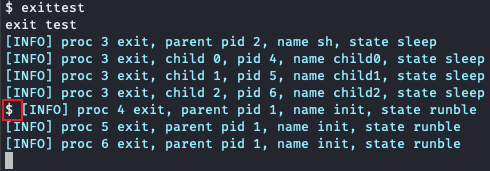

# 实验实现
!!! note "提示"
    这里，我们将对一些实现的细节做一定提醒，但是完整的流程需要自己把握，我们 **不会给出每一步实现步骤** 。因此，最重要的还是阅读[实验原理](part2.md)内容，得出自己的解决方案，然后参考"实验实现"这部分的内容。

    值得注意的是，xv6的代码很值得参考，可以看看其他系统调用和功能是怎么实现的。同时，还可以使用 `printf` 或者 `gdb` 等方法查看具体的执行情况。此外，还可以阅读 xv6 指导书，看看背后的设计机理。
    
    如果在实现过程中遇到困难，可以 **先尝试回答[任务四](#4)** 提出的问题，它们或许可以帮助你更好地理解。

## 1. 任务一：进程信息收集

&emsp;&emsp;**具体要求：在exit系统调用当中寻找合适的输出时间点，在相应的函数内进行父子进程信息的打印。**

### 1.1 流程

&emsp;&emsp;首先切换分支：

- 参考[这个指南](part1.md/#31)，切换到syscall分支并同步上游仓库；

&emsp;&emsp;在内核部分：

- 参考[exit系统调用工作流程](part2.md/#3-pcb)，阅读`proc.c: exit(int)`相关源码，在合适的位置使用`exit_info`输出。
- 然后启动xv6，在shell输入 `exittest` ，要能满足[实验概述](part1.md/#322)中提到的输出。

## 2. 任务二：wait系统调用的非阻塞选项实现

&emsp;&emsp;**具体要求：更改原有的wait系统调用，添加新参数，实现wait系统调用的非阻塞选项。**

### 2.1 流程

&emsp;&emsp;在用户部分：

- 由于我们已经将用户态的wait接口做好了更改，同学们无需更改用户部分代码。

&emsp;&emsp;在内核部分：

- 更改内核部分的wait接口定义（在`defs.h`中），以及相应的函数接口（`proc.c: wait(uint64)`）；
- 在`sysproc.c: sys_wait(void)`函数中获取用户态传入的新参数；
- 在`proc.c: wait(uint64, int)`中实现非阻塞逻辑。
- 然后启动xv6，在shell输入 `waittest` ，要能满足[实验概述](part1.md/#33-wait)中提到的输出。

## 3. 任务三：实现yield系统调用

&emsp;&emsp;该实验代码量约为30行

### 3.1 流程 

&emsp;&emsp;在用户部分：

- 添加`yield`的系统调用声明(参考[用户程序调用](part2.md/#21))；
- 在`usys.pl`文件中新增一个entry(参考[系统调用的接口：操作系统内核和用户程序的中间体](part2.md/#12))；
- 在`Makefile`的`UPROGS`变量中新增一个用户程序`_yieldtest`。

&emsp;&emsp;在内核部分：

- 在`syscall.h`中增加一个新的系统调用号，具体值你自己决定；
- 在`syscall.c`中增加一个extern函数声明，以及在`syscalls`数组中增加一项(参考[系统调用的分发和实现：解耦合](part2.md/#14))；
- 在`sysproc.c`中增加一个`sys_yield`函数，在该函数中：
    - 获取当前正在执行的进程PCB(参考[mycpu和myproc](part2.md/#73-mycpumyproc))
    - 打印出该进程对应的内核线程在进行上下文切换时，上下文被保存到的地址区间(参考[上下文切换](part2.md/#71))；
    - 打印出该进程的用户态陷入内核态时PC的值(参考[trapframe](part2.md/#31-trapframe))；
    - 根据调度器的工作方式模拟一次调度，找到下一个`RUNNABLE`的进程，同样打印相关信息(参考[调度器线程的工作方式](part2.md/#72))。首先需要在proc.h文件末尾新增extern声明全局进程表，然后在`sys_yield`函数中从当前进程起，环形遍历全局进程表，在这个过程中记得注意锁的获取和释放。
    - 然后将当前进程挂起，XV6内核态已经帮我们实现了一个`yield`函数了。

!!! note "C语言指针加法"
    指针加法的操作会根据指针所指向的数据类型来计算。假设你有一个指向某类型的指针 ptr，并且你执行了 ptr + n，这并不是将指针的地址加上 n，而是将指针的地址加上 n * sizeof(指针所指向的数据类型)。

&emsp;&emsp;最后，运行`./grade-lab-syscall yield`测试。该脚本会启动qemu并且运行yieldtest测试进行输出匹配。建议你阅读一下`user/yieldtest.c`。
## 4. 任务四：回答问题

!!! question  "回答问题"
    

    (1) 阅读`kernel/syscall.c`，试解释函数 `syscall()` 如何根据系统调用号调用对应的系统调用处理函数（例如`sys_fork`）？`syscall()` 将具体系统调用的返回值存放在哪里？
    
    (2) 阅读`kernel/syscall.c`，哪些函数用于传递系统调用参数？试解释argraw()函数的含义。
    
    (3) 阅读`kernel/proc.c`和`proc.h`，进程控制块存储在哪个数组中？进程控制块中哪个成员指示了进程的状态？一共有哪些状态？

    (4) 在任务一当中，为什么子进程（4、5、6号进程）的输出之前会 **稳定的** 出现一个`$`符号？（提示：shell程序(`sh.c`)中什么时候打印出`$`符号？）  
    
    
    (5) 在任务三当中，我们提到测试时需要指定CPU的数量为1，因为如果CPU数量大于1的话，输出结果会出现乱码，这是为什么呢？（提示：多核心调度和单核心调度有什么区别？）

​      
