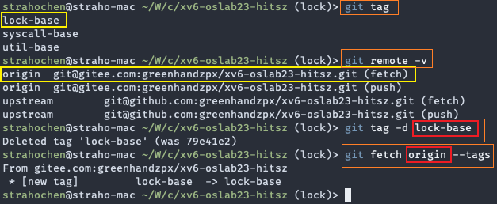

<!-- # 提交内容

## 需要提交的文件

本次实验需要提交：

- 所有你曾对xv6进行的更改；
- 一个实验报告。任务三的问答题答案请写在实验报告内。

!!! info "如何得知自己曾对xv6进行过那些更改？"
	参照[实验实用工具-3.5.2节](../../tools/#352)，可以使用`git diff`命令检查自己曾经修改过哪些文件。

## 提交格式要求

被修改的文件如果曾经位于`kernel`文件夹，那么请在提交包中创建一个`kernel`文件夹，并将对应代码文件放置于该文件夹内。  
同理，如果你曾经修改过`user`文件夹的文件，请将其放置于提交包的`user`文件夹中。  
最好不要嵌套压缩包。  
你的实验报告应当使用pdf格式，并被命名为`实验报告.pdf`。

!!! warning "为何命名和格式如此重要？"
	我们使用自动评测脚本来评测大家的提交。如果你所提交的文件名字或者格式不对，这会导致自动评测脚本找不到对应的文件，进而导致编译失败、评测0分。

!!! warning "部分修改不会被接受"
	一部分代码文件，比如`sysinfotest.c`等，为了评测环境公平，不允许同学们修改。如果你的代码依靠修改这些评测程序以通过评测，请重新审视一下自己的代码。

## 一个可能的提交包文件结构

如下图所示。这位同学将代码统一放在了一个`代码`文件夹中。`kalloc.c`等原本位于`kernel`文件夹中的文件，现在也被放置于`kernel`文件夹下；这位同学自己写了一个`my_custom_command.c`，并为其修改过`Makefile`，为防止编译不通过，该文件也可以被提交；位于根目录下的`Makefile`等文件则被同样放置在了`代码`文件夹的根目录下。  
如果不想创建`代码`文件夹，可以将`kernel`文件夹等直接放在提交包的根目录；为其更换名字、或者在外面再套几层文件夹也是可以的。不过，我们建议使用类似的提交包结构，这样可以显得更清晰易读。

```none
200xxxxxx-某某甲-file.zip
├── 代码
│   ├── Makefile
│   ├── kernel
│   │   ├── kalloc.c
│   │   ├── syscall.c
│   │   ├── syscall.h
│   │   └── sysinfo.h
│   ├── user
│   │   ├── my_custom_command.c
│   |   └── usys.pl
|	└── time.txt
└── 实验报告.pdf
``` -->

# 实验提交

请参考实验一的代码[提交方式](../lab1/part4.md/#1)。

<!--
&emsp;&emsp;实验二提交<font color=red>  **实验报告** </font> 和 <font color=red> **实验代码(只提交commit.patch文件)** </font> 。

## 1 实验报告会纳入评分

&emsp;&emsp;实验报告要求 **[回答实验中的问题](../part3/#3)，并写出实验设计思路和运行结果** 。

&emsp;&emsp;实验报告也是证明实验是独立完成的重要依据，有分数追求的大佬（juanwang）们不要只放代码和指导书的截图。

## 2 实验代码(只提交commit.patch文件)

&emsp;&emsp;不需要提交完整的代码包，只需要提交commit.patch文件即可，操作步骤如下：

!!! warning "请保证仓库标签的实时性"
	由于实验测试脚本存在更新的可能性，请同学们留意仓库代码是否存在改动。如果存在改动，请及时更新代码仓库和仓库的标签。
	更新仓库标签的方法如下：  
	- 将原本的tag删除：`git tag -d 目标tag（例如：syscall-base）`。  
	- 将新的tag拉取下来：`git fetch origin（或者upstream，取决于你把我们的仓库设置的标签叫啥） --tags`。
	如下图所示：  
	  
	其中红框标出的部分就是大家需要留意是否要更改的，大家可以参考上面的命令中的描述进行更改。

- 在完成实验之后，将当前分支上的所有更改进行提交（commit，具体方法参考[git使用教程](../../lab1/part4/#3-git)）
- 在仓库的目录下使用`make diff`命令导出更改文件（commit.patch）
- 将 **生成的commit.patch文件** 与 **实验报告** 一起打包提交到作业提交平台即可

-->