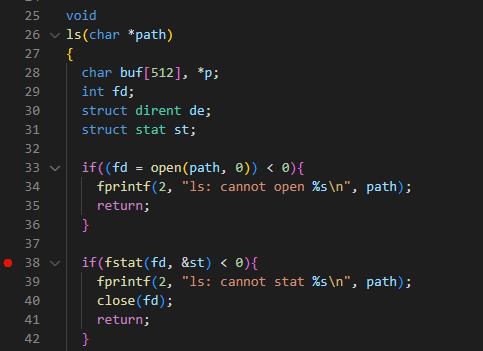
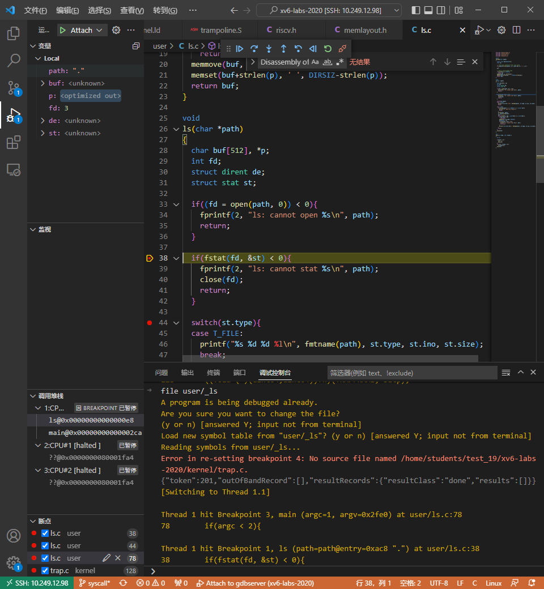
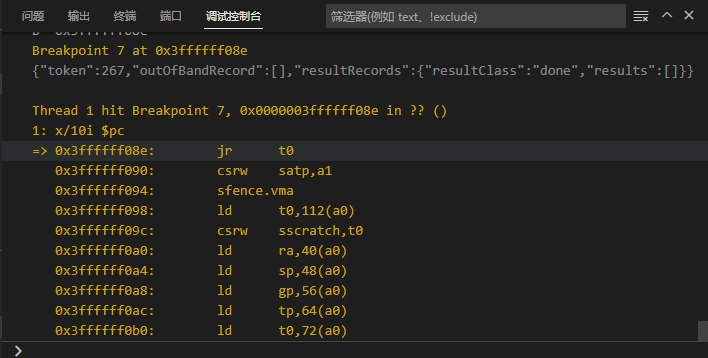
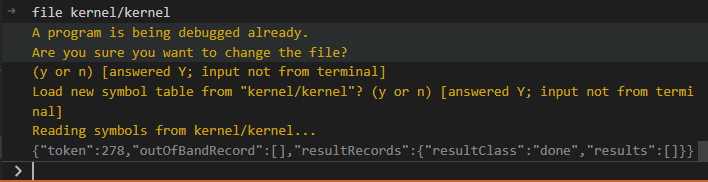

# GDB调试系统调用（补充说明）

这部分深入介绍了VS Code图形化界面GDB调试系统调用的过程，涉及到了page table的部分内容以及汇编代码，虽然有些晦涩难懂，但如果想要深入了解整个系统调用的过程，这些都是必不可少的知识点。下面以ls.c文件中的`fstat`系统调用执行过程为例，采用GDB调试分析`ecall`指令前后的系统调用过程，供同学们进行参考。

## 1. ECALL指令之前的状态

首先，参考[用户态程序调试](../remote_env_gdb/#444)从内核进入用户空间的user/ls.c。

在第38行打上断点。



点击“运行”，程序将自动运行到第38行并停止：



在调试控制台输入`display/10i $pc`，让gdb持续自动显示从pc起的10条指令。


在user/ls.asm反汇编文件中，可以看到ecall指令汇编地址是0x59c。


接着，输入`b *0x59c`在ecall指令上打断点。再点击“运行”，程序自动停在了ecall指令那一行上。

或者，也可以连续多次输入`si`（stepi命令），单步执行每一条汇编指令，直到程序停止ecall指令处。


我们还可以输入`info reg`打印全部32个寄存器的值


我们需要关心的是a0、a1寄存器，ls程序传递给fstat系统调用的参数。其中，a0是`fd`文件描述符，a1是要获取stat结构体信息的指针。

此时，我们也可以通过输入`print/x $satp`或者`p/x $satp`查看satp寄存器（页表所在的物理地址）。


satp寄存器给出的物理内存地址是0x8000000000087f48。

如果想进一步查看page table的映射关系，在QEMU界面中（注意，是在`终端`，不是在调试控制台），输入`ctrl a + c`就可以进入QEMU的console，之后再输入`info mem`。


上面打印出来的是用户程序`ls`的page table，非常小，只包含了5条映射关系。

!!! note "page table拓展知识"
	在上图中，`attr`是PTE（页表，Page Table Entry）的标志位。  

	- `r`：Readable，可读
	- `w`：Writable，可写
	- `x`：Executable，可执行
	- `u`：User，表明PTE_u标志位是否被设置，用户代码只能访问u标志位设置了的PTE。也就是如果有这个标志位，则说明这个page可以被运行在用户空间的进程访问。
	- `a`：Accessed，表明这条PTE是否被使用过。
	- `g`：Global
	- `d`：Dirty，表明这条PTE是否被写过。
	
	最后两条PTE的虚拟地址非常大（接近虚拟地址的顶端），它们分别是trapframe page和	trampoline page（详见xv6 book P24-26）。这两个PTE没有u标志位，用户代码不能访问它们。当进入supervisor mode时，才能够访问。
	
	
	
	我们在kernel/memlayout.h头文件中，也可以看到trapframe的定义。
	
	```c
	// map the trampoline page to the highest address,
	// in both user and kernel space.
	#define TRAMPOLINE (MAXVA - PGSIZE)
	```
	
	PGSIZE和MAXVA的定义在kernel/riscv.h。
	
	```c
	#define PGSIZE 4096 // bytes per page
	
	// one beyond the highest possible virtual address.
	// MAXVA is actually one bit less than the max allowed by
	// Sv39, to avoid having to sign-extend virtual addresses
	// that have the high bit set.
	#define MAXVA (1L << (9 + 9 + 9 + 12 - 1))
	```
	
	这样，就能计算出TRAMPOLINE的地址是`1<<38 - 4096 = 0x3ffffff000`，这个地址和上面用`info mem`命令查到的最后一条PTE是一样的。也就是，最后一条PTE正是TRAMPOLINE。

## 2. ECALL指令之后的状态

为了能够让程序停留在trampoline.S的userver段的第一条指令，我们可以在`0x3ffffff000`地址上打上断点。

在调试控制台上输入`b *0x3ffffff000`。


点击”运行“，或者输入`si`单步执行ecall指令。


从这里可以看到，已经进入了trampoline。

此时，我们在QEMU的console，之后再输入`info mem`。


可以看出，page table并没有发生改变，也就是说ecall并没有切换page table。

继续观察uservec汇编代码，里面有很多sd指令，用来保存用户寄存器，这些指令比较无趣，暂时不管它们（后面我们还会回来分析的:-）。我们先看在第76-85行，通过阅读注释了解到，在准备跳入usertrap()之前，需要先切换kernel page。

```assembly
76        # restore kernel page table from p->trapframe->kernel_satp
77        ld t1, 0(a0)
78        csrw satp, t1
79        sfence.vma zero, zero
80
81        # a0 is no longer valid, since the kernel page
82        # table does not specially map p->tf.
83
84        # jump to usertrap(), which does not return
85        jr t0
```

接下来，我们将断点打在`0x3ffffff08e`地址上，也就是让程序停留在跳入usertrap()之前。

!!! note "如何知道第85行`jr t0`语句的地址是`0x3ffffff08e`？"
	在调试控制台，输入`x/40i $pc`显示当前PC后面的40条指令，就可以看到`jr t0`对应的地址。

	也可以通过查看kernel.asm反汇编文件，在`0000000080007000 <_trampoline>:`段，可以看到`jr t0`相对uservec第一条指令位置偏移了`0x8e`，将`0x3ffffff000` + `0x8e`，就是`0x3ffffff08e`。

输入`b *0x3ffffff08e`


点击”运行“。



在跳转到内核C语言代码运行之前，加载kernel的调试符号，输入`file kernel/kernel`



接着，输入`si`单步执行汇编指令。


可以看到已经进入了trap.c的usertrap函数中了。

此时我们再观察page table，在qemu控制台输入`info mem`


可以看出与之前的page table不一样了，已经从user page table切换到了kernel page table，说明已经准备好了执行内核中的C代码了。

!!! note "`trampoline`拓展知识"
	注意观察的同学可能已经发现了，user page table和kernel page table的trampoline page的映射是完全一样的，因此我们在切换page table时，寻址的结果不会改变，否则当trampoline切完页表就可能因找不到指令而崩溃了。这也正是trampoline page的特殊之处。

!!! note "`trapframe`拓展知识"
	可能还有同学注意到，user page table中倒数第二个PTE的vaddr（虚拟地址：0x3ffffffe00）也是比较大。这个PTE是由kernel设置好的映射关系，用于指向一个可以用来存放每个进程的用户寄存器的内存位置（如果你想查看xv6在trapframe page中存放了什么，详见proc.h的trapframe结构体）。在内核切换用户空间时，内核会执行set sscratch指令，将这个寄存器的内容设置为0x3ffffffe00，也就是trapframe page的虚拟地址。在运行用户代码时，sscratch保存的就是指向TRAPFRAME的地址。

	那为什么内核要保存这些用户寄存器呢？
	
	是因为内核即将要运行会覆盖这些寄存器的C代码。当从内核再次切回至用户空间时，如果要想正确恢复用户程序，则需要将用户寄存器恢复成在ecall指令执行之前的状态。因此，需要将所有的寄存器都保存在trapframe中，这样才能在之后恢复寄存器的值。


## 3. 汇编之后的C代码

自从见到了usertrap，我们就已经进入了C语言的世界，相比上述汇编代码来说，少了很多晦涩难懂的地方，是不是觉得生活更加美好了呢:-)

从前面实验原理的部分，我们已经知道，有很多原因都可以让程序进入usertrap函数中来。对于本实验来说，我们更关心的是系统调用的过程代码，那么我们可以在第67行`syscall();`打上断点，点击“运行”，让程序停留在syscall()函数。当然，喜欢探索的同学也可以深入分析usertrap()函数的执行流程。

接着进入syscall.c文件中的syscall()，那么同学们就可以愉快地进行调试分析后面的代码吧。

## 4. 一个简单的从用户到内核空间的调试方法

有同学可能问，能不能跳过汇编代码，直接打打断点到C代码呢？答案是可以的。下面还是以ls中的fstat系统调用为例，介绍一个较为简单的调试步骤：

**Step1：** 在kernel/trap.c:128处打断点，在终端运行`make qemu-gdb`，点击VS Code的“运行和调试”选项。

**Step2：** xv6第一个执行的用户程序为initcode，并非我们正在寻找的ls。我们可以继续执行，直到在xv6的shell中输入`ls`，以启动ls程序。

**Step3：** 接下来，我们需要在调试窗口左下角删除原有的内核态断点，并通过调试控制台，加载ls的调试符号。在其中输入`file user/_ls`。

**Step4：** 打开user/ls.c文件，找到main()函数，在第78行打上断点。

**Step5：** 点击“运行”，在ls.c第38行打上断点，也就是执行fstat系统调用的地方。

**Step6：** 在调试控制台，输入`b *0x59c`在ecall指令上打断点。再点击`“运行”`，程序自动停在了ecall指令那一行上。

**Step7：** 在调试控制台，输入`file kernel/kernel`，加载kernel的调试符号。

**Step8：** 在syscall.c文件中第67行`syscall();`打上断点，点击`“运行”`，让程序停留在syscall()函数。

**Step9：** 接下来，你就可以根据需要来调试你想要分析的代码吧。

