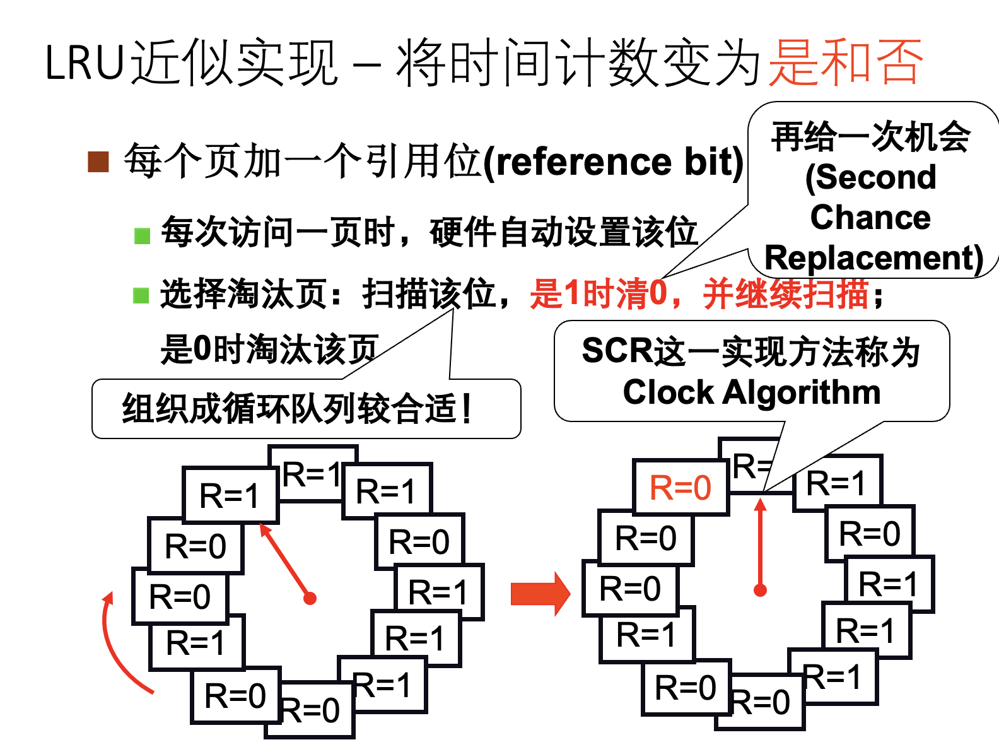

# 实验原理

!!! info   "关于锁的一些解释"
    锁用来保证数据一致性的手段十分简单粗暴：当有人操作的时候，不允许其他人操作。

    在多核情况下，这就会导致当很多CPU核心要操作一个数据结构（如kalloc中的freelist）时，需要排队，一个个来。一个核心在干活，其他的核心只能被阻塞住，这就导致了并行性的下降。
    
    那我们把锁删了，不阻塞，并行性不就上去了吗？确实，但这样功能就不能保证正确了。功能正确的重要性往往比性能高的重要性大得多。因此在成熟的操作系统中，一般都会采取锁的机制，同时通过减少锁争用的方法优化性能。这是本实验的 **根本目的** ，之后的章节主要讨论使用锁的一些部件，我们在这些场景下来进行锁的优化。

## 1. 内存分配器（Memory Allocator）

!!! warning   "注意"
    本部分，你应该要知道：

    - 什么是内存分配器？
    - 内存分配器的数据结构是什么？
    - 内存分配器的所有操作及其对数据结构的改变？
    - 我们应该如何修改内存分配器以达到实验目标？


### 1.1 简介

&emsp;&emsp;在xv6中，设置了总量为128MB的物理内存空间，见Makefile中的编译运行选项：

```makefile
QEMUOPTS = -machine virt -bios none -kernel $K/kernel -m 128M -smp $(CPUS) -nographic
```

&emsp;&emsp;在内核代码中，也给出了内存地址定义，在kernel/memlayout.h。

```c
// the kernel expects there to be RAM
// for use by the kernel and user pages
// from physical address 0x80000000 to PHYSTOP.
#define KERNBASE 0x80000000L
#define PHYSTOP (KERNBASE + 128*1024*1024)
```

&emsp;&emsp;在xv6 book 3.2小节，给出了物理地址和虚拟地址的分布及映射关系（见下图）。下图左边是内核的虚拟地址，右边上半部分是物理内存（DRAM），右边下半部分是I/O设备。本次实验主要关注图中的右边上半部分（我们会在下一个实验中再次介绍左边部分的虚拟地址：）。当操作系统启动时，会从地址0x80000000开始运行，这个地址其实是由硬件设计者决定的。在xv6内核刚启动时，从kernel结束地址（end）一直到PHYSTOP的空间都是空闲的。实际上，内核代码段（kernel text）和数据段（kernel data）会占用一部分空间，导致剩余的空闲空间比128MB要小。


!!! info   "拓展阅读"
    - **trampoline**：用户态-内核态跳板。
    - **kstack** ：每个进程的内核栈空间。
    - **Guard page**：同时在内核空间和用户空间用来保护Stack。如果kernel stack耗尽了，它会溢出到Guard page，但是因为Guard page的PTE中Valid标志位未设置，会导致立即触发page fault，这样的结果好过内存越界之后造成的数据混乱。
    - **free memory**：页分配器管理的地址空间，即本次实验中freerange要管理的地址空间
    - **kernel data/text**：数据段/代码段。
    - **KERNBASE**：内核态基址。
    - **VIRTIO disk**：磁盘I/O操作地址。
    - **UART0**：串口I/O操作地址。
    - **PLIC**：平台级中断控制器地址。
    - **CLINT**：core-local中断控制器地址。
    - **boot ROM**：用于启动操作系统。当主板上电后，运行的是存储在boot ROM中的代码，当boot完成之后，会跳转到地址0x80000000。

&emsp;&emsp;xv6内存分配器对上层提供`kalloc()`和`kfree()`接口来管理这段剩余的空闲物理内存free memory。在需要使用新内存空间的时候调用`kalloc()`，在需要释放内存空间的时候调用`kfree()`。
物理内存分配器（allocator）定义在`kernel/kalloc.c`。

```c
struct run {
  struct run *next;
};

struct {
  struct spinlock lock;
  struct run *freelist;
} kmem;
```

&emsp;&emsp;分配器的核心数据结构是由空闲物理页组成的链表`freelist`，这个空闲页链表将物理内存划分成4KB大小的页帧来管理，并使用 **自旋锁** （spinlock）进行保护。每个空闲页在链表里都是`struct run next`指向下一个空闲物理页。

&emsp;&emsp;这可能比较难理解，我们不妨从这个链表的构建开始了解。在系统启动时，`main()`函数（见`kernel/main.c`）调用`kinit()`来初始化分配器，它通过保存所有空闲页来初始化链表。`kinit()`调用`freerange()`来把空闲内存页加到链表里，`freerange()`则是通过调用`kfree()`把每个空闲页（地址范围从`pa_start`至`pa_end`）逐一加到链表里来实现此功能的。`kfree()` 函数用于释放指定的物理内存页，将其添加至`freelist`中，参数`pa`为需要释放的物理页页号，即物理页的首地址，它被看作一个没有类型的指针。在`kfree()`中，`pa`被 **强制转换** 为`run`类型的指针，进而可以放入`freelist`中。因为空闲页里什么都没有，所以结构体`run`的成员可以直接 **保存在空闲页自身里** 。

<div align="center">  </div>

<!--

```c
void freerange(void *pa_start, void *pa_end)
{
  char *p;
  p = (char*)PGROUNDUP((uint64)pa_start);
  for(; p + PGSIZE <= (char*)pa_end; p += PGSIZE)
    kfree(p);
}

void kfree(void *pa)
{
  ...
  r = (struct run*)pa;
  acquire(&kmem.lock);
  r->next = kmem.freelist;
  kmem.freelist = r;
  release(&kmem.lock);
}
```
-->
### 1.2 功能与操作

&emsp;&emsp;关于链表的操作主要有两个：

1、释放内存

&emsp;&emsp;释放内存的函数是`kfree(void *pa)`，首先将 `void *pa` 开始的物理页的内容全部置为1，这是为了让之前使用它的代码不能再读取到有效的内容，使得这些代码能尽早崩溃以暴露问题。然后将这空闲页物理内存加到链表头。

<div align="center">  </div>

2、申请内存

&emsp;&emsp;`void* kalloc(void *)`用来分配内存物理页，功能很简单，就是移除并返回空闲链表头的第一个元素，即给调用者分配1页物理内存。

<div align="center">  </div>

&emsp;&emsp;由于物理内存是在多进程之间共享的，所以不管是分配还是释放页面，每次操作`kmem.freelist`时都需要先申请`kmem.lock`，此后再进行内存页面的操作。
    

<div align="center">  </div>

### 1.3 锁机制

!!! info   "`kalloc`在什么情况下使用了锁？"
    查阅`kalloc.c`代码可知，`kalloc`只在`kalloc()`和`kfree()`中使用了锁，那这两个用锁的情况有什么共同之处呢？
    
    没错，他们都是把 **对`freelist`的操作** 锁了起来。`kfree()`在往`freelist`里加入空闲页前锁了一下，操作完之后解锁了。`kalloc()`在移除`freelist`第一个元素时也同样加了锁，操作完成再释放锁。所以对于内存分配器中需要锁保护的只有对`freelist`的操作。

### 1.4 优化方法（重要）

&emsp;&emsp;修改空闲内存链表就是`freelist`，现在我们要减少锁的争抢， **使每个`CPU`核使用独立的链表** ，而不是现在的共享链表。这样等分，就不会让所有的`CPU`争抢一个空闲区域。**注意**：每个空闲物理页只能存在于一个freelist中。 

<div align="center">  </div>


## 2. 磁盘缓存（Buffer Cache）

!!! warning   "注意"
    本部分，你应该要知道：

    - 什么是磁盘缓存？
    - 磁盘缓存的数据结构是什么（bcache和buf）？
    - 磁盘缓存的所有操作及其对数据结构的改变？
    - 我们应该如何修改磁盘缓存以达到实验目标？  

### 2.1 简介

&emsp;&emsp;xv6的文件系统是以磁盘数据块为单位从磁盘读写数据的。由于对磁盘的读取非常慢，而内存的速度要快得多，因此将最近经常访问的磁盘块缓存在内存里可以大大提升性能（此时内存起到cache的作用）。Buffer Cache（也称为bcache）就担任了磁盘缓存一职，它是磁盘与文件系统交互的中间层。

&emsp;&emsp;xv6的磁盘缓存模块主要提供了以下功能：

1. 同步访问磁盘块以确保内存里每个块只有一份复制，且每次只有一个内核进程可以使用那份复制。  
2. 缓存常用块，使得不必每次都从硬盘上读取它们。  
3. 修改缓存块的内容后，确保磁盘中对应内容的更新。  

<div align="center">  </div>

### 2.2 基本结构

&emsp;&emsp;数据结构bcache（见kernel/bio.c）维护了一个由静态数组`struct buf buf[NBUF]`组成的双向链表，它以块为单位，每次读入或写出一个磁盘块，放到一个内存缓存块中（bcache.buf），同时自旋锁`bcache.lock`用于用户互斥访问。所有对缓存块的访问都是通过`bcache.head`引用链表来实现的，而不是buf数组。

```c
struct {
  struct spinlock lock;
  struct buf buf[NBUF];
  // Linked list of all buffers, through prev/next.
  // head.next is most recently used.
  struct buf head;
} bcache;
```

```c
struct buf {
  int valid;   // has data been read from disk?
  int disk;    // does disk "own" buf?
  uint dev;
  uint blockno;
  struct sleeplock lock;
  uint refcnt;
  struct buf *prev; // LRU cache list
  struct buf *next;
  uchar data[BSIZE];
};
```

&emsp;&emsp;每个缓存块（见struct buf）都由三个部分组成：

- （1）**`data`字段** `（data[BSIZE]）`标示了它的内容;
- （2）**指针字段** `（\*prev，\*next）`用于组成链表;
- （3）**数值字段** 用于标示它的属性，如
  
    - *`valid`* 是缓存区包含了一个块的复制（即该buffer包含对应磁盘块的数据）;
    - *`disk`* 是缓存区的内容是否已经被提交到了磁盘;
    - *`dev`* 是磁盘块的设备号，本实验中dev都是0;
    - *`blockno`* 是缓存的磁盘块号;
    - *`refcnt`* 是该块被引用次数（即被多少个进程拥有）;
    - *`lock`* 是缓存磁盘块的睡眠锁。sleeplock是用于确保每次只有一个进程使用buffer（从而使用相应的磁盘块）。


<div align="center">  </div>


&emsp;&emsp;上图是bcache结构示意图。bcache.lock是自旋锁，用于表示 bcache 链表是否被锁住。b->lock是睡眠锁，用于表示缓存数据块buf是否被锁住。

!!! note   "关于bcache"
    看到这里，大家还是否记得我们在《计算机组成原理》实验课程上做过的Cache实验，其结构是：有效位（Valid）、标记（Tag）和数据（Data）。主要差异在于，组成原理实验是硬件Cache，本次实验是用C语言写的内存Cache。

### 2.3 功能与操作

&emsp;&emsp;对bcache的操作如下：

- 在系统启动时，`main()`函数（见`kernel/main.c`）调用`binit()`来初始化缓存，随即调用`initlock()`初始化`bcache.lock`，然后循环遍历`buf`数组，采用头插法逐个链接到`bcache.head`后面。
- 上层文件系统读磁盘时，调用`bread()`，随即调用`bget()`检查请求的磁盘块是否在缓存中。`bget()`使用`LRU`（Least Recent Used）算法首先从链表头部开始查找，如果命中，返回缓存命令结果；如果未命中，则从链表尾部开始找到最不常使用的`block cache`，腾出空间以用来存放新的`block cache`。然后，转到底层的`virtio_disk_rw()`函数先将此磁盘块从磁盘加载进`block cache`中，再返回此磁盘块。
- 上层文件系统写磁盘时，调用`bwrite()`，随即调用`virtio_disk_rw()`函数直接将缓存中的数据写入磁盘。
- 上层文件系统可通过调用`brelse()`首先释放了`sleep clock`，之后获取`bcahce`的锁，减少`block cache`的引用计数，表明某个进程不再对`block cache`进行操作。如果当引用计数为0时，则将`block cache`脱离出链表，再将它插入到链表头部，这样表示这个`block cache`是最近使用过的`block cache`，以便在`bget()`中使用`LRU`算法。也就是说如果一个`block cache`最近被使用过，那么很有可能它很快会再被使用。
- 上层文件系统可通过`bpin()`将block固定在`buffer cache`中，它是通过给`block cache`增加引用计算来避免`cache`撤回对应的`blcok`。因为在`brelse()`中，如果引用计数不为0，那么`bcache`是不会撤回`block cache`的。`bunpin()`的用法则与之相反。
  

!!! info   "提示"
    磁盘层在`virtio_disk.c`，实际上就是硬盘驱动。

    缓冲区缓存层用到的接口是`virtio_disc_rw(struct buf *b, int write)`
    
    - 作用：对磁盘进行读或写
    - `*b` : 缓冲区的指针   
    - `write` : 当为1时是把缓冲区的内容写入到磁盘，为0时是把磁盘的内容读取到缓冲区   

### 2.4 优化方法（重要）

&emsp;&emsp;在`kernel/bio.c`中，可以看到，所有的`buffer`都被组织到 **一条链表** 中，因此如果有多个进程要使用`buffer`，它们并发的请求只能被顺序地处理。

<div align="center">  </div>

!!! note   "关于bcache的优化策略"
    MIT官方指导书推荐使用 **哈希桶** 和 **时间戳** 两个方案，此外，本实验还给出了基于 **CLOCK算法** 的优化策略，大家可以自行选择优化策略，也可以一起使用（如哈希桶结合时间戳），也可以单独分开用，需要自行测试看看能否通过测评程序。

#### 2.4.1 哈希桶

&emsp;&emsp;使用哈希桶，将各块块号`blockno`的某种散列值作为`key`对块进行分组，并为每个哈希桶分配一个专用的锁。通过哈希桶来代替链表，当要获取和释放缓存块时，只需要对某个哈希桶进行加锁，桶之间的操作就可以并行进行，提供并行性能。  
      
1. 在`bget()`中查找指定块时，锁上对应的锁（获取空闲块号须另作处理）。  
   
2. 当`bget()`查找数据块未命中时，`bget()`可从其他哈希桶选择一个未被使用的缓存块，移入到当前的哈希桶链表中使用。
   
3. 选择合适的散列函数以分组，分组的数量不必动态调整，可以取定值，推荐使用质数组（如13组）以减少哈希争用。  
   
4. 哈希表的搜索和空闲缓存块的查找需要保证原子性。 
   

<div align="center">  </div>


#### 2.4.2 时间戳

&emsp;&emsp;移除空闲缓存块列表(`bcache.head`)。使用 **时间戳** 作为判断缓存块最一次被访问的顺序的依据。  
      
1. 此项改动可使`brelse`不再需要锁上`bcache lock`。  
   
2. `bget()`在找空闲块时也可通过时间戳得知最后一次被访问时间最早的空闲缓存块。  
   
3. 时间戳可通过`kernel/trap.c`中的`ticks`函数获得（`ticks`已在`kernel/def.h`中声明，`bio.c`中可直接使用）。  
   
<div align="center">  </div>

#### 2.4.3 CLOCK算法

&emsp;&emsp;除此之外，理论课上我们还学习过除了 LRU 以外的替换算法，例如 CLOCK 算法等，也可以在本实验中使用。

<div align="center">  </div>


&emsp;&emsp;CLOCK 算法的实现思路为:

1. 将数据结构改为使用 **数组** 构成的循环队列，每个 buf 拥有自己的锁。

2. `bget()` 查找时，不需要获取对应的锁，查找到之后，锁上对应的锁，然后重新检查这个 buf 是否是想要的，检查完后进行对应的操作。

3. 每个 buf 维护一个访问位，当 `bget()` 没有找到对应的缓存 buf 时，根据 CLOCK 算法维护访问位并分配一个 buf。
      1. 如当前查询的 buf 命中，访问位 -> 置“1”，指针保持不动

      2. 否则，循环检查各页面的使用情况。若访问位为“0”，选择该页淘汰，指针前进一步。若访问位为“1”，复位访问位为“0”，指针进一步。

&emsp;&emsp;CLOCK 算法实现思路中我们提到，查找时不需要获取对应的锁，那么这个是否安全？如果查找时也获取对应的锁，会发生什么？其实这两种做法分别对应“ **乐观锁** ”和“ **悲观锁** ”。“乐观锁”每次去拿数据的时候都认为别人不会修改，所以不会上锁，但是在更新的时候会判断一下在此期间别人有没有去更新这个数据。“悲观锁”总是假设最坏的情况，每次去拿数据的时候都认为别人会修改，所以每次在拿数据的时候都会上锁。感兴趣的同学可以尝试比较这两种做法，再与网上搜索的常见用途相对比。

----------

上述三个方案在以下情况中都存在少量锁争用，在本实验中，这是允许的：

1. 当两个进程同时访问同一个缓存数据块号`blockno`时；
2. 当两个进程同时没有命中`cache`，需要找一个未使用的`block`来替代时；
3. 当两个进程同时使用块时，无论使用何种模式划分数据块和锁，都会产生争用的情况，比如在哈希桶的优化策略中，如果两个进程使用的两个数据块，通过哈希表映射到同一个哈希组部分（这取决于具体的设计，请尝试调整具体的模式来避免争用，比如可以调整哈希表的大小）。

----------

### 2.5 避免死锁（重要）

&emsp;&emsp;bcache 与前面 kalloc 实验的重要区别是，bcache 实验需要处理替换/分配情况，因此同学们第一次设计 **极易** 出现死锁。

&emsp;&emsp;死锁的发生具有概率性，所以`bcachetest`通过并不代表你编写的代码不存在死锁。实验要求同学们通过的`usertests`是较为全面的测试，对操作系统的各方面均进行了较大强度的测试，所以如果你的代码不能够通过`usertests`或在测试中卡死，或 **有概率不通过** 测试，那么一般来说代表你的代码出现死锁/竞争条件。


!!! warning "注意"
      即使你的设计通过了全部的测试，也不代表你的代码100%没有死锁。如何确保代码是无 bug 的超出了操作系统课程的范畴，感兴趣的同学可以了解 **形式化验证**。

      同样，设计方案时形式化地思考理论课上学习的知识，有助于你设计出正确的代码。

&emsp;&emsp;为什么会出现死锁？以哈希桶的优化为例，同学们一般做法都会为每个哈希桶设置一个锁。但是在需要进行替换/分配的时候，往届同学们的做法通常是内核持有一个桶的锁，然后同时抢另一个桶的锁，此时出现了同时持有 **两个自旋锁**，这种情况在实际业务代码里是比较危险的，在本实验也会导致死锁，请同学们思考这是为什么。

!!! warning "注意"
      有的同学为了解决死锁问题，设计了一种方法：
      
      先释放原有桶的锁，然后再获取另一个桶的锁。
      
      这种做法是不安全的，请大家思考为什么不安全？

&emsp;&emsp;下面以哈希桶的优化方式为例给出一种替换/分配思路，这个思路也出现了同时持有两个或以上自旋锁的情况，请同学们思考这种做法是否有死锁，是否出现竞争。

1. 首先获取对应请求桶的锁，查找是否已缓存相应块，查找不到以后释放锁。
2. 接着进入全局替换/分配流程，需要到全部桶中寻找可用块释放并分配。先获取全局分配大锁，获取原有桶的锁，再重新扫描一遍检查是否已有缓存，如果没有就再查找是否存在可用块并分配；如果还是没有，就需要在其他桶内查找可用块并分配；最后在函数返回前按序释放所有锁。

<!-- 
原来的锁放了以后原来桶里的内容就不能保证了（原来“查询未命中”这个结果已经失效了，可能已经被别的进程做了同样的替换）。获取全局大锁后，再获取两个桶的锁，可以保证互斥。
-->