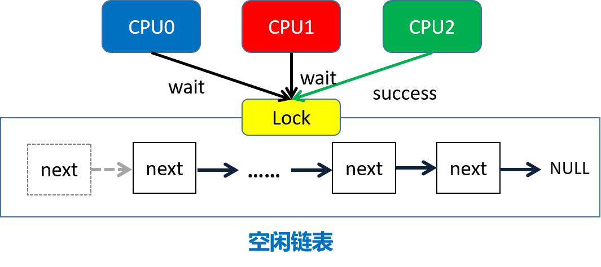

# 实验原理

!!! info   "关于锁的一些解释"
    锁用来保证数据一致性的手段十分简单粗暴：当有人操作的时候，不允许其他人操作。

    在多核情况下，这就会导致当很多CPU核心要操作一个数据结构（如kalloc中的freelist）时，需要排队，一个个来。一个核心在干活，其他的核心只能被阻塞住，这就导致了并行性的下降。
    
    那我们把锁删了，不阻塞，并行性不就上去了吗？确实，但这样功能就不能保证正确了。功能正确的重要性往往比性能高的重要性大得多。因此在成熟的操作系统中，一般都会采取锁的机制，同时通过减少锁争用的方法优化性能。这是本实验的 **根本目的** ，之后的章节主要讨论使用锁的一些部件，我们在这些场景下来进行锁的优化。

## 1. 内存分配器（Memory Allocator）

!!! warning   "注意"
    本部分，你应该要知道：

    - 什么是内存分配器？
    - 内存分配器的数据结构是什么？
    - 内存分配器的所有操作及其对数据结构的改变？
    - 我们应该如何修改内存分配器以达到实验目标？


### 1.1 简介

xv6对上层提供kalloc()和kfree()接口来管理物理内存。通过kalloc()和kfree()，屏蔽对物理内存的管理，使得调用者只需要关心虚拟地址空间，在需要使用新内存空间时候调用kalloc()，在需要释放内存空间的时候调用kfree()。
物理内存分配器（allocator）定义在kernel/kalloc.c。

```c
struct run {
  struct run *next;
};

struct {
  struct spinlock lock;
  struct run *freelist;
} kmem;
```

分配器的核心数据结构是由空闲物理页组成的链表`freelist`，这个空闲页链表用 **自旋锁** （spinlock）进行保护。每个空闲页在链表里都是`struct run next`指向下一个空闲物理页。这可能比较难理解，我们不妨从这个链表的构建开始了解。在系统启动时，`main()`函数（见kernel/main.c）调用`kinit()`来初始分配器，它通过保存所有空闲页来初始化链表。kinit()调用`freerange()`把空闲内存页加到链表里，freerange()则是通过调用`kfree()`把每个空闲页（地范围从pa_start至pa_end）逐一加到链表里来实现此功能的。kfree() 函数用于放指定的物理内存页，将其添加至`freelist`中，参数`pa`为需要释放的物理页号，即物理页的首地址，它被看作一个没有类型的指针。在kfree()中，pa被 **强制转换** 为run类型的指针，进而可以放入freelist中。因为空闲页里什么都没有，所以结构体`run`的成员可以直接 **保存在空闲页自身里** 。


```c
void freerange(void *pa_start, void *pa_end)
{
  char *p;
  p = (char*)PGROUNDUP((uint64)pa_start);
  for(; p + PGSIZE <= (char*)pa_end; p += PGSIZE)
    kfree(p);
}

void kfree(void *pa)
{
  ...
  r = (struct run*)pa;
  acquire(&kmem.lock);
  r->next = kmem.freelist;
  kmem.freelist = r;
  release(&kmem.lock);
}
```

### 1.2 功能与操作

关于链表的操作主要有两个：

1、释放内存

释放内存的函数是`kfree(void *pa)`，首先将 `void *pa` 开始的物理页的内全部置为1，这是为了让之前使用它的代码不能再读取到有效的内容，使得这些代码能尽早crash以显露问题。然后将这空闲页物理内存加到链表头。


2、申请内存

`void* kalloc(void *)`用来分配内存物理页，功能很简单，就是移除并返回空闲链表头的第一个元素，即给调用者分配1页物理内存。


由于物理内存是在多进程之间共享的，所以不管是分配还是释放页面，每次操作kmem.freelist时都需要先申请kmem.lock，此后再进行内存页面的操作。
    



### 1.3 锁机制

!!! info   "`kalloc`在什么情况下使用了锁？"
    查阅`kalloc.c`代码可知，`kalloc`只在`kalloc()`和`kfree()`中使用了锁，那这两个用锁的情况有什么共同之处呢？没错，他们都是把 **对`freelist`的操作** 锁了起来。`kfree()`在往`freelist`里加节点前锁了一下，操作完之后解锁了。`kalloc()`在移除`freelist`第一个元素时也同样加了锁，操作完成再释放锁。所以对于内存分配器中需要锁保护的只有对`freelist`的操作。
