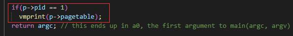
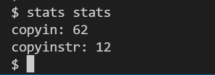

# 实验概述

!!! warning "温（守）馨（住）提（红）示（线）"
    
    本课程实验已引入代码自动查重系统，请同学们保持[学术诚信](https://integrity.mit.edu/)！


!!! note   "课程复习和预习要求"
    本节实验与理论课的 **“虚拟内存”** 和 **“内存管理”** 这两章课程内容相关，请同学们复习这两章课程内容。

    在做实验之前，请同学们阅读[xv6手册](https://pdos.csail.mit.edu/6.828/2020/xv6/book-riscv-rev1.pdf)的以下章节及相关源代码：
    
    - [1] xv6 book, Chapter 3 Page tables (页表)
    - [2] kernel/memlayout.h （定义内存的布局）
    - [3] kernel/vm.c （虚拟内存代码）
    - [4] kernel/kalloc.c （分配和释放物理内存代码）
    
    此外，特别推荐同学们观看由我校OS课题组、各级学长助教们合力为大家录制的XV6讲解视频，希望能够让大家对整个XV6系统有一个更为直观的认识，推荐大家按需观看：
    
    1. 【HITSZ操作系统课程组讲解XV6（一）启动过程】 https://www.bilibili.com/video/BV1mK411S7N9?share_source=copy_web&vd_source=225a99017e082147ac525beeddd6e3e2
    2. 【HITSZ操作系统课程组讲解XV6（二）进程管理】 https://www.bilibili.com/video/BV1ge4y1J7Je?share_source=copy_web&vd_source=225a99017e082147ac525beeddd6e3e2
    3. 【HITSZ操作系统课程组讲解XV6（三）内存管理】 https://www.bilibili.com/video/BV1Te4y1i77z?share_source=copy_web&vd_source=225a99017e082147ac525beeddd6e3e2

!!! info   "提示"
    本节实验将探索内核的内存管理模块，并且需要修改相应的部分。建议阅读完所有部分，再开始代码的编写。
    

## 0.  实验分数

本实验有三个任务，作为最后一个MIT xv6实验，任务二和任务三的难度相比之前来说有 **明显提高** ，但是我们希望大家能够尽量完成，如果实在无法完成，也可以给出你的思路，以尽可能拿到分数，即使任务二和任务三的分数占比不高。

**1. 实验报告**
    
- 回答实验中的问题 40%；
- 给出实验设计思路 60%：
    - 任务一：30%
    - 任务二：20%
    - 任务三：10%
    

若对应任务未给出实验设计，那么对应任务代码分记0分。

**2. 实验代码**

- 任务一：50%
- 任务二：30%
- 任务三：20%

若对应任务代码无法通过测试，那么实验报告中对应任务的设计分最高只能得到满分的50%。
因此，即使没有实现，你也应该应该尽可能地给出你的思路。

## 1.  实验目的

1. 了解页表的实现原理。
2. 修改页表，使内核更方便的进行用户虚拟地址翻译。

## 2.  实验学时

本实验为4学时。
    

## 3.  实验内容及要求

!!! warning   "请先同步上游远程仓库，并注意切换到pgtbl 分支进行试验"

    本次实验基于 **pgtbl** 分支，请同学们注意切换。
    
    **Step 1.** 首先，保存实验三的代码，请参考实验实用工具的[3.3.1 使用命令行完成操作](../../tools/#331)或者[3.3.2 使用VS Code内建的图形化界面完成操作](../../tools/#332-vs-code)这两小节，完成commit操作。或者， **如果你希望直接放弃掉上一次commit后的所有更改** ，那么你也可以使用-f选项强制切换分支，例如`git checkout -f pgtbl`。
    
    **Step 2.** 切换的方法可以参考实验 -> 实验实用工具 -> [3.1同步上游仓库 ~ 3.3.3 合并冲突更改](../tools.md#31)。
    
    同时，本次实验的 **输出格式不同于MIT原版实验，请严格按照指导书要求！** 

### 3.1 任务一：打印页表

本任务中，你需要加入页表打印功能，来帮助你在之后的实验中进行debug。

首先，我们需要了解页表的数据结构。然后，按层次每页打印即可，可以采用迭代的算法。
    
#### 3.1.1 打印函数定义

`void vmprint(pagetable_t pgtbl)`
    
该函数将获取一个 **根页表指针** 作为参数，然后打印对应的页表数据。
    
**函数的使用位置** ：注意！该函数一定要插入在`exec()`逻辑结束的末尾，来打印第一个进程或刚载入程序的页表数据。在开发过程中，你可以插入到其他的地方，但是最后一定只保留这一个地方的函数使用。

- 在exec.c中的返回argc之前插入vmprint()函数，以输出第一个进程或刚载入程序的页表。其中，vmprin()函数的入参可以根据你自己的设计来填入。



#### 3.1.2 结果示例

当xv6启动的时候，它自身会调用 `exec()` 启动第一个进程 `init` ，这个时候我们的函数会得到以下的输出：
    

```console
xv6 kernel is booting

hart 1 starting
hart 2 starting
page table 0x0000000087f6e000
/* 根页表物理地址：0x0000000087f6e000 */
||0: pte 0x0000000021fda801 pa 0x0000000087f6a000
/* 根页目录项 0，PTE内容为0x0000000021fda801，表示下一级（第二级）页表的PPN物理页帧号为0x87f6a，Flags为0x001，PTE_V有效。该物理页的起始物理地址为0x0000000087f6a000。*/
|| ||0: pte 0x0000000021fda401 pa 0x0000000087f69000
/* 第二级目录项 0，PTE的PPN物理页帧号：0x87f69，Flags为0x001。 */
|| || ||0: pte 0x0000000021fdac1f pa 0x0000000087f6b000
/* 进程的第 0 页，其PPN物理页帧号：0x87f6b，Flags为0x01f，物理块起始地址：0x0000000087f6b000 */
|| || ||1: pte 0x0000000021fda00f pa 0x0000000087f68000
/* 进程的第 1 页，其PPN物理页帧号：0x87f68，Flags为0x00f，物理块起始地址：0x0000000087f68000 */
|| || ||2: pte 0x0000000021fd9c1f pa 0x0000000087f67000
/* 进程的第 2 页，其PPN物理页帧号：0x87f67，Flags为0x01f，物理块起始地址：0x0000000087f67000 */
||255: pte 0x0000000021fdb401 pa 0x0000000087f6d000
/* 根页目录项 255，下一级（第二级）页表的PPN物理页帧号为0x87f6d，Flags为0x001，PTE_V有效。该物理页的起始物理地址为0x0000000087f6d000 */
|| ||511: pte 0x0000000021fdb001 pa 0x0000000087f6c000
/* 第二级目录项 511，PPN物理页帧号为0x87f6c，Flags为0x001 */
|| || ||510: pte 0x0000000021fdd807 pa 0x0000000087f76000
/* 进程的第 510 页，其PPN物理页帧号：0x87f76，Flags为0x007，物理块起始地址：0x0000000087f76000 */
|| || ||511: pte 0x0000000020001c0b pa 0x0000000080007000
/* 进程的第 511 页，其PPN物理页帧号：0x80007，Flags为0x00b，物理块起始地址：0x0000000080007000 */
```

我们先不着急动手，先看看结果长什么样（不清楚页表的含义先不急，实验原理会告诉你）。
    
- 第一行打印的是 `vmprint` 的参数，即获得的页表参数具体的值。
- 在之后打印的则是页表项。RISC-V的页表被设计成了三层（具体见[实验原理](../part2/)），每一个”||“都代表一层。
- 之后打印的格式为： `$index: pte $pte_bits pa $physical_address` 。
    - `index`:  指示了该页表项在当前等级页表内的序号（取值范围：0-511）；
    - `pte_bits`：指示了这个页表项的十六进制值（PTE）；
    - `physical_address`：指示了这个页表项对应的十六进制物理地址；
    - 只打印有效的pte。

在上面的示例中，根页表向具有0和255的映射，其中0的次页表只映射了索引0，该索引0映射了叶子页表的0、1和2。

你的代码输出的物理地址与上述示例可能不相同，但显示项数和虚拟地址应相同。

    
#### 3.1.3 测试

运行`make grade` ，其中的`pte printout`测试就是该任务的测试（[可参考测评 3.4](#34)）。
    


### 3.2 任务二：独立内核页表（难）

目前，xv6的每个进程都有自己独立的 *用户页表* （只包含该进程用户内存的映射，从虚拟地址0开始），但是每个进程进入内核的时候，会使用唯一的一个 *全局共享内核页表* 。我们需要 **将全局共享内核页表改成独立内核页表** ，使得每个进程拥有自己独立的内核页表，也就是全局共享内核页表的副本。

这部分有一定的难度，因此指导书会尽可能给出多的描述，大家应反复阅读，并试图将知识点串联起来。
    
#### 3.2.1 独立页表的背景

共享内核页表中，所有物理地址都和与之完全相等的虚拟地址建立映射，也就是直接映射。这是让内核能够直接以物理地址访问内存的数据，不需要使用任何的虚拟地址。
    
**但是** ，由于用户地址的映射并未存储于内核页表，如果我们需要处理用户程序传来的虚拟地址（比如系统调用传入的指针），我们需要先找到用户页表，逐个页表项地找到能够翻译对应虚拟地址的页表项后，才可以获取实际的物理地址并进行访问，这叫做软件模拟翻译。软件模拟翻译的实现很复杂，同时，因为需要复杂的查找，还降低了性能。
    
所以我们将 *用户页表中的内存映射* 和 *原来共享内核页表中的内存映射* 进行合并，这样内核也能够直接对用户的虚拟地址进行访问，而不需要软件模拟翻译。需要注意的是，这是 **任务三和任务二一同** 需要实现的结果，任务二分离出独立页表，任务三利用独立页表去除软件模拟翻译。
    

#### 3.2.2 独立页表的要求

共享内核页表的映射：虚实地址相同，也就是直接映射。
    
独立内核页表的映射：虚实地址相同的映射应该要保留， **先不需要** 加上用户页表的内容，在 **任务三** 中再加上加上用户页表的内容。
    
同时还需要修改有关的操作。
    


#### 3.2.3 测试

首先，在xv6运行 `kvmtest`，如果你确实使用了独立内核页表，会看到以下结果：
    

    
然后，请在xv6运行 `usertests`，确保所有测试通过（显示"ALL TESTS PASSED"）。
    


### 3.3 任务三：简化软件模拟地址翻译（很难）

xv6目前使用`kernel/vm.c`中的`copyin()/copyinstr()`将用户地址空间的数据拷贝至内核地址空间，它们通过软件模拟翻译的方式获取用户空间地址对应的物理地址，然后进行复制（详情见代码注释）。

任务目标：你需要 **在独立内核页表加上用户地址空间的映射，同时将函数 `copyin()/copyinstr()` 中的软件模拟地址翻译改成直接访问** ，使得内核能够不必花费大量时间，用软件模拟的方法一步一步遍历页表，而是直接利用硬件。
    
#### 3.3.1 任务要求

1. 要求提供了新的函数 `copyin_new()/copyinstr_new() ` （在 `kernel/vmcopyin.c`中定义）。你需要找到调用 `copyin()`（在 `kernel/vm.c` 中定义）的地方，用`copyin_new()`替换之 。同样地，用`copyinstr_new()`代替 `copyinstr()`。
2. 在独立内核页表加上用户页表的映射，以保证刚刚替换地新函数能够使用。但是要注意地址重合问题，见“[实验原理 3.5](../part2/#35)”.
   
#### 3.3.2 结果示例

首先，在xv6运行 `stats stats`，如果你正确使用了copyin_new和copyinstr_new，会看到输出的数值不为零：
    

    
然后，请在xv6运行 `usertests`，确保所有测试通过（显示"ALL TESTS PASSED"）。

### 3.4 测评

当完成上述的三个实验后，在命令行输入 `make grade` 进行测试。如果通过测试，会显示如下内容：


    
    


