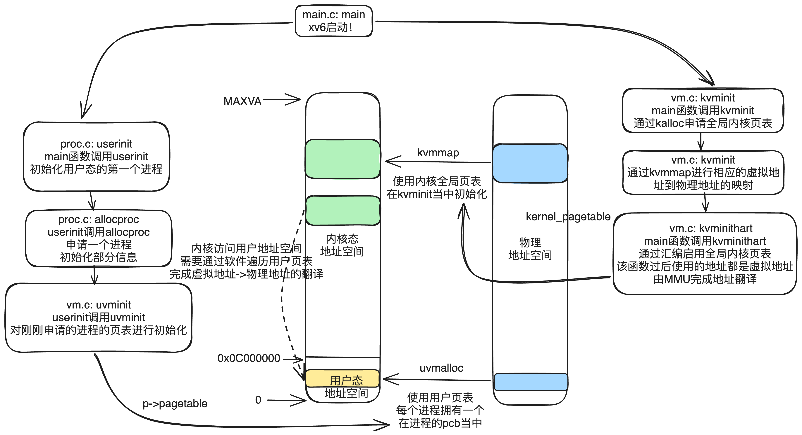
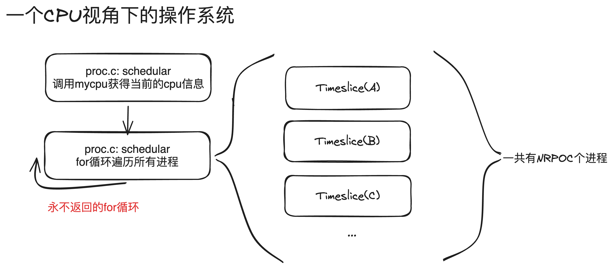
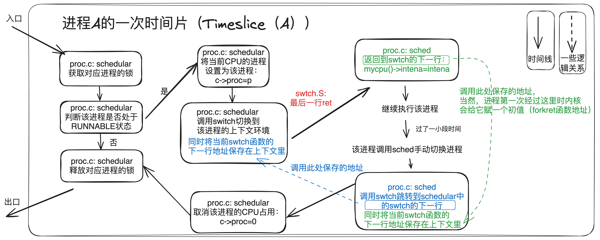
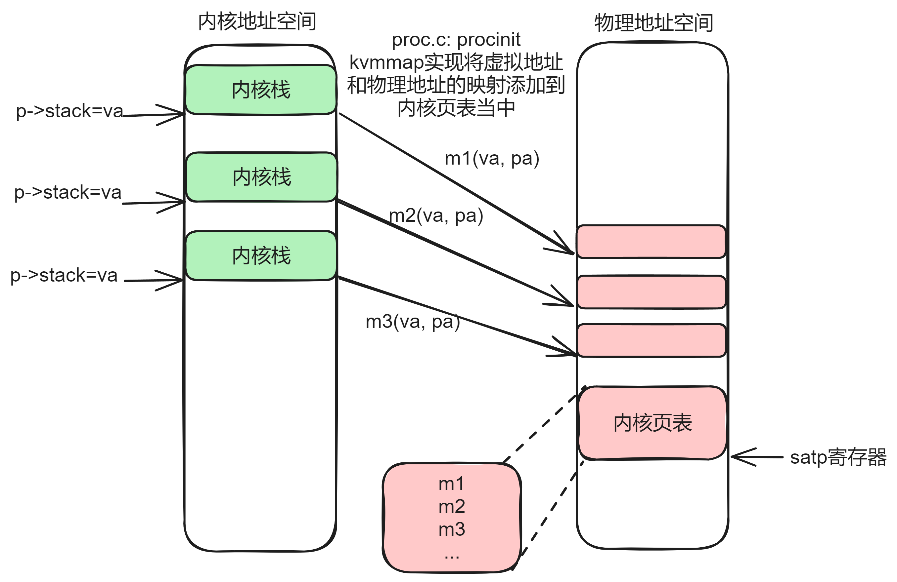
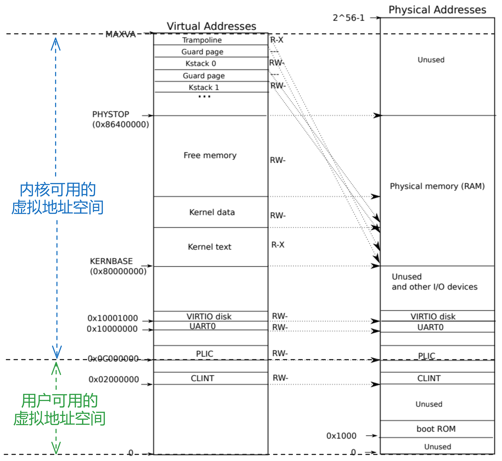

# 实验原理

## 1. 虚拟内存管理

&emsp;&emsp;虚拟内存管理已经在理论课上进行了学习，不熟悉的同学请及时回顾理论知识，本部分仅供回顾。

### 1.1 地址空间

&emsp;&emsp;每个进程有独立的虚拟地址空间，进程访问的虚拟地址并不是真正的物理地址，但进程可通过自身页表中虚拟地址与物理地址建立的映射获得真正的物理地址。xv6使用页表分隔不同进程的地址空间，并把它们多路复用到单一的物理内存。

### 1.2 数据结构

&emsp;&emsp;系统通过页机制来实现虚拟地址到物理地址的映射，用页表储存映射关系。

- **页：** 系统将虚拟内存分成4K大小的块。每块就是一页，作为内存管理的最小单位。每个页都会有一个编号，从小到大。

- **页框（块）：** 系统将物理内存也和虚拟内存一样分成4K大小的块，每块就是一个页框，与页一一对应。

- **地址结构：** 分页存储管理的逻辑地址结构如图前一部分为页号P，后一部分为页内偏移量W。32位机器图示如下（xv6是64位操作系统）。

<div align="center">  </div>

- **页表：** 为了便于在内存中找到进程的每个页面所对应的物理块，系统为每个进程建立一张页表，记录页在内存中对应的页框号，页表一般存放在内存中。在配置了页表后，进程执行时，通过查找该表，即可找到每页在内存中的物理块号。可见，页表的作用是实现从页号到页框号的地址映射。
      


### 1.3 使用方法

&emsp;&emsp;在RISC-V指令集中，当我们需要开启页表服务时，我们需要将我们预先配置好的页表首地址放入 `satp` 寄存器中。从此之后， **计算机硬件** 将把访存的地址 **均视为虚拟地址** ，都需要通过硬件查询页表，将其 **翻译成为物理地址** ，然后将其作为地址发送给内存进行访存。

## 2. 页表

!!! warning "提示"
    本部分，你应该要知道：

    - 什么是页表？
      
    - 页表的数据结构是什么？
      
    - 页表是怎么工作的？


### 2.1 页表是什么

&emsp;&emsp;页表就是存放虚实地址映射的表格，里面装满了虚实地址的映射。

&emsp;&emsp;页表的数据结构和翻译的模式图示大致如下：
    
<div align="center">  </div>
    
&emsp;&emsp;xv6采用的指令集标准为RISC-V标准，其中页表的标准为SV39标准，也就是虚拟地址最多为39位。下面，我们来介绍这套标准，之后你会知道为什么叫39。


### 2.2 页表的数据结构（重要）

#### 2.2.1 虚实地址

<div align="center">  </div>

&emsp;&emsp;蓝色部分：代表用户所持有的虚拟地址。比如我们在用户程序所持有的指针，64位的，就长这样。其中低39位可用（39的由来），其他的为拓展。这三十九位被划分成了四部分： `L2、L1、L0、Offset`。
    
- L2是 **根页表** 的索引（index），可以得到次页表的基地址。
- L1是 **次页表** 的索引，可以得到叶子页表的基地址。
- L0是 **页表项** 的索引，可以得到64位的页表项。
  

&emsp;&emsp;注：事实上，L2和L1对应于理论课中的页目录号，L0对应理论课中的页号。
    
&emsp;&emsp;红色部分：页表项中有物理页帧号PPN，加上虚拟地址本身含有的 `Offset` 组成了物理地址，64位剩下的位数为保留位。注意， **虚实地址的Offset（低十二位）完全相同** ，不用翻译。

#### 2.2.2 页表

<div align="center">  </div>

&emsp;&emsp;SV39页表标准下，构造了三级页表，我们将其分为称为：根页表、次页表、叶子页表。顺序和图中页表从左向右依次对应。
    
&emsp;&emsp;每个页表的大小都是4K，也就是一个页。页表有512个页目录项，每个目录项8 bytes，也就是64位。512个目录项需要9位的索引，因此 [2.2.1 虚实地址](#221) 蓝色虚拟地址中的 L2, L1, L0 索引都是9位的。
    
&emsp;&emsp;现在来看页目录项自身，可以大概分成两个部分：`页帧号（PPN）`和对应的`标志位（Flags）`（含有访问权限、访问记录等）。前者表示物理地址的页帧号，也就是 [2.2.1 虚实地址](#221)  红色物理地址的PPN。但是每一级页表的目录项的意义都不同，具体如下：
    

-  **根页表** 的目录项，包含对应 **次页表** （下一级页表）的基地址页帧号以及标志位。
-  **次页表** 的目录项，包含对应 **叶子页表** （下一级页表）的基地址页帧号以及标志位。
-  **叶子页表** 的目录项，包含对应 **虚拟地址** 的物理地址页帧号以及标志位。

#### 2.2.3 页表项

<div align="center">  </div>

&emsp;&emsp;刚刚，我们把目录项分成了两个部分：物理地址页帧号和标志位。具体的结构如上图。
    
- 保留位：第`54-63`位，共`10`位。
- `PPN`: 物理页帧号，第`10-53`位，共`44`位。
- `Flags`：标志位，第`0-9`位，共`10`位。其中第`8-9`位为保留位，暂不使用。
    - 第`0`位 `Valid`：该页表项有效。对于叶子页表来说，这个位置为1说明虚拟地址有映射到物理地址，否则说明没有该映射。对于次页表来说，为1说明有对应的叶子页表，对于根页表说明有对应次页表。
    - 第`1-3`位 `Readable/ Writable/ Executable`： 该页表项是可读/写/执行（作为代码运行）的。通常我们只需要关心叶子页表项的这三个位，因为这代表对应的物理页帧的标志，而不是页表的标志。对于根页表和次页表的目录项，这三个位往往置为`0`。
    - 第`4`位 `User`： 该页表项指向的物理页能在用户态访问。内核页表中的代码和数据我们不会将其给用户使用，所以会置`0`，但是用户页表的代码和数据应该要置`1`。同样，对于内核页表中的页表项，如果该位置`1`，则计算机的硬件不会允许内核访问对应地址，但可以通过其他的手段访问，后文会介绍。
    - 其他的位，感兴趣的可以通过英文名看出其意义，或者查阅[riscv-privileged-20211203.pdf](https://gitee.com/hitsz-cslab/os-labs/tree/master/references/riscv-privileged-20211203.pdf) 4.3~4.4小节。
    

&emsp;&emsp;注：理论课上我们将页表项和页目录项加以区分，但是在本实验中，他们是完全相同的结构！

&emsp;&emsp;在xv6当中，使用`PTE2PA`和`PA2PTE`来完成虚拟地址和物理地址之间的转换，同学们可以自行查看源码（实际上就是简单的位移操作）。
    


### 2.3 虚实地址翻译流程

&emsp;&emsp;现在我们来将其串联起来，看看对应的虚拟地址是怎样翻译成物理地址的：

1. 获得一个虚拟地址。根页表基地址已经被装填至寄存器 `satp` 中。
2. 通过 `satp` 找到根页表的物理页帧号，转成物理地址（`Offset`为0），通过虚拟地址的`L2`索引，找到对应的页表项。
3. 通过页表项可以找到找到 **次页表** 的物理页帧号，转成物理地址（`Offset`为0），通过虚拟地址的`L1`索引，找到对应的页表项。
4. 通过页表项可以找到找到 **叶子页表** 的物理页帧号，转成物理地址（`Offset`为0），通过虚拟地址的`L0`索引，找到对应的页表项。
5. 通过页表项可以找到找到 **物理地址** 的物理页帧号，通过虚拟地址的`Offset`，转成物理地址（`Offset`和虚拟地址`Offset`相同）。

## 3. xv6中的虚拟内存管理

!!! note   "提示"
    本部分，我们将简单的说明xv6中与之前两个部分相关的具体实现和部分原理。这部分将 **直接叙述与实验本身有关** 的原理，希望大家能够理解这个实验的目的和要求并形成自己的解决方案。

&emsp;&emsp;我们先来看一张图：  



&emsp;&emsp;xv6在初始化时会调用`kvminit`完成 **全局内核页表** 的初始化，使用`kvminithart`启用刚刚初始化的内核全局页表。然后xv6还会调用`userinit`，初始化第一个用户态进程`initproc`。在`userinit`当中，会调用`allocproc`完成进程的申请（实际上就是申请和填写进程的PCB），在然后会调用`uvminit`完成用户进程的页表（ **用户页表** ）的初始化。

&emsp;&emsp;xv6的两个页表（全局内核页表和用户页表）都是 **完成虚拟地址到物理地址的映射的记录** ，但是操作系统在内核态当中不能直接访问用户态的地址空间（为了安全），所以内核态不能直接翻译用户态的虚拟地址，需要遍历用户态的用户页表（在PCB当中），完成虚拟地址（va）到物理地址（pa）的转换。

&emsp;&emsp;接下来我们将详细介绍xv6的用户页表和内核页表。

### 3.1 用户内核双页表

&emsp;&emsp;xv6为每个进程维护一个用于描述进程的用户程序页表和一个描述内核地址空间的共享的内核全局页表，这样，用户程序运行和内核运行的时候，使用的是不同的页表。

#### 3.1.1 用户程序页表

&emsp;&emsp;每个进程都有一个单独的用户程序页表，当xv6在进程间切换时，也会改变页表。用户程序页表仅包含自身的代码和数据的虚实地址映射，内核代码和数据不包含在内。


<div align="center">  </div>

&emsp;&emsp;上图是xv6的用户程序虚拟地址空间分布。其代码实现在kernel/exec.c中，`exec`使用`proc_pagetable`分配了`TRAMPOLINE`和`TRAPFRAME`的页表映射，然后用`uvmalloc`来为每个ELF段分配内存及页表映射，并用`loadseg`把每个ELF段载入内存。

&emsp;&emsp;当进程申请更多内存的时候，xv6首先用`kalloc`分配一个物理页。然后调用`mappages`函数把这个物理页的PTE加到进程的页表里。xv6会设置该PTE对应的标志位(W,X,R,U,V)。


!!! info   "拓展阅读：用户程序虚拟地址空间分布"
    - **trampoline**：用户态-内核态跳板。
    - **trapframe**：用来存放每个进程的用户寄存器的内存空间。如果你想查看xv6在trapframe page中存放了什么，详见proc.h的trapframe结构体。
    - **heap**：堆。程序初始化时堆没有分配任何空间。用户程序可以通过sbrk系统调用调整堆分配的空间，这会把新内存映射到页表中，也可以从页表中移除映射，释放内存。
    - **stack**：用户栈。xv6的用户栈只分配了一个页（PAGESIZE），放置在比堆更低的位置。通常操作系统会把用户栈放置在比堆更高的位置，这也是xv6和常见的操作系统做法不一样的地方。
    - **guard page**：守护页，用来保护Stack。如果stack耗尽了，它会溢出到Guard page，但是因为Guard page的PTE中Valid标志位未设置，会导致立即触发page fault，这样的结果好过内存越界之后造成的数据混乱。
    - **data**：用户程序的数据段。
    - **text**：用户程序的代码段。

#### 3.1.2 内核页表

&emsp;&emsp;内核页表仅包含内核的代码和数据的虚实地址映射，用户程序的代码和数据不包含在内。
下图描述了如何将内核虚拟地址映射到物理地址，`kernel/memlayout.h`声明了xv6内核内存布局的常量。

<div align="center">  </div>

&emsp;&emsp;其代码实现在`kernel/vm.c`的`kvminit()`函数。在`kvminit()`函数内，完成了`UART0`、`VIRTIO0`、`CLINT`、`PLIC`、`kernel text`、`kernel data`和`TRAMPOLINE`的虚拟地址和物理地址的映射。

<!-- 
```c
/*
 * create a direct-map page table for the kernel.
 */
void
kvminit()
{
  kernel_pagetable = (pagetable_t) kalloc();
  memset(kernel_pagetable, 0, PGSIZE);

  // uart registers
  kvmmap(UART0, UART0, PGSIZE, PTE_R | PTE_W);

  // virtio mmio disk interface
  kvmmap(VIRTIO0, VIRTIO0, PGSIZE, PTE_R | PTE_W);

  // CLINT
  kvmmap(CLINT, CLINT, 0x10000, PTE_R | PTE_W);

  // PLIC
  kvmmap(PLIC, PLIC, 0x400000, PTE_R | PTE_W);

  // map kernel text executable and read-only.
  kvmmap(KERNBASE, KERNBASE, (uint64)etext-KERNBASE, PTE_R | PTE_X);

  // map kernel data and the physical RAM we'll make use of.
  kvmmap((uint64)etext, (uint64)etext, PHYSTOP-(uint64)etext, PTE_R | PTE_W);

  // map the trampoline for trap entry/exit to
  // the highest virtual address in the kernel.
  kvmmap(TRAMPOLINE, (uint64)trampoline, PGSIZE, PTE_R | PTE_X);
}
```
-->


&emsp;&emsp;这里内核页表使用的还是 **全局页表** ，并且 **映射采用恒等映射** ，也就是说虚拟地址在哪，物理地址就在那。

!!! info   "拓展阅读：内核虚拟地址空间-物理地址空间分布"
    又见到图Figure3.3了: ) 我们在[Lab3的实验原理](../../lab3/part2/#11)部分已经介绍过了。

    kernel/memlayout.h描述了内核内存的布局。

    xv6内核的大部分虚实地址映射是恒等映射，虚拟地址和物理地址是一模一样的。对于既要读写虚拟页又要通过PTE管理物理页的xv6内核来说，这样的直接映射降低了复杂性。

    从Figure3.3中，我们可以看到，有两处虚拟地址不是直接映射的： 

    - **`trampoline`页** ：它是用户态-内核态跳板，既被映射到内核虚拟空间的顶端，也被映射到用户空间的同样位置。
    - **内核栈** ：每个进程都有自己的内核栈，它被映射到高位，这样在它下面可以保留一个未映射的守护页guard page。

&emsp;&emsp;对此Figure3.3和Figure3.4，可以发现，用户虚拟地址空间与内核虚拟地址空间的范围一样，都是从0到`MAXVA`（`MAXVA`的定义见`kernel/riscv.h`，共计256G的内存（2<sup>38</sup>））。这样，内核页表因不包含用户页表的映射，用户地址在内核中无访问，同理用户无法访问内核的数据。

```c
// one beyond the highest possible virtual address.
// MAXVA is actually one bit less than the max allowed by
// Sv39, to avoid having to sign-extend virtual addresses
// that have the high bit set.
#define MAXVA (1L << (9 + 9 + 9 + 12 - 1))
```

### 3.2 用户内核双页表的切换

&emsp;&emsp;当用户程序需要进入内核的时候，需要切换相应的页表，转换为内核页表。内核切换到用户程序的时候，也同样需要切换为用户页表。
    
&emsp;&emsp;但是，xv6使用了共享的内核页表，**所有进程使用一个内核页表** ，这就意味着内核进行 **进程间调度** 的时候，不需要切换页表。在进程调度器`scheduler`函数当中，其流程体现出这一特点：  

&emsp;&emsp;如下图，在CPU的视角下，操作系统被看成一个不断从进程队列当中获取可运行进程并执行的状态机，我们这里将一个进程（如进程A）的时间片Timeslice(A)定义为：每次CPU从进程队列里取出一个进程并查看其能否运行，若能则运行它。





&emsp;&emsp;首先我们定义什么是执行流（控制流），执行流就是CPU从一段固定的代码段不断地取指执行的过程，比如一个进程的运行就是一个执行流。

&emsp;&emsp;因此，执行流需要让CPU能够访问其对应的代码段的内存空间，而我们知道，在开启了虚拟内存之后，每次访问某段内存空间都必须经过页表的翻译，因此，每个执行流必须有对应的页表。

&emsp;&emsp;我们梳理一下，假设目前xv6中运行着N个进程，那么总共有 **2N+1** 个执行流，其中2N个执行流对应着N个进程的用户态和内核态两个执行流，多出来的一个执行流对应上图中的`proc.c`中的`scheduler`函数对应的代码的执行过程（我们将其称为`scheduler执行流`），由于其并不需要返回用户态，因此只有一个内核态执行流。

&emsp;&emsp;可以看见：由于使用 **内核全局页表** ，所有进程的内核态以及`scheduler执行流`共享一个页表，因此总共有 **N+1** 个页表（N个用户态页表 + 一个内核全局页表），在进行进程间调度时，由于进程切换的点是发生在内核态的（`swtch.S`），因此进程切换前后使用的都是内核全局页表，不需要切换页表，即 **不需要对`satp`寄存器进行写入操作** ，只需要进行进程上下文的切换即可，一直到该进程返回用户态的时候才会切换成用户态页表（`trampoline.S:userret`）。

&emsp;&emsp;但是如果内核页表变成独立页表，那么此时一共有 **2N+1** 个页表（N个用户态页表+N个内核页表+一个内核全局页表），在进程调度，切换进程的时候，就需要 **在适当的时候切换内核页表** （我们会在[实验实现](../part3/#21)当中给出具体的图片介绍）。
    
&emsp;&emsp;上文已经提及，使用某个页表时，页表所在的物理地址应存放在`satp`寄存器中。页表未使用时，页表所在地址也需要一个位置保存， **对于用户进程而言，它被保存在`struct proc`中的`pagetable_t pagetable`；对于内核而言，xv6使用一个全局变量保存（`kernel/vm.c`的`kernel_pagetable`）。** 为进程引入内核页表后，也需要存储其所在的物理地址。

### 3.3 内核对用户空间的访问

#### 3.3.1 地址翻译与TLB页表

&emsp;&emsp;通常，在进行地址翻译的时候，计算机硬件（即内存管理单元MMU）都会自动查找对应的映射进行翻译。对于操作系统来说，只需要设置`satp`寄存器，将需要使用的页表的地址交给该寄存器。这样，当CPU发出内存访问请求时，MMU就知道应该使用哪个页表来进行地址翻译了。

!!! info   "拓展阅读：TLB页表缓存"
    回想一下上述page table的结构，当处理器从内存加载或存储数据时，需要做3次内存查找，第一次在最高级的根页表，第二次在中间级的次页表，最后一次在最低级的叶子页表。对于一个虚拟内存地址的寻址，需要读三次内存，代价确实有点高。因此，在实际的处理器中，基本会使用TLB页表缓存来缓存最近使用过的虚拟地址的翻译结果。

    TLB是由硬件实现的，操作系统不需要知道TLB是如何工作的。但是，如果切换了page table，TLB中的缓存将不再有用，操作系统需要告诉处理器当前正在切换page table，处理器会去清空TLB。在RISC-V中，清空TLB的指令是sfence_vma。这也就反映了内核中切换页表的整个完成操作（在`kvminithart`中可以看到）需要两步：  

      - 1） 设置`satp`寄存器  
      - 2） 调用`sfence_vma`刷新TLB

#### 3.3.2 内核对用户空间访问的挑战与解决方案 

&emsp;&emsp;在xv6内核中，当需要访问用户空间的虚拟地址时，由于内核页表中不包含这些地址的映射，硬件无法自动完成地址翻译。为了解决这个问题，内核需要先找到用户程序的页表，仿照硬件翻译的流程，一步一步的找到对应的物理地址，再对其进行访问。

!!! tip   "举个栗子：`copyout()`函数"
    &emsp;&emsp;如[3.1 用户内核双页表](#31)中所述，内核有自己的页表，用户程序也有自己的页表。在Lab1 `find`使用到的`fstat()`系统调用，用户程序指向`stat`结构体的指针存在于用户空间的页表中，内核需要将这个指针翻译成一个自己可以读写的物理地址，才能去访问`stat`结构体。如果你感兴趣，可以查看`copyout()`->`walkaddr()`->`walk()`函数是如何进行软件模拟翻译的。

    &emsp;&emsp;下面给出关于`walk()`函数的说明：

    &emsp;&emsp; `static pte_t *walk(pagetable_t pagetable, uint64 va, int alloc)`函数（`kernel/vm.c`）模拟了RISC-V分页硬件查找虚拟地址对应页表项（PTE）的过程（参考[虚实地址翻译流程](#23)）。该函数通过每次减少9位虚拟地址来逐级遍历三级页表结构。在遍历过程中，它利用每一级页表的9位虚拟地址索引来查找下一级页表或最后一级页表的页表项（PTE）。如果PTE无效，则表明所需的物理页表还没有被分配。如果alloc参数非零，则在需要分配新的页表页。最终，该函数返回指向与va对应的PTE指针。


&emsp;&emsp;当我们在内核页表中拥有了用户进程的映射后（任务三），内核就可以直接访问用户进程的虚拟地址。比如可以直接解引用用户地址空间中的指针，就能获取到对应地址的数据。很多系统调用或者内核的一些操作（如`copyout()`函数），都需要进行虚实地址翻译，因此我们在拥有了用户进程的地址映射后，原有麻烦的软件模拟翻译就可以被去除，很多操作都可以被简化，性能也可以得到提升。
    
&emsp;&emsp;**但需要注意的是** ，如果直接把用户页表的内容复制到内核页表，即其中页表项的User位置1，那么内核依旧无法直接访问对应的虚拟地址（硬件会拒绝地址翻译，但软件模拟翻译依旧可行）。可供参考的解决方案有两种：
    
- （1）把内核页表中页表项的User位均置为0；
- （2）借助RISC-V的`sstatus`寄存器，如果该寄存器的SUM位（第18位）置为1，那么内核也可以直接访问上述的虚拟地址。大多情况下，该位需要置0。（访问寄存器的函数定义于riscv.h）关于`sstatus`寄存器，可以查阅[riscv-privileged-20211203.pdf](https://gitee.com/hitsz-cslab/os-labs/tree/master/references/riscv-privileged-20211203.pdf) 4.1小节。

<div align="center">  </div>
    
### 3.4 内核栈

&emsp;&emsp;进程进入内核后，还需要一个专属的栈以维持运行，这个栈就被称为内核栈。因为不同进程在内核中运行的情况不一样，所以每个进程都应当拥有一个内核栈。每个进程的内核栈到实际物理空间的映射在原版xv6当中都是存储在`kvminit`初始化的全局内核页表当中。



&emsp;&emsp;如[3.1小节 内核页表](#31)所示，在kvminit()函数中，除了内核栈之外，其他部件都映射完成。内核栈的页表映射是在`kernel/proc.c`的 `procinit()`中实现：

```c linenums="1"
/*in kernel/proc.c procinit()*/
for(p = proc; p < &proc[NPROC]; p++) {
    ...
    char *pa = kalloc();  // 分配一个物理页，返回其首地址
    if(pa == 0)           
        panic("kalloc");
    uint64 va = KSTACK((int) (p - proc));  // 计算内核栈所在的虚拟地址
    kvmmap(va, (uint64)pa, PGSIZE, PTE_R | PTE_W);     // 在内核页表建立内核栈的映射
    p->kstack = va;       // 将内核栈的虚拟地址存储于进程控制块PCB中
}
```

&emsp;&emsp;`procinit()`在系统的启动阶段执行，因此其 **为每个进程（总共支持NPROC个进程）都分配了一个内核栈** 。在xv6的设计中，每个进程的内核栈的虚拟地址是固定的，因此可以直接计算。

&emsp;&emsp;之所以将进程的内核栈`procinit()`与`kvminit()`独立开来，是因为从设计上来讲，内核栈应该隶属于进程模块，与内核的虚拟地址管理模块应该分开，不应该耦合在一起，但确实是可以将`procinit()`放在`kvminit()`当中的，只是我们不支持这种耦合的设计，这会给后期维护带来负担。

!!! tip  进程的内核独立页表注意事项
    &emsp;&emsp;上面提到，原本xv6当中所有进程的内核栈的地址映射都是存储在全局内核页表当中，在任务二当中，同学们需要将全局内核页表改成每个进程独立一个内核页表，这时： **同学们不要忘记将每个进程内核栈的地址映射（va->pa）放在自己的独立内核页表当中！！！**

### 3.5 用户页表和内核页表合并的一个重要前提：地址不重合

&emsp;&emsp;其实，要想在独立内核页表中，同时包含内核页表和用户页表是有讲究的。其中一个重要的前提要求是：用户的虚拟地址和内核的虚拟地址不能重叠。

&emsp;&emsp;还好，用户程序从0开始，内核则从一个很高的虚拟地址（0xC000000）开始排布。但是他们还是有可能发生重叠。所以，你一定要限制用户程序虚拟地址与内核地址重叠。

&emsp;&emsp;内核地址0xC000000，为PLIC寄存器地址，你可以在 `kernel/memlayout.h + kernel/vm.c` 中 `kvminit()` 进行查阅。仔细阅读 `kvminit()` ，你会发现其对如下地址范围进行了映射：

```c  linenums="1"
  // CLINT
  kvmmap(CLINT, CLINT, 0x10000, PTE_R | PTE_W);

  // PLIC
  kvmmap(PLIC, PLIC, 0x400000, PTE_R | PTE_W);
```

&emsp;&emsp;那么为何说0xC000000是内核地址的开始？内核页表不是从0开始，而是在某些特定地址上有特定的映射（见上述Figure3.3）。在 `memlayout.h` 可看到CLINT的值为0x2000000L，这个值比0xC000000小，0xC000000是PLIC（Platform-Level Interrput Controller，中断控制器）的地址，实际上，CLINT（Core Local Interruptor）定义了本地中断控制器的地址，我们只会在内核初始化的时候用到这段地址。所以，为用户进程生成内核页表的时候，可以不必映射这段地址。用户页表是从虚拟地址0开始，用多少就建多少，但最高地址不能超过内核的起始地址，这样用户程序可用的虚拟地址空间就为`0x0 - 0xC000000`。

