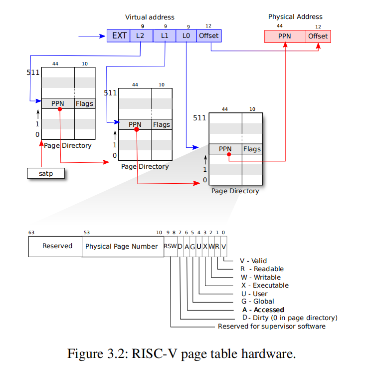
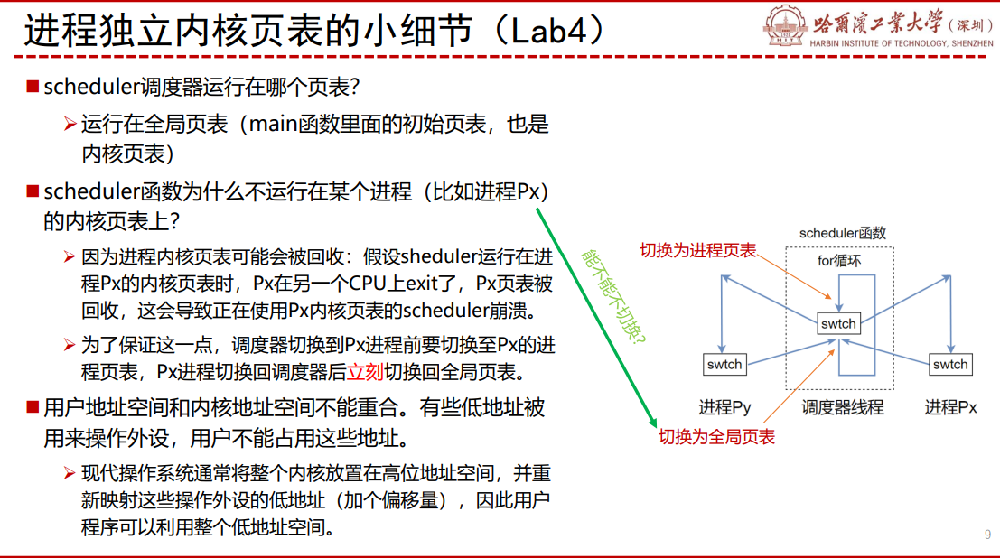
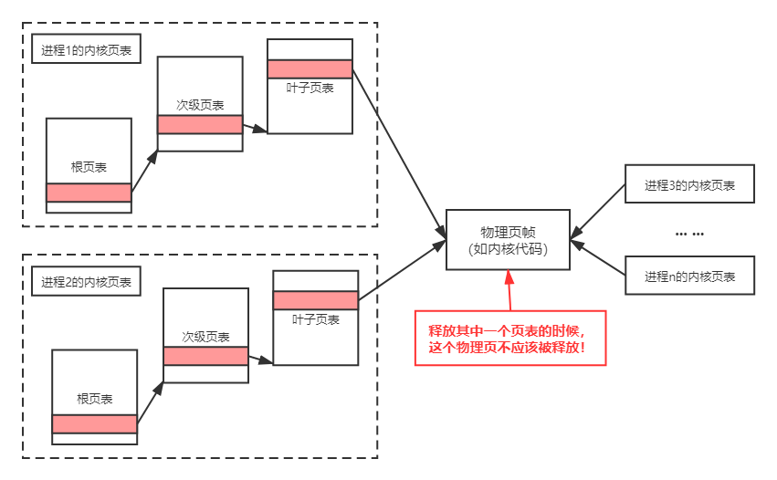
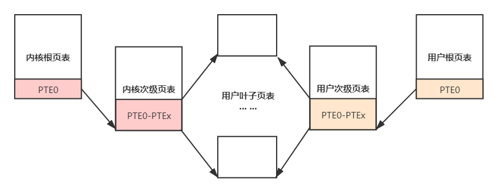

# 实验实现

这里，我们将对一些实现的细节做一定的提醒。但是完整的流程需要自己把握，我们 **不会给出每一步实现步骤** 。因此，最重要的还是阅读 “[实验原理](../part2/)” 内容，得出自己的解决方案，然后参考 ”实验实现“ 这部分的内容。

值得注意的是，xv6的代码是可以参考的，可以看看相关实验原理是怎么实现的。同时，还可以插桩，使用printf等方法看看具体的内容。同时，还可以阅读 xv6 指导书，看看背后的设计机理。

!!! note  "温馨提示"
    本次实验的后两个任务非常硬核，但真正凸显了操作系统的魅力。虽然最后一个任务的分值不多，我们依然建议你努力尝试，如果能坚持做完，就一定会对操作系统的内存管理有更高层次的认知。
    

本次实验 **你可能会用到很多kernel/vm.c中的函数** ，它们有比较完善的注释，请仔细阅读理解。

## 0. 任务零：回答问题

!!! tip   "回答问题"
    任务开始之前，我们应该先要首先回答一些原理性的问题，这部分应该被包含在实验报告中：

    1. 查阅资料，简要阐述页表机制为什么会被发明，它有什么好处？
    
    3. 按照步骤，阐述SV39标准下，给定一个64位虚拟地址为0x123456789ABCDEF的时候，是如何一步一步得到最终的物理地址的？（页表内容可以自行假设）
    
    3. 我们注意到，虚拟地址的L2, L1, L0 均为9位。这实际上是设计中的必然结果，它们只能是9位，不能是10位或者是8位，你能说出其中的理由吗？（提示：一个页目录的大小必须与页的大小等大）
    
    4. 在“实验原理”部分，我们知道SV39中的39是什么意思。但是其实还有一种标准，叫做SV48，采用了四级页表而非三级页表，你能模仿“实验原理”部分示意图，画出SV48页表的数据结构和翻译的模式图示吗？（SV39原图如下）
    
      

## 1. 任务一 ：打印页表

本任务中，你需要加入 **页表打印功能** ，来帮助你在之后的实验中进行debug。

`void vmprint(pagetable_t pgtbl)`

### 1.1 流程

**Step 1** ：更新本地代码，切换到pgtbl分支。
    
**Step 2** ：理解页表的原理。
    
**Step 3** ：实现 `vmprint()` ，并在 `exec()` 函数中插入语句 `if(p->pid==1) vmprint(p->pagetable)`， 这条语句插在 `exec.c` 中 `return argc` 代码之前，即在第一个进程启动时打印页表信息。

!!! info   "拓展阅读：xv6第一个进程"
    我们从xv6的启动来分析：

    - 上电后，先运行ROM的bootloader，bootloader再加载xv6内核到内存0x80000000处，然后从xv6内核的`_entry`开始。那为什么不加载到0x0地址呢？原因是0x0~0x80000000之间包含了I/O设备，详见《XV6 book》Figure3.3。
    - `_entry`用于设置C代码的运行指定栈，完成后就跳转到`start`函数执行C代码。
    - `start`函数处于机器模式下，初始化计时器中断，为切换到管理模式做好准备，然后到`main`函数开始执行。
    - `main`函数初始化一些设备和子系统，调用`userinit`来创建第一个进程。
    - 第一个进程执行了一个小程序`user/initcode.S`，通过系统调用`exec`执行一个新的程序`user/init`。
    - `user/init`创建了一个控制台设备文件，并作为文件描述符0，1，2来打开它。之后在for(;;)无限循环中启动shell，并处理僵尸进程。这样，系统就启动了。


**Step 4** ：启动测试程序进行测试。

### 1.2 实现

- 把 `vmprint()` 放在 `kernel/vm.c`。   
  
- 可以使用 `kernel/riscv.h` 中尾部的宏定义 ，比如：
  
```c
323  #define PGSIZE 4096 // bytes per page
324  #define PGSHIFT 12  // bits of offset within a page
    
329  #define PTE_V (1L << 0) // valid
330  #define PTE_R (1L << 1)
331  #define PTE_W (1L << 2)
332  #define PTE_X (1L << 3)
333  #define PTE_U (1L << 4) // 1 -> user can access
334
335  // shift a physical address to the right place for a PTE.
336  #define PA2PTE(pa) ((((uint64)pa) >> 12) << 10)
337
338  #define PTE2PA(pte) (((pte) >> 10) << 12)
```

- `kernel/vm.c`中的函数 `freewalk()` 能帮助你理解遍历页表的过程。  

```c
// Recursively free page-table pages.
// All leaf mappings must already have been removed.
275 void
276 freewalk(pagetable_t pagetable)
277 {
278  // there are 2^9 = 512 PTEs in a page table.
  // 遍历一个页表页的PTE表项 
279  for(int i = 0; i < 512; i++){
280    pte_t pte = pagetable[i]; //获取第i条PTE 

    /*判断PTE的Flag位，如果还有下一级页表(即当前是根页表或次页表)，
    则递归调用freewalk释放页表项，并将对应的PTE清零*/
281    if((pte & PTE_V) && (pte & (PTE_R|PTE_W|PTE_X)) == 0){ 
282      // this PTE points to a lower-level page table.
283      uint64 child = PTE2PA(pte); // 将PTE转为为物理地址
284      freewalk((pagetable_t)child); // 递归调用freewalk
285      pagetable[i] = 0; // 清零
286    } else if(pte & PTE_V){ 
    /*如果叶子页表的虚拟地址还有映射到物理地址，报错panic。
    因为调用freewalk之前应该会先uvmunmap释放物理内存*/    
287      panic("freewalk: leaf"); 
288    }
289  }
290  kfree((void*)pagetable); // 释放pagetable指向的物理页
291 }
```

- 在 `kernel/defs.h` 中定义 `vmprint()` 的接口，这样你才能在 `exec()` 中使用它。  
  
- 使用 `printf()` 打印页表数据中的指针时，你可以直接使用 `%p` 标示。  

## 2  任务二 独立内核页表

我们需要 **将共享内核页表改成独立内核页表** ，使得每个进程拥有自己独立的内核页表。


### 2.1 流程

**Step 1** ：修改`kernel/proc.h`中的 `struct proc`， 增加两个新成员：`pagetable_t k_pagetable;`和`uint64 kstack_pa;`，分别用于给每个进程中设置一个内核独立页表和内核栈的物理地址。
    
**Step 2** ：仿照`kvminit()` 函数重新写一个创建内核页表的函数。

- **为进程分配内核页表的一种解决方案** ：不要修改全局的内核页表（kernel/vm.c中的`pagetable_t kernel_pagetable`），而是直接创建一个新的内核页表，并将其地址`k_pagetable`返回。实现的时候不要映射CLINT，否则会在任务三发生地址重合问题。应该要在Step 4 `allocproc()` 中调用它。

**Step 3** ：修改procinit函数。procinit()是在系统引导时（见`kernel/main.c`的main函数），用于给进程分配内核栈的物理页并在页表建立映射。

- **参考优化方法** ：把procinit()中内核栈的物理地址pa拷贝到PCB新增的成员`kstack_pa`中，同时还需要保留内核栈在全局页表kernel_pagetable的映射，然后在Step 4 `allocproc()`中再把它映射到进程的内核页表里。关于内核栈说明，见[实验原理 3.4](../part2/#34).

!!! note   "为什么要保留初始内核页表？"
    保留原有的kvminit()以及kernel/vm.c中kernel_pagetable，因为有些时候CPU可能并未执行用户进程。

**Step 4** ：修改allocproc函数。allocproc()会在系统启动时被第一个进程和fork调用。在allocproc函数里调用Step 2 创建的函数设置内核页表，并且调用kvmmap函数将Step 3 设置的内核栈映射到页表`k_pagetable`里。

!!! tip   "allocproc函数功能说明"
    在进程表中查找空闲PCB，如果找到，初始化在内核中运行所需的状态，并保持p->lock返回。如果没有空闲PCB，或者内存分配失败，则返回0。

!!! note   "关于内核栈映射"
    注意，要保证在每一个进程的内核页表中映射该进程的内核栈。xv6本会在 procinit() 中分配内核栈的物理页并在页表建立映射。但是现在，应该在allocproc()中实现该功能，因为执行procinit()的时候进程的内核页表还未被创建。你可以在procinit()中只保留内存的分配，但在allocproc()中完成映射。

**Step 5** ：修改调度器（scheduler），使得切换进程的时候切换内核页表。

- **参考方法** ：在进程切换的同时也要切换页表将其放入寄存器`satp`中，请借鉴 kvminithart()的页表载入方式），在调用 w_satp() 之后调用 sfence_vma()，具体原理可查阅实验原理的[3.3 内核对用户空间的访问](../part2/#33)。

- **无进程运行的适配** ：当目前没有进程运行的时候，scheduler() 应该要satp载入全局的内核页表kernel_pagetable (kernel/vm.c)。

- 关于scheduler调度器，可以参考[HITSZ操作系统课程组讲解XV6（三）内存管理](https://www.bilibili.com/video/BV1Te4y1i77z?share_source=copy_web&vd_source=225a99017e082147ac525beeddd6e3e2)





**Step 6** ：当进程结束的时候，你需要修改freeproc()函数来释放对应的内核页表。你需要找到 **释放页表但不释放叶子页表指向的物理页帧** 的方法。你可参考kernel/vm.c中的freewalk，其用于释放整个页表，但要求叶子页表的页项已经被清空。

- 虽然我们为每个进程引入了内核页表，但是内核的代码和数据都还是唯一的。这意味着，在各个内核页表的叶子页表中，页表项指向了共享的物理页，如下图所示：
  


    
- 因此，在我们释放某个进程的内核页表的时候，不应该把这个共享物理页帧释放，否则会产生非常严重的后果！ 

    

**Step 7** ：通过`usertests`和`kvmtest`测试。
    
### 2.2 实现

这里有必要提醒一下同学，要以最简单的方法以及工程量最小的方法实现，最好不要因为优化等问题，大改内核机制。

- 好好利用 `vmprint()` 来帮助debug。
- 页表的bug通常会导致映射缺失的traps，访存失败，指令运行错误等报错。如果 **内核** 缺失了地址映射造成了页缺失（page fault），通常会打印个 `sepc=0x00000000XXXXXXXX` ，这代表的是出错时pc的值，你可以查`kernel/kernel.asm` 看看 **对应地址** 的代码的含义。   
- 你的实现可以修改原有的函数或者是新增函数，最好放在 `kernel/vm.c +kernel/proc.c` 中，但是 **千万不要修改** `kernel/vmcopyin.c +kernel/stats.c + user/usertests.c + user/stats.c`。


## 3  任务三 简化软件模拟地址翻译

!!! note   "具体要求"
    我们需要 **在独立内核页表加上用户页表的映射，同时替换 `copyin()/copyinstr()` 为 `copyin_new()/copyinstr_new()`** ，使得内核能够不必花费大量时间，用软件模拟的方法一步一步遍历页表，而是直接利用硬件。

### 3.1 流程

**Step 1** ：写一个`XXX`函数把进程的用户页表映射到内核页表中，同时在defs.h中声明。

- **推荐一种较为优雅的实现方法** ：内核页表直接共享用户页表的叶子页表，即内核页表中次页表的部分目录项直接指向用户页表的叶子页表。这样可以不必将用户页表的页表项全部复制进内核页表，也不必修改页表项标志位，简化实现的同时也可以提升性能，但在页表回收的时候需要避免重复回收。

- 提示：前面已经提到用户地址空间的范围为0x0-0xC000000，见“[实验原理 3.5](../part2/#35)”。试计算，多少个次级页表项就能涵盖整个用户地址空间？



**Step 2** ：用函数 `copyin_new()` （在 `kernel/vmcopyin.c`中定义）代替 `copyin()` （在 `kernel/vm.c`中定义）。确保程序 **能运行** 之后再用 `copyinstr_new()` 以代替 `copyinstr()`。

**Step 3** ：在独立内核页表加上用户页表的映射，以保证刚刚替换地新函数能够使用。注意独立内核页表的用户页表的映射的标志位的选择。标志位User一旦被设置，内核就不能访问该虚拟地址了。

- **推荐方案** ：在调用copyin_new()/ copyinstr_new()之前修改sstatus寄存器的SUM位：`w_sstatus(r_sstatus() | SSTATUS_SUM);` 在凋用copyin_new()/ copyinstr_new()之后去掉sstatus寄存器的SUM位：`w_sstatus(r_sstatus() & ~SSTATUS_SUM);`


**Step 4** ：在独立内核页表加上用户页表的映射的时候，每一次用户页表被修改了映射的同时，都要修改对应独立内核页表的相应部分保持同步。这通常在 fork(), exec(), sbrk()中发生，其中sbrk()调用growproc()来实现内存分配或回收。也就是，需要在fork()、exec()和growproc()这三个函数里将改变后的进程页表同步到内核页表中。

**Step 5** ：注意：第一个进程也需要将用户页表映射到内核页表中，见kernel/proc.c: userinit()。

**Step 6** ：通过 usertests, make grade。
    

### 3.2 实现
  
- 注意独立内核页表的用户页表的映射的 **标志位** 的选择。（标志位User一旦被设置，内核就不能访问该虚拟地址了）
  
- 再次提醒地址重合问题，见“[实验原理 3.5](../part2/#35)”.