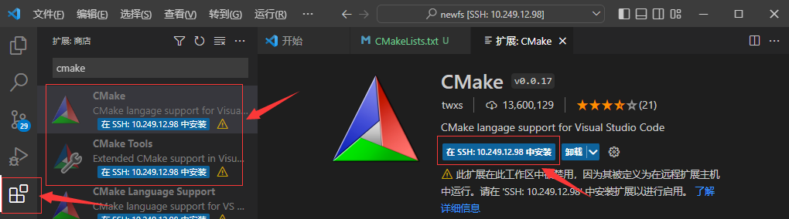
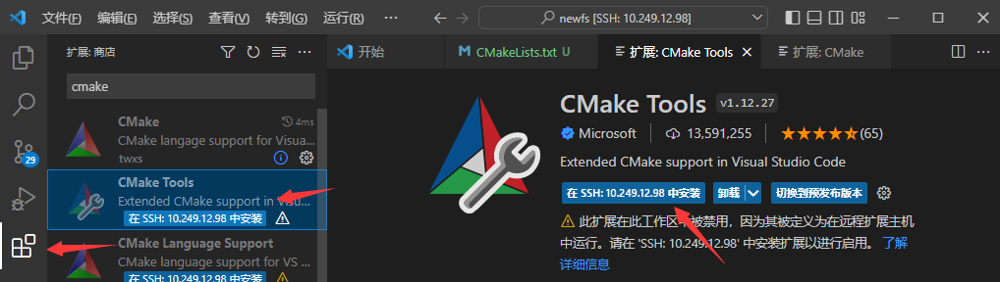
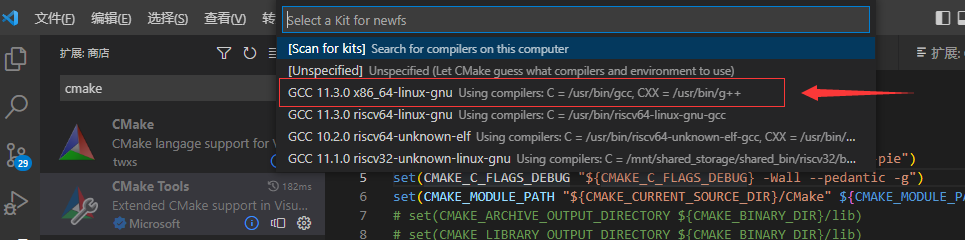
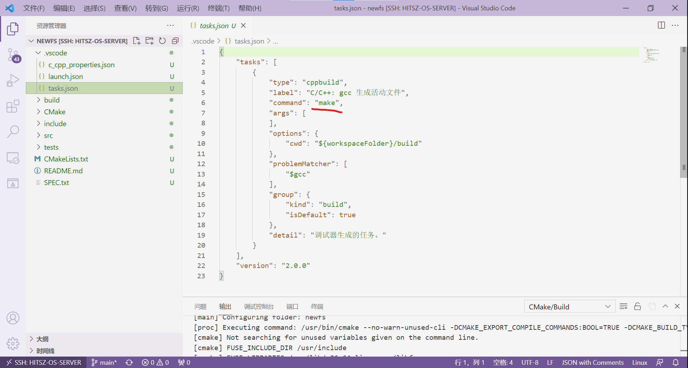
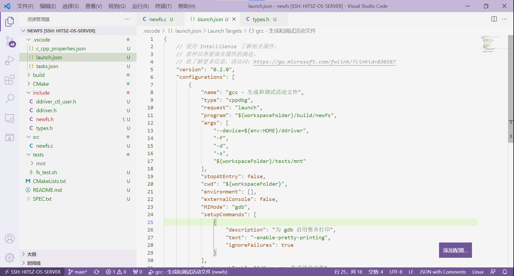

# 环境搭建与上手

## 1. 实验包结构介绍

本次实验充分考虑到 **上手成本** ，因此我们编写了简单的环境配置脚本，帮助大家一键配置开发环境。实验包代码获取途径：

```console
# git clone https://gitee.com/ftutorials/user-land-filesystem.git
```

实验包的结构如下：

```
user-land-filesystem/
├── driver
│   ├── ddriver.sh
│   ├── kernel_ddriver
│   └── user_ddriver
├── fs
│   ├── samples
│   ├── simplefs
│   └── template
├── LICENSE
├── README.md
├── setenv.sh
└── tests
    ├── README.md
    └── test_ddriver
```

- `driver`

存放驱动代码。其中`kernel_ddriver`为内核驱动，`user_ddriver`为用户驱动，`ddriver.sh`为控制 **ddriver** 驱动的脚本。进入user-land-filesystem目录，可以运行如下命令尝鲜：

```console
[root@localhost user-land-filesystem]# ./driver/ddriver.sh 
```

- `fs`

存放 **实现的FUSE文件系统** 。其中`samples`为`myfs`文件系统，`simplefs`为类`EXT2`文件系统（缺少数据位图），`template`用于生成文件系统的代码结构，可忽略。

- `LICENSE`

开源许可，本实验遵循 **GPL v3** 开源许可。

- `tests`

该文件夹存放DDRIVER用户驱动代码。

- `setenv.sh`

用于配置FUSE文件系统开发环境。

## 2. 配置开发环境

运行`./setenv.sh`后，即可按照指导一步一步来建立环境：

```console
teststu_8@OSLabExecNode0:~/user-land-filesystem$ ./setenv.sh 
请输入工作目录名称 ([工作]目录将被至于./fs目录下): newfs
...
生成工作路径:  /home/guests/teststu_8/user-land-filesystem/fs/newfs
请输入项目名称: newfs
...
```

其中，工作目录名称即开发该文件系统的 **文件夹名称** 。可以看到，它在`fs`目录下新建了一个`newfs`目录作为工作目录。

接着，项目名称即真正的文件系统名称，可以是文件系统的简写，例如：nfs（代表newfs），这里要注意项目名不能有 **特殊符号、空格** 等。

项目建立完成之后的结构`newfs`如下所示：

```
./fs/newfs/
├── .vscode
├── CMake
│   └── FindFUSE.cmake
├── CMakeLists.txt
├── include
│    ├── ddriver_ctl_user.h
│    ├── ddriver.h
│    ├── fs.layout
│    ├── newfs.h
│    └── types.h
├── README.md
├── SPEC.txt
├── src
│   └── newfs.c
└── tests
    ├── checkbm
    │   ├── checkbm.py
    │   ├── golden-sfs.json
    │   └── golden.json
    ├── mnt
    ├── stages
    │   ├── cp.sh
    │   ├── ls.sh
    │   ├── mkdir.sh
    │   ├── mount.sh
    │   ├── remount.sh
    │   ├── rw.sh
    │   └── touch.sh 
    ├── fs_test.sh
    ├── main.sh
    └── test.sh
```

这个结构可以自行修改添加，不过要记得 **重新配置CMake** 。本次实验要求很简单， **跑过`tests`下的`test.sh`的基础功能测试就算完成** 。

## 3. DDRIVER脚本的运用

为了方便对 **ddriver** 设备进行控制，我们将ddriver.sh脚本链接到了 **Linux命令系统** 中，接下来，大家先到`个人目录`下运行source \~/.bashrc，然后同学们就可以在任何目录下访问到ddriver.sh脚本。该脚本的主要用途如下： 

```console
teststu_8@OSLabExecNode0:~/$ source ~/.bashrc 
teststu_8@OSLabExecNode0:~/$ ddriver 

====================================================================
]]]]]]]]    ]]]]]]]]             
]      ]]   ]      ]]   ]   ]]   ]]   ]]    ]]    ]-------]   ]   ]]   
]       ]   ]       ]   ] ]]     ]]    ]]  ]]     ]_______/   ] ]]     
]      ]]   ]      ]]   ]]       ]]     ]  ]      \           ]]      
]]]]]]]]    ]]]]]]]]    ]]       ]]      ]]        ]]]]]]]]   ]]  
====================================================================

用法: ddriver [options]
options: 
-i [k|u]      安装ddriver: [k] - kernel / [u] - user
-t            测试ddriver[请忽略]
-d            导出ddriver至当前工作目录[PWD]
-r            擦除ddriver
-l            显示ddriver的Log
-v            显示ddriver的类型[内核模块 / 用户静态链接库]
-h            打印本帮助菜单
====================================================================
```

常用的功能是`-v`、`-d`与`-r`，它们的用途分别是 **查看ddriver设备类型及设备位置** 、 **将ddriver设备镜像导出到当前目录下** 、 **将ddriver设备擦除干净** 。用法如下：

```console
====================================================================
# 查看设备位置和类型
teststu_8@OSLabExecNode0:~$ ddriver -v
静态链接库设备: /home/guests/teststu_8/ddriver
teststu_8@OSLabExecNode0:~$ 

====================================================================
# 将ddriver设备导出到当前目录下
teststu_8@OSLabExecNode0:~/$ ddriver -d
[sudo] password for teststu_8: 
目标设备 /home/guests/teststu_8/ddriver
8192+0 records in
8192+0 records out
4194304 bytes (4.2 MB, 4.0 MiB) copied, 0.094218 s, 44.5 MB/s
文件已导出至/home/guests/teststu_8/ddriver_dump，请安装HexEditor插件查看其内容
teststu_8@OSLabExecNode0:~/$ ls
ddriver_dump 
teststu_8@OSLabExecNode0:~/$

====================================================================
# 将ddriver设备擦除干净
teststu_8@OSLabExecNode0:~/$ ddriver -r
目标设备 /home/guests/teststu_8/ddriver
8192+0 records in
8192+0 records out
4194304 bytes (4.2 MB, 4.0 MiB) copied, 0.0506111 s, 82.9 MB/s
teststu_8@OSLabExecNode0:~/$ cat ./ddriver_dump
teststu_8@OSLabExecNode0:~/$
```

## 4. 项目编译

项目编译的过程在新建项目的SPEC.txt文件中有所交代，这里提出来讲一讲：

-   **Step 1** . SSH打开`./fs/newfs`。打开VSCode软件，点击左上角 "文件" → "打开文件夹"，选择实验包目录下的fs/newfs文件夹。


-   **Step 2** . 在远程实验平台上安装CMake、CMake Tools、C/C++三个插件。






-   **Step 3** . 打开CMakeLists.txt文件
-   **Step 4** . ctrl + shift + p呼出命令菜单
-   **Step 5** . 输入CMake: Configure
-   **Step 6** . 选择X86_64版本的GCC：



-   **Step 7** . 点击VSCode左下角“管理”按钮，选择“设置”，然后在弹出的窗口中输入`@ext:ms-vscode.cmake-tools generator`，再点击“远程[SSH:10.249.12.98]”选项栏，在Cmake: Generator选项框中填入`Unix Makefiles`。


-   **Step 8** . 再次用ctrl + shift + p呼出命令菜单，输入CMake: Configure，查看输出窗口是否有“Generator” (已用!!!!!标记)


若 **CMAKE_GENERATOR** 为 **Unix Makefiles** ，请手动修改`.vscode/tasks.json`的`command`为`make`，若为 **Ninja** ，请手动修改`.vscode/tasks.json`的`command`为`ninja`，如下图所示：



-   **Step 9** . 到`newfs/src/newfs.c`目录，打断点

-   **Step 10** . 按下F5进行调试


编译运行原理：

-   **编译。** 编译环节利用CMakeLists工程自动帮助我们编译，这里要安装CMake Tools等拓展，相信大家前面也装过了。其中，按下F5后，VSCode会首先运行`.vscode`目录下`tasks.json`中的命令：


该命令执行的操作就是在CMakeLists生成的`build`目录下运行`make`，由此完成自动编译。

-   **运行。** 运行过程是在`.vscode`目录下`launch.json`中定义：



把运行命令展开实际上是：

```console
teststu_8@OSLabExecNode0:~/user-land-filesystem/fs/newfs$ ./build/newfs --device=/home/guests/teststu_8/ddriver -f -d -s ./tests/mnt/
```

正如我们前面 **实验原理 - FUSE架构** 中说到的那样， **FUSE文件系统** 的挂载不需要使用`mount`命令，而是直接用编译出来的二进制文件。上述命令的意义为： **将设备/home/guests/teststu_8/ddriver** 以 **newfs文件系统** 形式， **挂载** 到 **./tests/mnt目录** 下。

进而衍生出 **FUSE文件系统** 的 **卸载** ，同样，与传统内核文件系统卸载不同，它的卸载命令为：

```console
teststu_8@OSLabExecNode0:~/user-land-filesystem/fs/newfs$ fusermount -u ./tests/mnt
teststu_8@OSLabExecNode0:~/user-land-filesystem/fs/newfs$ 
```

这里使用`fusermount -u`命令进行FUSE文件系统的卸载。

