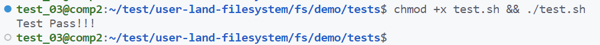
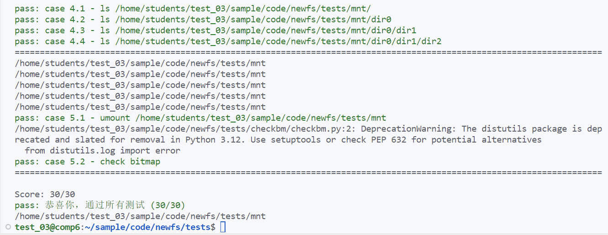

# 实验概述

!!! warning "温（守）馨（住）提（红）示（线）"
    
    本课程实验已引入代码自动查重系统，请同学们保持[学术诚信](https://integrity.mit.edu/)！

!!! note   "课程复习和预习要求"
    本节实验与理论课的 **“文件与文件系统”** 和 **“I/O与存储”** 这两章课程内容相关，请同学们复习这两章课程内容。
    

!!! tip "关于第三次实验课考核"
    我们将在第六次实验课进行第三次实验现场验收：  

    - **验收内容** ：Lab4 页表，Lab5 基于FUSE的青春版EXT2文件系统。  
      
    - **验收目的** ：考察同学们是否是自己完成的实验代码，而不是“复制拷贝”。
      
    - **验收形式** ：助教与同学们进行一对一问答（📢  **注：Lab5验收时需要现场改代码** ）。
        - duck不必担心，只是修改几行代码：）
        - 如果实验代码是你自己写的，那这将是你的现场秀！

  

    请同学们认真对待！

## 1.  实验目的

- 了解磁盘和磁盘管理的基本概念，理解为什么需要文件系统
- 掌握文件系统的核心设计思想及其实现原理，熟悉文件系统内部数据结构的组织方式和基本处理流程
- 掌握EXT2文件系统的布局，并完整设计和实现一个青春版的EXT2文件系统
      

## 2.  实验学时

本实验为8学时。

## 3.  实验内容

### 3.1 必做部分

#### 3.1.1 **简单的文件系统demo** 

任务一要实现一个实现一个简单的文件系统小demo，仅仅支持`ls`操作，并且`ls`时只会显示某个预设的文件名`<filename>`。实现细节请参考[实验实现-任务一](../part3#21)。通过任务一，能够帮助同学们快速上手整个项目的编译和运行、本次实验文件系统的大致架构等，起到对任务二的过渡作用。

#### 3.1.2  **实现青春版EXT2文件系统**

任务二参考EXT2文件系统布局，要求磁盘布局具有超级块、索引节点位图、数据位图、索引节点区、数据块区等主要结构，向下和磁盘进行IO交互，并向上实现文件系统各个接口，完整实现一个青春版EXT2文件系统。实现细节请参考[实验实现-任务二](../part3#31)。

本次实验的文件系统要求完成如下几个功能：

- 挂载文件系统；
- 卸载文件系统；
- 创建文件/文件夹；
- 查看文件夹下的文件；

上述功能对应的命令为：

- 运行程序
- `fusermount`
- `touch/mkdir`
- `ls`

以上未提及的功能（如复制、删除、读写文件等） 是选做实现 ，见下。

### 3.2 选做部分

为防止内卷，实现本部分不会带来额外加分（但或许会有其他意想不到的惊喜）。选做部分，同学们可以在任务二的青春版文件系统上实现更完善的文件系统基本操作：

- 间接索引和二级间接索引
- 删除操作（`rm`命令，需要支持`rm -r`）
- 文件移动（`mv`命令）
- 读写文件（支持vim、vscode直接修改文件）
- 软硬连接（`ln`命令）

## 4.  测试

### 4.1 任务一测评

任务一提供测评程序，同学们完成任务一后，运行测评程序进行本节任务的测评，详细参考[实验实现-任务一测试](../part3#23)。

任务一测评通过如下图所示：

### 4.2 任务二测评

任务二提供测评程序，同学们完成任务二后，运行测评程序进行本节任务的测评，详细参考[实验实现-任务二测试](../part3#33)。

任务二测评通过如下图所示：

