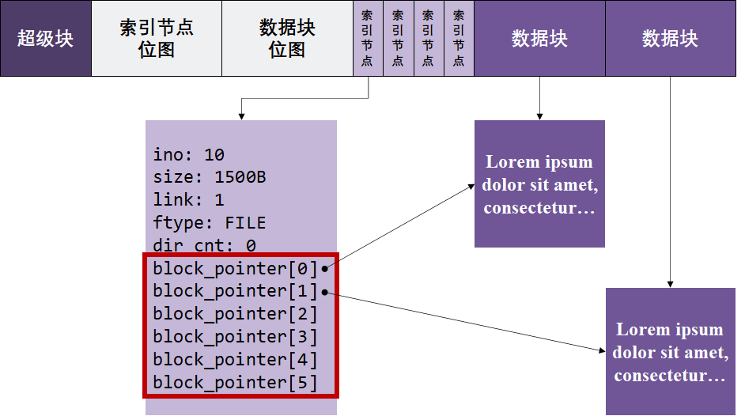
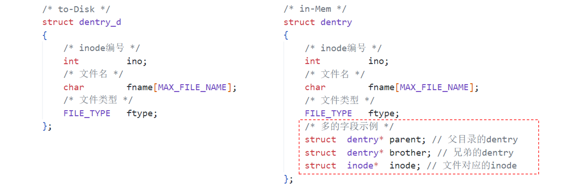
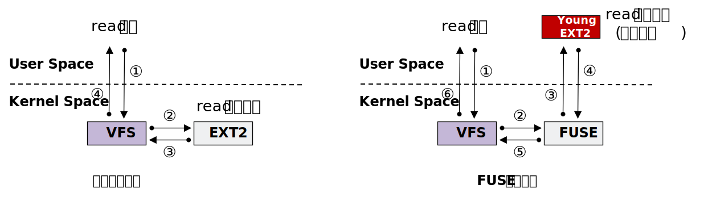
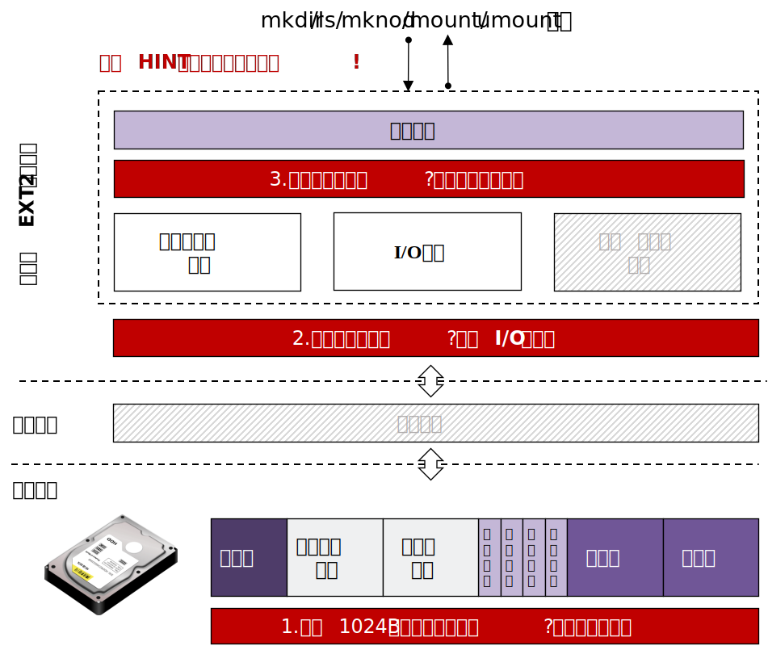

# 实验原理

## 1.  EXT2文件系统

### 1.1  文件系统及其挂载


为什么需要文件系统？

假设我们有一个磁盘设备disk，并想将文件file1和file2存储在磁盘中。

一种很朴素的思想就是把file1和file2的数据依次放在磁盘中，直接大功告成。它把全部磁盘disk都用来存数据，都是数据区。这种办法简单直接，但是它无法很好的适应增删等需求，难以管理和维护空闲区域。很显然，仅仅有数据区是不够的。


为了更好管理磁盘，我们需要对磁盘引入一套管理程序，这就是文件系统。

- **硬件层面**：此时的磁盘，除了放数据内容以外，还要应该要有对应的区域来存放管理内容。文件系统思想则将 **整个磁盘进行布局设计** ，将磁盘划分为管理区和数据区。
- **软件层面**：管理程序向下通过磁盘驱动提供的接口完成和 **磁盘的读写交互** ，向上为上层应用封装 **实现增、删、查、改等接口**（如getattr等） ，同时会在必要时在内存中维护相关管理内容和数据内容的缓存或其他数据结构来满足管理程序的需求。

最终上层应用执行一些文件请求时，例如：执行`ls ./mnt`命令时，会调用到文件系统已经封装好的getattr和readdir来完成对应的文件请求功能。

通过文件系统，我们可以方便的维护和管理磁盘空间，提高从设备查找文件的效率。

目前在各种操作系统中存在着各种各样的文件系统，在Windows平台主流有：FAT、FAT16、FAT32、NTFS等；在Unix平台主流的有：EXT2、EXT3、EXT4等。不同的文件系统在管理磁盘设备时都有各自的一套策略和方法，对应着不同的磁盘布局，不同的接口实现。

!!! note "总结"
    文件系统实现重要的3个步骤：

    1. 设计好磁盘的布局分布（layout）。
    2. 向下，调用驱动提供接口和磁盘进行交互。
    3. 向上，维护相关数据结构，实现为上层封装的各种接口。
    同学们可以按照这个大体思路完成自己的文件系统的设计工作。

了解了文件系统的总体概念后，我们来讲讲文件系统的挂载。


在Linux操作系统上，在主机插入某种存储设备时（如移动硬盘），通常只会在`/dev`目录下多一个设备表示，如上图所示。但是，通常我们无法直接访问这个存储设备（如移动硬盘）中的数据内容。

这是因为没有给存储设备 **指定文件系统** ，我们无法知道这些数据在存储设备是内部 **怎么进行组织的** ，也没有 **一个入口** 去访问文件系统内部的文件及其层次结构。

文件系统的挂载，就是显示声明用 **哪种类型的文件系统** 管理这个存储设备，并且为访问这个存储设备指定一个路径作为访问入口，这个路径就叫做 **挂载点** ，也就是管理这个存储设备的文件系统看起来的 **根目录** 。通过访问这个路径（挂载点），我们就能够访问到存储设备中的全部文件。

例如，假设我们将上述的存储设备指定一个类型文件系统（EXT2），并挂载到`/mnt`目录（挂载点）下。那么如果我们执行`ls /mnt`时，就可以直接访问存储设备中的全部文件。

```
[root@localhost dev]# ls /mnt/
'演示1.pptx'  '演示2.docx'  'pynq_z2_v2.6.0.zip'  'Deadpool.txt'
```


### 1.2  EXT2文件系统

 **EXT2** 是GNU/Linux系统中标准的文件系统，其特点是 **存取文件的性能较好** ，对于中小型的文件更显示其优势。本实验以 **EXT2** 为模板，实现一个青春版文件系统。

#### 1.2.1  磁盘布局

EXT2文件系统将盘块分成两大类：保存元数据的 **元数据盘块**（前面提到的管理区），以及存放文件内容数据的 **数据盘块** （前面提到的数据区）。本实验中，为了降低实验难度，简化后的EXT2文件系统的基本布局如下所示：


系统主要包含以下五个部分：

- **超级块** ：包含整个文件系统和磁盘布局的总体信息。
- **索引节点位图** ：记录着 **索引节点** 表的使用情况， **用1个比特** 记录某一个索引节点是否被使用。
- **数据块位图** ：记录着 **数据块** 的使用情况， **用1个比特** 记录某一个数据块是否被占用。
- **索引节点** （inode） ：记录着文件的元数据，每个文件都与一个inode对应。但一个inode可能对应多个文件（硬链接），我们实验不做考虑。
- **数据块** ：记录文件内容，数据块通常会被inode通过直接索引或者间接索引的方式找到。间接索引我们实验不做考虑。

#### 1.2.2  超级块

超级块是存放 **文件系统全局信息** 的数据结构。它通常需要维护一些信息：

- **幻数**。 通常，超级块会存在一个幻数，magic number。通过对比从磁盘读取到的幻数，用来识别磁盘上有文件系统吗，是哪种文件系统，以及文件系统是否损坏等。
- **逻辑块信息**。文件系统用来管理的逻辑块大小是多大，一共能划分多少逻辑块。
- **磁盘布局分区信息** 。文件系统如何对磁盘分区，哪里开始是超级块，哪里开始是索引节点位图等等，都需要被记录，这些信息就被记录在超级块中。
- **支持的限制**。比较简易的文件系统可能还会添加，最大支持inode数，文件最大大小等字段。
- **根目录索引**。最上层的第一个目录就是根目录，是所有目录解析的入口，根目录维护在超级块结构中供全局访问。根目录的索引节点编号可以自行设定，在本次实验的参考`simplefs`中根目录的索引节点编号是0，但在实际的`ext2`文件系统中，根目录索引节点编号是1（第一个inode编号保留）。
- **其他信息**。例如，根据实际需求可能还有添加时间戳、挂载次数等字段。

这样一来，一个超级块的结构示意可能为：

```c
struct super_block_d 
{
    /* 幻数 */
    uint32_t	magic_number; 	// 幻数
    
    /* 逻辑块信息 */
    int	blks_size; 			// 逻辑块大小
    int	blks_nums;			// 逻辑块数
    
    /* 磁盘布局分区信息 */
    int	sb_offset;			// 超级块于磁盘中的偏移，通常默认为0
    int sb_blks;			// 超级块于磁盘中的块数，通常默认为1
    
    int	ino_map_offset;		// 索引节点位图于磁盘中的偏移
    int ino_map_blks;		// 索引节点位图于磁盘中的块数
    
    ... // 数据块位图同理
        
    ... // 索引节点区同理
        
    ... // 数据块区同理
        
    /* 支持的限制 */
    int ino_max;			// 最大支持inode数
    int	file_max;			// 支持文件最大大小
    
    /* 根目录索引 */
    int	root_ino;			// 根目录对应的inode
    
    /* 其他信息 */
    ...
}
```

!!! note "注意"
    超级块字段设计是相对灵活的，上面列出一些参考的字段，在文件系统接口实现上感觉需要用到的全局字段可以合理的加进来。

#### 1.2.3  文件的表示

通过[1.1 文件系统](./#11)的介绍，不能仅仅将文件的数据存在磁盘就万事大吉了，还需要一些管理信息。文件的管理信息就是文件的 **元数据** ，也就是 **索引节点（inode）** 中的数据。

在EXT2文件系统中，任何一个文件都是由 **索引节点（inode）** 和 **数据（data）** 构成。索引节点（inode）的数据存放在索引节点区，数据（data）存放在数据块区，并通过索引节点（inode）来索引数据块。

文件夹（目录）也属于文件范畴，即，目录是一种特殊的文件。如果没有特殊说明，本小节的“文件”包括普通文件（FILE）和目录文件（DIR）。

**（1）索引节点（inode）通常存放：**

- **inode编号**。是第几个inode，用于标识一个inode。
- **文件的属性**。文件大小，链接数（本实验不考虑链接，默认为1），文件类型等。
- **数据块的索引**。每个索引找到的就是存放文件内容的数据块。（本实验只考虑直接索引）
- **其他字段**。例如，如果是目录类型的文件，还维护多少个目录项的字段，遍历目录用到。

通常的一个inode的结构可能为：

```c
struct inode_d
{
    /* inode编号 */
    int                ino;                // 在inode位图中的下标
    
    /* 文件的属性 */
    int                size;               // 文件已占用空间
    int                link;               // 链接数，默认为1
    FILE_TYPE          ftype;              // 文件类型（目录类型、普通文件类型）
    
    /* 数据块的索引 */
    int                block_pointer[6];   // 数据块指针（可固定分配）
    
    /* 其他字段 */
    int                dir_cnt;            // 如果是目录类型文件，下面有几个目录项
};  
```

通过索引节点（inode）索引到数据块后，就可以存放和读取文件的数据。

其中的`FILE_TYPE`可能包括如下值：

```c
typedef enum file_type {
    FILE,           // 普通文件
    DIR             // 目录文件
} FILE_TYPE;
```

**（2）数据（data）通常存放：**

- **普通文件（file）的话**，直接存放文件的内容即可。例如，file.txt的内容为aaa，那么file.txt的数据块直接填aaa即可。
- **目录文件（dir）的话**，存放所有的子目录项（dentry）。（什么是目录项dentry？参见下一小节[1.2.4目录项的表示](./#124)介绍）。例如，目录dir下有子目录dir0和子文件file.txt，那么目录dir的数据块填的是子目录dir0的dentry结构和子文件file.txt的dentry结构。

!!! note "笔记"
    目录也是一种特殊的文件，其数据块内容是所有子目录项结构。

一个典型并简化的EXT2的文件结构如下图所示。该图展示了一个文件的元数据和数据在磁盘上的布局情况，并展示了如何如何通过索引节点通过`block_pointer`索引数据块。



#### 1.2.4 目录项的表示

上面讲述的索引节点（inode）和数据（data）表示，只是给出了一个文件 **自身** 的组织形式。但是，目录文件（dir）及其子文件之间的关系如何表示呢？例如，dir0是dir的子目录，file又是dir0的子文件。仅仅靠上一小节的索引节点（inode）结构无法表示 **文件的层级关系** 。UNIX/Linux设计者很精明地将这种层级结构通过 **文件/文件名解耦** 的方式实现。

具体而言，我们为 **目录文件** 维护一种特殊的数据：目录项（dentry）。目录项指向了文件对应的索引节点（inode），并保存了该文件的文件名。通过目录项，我们就可以很直观地构建起整个文件树。如下图所示：


那么，目录项该维护怎样的数据结构呢？一个目录项要尽可能精简，只需要包含文件最基本的信息，通常会包括：

- **inode编号**。用来找到对应文件的索引节点（inode），进而找到其数据。
- **文件名称**。文件的名字，一个文件的最基本的标识。
- **文件类型**。目录文件，普通文件，还是其他类型。

通常的一个dentry的结构可能为：

```c
struct dentry_d
{
    /* inode编号 */
    int		ino;
    
    /* 文件名称 */
    char	file_name[MAX_FILE_NAME]; 
    
    /* 文件类型 */
    FILE_TYPE		ftype;                
};  
```

!!! note "为什么不把文件名放在inode中？"
    在UNIX/Linux系统中存在一种特殊的文件结构，硬链接（Hard Link）。这种结构允许一个文件对应多个文件名。因此，文件名与文件本身是解耦的，文件名可以有多个，但是文件本身只有一个。在实现过程中，通过dentry的方式，就可以很好的支持硬链接。

#### 1.2.5 in-Mem与to-Disk结构

当文件系统挂载后，为了避免频繁与磁盘交互，会将关键字段保存在内存中。当文件系统卸载后，这些信息会 **刷回** 磁盘中。下一次挂载重新挂载文件系统的时候，会 **读取** 之前刷回磁盘的内容，**重新构建** 文件系统的有关数据结构，例如：super_block（超级块）、inode（索引节点）、dentry（目录项）、inode位图等。简单的图示如下：


可以看到，文件系统的有关数据结构既会在文件系统挂载运行时 **动态** 维护于 **内存** 中，也会在文件系统卸载不运行时 **静态** 存储在 **磁盘** 中，供下一次读取。这就带来了位于内存（in-Mem）和刷回磁盘（to-Disk）的两种类型数据结构。那么问题就来了，这两种结构会完全一致吗。

细心的同学可以注意到前面给出的结构体示例代码，我们都加了`_d`的后缀，比如超级块，我们用的`struct super_block_d`。这就表示刷回磁盘（to-Disk）类型结构。

我们先以`dentry`这个结构，简单看看to-Disk的结构和in-Mem的结构的差异：




多出来的这些字段，不是刷回磁盘所必须的，但是可能是文件系统运行时所需要的，或者方便文件系统进行实现所额外添加的字段。

通常来说，to-Disk的结构，是指要在磁盘中静态存储的结构，也就是要写回磁盘的结构，包含一些 **静态的**、**最基本的**、**必须要写回磁盘** 的字段。而in-Mem的结构，是动态维护着，更加灵活的结构，只要是 **方便文件系统进行管理** 的所需要的 **字段**，都可以动态的在文件系统运行时添加到in-Mem的结构中进行维护。to-Disk结构的字段通常可以理解是in-Mem字段的子集。

对于超级块（super_block）、索引节点（inode）、目录项（dentry）这些数据结构，均是如此。

## 2.  虚拟磁盘的使用

本次实验在用户态下模拟了一个 **容量为4MB的磁盘** ，并实现了对这个虚拟磁盘进行操作的 **DDRIVER驱动** 。 **虚拟磁盘** 是通过一个普通的数据文件来充当，这个数据文件的路径位于 `~/ddriver` 。我们封装了一层DDRIVER驱动，其原理是单次读取、写入这个数据文件时会按照固定的大小 `512B` 进行读取和写入，也就是 **IO大小为512B** ，从而来模拟达到磁盘操作。

|     参数     | 具体数值 |
| :----------: | :------: |
| 虚拟磁盘容量 |   4MB    |
| 驱动的IO大小 |   512B   |

### 2.1 驱动接口查阅

DDRIVER驱动封装实现了open，close，seek，read，write，ioctl的方法，同学们在文件系统实现中直接调用这些驱动接口来和 **磁盘进行读写交互** 即可，无需关注其具体实现原理。

| DDRIVER驱动API                                          | 接口介绍                                                     |
| ------------------------------------------------------- | ------------------------------------------------------------ |
| int ddriver_open(char *path)                            | 根据路径path打开虚拟磁盘，返回文件描述符fd。path只能固定传入`~/ddriver`的绝对路径。 |
| int ddriver_close(int fd)                               | 关闭打开的虚拟磁盘。                                         |
| int ddriver_seek(int fd, off_t offset, int whence)      | 根据基准whence和偏移offset移动虚拟磁盘的磁盘头。whence基准通常固定为SEEK_SET，也就是0；填写偏移offset即可。 |
| int ddriver_read(int fd, char *buf, size_t size)        | 按照IO大小来从虚拟磁盘读取数据。size只能固定传入IO大小。     |
| int ddriver_write(int fd, char *buf, size_t size)       | 按照IO大小来往虚拟磁盘写入数据。size只能固定传入IO大小。     |
| int ddriver_ioctl(int fd, unsigned long cmd, void *ret) | 根据传入命令cmd获取虚拟磁盘信息。cmd为IOC_REQ_DEVICE_SIZE，void *ret处返回虚拟磁盘总大小。cmd为IOC_REQ_DEVICE_IO_SZ，void *ret参数处返回虚拟磁盘的IO大小。 |

!!! note "补充"
    这部分的相关代码位于`user-land-filesystem/driver/user_ddriver/ddriver.c`，有兴趣的同学可以简单阅读。实验没有涉及 `user-land-filesystem/driver/kernel_ddriver` 部分。最终模拟驱动编译为了静态链接库，是为了无法直接通过Debug调试进入到上述接口实现的代码中， 出自模拟真实驱动所做的考虑，了解即可。

### 2.2 磁盘管理工具

我们编写了一个简单的shell脚本来帮助大家来管理充当虚拟磁盘的数据文件。在安装好实验环境后，同学们在命令行输入 `ddriver` 就可以看到帮助信息。

本次实验，同学们只需要关注以下两条命令即可（可以在任意目录下运行）。

- `ddriver -r`。将虚拟磁盘清空，也就是将用来模拟磁盘的数据文件置空，重新再来。
- `ddriver -d`。将模拟磁盘的数据文件导出到当前目录下，命名为disk_dump，方便同学们直接查看。

关于查看虚拟磁盘的内容，同学们需要在VSCode上安装Hex Editor插件，然后右键点击ddriver_dump，选择打开方式，选择Hex Editor，就可以查看自己虚拟磁盘的内容了，调试可能会用到。


我们为有需要的同学录制了一个Hex Editor查看虚拟磁盘的演示视频：https://www.bilibili.com/video/BV1CN411g7KG

!!! note "补充"
    这部分的相关代码位于`user-land-filesystem/driver/user_ddriver/ddriver.sh`下，有兴趣的同学可以自行进行阅读。

## 3.  FUSE的使用



一般的文件系统的实现位于内核，用户态的文件请求（如read请求）到达内核文件系统，就会调用对应的接口（如read接口实现）实现完成本次文件请求，并将结果返回。传统的、基于Linux的文件系统开发都是以内核模块的方式进行，这使得开发调试变得异常繁琐。

由于内核文件系统开发的困难，FUSE（Filesystem in User SpacE）架构由此登上了台面。FUSE包括内核部分和用户态部分，FUSE内核部分没有负责实现对应的接口，它会额外到注册到 **FUSE的用户态部分** （如图中Young EXT2）寻找对应的接口实现完成本次文件请求，最后将结果沿路返回。我们则是 **在图中红色的部分完成各种接口的实现** 供FUSE内核调用。它将 **文件系统的实现从内核态搬到了用户态** ，也就是我们可以 **在用户态实现一个文件系统** 。

VFS，全称Virtual File System，Linux虚拟文件系统，是所有内核文件系统的统一接口。

!!! note "提示"
    同学们简单了解一下上述FUSE原理即可，重点通过下面的简单示例看懂（实验有关的部分）：

    1. FUSE怎么注册文件系统接口
    2. FUSE怎么进行挂载和卸载文件系统

本次实验我们便是基于FUSE架构， 在用户态实现我们的青春版EXT2文件系统。

### 3.1  FUSE的简单示例

这里我们给一个极简的Demo。该Demo非常简单，它并不是一个真正意义的文件系统， 也不会访问设备 ，而是在 **该文件系统** 的根目录中 **显示一个固定的文件** ，也就是 `Hello-FUSE`文件。建议同学们跟着一起过一遍。

```c
/* main.c源码 */
 
#define FUSE_USE_VERSION 26
#include <stdio.h>
#include <fuse.h>
 
/* 这里实现了一个遍历目录的功能，当用户在目录执行ls时，会回调到该函数，我们这里只是返回一个固定的文件Hello-FUSE。 */
static int test_readdir(const char* path, void* buf, fuse_fill_dir_t filler, off_t offset, struct fuse_file_info* fi)
{
 
    return filler(buf, "Hello-FUSE", NULL, 0);
}
 
/* 显示文件属性 */
static int test_getattr(const char* path, struct stat *stbuf)
{
    if(strcmp(path, "/") == 0)
        stbuf->st_mode = 0755 | S_IFDIR;            // 说明该文件是目录文件
    else
        stbuf->st_mode = 0644 | S_IFREG;            // 说明该文件是普通文件
    return 0;
}
 
/*这里是回调函数集合，这里实现的很简单*/
static struct fuse_operations ops = {
  .readdir = test_readdir,
  .getattr = test_getattr,
};
 
int main(int argc, char *argv[])
{
    int ret = 0;
    ret = fuse_main(argc, argv, &ops, NULL);
    return ret;
}
```

接下来，编译运行 `main.c`文件

```bash
gcc -o hello main.c -D_FILE_OFFSET_BITS=64 -lfuse
```

假设在 `/tmp`目录下面有一个 `fuse`目录，如果没有可以手动创建一个。然后执行如下命令可以在该目录挂载新的文件系统。

```bash
[root@localhost test]# ./hello /tmp/fuse
```

注意 ， FUSE文件系统的挂载与传统文件系统的挂载略有不同，它不用mount选项 ，直接运行二进制文件就可完成挂载。上面命令的意思是将文件系统 `hello`挂载到 `/tmp/fuse`。

此时运行 `ls`命令看看效果：

```bash
[root@localhost test]# ls /tmp/fuse
Hello-FUSE
```

可以看出正式我们期望的内容，也就是只有一个名为 `Hello-FUSE`的文件。

使用结束后，将这个文件系统`hello`卸载，运行如下命令完成卸载：

```bash
[root@localhost test]# fusermount -u /tmp/fuse
```

### 3.2 FUSE文件系统的挂载与卸载

#### 3.2.1 挂载

FUSE文件系统的挂载 **无需使用mount系统调用** ，**直接运行生成的二进制程序** 即可完成挂载操作。

通常情况下，fuse文件系统只需要运行二进制程序的时候，指定挂载设备，以及可选挂载选项（非必须）即可。

```shell
./<你实现的fuse文件系统名称> <可选选项> <指定挂载点> 
```

如上述FUSE简单示例中的挂载命令：

```shell
./hello /tmp/fuse
```

在任务一，VSCode配置的挂载命令（F5）展开就是：

```shell
./build/demo -f -d -s ./tests/mnt/
```

在任务二实现的fuse文件系统样板中，额外添加了指定挂载设备选项：

```shell
./<你实现的fuse文件系统名称> --device=<指定挂载设备> <可选选项> <指定挂载点> 
```

在任务二中，在[环境搭建](../part3/#14)的运行部分，VSCode配置的挂载命令（F5）展开就是：

```shell
./build/newfs --device=/home/students/<学号>/ddriver -f -d -s ./tests/mnt/
```

也就是指定虚拟磁盘为 `/home/students/<学号>/ddriver`（这是远程平台的路径，本地请换成`~/ddriver`对应的绝对路径），指定挂载点为`./test/mnt/`，挂载我们实现的newfs文件系统。其中 `-f` 选项表示强制执行操作，`-d` 选项表示输出调试信息，`-s` 选项表示输出摘要信息。

#### 3.2.2 卸载

FUSE文件系统的卸载只需要在另一个命令行 输入如下命令，就可以完成FUSE文件系统的卸载：

```shell
fusermount -u <FUSE文件系统挂载点>
```

如上述FUSE简单示例中，对应的卸载命令就是：

```shell
fusermount -u ./tests/mnt/
```

## 4. 实验总体结构

根据前三部分的实验原理介绍，实验需要根据EXT2文件系统的磁盘布局对模拟磁盘 **进行磁盘布局设计** ，也就是文件系统来决定每个逻辑块存什么内容。文件系统还通过调用模拟驱动提供的接口来 **和模拟磁盘进行读写交互** ，一次读写512B。最后文件系统还需要维护相关数据结构和函数，最终 **实现文件系统的各种接口** 供上层文件请求调用。



