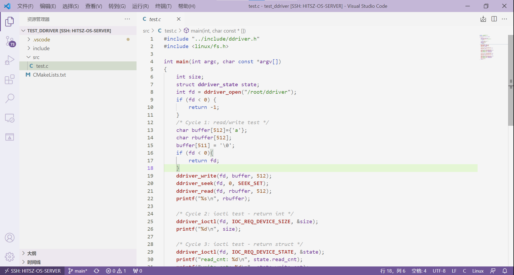

#  任务一：**熟悉DDRIVER驱动** 

任务一要求熟悉DDRIVER驱动，我们要求大家根据注释看懂`user-land-filesystem/tests/test_ddriver/src/test.c`的代码，并 **根据提示** 修改其中的 **一处错误** ：



编译运行测试程序的步骤：

```console
teststu_8@OSLabExecNode0:~/user-land-filesystem/tests/test_ddriver$ mkdir -p build 
teststu_8@OSLabExecNode0:~/user-land-filesystem/tests/test_ddriver$ cd build
teststu_8@OSLabExecNode0:~/user-land-filesystem/tests/test_ddriver/build$ cmake ..
teststu_8@OSLabExecNode0:~/user-land-filesystem/tests/test_ddriver/build$ make
teststu_8@OSLabExecNode0:~/user-land-filesystem/tests/test_ddriver/build$ ./ddriver_test 
```

