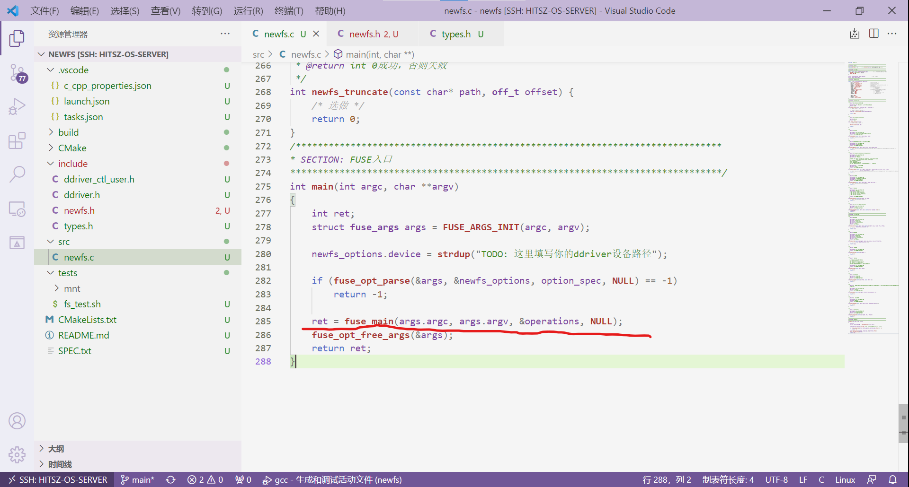

#  任务二：基于FUSE实现青春版EXT2文件系统
熟悉了驱动后，我们也就基本掌握了访问 **DDRIVER** 设备的方法。接下来我们就可以基于FUSE来正式编写 **青春版EXT2文件系统** 了。我们已经在 **环境配置** 阶段就为大家搭建好了FUSE文件系统项目框架。

本次实验可以参考两个完全搭建好的FUSE文件系统：`simplefs`（`fs/simplefs`文件夹下）和`myfs`（`fs/samples`文件夹下），其中`simplefs`是一个类EXT2的文件系统，但 **没有给予数据位图** 的实现；`myfs`是`github`上的一个开源项目，也是一个FUSE文件系统实例。

注意，在本实验中，simplefs和sfs都代表Simple File System。

## 1. 实现步骤建议

-   封装对 **ddriver** 的访问代码，方便设备读写。注意驱动读写IO为512B，但是EXT2文件系统一个块大小为1024B，也就是两个IO单位。在simplefs文件系统中也封装了 **ddriver** 的访问代码，然而simplefs是按一个块大小为512B来封装的（详见sfs_utils.c的sfs_driver_read函数）。

-   设计介质数据结构（位于`types.h`）；

-   设计内存数据结构（可设计、可不设计）；

-   仔细阅读`include/fs.layout`文件，并按要求设计填写自己的文件系统布局，在测试umount时会对文件系统布局进行检测；

-   完成`.init`钩子：读 **超级块** 、初始化文件系统；

-   完成`.destroy`钩子： **回写必要结构** ，保证下一次挂载正常；

-   验证挂载卸载流程的正确性（ **主要看读写是否正确** ）；

-   完成工具函数（可自行设计）：

    -   完成 **分配inode** 函数：创建一个Inode、初始化其上的字段、修改位图结构，可能还需要修改超级块；

    -   完成 **分配dentry** 函数：创建一个dentry、初始化其上的字段；

    -   完成将 **dentry加入到inode** 中的函数：将生成的dentry写入到inode中；

    -   完成 **路径解析函数** ，要么返回dentry，要么返回inode，可自行设计；

-   根据工具函数，完成`.get_attr`钩子；

-   根据工具函数，完成`.mknod`钩子；

-   根据工具函数，完成`.mkdir`钩子；

-   根据工具函数，完成`.readdir`钩子；

-   手工测试`touch`、`ls`、 `mkdir`、`fusermount -u`等命令的正确性；

-   通过`./tests/test.sh`脚本的基本功能测试。


## 2. simplefs文件系统参考实现

!!! note   "提示"
    为降低同学们的上手成本，本节对Simple File System代码进行夹叙夹议地深入分析，希望能对各位同学有所帮助: )

样例文件系统（SFS）的系统布局如下：


要接入一个框架，那么少不了钩子函数（也可称为 **函数指针** ）。钩子函数 **是一系列函数的抽象** ，从而让C语言具有多态的性质。对于FUSE框架，其给我们的接口 **如下** 。

```c
struct fuse_operations {
    int (*getattr) (const char *, struct stat *);
    int (*readlink) (const char *, char *, size_t);
    int (*getdir) (const char *, fuse_dirh_t, fuse_dirfil_t);
    int (*mknod) (const char *, mode_t, dev_t);
    int (*mkdir) (const char *, mode_t);
    int (*unlink) (const char *);
    int (*rmdir) (const char *);
    int (*symlink) (const char *, const char *);
    int (*rename) (const char *, const char *);
    int (*link) (const char *, const char *);
    int (*chmod) (const char *, mode_t);
    int (*chown) (const char *, uid_t, gid_t);
    int (*truncate) (const char *, off_t);
    int (*utime) (const char *, struct utimbuf *);
    int (*open) (const char *, struct fuse_file_info *);
    int (*read) (const char *, char *, size_t, off_t,
            struct fuse_file_info *);
    int (*write) (const char *, const char *, size_t, off_t,
            struct fuse_file_info *);
    int (*statfs) (const char *, struct statvfs *);
    int (*flush) (const char *, struct fuse_file_info *);
    int (*release) (const char *, struct fuse_file_info *);
    int (*fsync) (const char *, int, struct fuse_file_info *);
    int (*setxattr) (const char *, const char *, const char *, size_t, int);
    int (*getxattr) (const char *, const char *, char *, size_t);
    int (*listxattr) (const char *, char *, size_t);
    int (*removexattr) (const char *, const char *);
    int (*opendir) (const char *, struct fuse_file_info *);
    int (*readdir) (const char *, void *, fuse_fill_dir_t, off_t,
            struct fuse_file_info *);
    int (*releasedir) (const char *, struct fuse_file_info *);
    int (*fsyncdir) (const char *, int, struct fuse_file_info *);
    void *(*init) (struct fuse_conn_info *conn);
    void (*destroy) (void *);
    int (*access) (const char *, int);
    int (*create) (const char *, mode_t, struct fuse_file_info *);
    int (*ftruncate) (const char *, off_t, struct fuse_file_info *);
    int (*fgetattr) (const char *, struct stat *, struct fuse_file_info *);
    int (*lock) (const char *, struct fuse_file_info *, int cmd,
            struct flock *);
    int (*utimens) (const char *, const struct timespec tv[2]);
    int (*bmap) (const char *, size_t blocksize, uint64_t *idx);
    int (*ioctl) (const char *, int cmd, void *arg,
            struct fuse_file_info *, unsigned int flags, void *data);
    int (*poll) (const char *, struct fuse_file_info *,
            struct fuse_pollhandle *ph, unsigned *reventsp);
    int (*write_buf) (const char *, struct fuse_bufvec *buf, off_t off,
            struct fuse_file_info *);
    int (*read_buf) (const char *, struct fuse_bufvec **bufp,
            size_t size, off_t off, struct fuse_file_info *);
    int (*flock) (const char *, struct fuse_file_info *, int op);
    int (*fallocate) (const char *, int, off_t, off_t,
            struct fuse_file_info *);
};
```

以下面一行代码为例：

```c
int (*mkdir) (const char *, mode_t);
```

这个钩子函数 **抽象了所有** `mkdir`的操作：所有`mkdir`都需要接受一个参数作为 **路径** 、另一个参数作为 **创建模式** （只读/只写/可读可写）。不同的文件系统可以基于此实现不同的`mkdir`代码，举个例子：

```c
// 文件系统一实现mkdir
int mkdir(const char *path, mode_t mode) {
    printf("我不给你创建 %s\n", path);
    return 0;
}

// 文件系统二实现mkdir
int mkdir(const char *path, mode_t mode) {
    dentry = lookup(path);          // 查找路径，找到父级dentry
    inode  = new_inode();           // 创建该目录文件的inode
    new_dentry = new_dentry();      // 创建属于该inode的dentry
    bond(new_dentry, inode);        // 让该dentry指向inode
    add(dentry, new_dentry);        // 将新创建的dentry加入到父级dentry对应的目录文件中
    return 0;
}
```

**FUSE框架** 通过向`fuse_main`函数传入一个被复制的`fuse_operations`结构体即可完成操作的注册，从而使得文件系统能够按照我们既定的方式来处理命令。下图为 **将操作接入FUSE的入口** ：



本次实验由于实现的功能较为简单，我们只要求同学们实现以下钩子（其中标记为 **NULL** 的在本次实验中不要求实现）：

```c
// Line 21 
static struct fuse_operations operations = {
    .init = newfs_init,                      /* mount文件系统 */        
    .destroy = newfs_destroy,                /* umount文件系统 */
    .mkdir = newfs_mkdir,                    /* 建目录，mkdir */
    .getattr = newfs_getattr,                /* 获取文件属性，类似stat，必须完成 */
    .readdir = newfs_readdir,                /* 填充dentrys */
    .mknod = newfs_mknod,                    /* 创建文件，touch相关 */
    .write = NULL,                           /* 写入文件 */
    .read = NULL,                            /* 读文件 */
    .utimens = newfs_utimens,                /* 修改时间，忽略，避免touch报错 */
    .truncate = NULL,                        /* 改变文件大小 */
    .unlink = NULL,                          /* 删除文件 */
    .rmdir  = NULL,                          /* 删除目录， rm -r */
    .rename = NULL,                          /* 重命名，mv */

    .open = NULL,                           
    .opendir = NULL,
    .access = NULL
};
```

先来看一下sfs文件系统给出的数据结构定义：

```c
struct custom_options {
	const char*        device;//驱动的路径
	boolean            show_help;
};

struct sfs_inode /*内存中inode的数据结构*/
{
    int                ino;                           /* 在inode位图中的下标 */
    int                size;                          /* 文件已占用空间 */
    int                dir_cnt;
    struct sfs_dentry* dentry;                        /* 指向该inode的dentry */
    struct sfs_dentry* dentrys;                       /* 所有目录项 */
    uint8_t*           data;           
};  

struct sfs_dentry/*内存中目录项的数据结构*/
{
    char               fname[SFS_MAX_FILE_NAME];
    struct sfs_dentry* parent;                        /* 父亲Inode的dentry */
    struct sfs_dentry* brother;                       /* 兄弟 */
    int                ino;
    struct sfs_inode*  inode;                         /* 指向inode */
    SFS_FILE_TYPE      ftype;
};

struct sfs_super/*内存中超级块的数据结构*/
{
    int                driver_fd;
    
    int                sz_io;/*inode的大小*/
    int                sz_disk;/*磁盘大小*/
    int                sz_usage;
    
    int                max_ino;/*inode的数目*/
    uint8_t*           map_inode;/*inode位图*/
    int                map_inode_blks;/*inode位图所占的数据块*/
    int                map_inode_offset;/*inode位图的起始地址*/
    
    int                data_offset;/*数据块的起始地址*/

    boolean            is_mounted;

    struct sfs_dentry* root_dentry;/*根目录*/
};

/******************************************************************************
* 磁盘中的数据结构
*******************************************************************************/
struct sfs_super_d
{
    uint32_t           magic_num;
    int                sz_usage;
    
    int                max_ino;
    int                map_inode_blks;
    int                map_inode_offset;
    int                data_offset;
};

struct sfs_inode_d
{
    int                ino;                           /* 在inode位图中的下标 */
    int                size;                          /* 文件已占用空间 */
    int                dir_cnt;
    SFS_FILE_TYPE      ftype;   
};  

struct sfs_dentry_d
{
    char               fname[SFS_MAX_FILE_NAME];
    SFS_FILE_TYPE      ftype;
    int                ino;                           /* 指向的ino号 */
};  


```


接下来，我们再分别介绍各个操作实现要经过的钩子函数，以便让同学们有个更直观的理解。


### 2.1 实现mount
当挂载FUSE文件系统时，会 **执行的钩子** 是`.init`，我们可以在`.init`钩子中完成 **超级块的读取** 、 **位图的建立** 、 **驱动的初始化** 等操作：

```c
/**
* @brief 挂载（mount）文件系统
* 
* @param conn_info 可忽略，一些建立连接相关的信息 
* @return void*
*/
void* newfs_init(struct fuse_conn_info * conn_info) {
    /* TODO: 在这里进行挂载 */

    /* 下面是一个控制设备的示例 */
    super.fd = ddriver_open(newfs_options.device);

    return NULL;
}
```
上面的示例是初始化驱动设备，其中`newfs_options`为自定义参数，这里我们不对 **自定义参数** 做更多的介绍，大家会用即可。

我们通过以下操作来实现sfs文件系统的挂载功能（sfs_mount函数）：

-   **Step 1** . 首先定义内存中的数据结构。

```c
	/*定义磁盘各部分结构*/
    int                 ret = SFS_ERROR_NONE;
    int                 driver_fd;
    struct sfs_super_d  sfs_super_d; 
    struct sfs_dentry*  root_dentry;
    struct sfs_inode*   root_inode;

    int                 inode_num;
    int                 map_inode_blks;
    
    int                 super_blks;
    boolean             is_init = FALSE;

    sfs_super.is_mounted = FALSE;
```

-   **Step 2** . 打开驱动。

```c
    driver_fd = ddriver_open(options.device);/*打开驱动*/

    if (driver_fd < 0) {
        return driver_fd;
    }

```

-   **Step 3** . 向内存超级块中标记驱动并写入磁盘大小和单次IO大小。

```c
	sfs_super.driver_fd = driver_fd;
    ddriver_ioctl(SFS_DRIVER(), IOC_REQ_DEVICE_SIZE,  &sfs_super.sz_disk);
    ddriver_ioctl(SFS_DRIVER(), IOC_REQ_DEVICE_IO_SZ, &sfs_super.sz_io);
```

-   **Step 4** . 创建根目录项并读取磁盘超级块到内存。

```c
    root_dentry = new_dentry("/", SFS_DIR);

    if (sfs_driver_read(SFS_SUPER_OFS, (uint8_t *)(&sfs_super_d), 
                        sizeof(struct sfs_super_d)) != SFS_ERROR_NONE) {
        return -SFS_ERROR_IO;
    }  
```

-   **Step 5** . 根据超级块幻数判断是否为第一次启动磁盘，如果是第一次启动磁盘，则需要建立磁盘超级块的布局。

```c
    if (sfs_super_d.magic_num != SFS_MAGIC_NUM) {     /* 幻数无 */
                                                      /* 估算各部分大小 */
        super_blks = SFS_ROUND_UP(sizeof(struct sfs_super_d), SFS_IO_SZ()) / SFS_IO_SZ();

        inode_num  =  SFS_DISK_SZ() / ((SFS_DATA_PER_FILE + SFS_INODE_PER_FILE) * SFS_IO_SZ());

        map_inode_blks = SFS_ROUND_UP(SFS_ROUND_UP(inode_num, UINT32_BITS), SFS_IO_SZ()) 
                         / SFS_IO_SZ();
        
                                                      /* 布局layout */
        sfs_super.max_ino = (inode_num - super_blks - map_inode_blks); 
        sfs_super_d.map_inode_offset = SFS_SUPER_OFS + SFS_BLKS_SZ(super_blks);
        sfs_super_d.data_offset = sfs_super_d.map_inode_offset + SFS_BLKS_SZ(map_inode_blks);
        sfs_super_d.map_inode_blks  = map_inode_blks;
        sfs_super_d.sz_usage    = 0;
        SFS_DBG("inode map blocks: %d\n", map_inode_blks);
        is_init = TRUE;
    }
```

-   **Step 6** . 初始化内存中的超级块，和根目录项。

```c
    sfs_super.sz_usage   = sfs_super_d.sz_usage;      /* 建立 in-memory 结构 */
    
    sfs_super.map_inode = (uint8_t *)malloc(SFS_BLKS_SZ(sfs_super_d.map_inode_blks));
    sfs_super.map_inode_blks = sfs_super_d.map_inode_blks;
    sfs_super.map_inode_offset = sfs_super_d.map_inode_offset;
    sfs_super.data_offset = sfs_super_d.data_offset;

    if (sfs_driver_read(sfs_super_d.map_inode_offset, (uint8_t *)(sfs_super.map_inode), 
                        SFS_BLKS_SZ(sfs_super_d.map_inode_blks)) != SFS_ERROR_NONE) {
        return -SFS_ERROR_IO;
    }

    if (is_init) {                                    /* 分配根节点 */
        root_inode = sfs_alloc_inode(root_dentry);
        sfs_sync_inode(root_inode);
    }
    
    root_inode            = sfs_read_inode(root_dentry, SFS_ROOT_INO);
    root_dentry->inode    = root_inode;
    sfs_super.root_dentry = root_dentry;
    sfs_super.is_mounted  = TRUE;

    sfs_dump_map();
```


其中，在Step 4中用到的 ```new_dentry```函数，其作用是创建目录项，原型如下：

```c
static inline struct sfs_dentry* new_dentry(char * fname, SFS_FILE_TYPE ftype) {
    struct sfs_dentry * dentry = (struct sfs_dentry *)malloc(sizeof(struct sfs_dentry));
    memset(dentry, 0, sizeof(struct sfs_dentry));
    SFS_ASSIGN_FNAME(dentry, fname);
    dentry->ftype   = ftype;
    dentry->ino     = -1;
    dentry->inode   = NULL;
    dentry->parent  = NULL;
    dentry->brother = NULL;                                            
}
```

在Step 6中的```sfs_alloc_inode```，其作用是为目录项创建inode节点，具体步骤可以分为以下几步：

​	①在inode位图上寻找未使用的inode节点。

```c
    for (byte_cursor = 0; byte_cursor < SFS_BLKS_SZ(sfs_super.map_inode_blks); 
         byte_cursor++)/*在inode位图上寻找未使用的inode*/
    {
        for (bit_cursor = 0; bit_cursor < UINT8_BITS; bit_cursor++) {
            if((sfs_super.map_inode[byte_cursor] & (0x1 << bit_cursor)) == 0) {    
                                                      /* 当前ino_cursor位置空闲 */
                sfs_super.map_inode[byte_cursor] |= (0x1 << bit_cursor);
                is_find_free_entry = TRUE;           
                break;
            }
            ino_cursor++;
        }
        if (is_find_free_entry) {
            break;
        }
    }

```


​	②为目录项分配inode节点并建立他们之间的连接。

```c
    if (!is_find_free_entry || ino_cursor == sfs_super.max_ino)
        return -SFS_ERROR_NOSPACE;

    inode = (struct sfs_inode*)malloc(sizeof(struct sfs_inode));
    inode->ino  = ino_cursor; 
    inode->size = 0;
                                                      /* dentry指向inode */
    dentry->inode = inode;
    dentry->ino   = inode->ino;
                                                      /* inode指回dentry */
    inode->dentry = dentry;
    
    inode->dir_cnt = 0;
    inode->dentrys = NULL;
    
    if (SFS_IS_REG(inode)) {
        inode->data = (uint8_t *)malloc(SFS_BLKS_SZ(SFS_DATA_PER_FILE));
    }

```

而在Step 6中的sfs_read_inode函数作用是从磁盘中读取inode节点，具体步骤如下：

​	①通过磁盘驱动来将磁盘中ino号的inode读入内存。

```c
    if (sfs_driver_read(SFS_INO_OFS(ino), (uint8_t *)&inode_d, 
                        sizeof(struct sfs_inode_d)) != SFS_ERROR_NONE) {
        SFS_DBG("[%s] io error\n", __func__);
        return NULL;                    
    }
    inode->dir_cnt = 0;
    inode->ino = inode_d.ino;
    inode->size = inode_d.size;
    inode->dentry = dentry;
```


​	② 判断inode的文件类型，如果是目录类型则需要读取每一个目录项并建立连接。

```c
  /*判断iNode节点的文件类型*/
    if (SFS_IS_DIR(inode)) {/*如果是目录的话需要将目录项建立连接*/
        dir_cnt = inode_d.dir_cnt;
        for (i = 0; i < dir_cnt; i++)
        {
            if (sfs_driver_read(SFS_DATA_OFS(ino) + i * sizeof(struct sfs_dentry_d), 
                                (uint8_t *)&dentry_d, 
                                sizeof(struct sfs_dentry_d)) != SFS_ERROR_NONE) {
                SFS_DBG("[%s] io error\n", __func__);
                return NULL;                    
            }
            sub_dentry = new_dentry(dentry_d.fname, dentry_d.ftype);
            sub_dentry->parent = inode->dentry;
            sub_dentry->ino    = dentry_d.ino; 
            sfs_alloc_dentry(inode, sub_dentry);
        }
    }
```


​	③如果是文件类型直接读取数据即可。

```c
    else if (SFS_IS_REG(inode)) {/*文件类型直接读取数据即可*/
        inode->data = (uint8_t *)malloc(SFS_BLKS_SZ(SFS_DATA_PER_FILE));
        if (sfs_driver_read(SFS_DATA_OFS(ino), (uint8_t *)inode->data, 
                            SFS_BLKS_SZ(SFS_DATA_PER_FILE)) != SFS_ERROR_NONE) {
            SFS_DBG("[%s] io error\n", __func__);
            return NULL;                    
        }
    }
```

### 2.2 实现mkdir+touch

#### 2.2.1 获取文件属性

**FUSE文件系统为了获得每个文件的状态** ，要不断调用`getattr`钩子，这个钩子函数类似于 **xv6** 里的 **fstat** 。实现`ls`、`mkdir`、`touch`等操作的前提就是完成`getattr`钩子的编写，这里给个例子（详见sfs_getattr函数）：

​	①首先找到路径所对应的目录项。

```c
	struct sfs_dentry* dentry = sfs_lookup(path, &is_find, &is_root);
	if (is_find == FALSE) {
		return -SFS_ERROR_NOTFOUND;
	}
```


​	②判断目录项的文件类型并对状态进行编写。

```c
	if (SFS_IS_DIR(dentry->inode)) {//如果是目录类型
		sfs_stat->st_mode = S_IFDIR | SFS_DEFAULT_PERM;
		sfs_stat->st_size = dentry->inode->dir_cnt * sizeof(struct sfs_dentry_d);
	}
	else if (SFS_IS_REG(dentry->inode)) {//如果是文件类型
		sfs_stat->st_mode = S_IFREG | SFS_DEFAULT_PERM;
		sfs_stat->st_size = dentry->inode->size;
	}

	sfs_stat->st_nlink = 1;
	sfs_stat->st_uid 	 = getuid();
	sfs_stat->st_gid 	 = getgid();
	sfs_stat->st_atime   = time(NULL);
	sfs_stat->st_mtime   = time(NULL);
	sfs_stat->st_blksize = SFS_IO_SZ();

	if (is_root) {
		sfs_stat->st_size	= sfs_super.sz_usage; 
		sfs_stat->st_blocks = SFS_DISK_SZ() / SFS_IO_SZ();
		sfs_stat->st_nlink  = 2;		/* !特殊，根目录link数为2 */
	}
	return SFS_ERROR_NONE;
}
```


`getattr`的实现首先是 **解析路径** ，从而获取相应文件的 **inode或dentry** ，接着填写`struct stat*`结构体即可。

其中```sfs_lookup```函数很重要，许多需要实现的钩子都需要用到它，它的作用是找到路径所对应的目录项，或者返回上一级目录项，原型如下（详见sfs_lookup函数）：

​	①首先计算路径的级数，如果为0说明是根目录。

```c
    int   total_lvl = sfs_calc_lvl(path);/*计算路径级数*/
...

    if (total_lvl == 0) {                           /* 根目录 */
        *is_find = TRUE;
        *is_root = TRUE;
        dentry_ret = sfs_super.root_dentry;
    }
```


​	②不为0则需要从根目录开始，依次匹配路径中的目录项，直到找到文件所对应的目录项。

​	③如果没找到则返回最后一次匹配的目录项。

```c
 fname = strtok(path_cpy, "/"); /*分析路径函数，可以看一下它的用法*/      
    while (fname)
    {   
        lvl++;
        if (dentry_cursor->inode == NULL) {           /* Cache机制 */
            sfs_read_inode(dentry_cursor, dentry_cursor->ino);
        }

        inode = dentry_cursor->inode;

        if (SFS_IS_REG(inode) && lvl < total_lvl) {
            SFS_DBG("[%s] not a dir\n", __func__);
            dentry_ret = inode->dentry;
            break;
        }
        if (SFS_IS_DIR(inode)) {/*目录类型的文件需要将目录项和路径名进行比较*/
            dentry_cursor = inode->dentrys;
            is_hit        = FALSE;

            while (dentry_cursor)
            {
                if (memcmp(dentry_cursor->fname, fname, strlen(fname)) == 0) {
                    is_hit = TRUE;
                    break;
                }
                dentry_cursor = dentry_cursor->brother;
            }
            
            if (!is_hit) {
                *is_find = FALSE;
                SFS_DBG("[%s] not found %s\n", __func__, fname);
                dentry_ret = inode->dentry;
                break;
            }

            if (is_hit && lvl == total_lvl) {
                *is_find = TRUE;
                dentry_ret = dentry_cursor;
                break;
            }
        }
        fname = strtok(NULL, "/"); 
    }

    if (dentry_ret->inode == NULL) {
        dentry_ret->inode = sfs_read_inode(dentry_ret, dentry_ret->ino);
    }
    
    return dentry_ret;
```


#### 2.2.2 建立目录

当为FUSE文件系统创建目录时，会 **执行的钩子** 是`.mkdir`（详见sfs_mkdir函数）：

​	①寻找上级目录项。

​	②创建目录并建立连接。

```c
/**
* @brief 创建目录
* 
* @param path 相对于挂载点的路径
* @param mode 创建模式（只读？只写？），可忽略
* @return int 0成功，否则失败
*/
int sfs_mkdir(const char* path, mode_t mode) {
	(void)mode;
	boolean is_find, is_root;
	char* fname;
	struct sfs_dentry* last_dentry = sfs_lookup(path, &is_find, &is_root);//寻找上级目录项
	struct sfs_dentry* dentry;
	struct sfs_inode*  inode;

	if (is_find) {//目录存在
		return -SFS_ERROR_EXISTS;
	}

	if (SFS_IS_REG(last_dentry->inode)) {
		return -SFS_ERROR_UNSUPPORTED;
	}

	fname  = sfs_get_fname(path);
	dentry = new_dentry(fname, SFS_DIR); 
	dentry->parent = last_dentry;
	inode  = sfs_alloc_inode(dentry);
	sfs_alloc_dentry(last_dentry->inode, dentry);
	
	return SFS_ERROR_NONE;
}
```

### 2.3 实现mknod+ls

#### 2.3.1 建立文件

当为FUSE文件系统创建文件时，会 **执行的钩子** 是`.mknod`，在我们给的框架中，给了一个简单的思路：

```c
/**
* @brief 创建文件
* 
* @param path 相对于挂载点的路径
* @param mode 创建文件的模式，可忽略
* @param dev 设备类型，可忽略
* @return int 0成功，否则失败
*/
int newfs_mknod(const char* path, mode_t mode, dev_t dev) {
    /* TODO: 解析路径，并创建相应的文件 */
    return 0;
}
```

而在sfs文件系统中，对于这个钩子的具体实现如下：

​	①找到创建文件路径中所对应的目录项。

​	②如果文件存在则返回错误。

​	③文件不存在则在创建目录项和对应的inode，并和父目录项建立连接。

```c
/**
* @brief 创建文件
* 
* @param path 相对于挂载点的路径
* @param mode 创建文件的模式，可忽略
* @param dev 设备类型，可忽略
* @return int 0成功，否则失败
*/
int sfs_mknod(const char* path, mode_t mode, dev_t dev) {
	boolean	is_find, is_root;
	
	struct sfs_dentry* last_dentry = sfs_lookup(path, &is_find, &is_root);//找到创建文件所在的目录
	struct sfs_dentry* dentry;
	struct sfs_inode* inode;
	char* fname;
	
	if (is_find == TRUE) {//文件存在
		return -SFS_ERROR_EXISTS;
	}

	fname = sfs_get_fname(path);//获取文件名字
	
	if (S_ISREG(mode)) {
		dentry = new_dentry(fname, SFS_REG_FILE);
	}
	else if (S_ISDIR(mode)) {
		dentry = new_dentry(fname, SFS_DIR);
	}
	dentry->parent = last_dentry;
	inode = sfs_alloc_inode(dentry);
	sfs_alloc_dentry(last_dentry->inode, dentry);

	return SFS_ERROR_NONE;
}
```


但仅仅实现这个函数`touch`一个文件仍然会报错，这是因为`touch`要求不仅仅是创建文件，还要求可以 **修改文件的访问时间** （难怪叫`touch`，摸一下），因此我们还要实现`utimens`钩子，这个钩子用于修改文件的访问时间（其实只需要返回0就好）。这个函数可以进一步完善，也可以不完善。

```c
/**
* @brief 修改时间，为了不让touch报错 
* 
* @param path 相对于挂载点的路径
* @param tv 实践
* @return int 0成功，否则失败
*/
int newfs_utimens(const char* path, const struct timespec tv[2]) {
    (void)path;
    return 0;
}
```


#### 2.3.2 读取目录项

当 **在FUSE文件系统** 下调用`ls`时，就会触发`readdir`钩子， **readdir** 在`ls`的过程中每次 **仅会返回一个目录项** ，其中`offset`参数记录着当前应该返回的目录项：
```c
/**
 * @brief 
 * 
 * @param path 
 * @param buf 
 * @param filler 参数讲解:
 * 
 * typedef int (*fuse_fill_dir_t) (void *buf, const char *name,
 *				const struct stat *stbuf, off_t off)
 * buf: name会被复制到buf中
 * name: dentry名字
 * stbuf: 文件状态，可忽略
 * off: 下一次offset从哪里开始，这里可以理解为第几个dentry
 * 
 * @param offset 
 * @param fi 
 * @return int 
 */
int sfs_readdir(const char * path, void * buf, fuse_fill_dir_t filler, off_t offset,
			    struct fuse_file_info * fi) {
    boolean	is_find, is_root;
	int		cur_dir = offset;

	struct sfs_dentry* dentry = sfs_lookup(path, &is_find, &is_root);
	struct sfs_dentry* sub_dentry;
	struct sfs_inode* inode;
	if (is_find) {
		inode = dentry->inode;
		sub_dentry = sfs_get_dentry(inode, cur_dir);
		if (sub_dentry) {
			filler(buf, sub_dentry->fname, NULL, ++offset);
		}
		return SFS_ERROR_NONE;
	}
	return -SFS_ERROR_NOTFOUND;
}
```
其中最重要的 **filler** 函数， **filler** 函数原型如下：

`typedef int (*fuse_fill_dir_t) (void *buf, const char *name, const struct stat *stbuf, off_t off)`
对各个参数做如下解释：

-  `buf`：name会被复制到buf中；

-  `name`：dentry 名字；

-  `stbuf`：文件状态，可忽略；

-  `off`： 下一次offset从哪里开始，这里可以理解为第几个dentry；

因此，在上述代码中，我们调用`filler(buf, fname, NULL, ++offset)`表示将`fname`放入`buf`中，并使目录项偏移加一，代表下一次访问下一个目录项。

----

####  *补充思考* ：符号链接的实现

#####  背景

- 符号链接（Symbolic Link），又称软链接（Soft Link），它包含了到原文件的路径信息，拥有自己的索引节点（inode）及文件属性及权限。
- 硬链接（Hard Link），是对原文件起了一个别名。文件有相同的 inode 及 data block。

详细区别请自行查阅资料

#####  符号链接的实现方式

由符号链接的原理可得，建立符号链接的关键是存储链接目标文件的路径信息。

由此引出符号链接的两种实现方式：

1. 将路径信息存储在inode节点中
2. 将路径信息存储在data block中

样例SimpleFS中的实现，将路径信息存储于inode节点中，对于存储在data block中的实现方式，可以自行自考并实现。

#####  符号链接的实现细节

1. 由于样例是将符号链接的路径信息存储于inode节点中，故需要首先修改`struct inode`和`struct inode_d`

```c
# 添加target_path用于存储路径信息
char               target_path[SFS_MAX_FILE_NAME];
```

并由此需要增加`sfs_utils.c`中，` sfs_sync_inode() 及  sfs_read_inode()`，对内存inode及磁盘inode间拷贝操作时的补充拷贝。同时，在文件类型`enum sfs_file_type`中增加`SFS_SYM_LINK`。

FUSE文件系统为支持符号链接，需要实现`symlink`钩子.首先，由于符号链接本质是一个特殊类型的文件，需要调用`mknod()`创建新的节点，将此dentry / inode节点标记位符号链接型节点，并将链接的路径信息拷贝至inode节点中。

```c
/**
 * @brief 
 * 
 * @param path - Where the link points
 * @param link - The link itself
 * @return int 
 */
int sfs_symlink(const char* path, const char* link){
	int ret = SFS_ERROR_NONE;
	boolean	is_find, is_root;
	ret = sfs_mknod(link, S_IFREG, NULL);
	struct sfs_dentry* dentry = sfs_lookup(link, &is_find, &is_root);
	if (is_find == FALSE) {
		return -SFS_ERROR_NOTFOUND;
	}
	dentry->ftype = SFS_SYM_LINK;
	struct sfs_inode* inode = dentry->inode;
	memcpy(inode->target_path, path, SFS_MAX_FILE_NAME);
	return ret;
}
```

FUSE文件系统为支持链接，需要实现`readlink`钩子。`readlink`即将path对应的符号链接型文件所指向的链接路径信息拷贝至buf中，以实现对对应链接文件的一系列操作。

```c
/**
 * @brief 
 * 
 * @param path 
 * @param buf
 * @param size 
 * @return int 
 */
int sfs_readlink (const char *path, char *buf, size_t size){
	/* SFS 暂未实现硬链接，只支持软链接 */
	boolean	is_find, is_root;
	ssize_t llen;
	struct sfs_dentry* dentry = sfs_lookup(path, &is_find, &is_root);
	if (is_find == FALSE) {
		return -SFS_ERROR_NOTFOUND;
	}
	if (dentry->ftype != SFS_SYM_LINK){
		return -SFS_ERROR_INVAL;
	}
	struct sfs_inode* inode = dentry->inode;
	llen = strlen(inode->target_path);
	if(size < 0){
		return -SFS_ERROR_INVAL;
	}else{
		if(llen > size){
			strncpy(buf, inode->target_path, size);
			buf[size] = '\0';
		}else{
			strncpy(buf, inode->target_path, llen);
			buf[llen] = '\0';
		}
	}
	return SFS_ERROR_NONE;
}
```

为了能成功读取符号链接型文件的状态和权限，还需要修改`sfs_getattr()`。

```c
# 添加如下分支判断
else if (SFS_IS_SYM_LINK(dentry->inode)) {
		sfs_stat->st_mode = S_IFLNK | SFS_DEFAULT_PERM;
		sfs_stat->st_size = dentry->inode->size;
	}
```

----

### 2.4 实现unmount

当卸载FUSE文件系统时，会 **执行的钩子** 是`.destroy`，我们可以在`.destroy`钩子中完成 **超级块回写设备** 、 **驱动的关闭** 、 **更多必要结构的回写** 等操作，以保证下一次挂载能够 **恢复ddriver设备中的数据** ：

```c
/**
* @brief 卸载（umount）文件系统
* 
* @param p 可忽略
* @return void
*/
void newfs_destroy(void* p) {
    /* TODO: 在这里进行卸载 */

    ddriver_close(super.fd);

    return;
}
```

上面的示例是关闭驱动设备。

下面我们来看看sfs文件系统中对于卸载的具体实现步骤（详见sfs_umount函数）：

​	①从根节点递归往下刷写根节点。

```c
 sfs_sync_inode(sfs_super.root_dentry->inode);     /* 从根节点向下刷写节点 */
```


​	②将内存超级块转换为磁盘超级块并写入磁盘。

```c
    sfs_super_d.magic_num           = SFS_MAGIC_NUM;
    sfs_super_d.map_inode_blks      = sfs_super.map_inode_blks;
    sfs_super_d.map_inode_offset    = sfs_super.map_inode_offset;
    sfs_super_d.data_offset         = sfs_super.data_offset;
    sfs_super_d.sz_usage            = sfs_super.sz_usage;

    if (sfs_driver_write(SFS_SUPER_OFS, (uint8_t *)&sfs_super_d, 
                     sizeof(struct sfs_super_d)) != SFS_ERROR_NONE) {
        return -SFS_ERROR_IO;
    }
```


​	③将inode位图写入磁盘。

```c
    if (sfs_driver_write(sfs_super_d.map_inode_offset, (uint8_t *)(sfs_super.map_inode), 
                         SFS_BLKS_SZ(sfs_super_d.map_inode_blks)) != SFS_ERROR_NONE) {
        return -SFS_ERROR_IO;
    }
    free(sfs_super.map_inode);
```


​	④关闭驱动。

```c
    ddriver_close(SFS_DRIVER());
```


其中最重要的函数是```sfs_sync_inode```，其作用是将内存inode及其下方结构全部刷回磁盘，操作流程如下：

​	①首先将inode写入磁盘。

```c
    if (sfs_driver_write(SFS_INO_OFS(ino), (uint8_t *)&inode_d, 
                     sizeof(struct sfs_inode_d)) != SFS_ERROR_NONE) {
        SFS_DBG("[%s] io error\n", __func__);
        return -SFS_ERROR_IO;
    }
```


​	②判断inode文件类型。

​	③如果是目录类型则需要首先将目录项写入磁盘，再递归刷写每一个目录项所对应的inode节点。

```c
                                                      /* Cycle 1: 写 INODE */
                                                      /* Cycle 2: 写 数据 */
    if (SFS_IS_DIR(inode)) {                          
        dentry_cursor = inode->dentrys;
        offset        = SFS_DATA_OFS(ino);
        while (dentry_cursor != NULL)
        {
            memcpy(dentry_d.fname, dentry_cursor->fname, SFS_MAX_FILE_NAME);
            dentry_d.ftype = dentry_cursor->ftype;
            dentry_d.ino = dentry_cursor->ino;
            if (sfs_driver_write(offset, (uint8_t *)&dentry_d, 
                                 sizeof(struct sfs_dentry_d)) != SFS_ERROR_NONE) {
                SFS_DBG("[%s] io error\n", __func__);
                return -SFS_ERROR_IO;                     
            }
            
            if (dentry_cursor->inode != NULL) {/*递归刷写节点*/
                sfs_sync_inode(dentry_cursor->inode);
            }

            dentry_cursor = dentry_cursor->brother;
            offset += sizeof(struct sfs_dentry_d);
        }
    }
```


​		④如果是文件类型，则将inode所指向的数据直接写入磁盘。

```c
    else if (SFS_IS_REG(inode)) {
        if (sfs_driver_write(SFS_DATA_OFS(ino), inode->data, 
                             SFS_BLKS_SZ(SFS_DATA_PER_FILE)) != SFS_ERROR_NONE) {
            SFS_DBG("[%s] io error\n", __func__);
            return -SFS_ERROR_IO;
        }
    }
```

### 2.5 实现read+write（选做）

#### 2.5.1 文件读

当读取文件时，就会用到`read`钩子，这个钩子在复制文件时也会用到，它通过下面的步骤来完成一次对文件的读取（详见sfs_read函数）：

①首先找到文件的目录项：

```c
	struct sfs_dentry* dentry = sfs_lookup(path, &is_find, &is_root);
```

②找到目录项之后判断文件类型，保证是文件类型并且文件大小要大于所要读取的偏移量：

```c
	if (SFS_IS_DIR(inode)) {
		return -SFS_ERROR_ISDIR;	
	}

	if (inode->size < offset) {
		return -SFS_ERROR_SEEK;
	}

```

③之后将数据读入内存块即可：

```c
	memcpy(buf, inode->data + offset, size);
```


#### 2.5.2 文件写

写文件是，用到`write`钩子，它向文件所在的磁盘位置中写入数据（详见sfs_write函数）：

①和读文件一样，首先找到路径所对应的目录项：

```c
	struct sfs_dentry* dentry = sfs_lookup(path, &is_find, &is_root);
```

②之后保证文件类型不是目录以及保证文件大小大于偏移量：

```c
	if (SFS_IS_DIR(inode)) {
		return -SFS_ERROR_ISDIR;	
	}

	if (inode->size < offset) {
		return -SFS_ERROR_SEEK;
	}

```

③将内存中数据复制到对应位置即可，并改写iNode节点的大小：

```c
	memcpy(inode->data + offset, buf, size);
	inode->size = offset + size > inode->size ? offset + size : inode->size;
```


​    


​    

