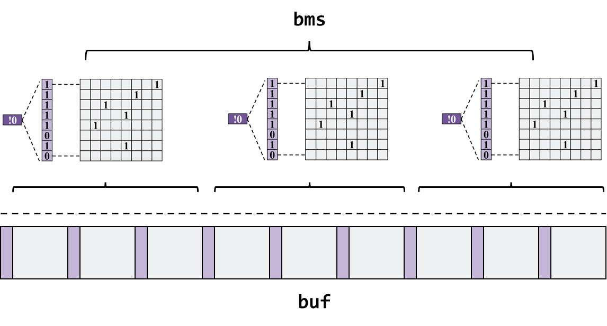

# 选做任务

## 1.  磁盘缓存（选做任务）

### 1.1 磁盘缓存简介

**磁盘的访问速度远小于内存的访问速度** ，而现实中磁盘的容量也远大于内存，所以为了提速 **把整个磁盘内容读到内存中是不现实的** 。但是，我们还是有一些手段提高对磁盘的访问速度。 **根据局部性原理** ，最近被访问过的空间接下来也很可能被访问到，所以我们可以做 **一些缓存块** ，把 **最近最常被访问的数据放入缓存块中** 。如何管理缓存块，采取怎样的 **替换策略** ，以及在什么时机下 **写回** ，如何保证 **一致性** ，这些都是磁盘缓存需要考虑的问题。

### 1.2 实现指南

SFS提供了一种简单的缓存方案。

- **缓存块分配**：利用内存结构查找缓存中第一个空闲缓存块，若无空闲缓存块，则采用后述替换策略释放缓存块。
- **缓存块替换**：被替换缓存块的挑选采用一种较为简单的 **近似先入先出** 方法。假设缓存块总共有`n`块，我们总是记录上一次被替换的缓存块`i`，则本次将要被替换的缓存块`j = (i + 1) mod n`。
- **缓存块命中**：我们为每个缓存块都会维护一个元数据，元数据记录了该缓存块对应介质上的物理地址，我们通过检查物理地址是否重合来判断缓存块是否命中。
- **缓存块索引**：SFS使用位图对缓存块的分配情况进行管理。但是位图面临的搜索时间为O(N)。SFS将位图划分为多个子位图，每个子位图由一个元数据节点管理，统计该子位图的分配情况。我们在后面进行更为详细的介绍。
- **缓存块回写方式**：Write-Back模式

SFS可以很容易地实现对文件数据的缓存，其伪代码可表示如下：

- **读数据**：

  ```c
  if not hit_cache(offset):
  	read_into_cache(offset)
  read_from_cache(offset)
  ```

- **写数据**：

  ```c
  if not hit_cache(offset):
  	read_into_cache(offset)
  write_to_cache(offset)
  ```

#### 1.2.1 SFS缓存实现

首先切换到`buf`分支以完成实验：

```bash
git checkout buf
```

**值得说明的是**，为了更好地模拟磁盘延时，我们向`user_ddriver`中人为插入了延迟函数，相关代码可阅读`buf`分支下的`ddriver.c`。

#### 1.2.2 数据结构

```c
struct sfs_bm_node { 
    int       avai;                                   /* 该位图剩余的记录数 */                 
    uint8_t   bm_indicators[SFS_CACHE_BMID_N];        /* 元数据位图 */           
    uint8_t   bm[SFS_CACHE_BMND_N];                   /* 数据位图 */
};
```

`sfs_bm_node`位于内存中，用于缓存块管理，可以理解为一个子位图结构，其中`bm`字段代表数据位图，`bm_indicators`进而记录`bm`中每8位的分配情况：如果为0，代表该8位中无有效（被分配）位；为1代表该8位中有有效位。**值得说明的是，如果仅记录每8位一组，完全可以通过&0xFF操作实现，事实上，这个方法可以推广到记录每128位甚至更高的情况**。最后，`avai`字段记录改为图剩余的记录数，非0代表还有空闲块，0代表无空闲块。因此单个`sfs_bm_node`节点可以画图表示为：


```c
struct __attribute__((packed)) sfs_cnode_hdr
{
    int                phys_ofs;
    int                flags;
};

struct __attribute__((packed)) sfs_cnode
{ 
    struct sfs_cnode_hdr hdr;
    unsigned char        data[];
};
```

`sfs_cnode`代表一个缓存块节点，其包含一个元数据头不`hdr`与缓存的数据`data`，`hdr`中记录了缓存块对应的物理地址`phys_ofs`与一些标志位`flags`（是否写脏）。**注意，在SFS中，缓存块大小默认与IO块大小对齐，因此不记录块大小**。当然，你可以更粗粒度地去管理一个缓存块，例如2个IO块大小等。`sfs_cnode`的集合构成了SFS缓存Buffer，如下图所示：


```c
struct sfs_cache
{
    int                     sz_blk;                   /* 每个缓存数据块大小 = io_sz */
    int                     num_blk;                  /* 缓存的数据块数 */  
    struct sfs_bm_node      *bms;                     /* Cache分配位图 */
    int                     num_bms;				  /* 分配位图的个数 */
    int                     last_evicted;             /* 上一次驱逐块 */
    unsigned char           *buf;                     /* Cnode存放区 */

    int                     cache_hit;
    int                     cache_miss;
    int                     cache_wb;
    int                     cache_ld;
};
```

`sfs_cache`代表整个缓存结构，相关变量定义不再赘述。其中，`cache_`开头的字段代表缓存的命中、回写、加载信息。进而，我们用下图来描述缓存的整体结构：



**值得说明的是，SFS中的缓存结构完全被部署在内存中，并非硬件Cache。**

#### 1.2.3 关键方法

- **命中或申请分配缓存块**：

  **函数介绍**：

  该方法做两个事情：

  1. 根据传入参数`phys_ofs`判断是否命中Cache，若未命中Cache，则执行步骤二
  2. 分配一个空闲的缓存块，若没有缓存块，则按前述替换算法进行缓存块替换释放

  **返回值**：该方法返回 **phys_ofs对应的缓存块块号**

  函数实现如下：

  ```c
  int sfs_cache_hit_or_alloc_blk(struct sfs_cache *cache, int phys_ofs) {
      int blk = -1;
      int bm_id, line, i;
      int num_bms = cache->num_bms;
      int bm_lines = SFS_CACHE_BMND_N;
      int free_blk = -1;
      int evict_blk = -1;
      struct sfs_bm_node *bm_node;
      struct sfs_cnode   *cnode;
      
      for (bm_id = 0; bm_id < num_bms; bm_id++) {        /* 遍历所有为位图，查看Cache命中和空闲块 */   
          bm_node = &cache->bms[bm_id];
          if (bm_node->avai != SFS_CACHE_BMND_N * UINT8_BITS) {
              for (line = 0; line < bm_lines; line++) { 
                  if (bm_test(bm_node->bm_indicators, line)) {
                      blk = bm_id * SFS_CACHE_BMND_N * UINT8_BITS + line * UINT8_BITS;
                      for (i = 0; i < UINT8_BITS; i++) {
                          if (bm_test(bm_node->bm, blk + i)) {
                              cnode = GET_CNODE(cache, blk + i);
                              if (cnode->hdr.phys_ofs == phys_ofs) {
                                  cache->cache_hit += 1;
                                  return blk + i;
                              }
                          }
                          else {
                              if (free_blk == -1) {
                                  free_blk = blk + i;
                              }        
                          }
                      }
                  }
                  else {
                      if (free_blk == -1) {
                          blk = bm_id * SFS_CACHE_BMND_N * UINT8_BITS + line * UINT8_BITS;
                          free_blk = blk;
                      }
                  }
              }
          }
          else {
              blk = bm_id * SFS_CACHE_BMND_N * UINT8_BITS;
              free_blk = blk;
          }
      }
      
      cache->cache_miss += 1;
  
      if (free_blk == -1 || free_blk > cache->num_blk - 1) { 
                                                        /* 驱逐缓存行 */
          evict_blk = (cache->last_evicted + 1) % cache->num_blk;
          sfs_cache_rls_blk(cache, evict_blk);
          cache->last_evicted = evict_blk;
          free_blk = evict_blk;
      }
  
      blk = free_blk;
  
      sfs_cache_alloc_blk(cache, blk, phys_ofs);
  
      return blk;
  }
  ```

  其中，下述代码主要完成位图的遍历，对于每一个`sfs_bm_node`，严格按照顺序检查：`avai`→`bm_indicators`→`bm`。在遍历过程中，记录下第一个空闲块`free_blk`，便于缓存未命中时返回。

  ```c
  for (bm_id = 0; bm_id < num_bms; bm_id++) {        /* 遍历所有为位图，查看Cache命中和空闲块 */   
      bm_node = &cache->bms[bm_id];
      if (bm_node->avai != SFS_CACHE_BMND_N * UINT8_BITS) {
          for (line = 0; line < bm_lines; line++) { 
              if (bm_test(bm_node->bm_indicators, line)) {
                  blk = bm_id * SFS_CACHE_BMND_N * UINT8_BITS + line * UINT8_BITS;
                  for (i = 0; i < UINT8_BITS; i++) {
                      if (bm_test(bm_node->bm, blk + i)) {
                          ...
                      }
                      ...
                  }
              }
              ...
          }
      }
      else {
          ...
      }
  }
  ```

  以下代码用于检测是否命中。首先获取目标缓存块`sfs_cnode`，再比对`phys_ofs`即可。

  ```c
  cnode = GET_CNODE(cache, blk + i);
  if (cnode->hdr.phys_ofs == phys_ofs) {
      cache->cache_hit += 1;
      return blk + i;
  }
  ```

  如果发现既未命中缓存块，又没有`free_blk`，则触发缓存替换，被替换的块作为新的空闲块被分配。其中，需要说明两个函数：

  - `sfs_cache_rls_blk`：该函数用于将缓存块的内容调用 **驱动写** 回写到介质上，并更新相应的位图索引结构
  - `sfs_cache_alloc_blk`：该函数用于将对应phys_ofs的内容调用 **驱动读** 读取到相应的缓存块中，并更新缓存块元数据`hdr`，更新相应的位图索引结构

  ```c
  int sfs_cache_hit_or_alloc_blk(struct sfs_cache *cache, int phys_ofs) {
      ...
      
      cache->cache_miss += 1;
  
      if (free_blk == -1 || free_blk > cache->num_blk - 1) { 
                                                        /* 驱逐缓存行 */
          evict_blk = (cache->last_evicted + 1) % cache->num_blk;
          sfs_cache_rls_blk(cache, evict_blk);
          cache->last_evicted = evict_blk;
          free_blk = evict_blk;
      }
  
      blk = free_blk;
  
      sfs_cache_alloc_blk(cache, blk, phys_ofs);
  
      return blk;
  }
  ```

- **读写方法**

  读方法为`sfs_try_cache_read`，写方法为`sfs_try_cache_write`。主要思路几乎一致，首先通过调用`sfs_cache_hit_or_alloc_blk`获取`offset`对应的缓存块，然后对缓存块进行读取或写入即可。

  ```c
  int sfs_try_cache_read(struct sfs_cache *cache, int offset, uint8_t *out_content, int size) {
      ...
      if (IS_CACHE_ENABLE(cache)) {
          blk = sfs_cache_hit_or_alloc_blk(cache, offset);
          cnode = GET_CNODE(cache, blk);
          
          memcpy(out_content, cnode->data, size);
          ...
      }
      ...
  }
  
  int sfs_try_cache_write(struct sfs_cache *cache, int offset, uint8_t *in_content, int size) {
      ...
      if (IS_CACHE_ENABLE(cache)) {
          blk = sfs_cache_hit_or_alloc_blk(cache, offset);
          cnode = GET_CNODE(cache, blk);
  
          memcpy(cnode->data, in_content, size);
      	...
      }
      ...
  }
  ```

  接下来，修改SFS封装的`sfs_driver_read`和`sfs_driver_write`即可，这两个函数原本的目的是为了适配任意`offset`与`size`，让修改符合IO块大小。修改方式很简单，只需要将原来的`ddriver_seek` + `ddriver_read`或`ddriver_write`更换为`sfs_try_cache_read`或`sfs_try_cache_write`即可，相关代码如下所示：

  ```c
  /* sfs_utils.c */
  
  int sfs_driver_read(int offset, uint8_t *out_content, int size) {
      ...
      // lseek(SFS_DRIVER(), offset_aligned, SEEK_SET);
      // ddriver_seek(SFS_DRIVER(), offset_aligned, SEEK_SET);
      while (size_aligned != 0)
      {
          // read(SFS_DRIVER(), cur, SFS_IO_SZ());
          // ddriver_read(SFS_DRIVER(), cur, SFS_IO_SZ());
          sfs_try_cache_read(SFS_CACHE(), offset_aligned, cur, SFS_IO_SZ());
          cur          += SFS_IO_SZ();
          size_aligned -= SFS_IO_SZ();   
          offset_aligned += SFS_IO_SZ();
      }
      memcpy(out_content, temp_content + bias, size);
      ...
  }
  
  int sfs_driver_write(int offset, uint8_t *in_content, int size) {
      ...
      // lseek(SFS_DRIVER(), offset_aligned, SEEK_SET);
      // ddriver_seek(SFS_DRIVER(), offset_aligned, SEEK_SET);
      while (size_aligned != 0)
      {
          // write(SFS_DRIVER(), cur, SFS_IO_SZ());
          sfs_try_cache_write(SFS_CACHE(), offset_aligned, cur, SFS_IO_SZ());
          cur          += SFS_IO_SZ();
          size_aligned -= SFS_IO_SZ();   
          offset_aligned += SFS_IO_SZ();
      }
      ...
  }
  ```

  此外，在原来的SFS设计中，我们实现的`sfs_write`和`sfs_read`直接在内存中进行，这样一来并不能体现缓存的作用，于是更换了读写数据函数如下（将`memcpy`更换为`sfs_driver_read`与`sfs_driver_write`）：

  ```c
  int sfs_write(const char* path, const char* buf, size_t size, off_t offset,
  		        struct fuse_file_info* fi) {
      ...
  	// memcpy(inode->data + offset, buf, size);
  	sfs_driver_write(SFS_DATA_OFS((inode->ino)) + offset, buf, size);
  	...
  }
  
  int sfs_read(const char* path, char* buf, size_t size, off_t offset,
  		       struct fuse_file_info* fi) {
  	...
  	// memcpy(buf, inode->data + offset, size);
  	sfs_driver_read(SFS_DATA_OFS((inode->ino)) + offset, buf, size);
  	...			   
  }
  ```

### 1.3 SFS缓存测试

为了验证SFS缓存有效性，编写如下脚本测试：

```python
import os
import sys
import time

def process(loop, cblks):
    ...
    work_set_sz = 16 * 512                                # 8KB
    iter_sz = 512                                         # 512B
    num_iters = work_set_sz // iter_sz
    ...
    tot_sz = loop * work_set_sz     # B
    start = time.time()
    with open(f_path, 'w+') as f:
        content = 'a' * work_set_sz
        for i in range(loop):
            f.seek(0)
            for j in range(num_iters):
                # print("Iter: " + str(j))
                f.write(content[j * iter_sz : (j + 1) * iter_sz])

        f.seek(0)
        data = f.read(work_set_sz)
        if data != content:
            print('buf: read data is not equal to written data')
            sys.exit(1)

    os.system('umount {}'.format(mnt_point))
    end = time.time()
    print('Time: {}ms BW: {}MB/s'.format(1000 * (end - start), tot_sz / 1024 / 1024 / (end - start)))
    
loop = 1000000
print("Cache Blks: 512")
process(loop, 512)
print("Cache Blks: 0")
process(loop, 0) 
```

该脚本以512B为单位写满SFS文件（大小为512B * 16）1000000次，然后计算写入带宽。测试对象是 **无缓存块** 与有 **512个缓存块** 两类，测试结果如下表所示：

| 无缓存块                | 512个缓存块              |
| ----------------------- | ------------------------ |
| *84.38797875936444MB/s* | *101.79038122398883MB/s* |

由于在虚拟机上测试，结果难免不准，**但有缓存块的时间开销一般来说比无缓存块小，本实验要求学生通过自己设计实验，最终结果能够体现出加入缓存的优势即可**

### 1.4 实验要求

由于本实验仅要求在虚拟机上实现，因此本实验仅要求学生通过自己设计实验，最终结果能够体现出加入缓存的优势即可。学生可以通过修改`driver/user_ddriver/ddriver.c`中的下述结构体中的对应字段来进一步调整延迟：

```c
struct ddriver disk = {
    ...
    .read_lat    = 2,       /* 2ms */       
    .write_lat   = 1,       /* 1ms */
    .seek_lat    = 4,       /* 4.17ms per 360 degree */
    ...
};
```

其中，`read_lat`代表为`ddriver_read`插入延迟，`write_lat`代表为`ddriver_write`插入延迟，`seek_lat`用于模拟磁盘旋转，一般来说指旋转360°耗时，单位都是`ms`。

修改`user_ddriver`后，需要使用`make`编译，从而使修改生效：

```bash
[root@localhost user_ddriver]# pwd
/user-land-filesystem/driver/user_ddriver
[root@localhost user_ddriver]# make
gcc  -Wall -O -g  -c ddriver.c
```

## 2.  日志文件系统简介（选做内容）

日志机制是提高文件系统鲁棒性的一个重要机制。我们知道， **文件系统的很多操作往往不止一个步骤** ，以创建文件为例，它要经过： **写文件inode** 、 **写目录项** 、 **更新位图** 三个步骤。

如果在写完目录项但没开始写超级块时发生了 **系统崩溃或者停电等因素导致宕机** ，那么第一步被分配出去的inode就无法被记录为已分配，重启系统后文件系统有可能把这一inode分配给其他文件。

为了保证整个过程的 **原子性** ，我们可以加入日志机制。在磁盘中划出一块区域记为日志区。一开始不把更新后的数据写入数据区，而是把日志区状态记为记录中，并把更改写入日志区。写入完成后，把日志区状态改为写入中，并把日志区的更改更新到数据区。全部更新完成后，把日志区状态记为空闲。

如果在记录时系统崩溃，在重启后会发现日志区状态为记录中。此时只需简单地丢弃日志内容，改状态为空闲，即可。这种情况下文件创建就好像从未发生过一样。

如果在写入时系统崩溃，在重启后会发现日志区状态为写入中。此时日志区的更新信息是完整的，只是不知道崩溃前写到了哪一步。此时只要把日志区的信息全部重新写入到数据区，再把状态记为空闲，即可恢复被打断的操作。


