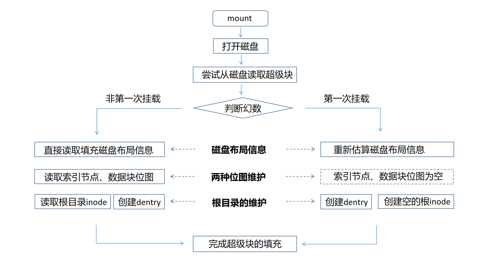

#  实验步骤

##  1. 任务一： 简单的文件系统demo

为了便于同学们过渡到任务二，我们在任务一要求同学们实现一个简单的文件系统小demo。通过这个简单的小demo，帮助大家理解和熟悉：

- 简单的磁盘布局。磁盘逻辑块划分的概念以及本次实验逻辑块大小。

- 简单的磁盘交互。利用本次实验提供的磁盘操作（驱动）接口。
- 简单的文件系统接口实现。什么是文件系统接口等。

这个文件系统小demo的实现要求如下：

- 只需要实现`ls`命令，并且`ls`只需要在根目录显示某个的固定的普通文件名`<filename>`即可。
- 通过磁盘驱动接口`ddriver_ioctl`获取磁盘相关信息：磁盘容量，IO块大小
- 文件系统demo的一个逻辑块是两个IO块大小，假设第500个逻辑块为根目录的数据块，这个数据块只有一个dentry，也就是名为`<filename>`的dentry。
- 出于简单示例，除了上述的块，磁盘其他块都是空的，无需做其他复杂考虑，同学只需要根据demo的`/ * TODO */` 指引完成demo即可。

假设`<filename>`为`file.txt`（实际可能不是`file.txt`），文件系统的demo效果将会如下：


TODO：测试

##  2. 任务二：实现青春版EXT2文件系统

在实验原理部分，我们已经宏观上知道文件系统所需要做的三件事：

1. 设计好磁盘的布局分布（layout）
2. 向下，调用驱动提供接口和磁盘进行交互
3. 向上，维护相关数据结构，实现为上层封装的各种接口

通过任务一的同学们已经对本次实验的相关内容有了初步的认识和了解。

实验的总体结构同学可以参考是实验原理部分的实验总体结构小节。

### 2.1 实现内容

在任务二，需要同学们在我们提供的实验框架下实现一个完整的EXT2文件系统，这个文件系统需要满足以下一些条件：

（1）支持 **挂载**、**卸载**、**重新挂载**、 **查看目录和文件**、**创建文件**、**创建目录** 六个最基本的功能。

（2）该文件系统的 **逻辑块大小** 应该为1024B，也就是两个磁盘的IO单位（512B）。

（3）该文件系统的磁盘布局应该按顺序依次包括（如下图）：超级块、索引节点位图、数据块位图、索引节点区、数据块区。五个区域 **缺一不可**。但具体的每个区域占多少个逻辑块，同学可以自行设计。


（4）出于测评脚本考虑，本次实验 **统一规定** 不实现"."和".."两个特殊目录。此外，本次实验一个inode只对应到一个文件，无需考虑软链接和硬链接的实现（也可选做）；只用实现直接索引，无需考虑间接索引（也可选做）。

### 2.2 实现步骤

为了降低同学的上手成本，我们为提供同学们提供了一个实现了完整功能的文件系统样例，`simplefs`，供同学参考学习其部分实现。**值得注意的是**，本次任务二要实现的文件系统从磁盘布局上就和simplefs不一样，因此在有关文件系统接口的实现上也会不同。评测脚本会检查同学的磁盘布局分布，`simplefs`无法通过测评。

#### 2.2.1 磁盘布局设计

首先，在 **逻辑块大小** 上，本次实验逻辑块大小为1024B，后续的布局设计和接口实现均要使用到此大小。阅读学习`simplefs`代码的同学，需要注意到`simplefs`直接将一个磁盘IO块（512B）作为了一个逻辑块，也就是其逻辑块为512B，和本次实验不同，如下图：


前面提到，本次实验 **磁盘布局** 应该包括：超级块、索引节点位图、数据块位图、索引节点区、数据块区五个区域。阅读和学习`simplefs`代码的同学，也需要注意到`simplefs`的磁盘布局上和本次实验的差别，如下图：


!!! note "补充"
    **simplefs** 采用固定分配的方式来维护文件，因此无需数据块位图，一个文件固定分配1个逻辑块当索引节点，16个逻辑块当数据块，索引节点和数据块一起放置，简单便于索引，但利用率不高。**本次实验** 将一个文件的索引节点和数据进行了分离，形成索引节点区和数据块区，灵活为每个文件按需分配数据块，但也需要数据块位图来记录数据块分配情况。

**本次实验的磁盘布局设计** 要求同学根据自己对文件系统的设计，确定上述每个区域分别需要多少个逻辑块。主要是通过假设估算和自己确定大小的方式来进行设计，最终只需要让文件系统根据磁盘布局正常工作即可。下面给出一个简单的设计例子：

磁盘容量为4MB，逻辑块大小为1024B，那么逻辑块数应该是4MB / 1024B = 4096。我们采用直接索引，假设每个文件最多直接索引8个逻辑块来填写文件数据，也就是每个文件数据上限是8 * 1024B = 8KB。假设一个文件的索引节点，采用一个逻辑块存储（见下面说明）。那么维护一个文件所需要的存储容量是8KB + 1KB = 9KB。那么4MB磁盘，最多可以存放的文件数是4MB / 9KB = 455。

!!! note "补充"
    `struct inode_d`的大小一般是比1024B小很多的，一个逻辑块放一个`struct inode_d`会显得有点奢侈，这里是简单起见，同学可以确定`struct inode_d`的大小后，自行决定一个逻辑块放多少个索引节点`struct inode_d`。

- 超级块，1个逻辑块。超级块区需要保存刷回磁盘的`struct super_block_d`，一般这个结构体的大小会小于1024B，我们用一个逻辑块作为超级块存储`struct super_block_d`即可。
- 索引节点位图，1个逻辑块。上述文件系统最多支持455个文件维护，一个逻辑块（1024B）的位图可以管理1024 * 8 = 8192个索引节点，完全足够。
- 数据块位图，1个逻辑块。上述文件系统总共逻辑块数才4096，一个逻辑块（1024B）的位图可以管理8092个逻辑块，足够。
- 索引节点区，455个逻辑块。上述文件系统假设一个逻辑块放一个索引节点`struct inode_d`，455个文件需要有455索引节点，也就是455个逻辑块。
- 数据块区，3638个逻辑块。剩下的都作为数据块，还剩4096 - 1 - 1 - 1 - 455 = 3638个逻辑块。

设计好有关布局后，**如何在文件系统中体现和实现呢** ？仔细阅读实验原理的同学会记得，是超级块。这些布局信息会被维护在超级块`struct super_block_d`（to-Disk型）和`struct super_block`（to-Disk型）中，在文件系统 **第一次挂载** 在磁盘上的时候，文件系统会按照上述的思路计算出布局信息的各个字段，将它填写到超级块结构中进行维护。大致代码的思路如下所示：

```c
int mount(struct options opt){
    ...
    if( /* 第一次挂载 */ ){
        
        /* 将上述估算思路用代码实现 */
        
        /* 填充超级块的磁盘布局信息字段 */
        super_block_d.sb_offset = /* 估算结果 */;			// 超级块于磁盘中的偏移，默认为0
        super_block_d.sb_blks = /* 估算结果 */;				// 超级块于磁盘中的逻辑块数
            
        super_block_d.ino_map_offset = /* 估算结果 */;		// 索引节点位图于磁盘中的偏移
    	super_block_d.ino_map_blks = /* 估算结果 */;		// 索引节点位图于磁盘中的块数
        
        ... // 其他区域同理
           
    }
    ...
}
```

#### 2.2.2 磁盘交互的封装

本次实验的驱动接口（见实验原理）为我们提供了读写模拟磁盘的方法，`ddriver_read`和`ddriver_write`，利用这两个接口能够实现往模拟磁盘读取或写入一个IO块大小的数据。同时提供了`ddriver_seek`来移动要读取或写入的起始位置，也就是磁盘头。

但上述接口每次读写的数据量固定为一个磁盘IO块的大小（512B），并且移动磁盘头的位置必须和512B保持对齐。为了能够更加灵活往磁盘任何一个位置`offset`读写任意大小`size`的数据，例如从磁盘开始位置处读出或写入`struct super_block_d`超级块结构体。同学可以利用提供原始驱动接口`ddriver_read`和`ddriver_write`，完成一层封装，实现你的`your_read`和`your_write`方法。

```c
int your_read(int offset, void *out_content, int size);
int your_write(int offset, void *in_content, int size);
```

下面的图示给出了`your_read`和`your_write`的一个实现思路：


`your_read`根据传入的offset和size，确定要读取的数据段和512B对齐的下界down和上界up。利用`ddriver_seek`移动把磁盘头到down位置，然后用`ddriver_read`读取一个磁盘块，再移动磁盘头读取下一个磁盘块，最后将从down到up的磁盘块都读取到内存中。然后拷贝所需要的部分，从bias处开始，大小为size，进行返回。


`your_write`的封装实现类似，同学可以根据上述的图示来参考实现。

#### 2.2.3 文件系统接口的实现

在实验原理部分，我们为同学们介绍了ext2文件系统中常用的几种数据结构，超级块`super_block`，索引节点`inode`，目录项`dentry`以及它们的两种类型（in-Mem类型和to-Disk类型）。同学们在实现下述文件系统接口的时候，根据自己的需求来添加相关字段，或者如有需要设计新的数据结构。

##### 2.2.3.1 挂载与卸载

在实验原理，我们已经知道超级块常包括幻数，磁盘布局信息，根目录索引等字段。

**（1）挂载函数**

文件系统的 **挂载函数**，其核心是为文件系统构建和填充一个超级块`struct super_block`（in-Mem类型）数据结构来供文件系统后续的使用。如果是 **第一次挂载**，超级块的构建需要完全重新进行。如果之前已经挂载过，这 **非第一次挂载**，超级块的构建只需要从磁盘中读取之前存储的`struct super_block_d`（to-Disk类型），然后用来填充和构建`struct super_block`（in-Mem类型）即可。

如何判断是否为第一次挂载？判断第一次挂载与否是通过尝试从磁盘预设的位置读取超级块，并判断是否存在约定的幻数`magic_number`来实现的。

挂载时构建的超级块需要维护哪些字段？在挂载构建的超级块`struct super_block`（in-Mem类型）是全局的结构，通常要包括最基本的 **磁盘布局信息** 来供全局使用，还可以 **预先读取两种位图** 到内存中来供全局使用，并需要 **维护根目录** 的作为整个文件系统入口来供全局使用。

挂载函数实现的大致示意如下图所示：



在FUSE中，挂载函数对应的钩子是`.init`，同学们实现好挂载函数后，需要将自己的挂载函数添加到`.init`钩子上。

!!! note "补充"
    实验原理提到父目录的数据块存放所有子文件的`struct dentry_d`结构。做路径解析时，解析到父目录时，会将这些`struct dentry_d`全部从父目录的数据块中读出从而得到子文件dentry结构。由于根目录不存在父目录，因此根目录的dentry比较特殊，不会保存在磁盘中，不会从父目录的数据块读出，而是每次在挂载文件系统时，为根目录新创建一个dentry，然后再和根目录的inode关联起来。

**（2）卸载函数**

本次实验要求同学实现重新挂载的功能，这意味着在卸载文件系统的时候，要实现将相关数据结构刷回磁盘的操作。

文件系统的 **卸载函数**，主要是根据磁盘布局设计，将文件系统有关的 **数据结构写回** 到磁盘指定的位置，以供文件系统下次挂载时能够再次读取和使用。本次实验，在文件系统卸载时，要考虑将几类结构写回磁盘：（1）超级块`struct super_block_d`结构；（2）两种位图，索引节点位图和数据块位图；（3）所有的文件数据及其管理结构，包括文件数据data，文件的目录项`struct dentry_d`结构和文件的索引节点`struct inode_d`结构。最后，在本次实验中，卸载函数还需要关闭在挂载时打开的磁盘。

卸载函数实现的大致示意如下图所示：


!!! note "注意"
    这里的文件既包括目录文件（dir），又包括普通文件（file）。之前提到，父目录的数据块会保存所有子文件的`struct dentry_d`结构。刷回目录文件（dir）的数据内容也就是指把所有子文件的`struct dentry_d`结构刷回到目录文件的指定数据块中。

如何刷回所有的文件？超级块和两个位图的刷回比较直接，将结构体写回到磁盘中预定的位置即可。以 **层次关系** 组织起来的文件，并且包括 **索引节点** `struct inode_d`、**目录项**`struct dentry_d`、**文件数据**data三种内容的写回，相对复杂一点。下面提供了一种 **递归写回** 的思路，这和同学们在实验一（xv6 utils）的`find`实现上有异曲同工之妙。

这个递归函数的 **核心** 是：先写传入文件的 **索引节点** `struct inode_d`，然后再写这个文件的 **文件数据** data（特别的，写目录文件的文件数据data就是在写回所有子文件的 **目录项**`struct dentry_d`），对于目录文件还会额外 **递归进入每个子文件**，从而完成全部文件的写回。

其主要流程如下图所示：


在FUSE中，挂载函数对应的钩子是`.destroy`，同学们实现好卸载函数后，需要将自己的卸载函数添加到`.destroy`钩子上。


以前的内容（有待删除）

-   封装对 **ddriver** 的访问代码，方便设备读写。注意驱动读写IO为512B，但是EXT2文件系统一个块大小为1024B，也就是两个IO单位。在simplefs文件系统中也封装了 **ddriver** 的访问代码，然而simplefs是按一个块大小为512B来封装的（详见sfs_utils.c的sfs_driver_read函数）。
-   设计介质数据结构（位于`types.h`）；
-   设计内存数据结构（可设计、可不设计）；
-   仔细阅读`include/fs.layout`文件，并按要求设计填写自己的文件系统布局，在测试umount时会对文件系统布局进行检测；
-   完成`.init`钩子：读 **超级块** 、初始化文件系统；
-   完成`.destroy`钩子： **回写必要结构** ，保证下一次挂载正常；
-   验证挂载卸载流程的正确性（ **主要看读写是否正确** ）；
-   完成工具函数（可自行设计）：

    -   完成 **分配inode** 函数：创建一个Inode、初始化其上的字段、修改位图结构，可能还需要修改超级块；

    -   完成 **分配dentry** 函数：创建一个dentry、初始化其上的字段；

    -   完成将 **dentry加入到inode** 中的函数：将生成的dentry写入到inode中；

    -   完成 **路径解析函数** ，要么返回dentry，要么返回inode，可自行设计；
-   根据工具函数，完成`.get_attr`钩子；
-   根据工具函数，完成`.mknod`钩子；
-   根据工具函数，完成`.mkdir`钩子；
-   根据工具函数，完成`.readdir`钩子；
-   手工测试`touch`、`ls`、 `mkdir`、`fusermount -u`等命令的正确性；
-   通过`./tests/test.sh`脚本的基本功能测试。
