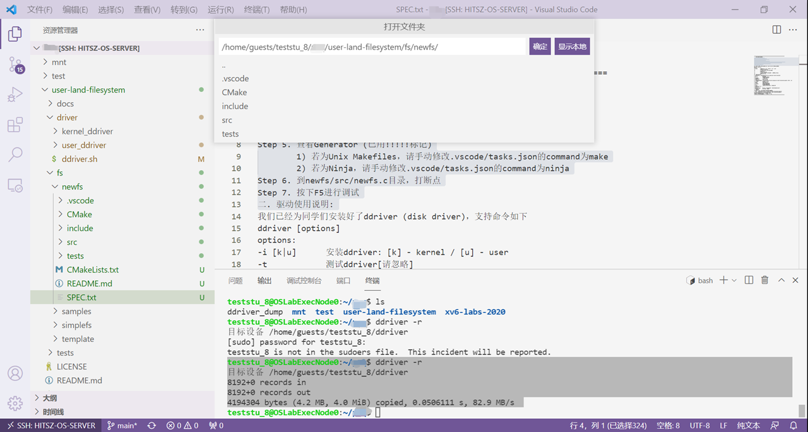
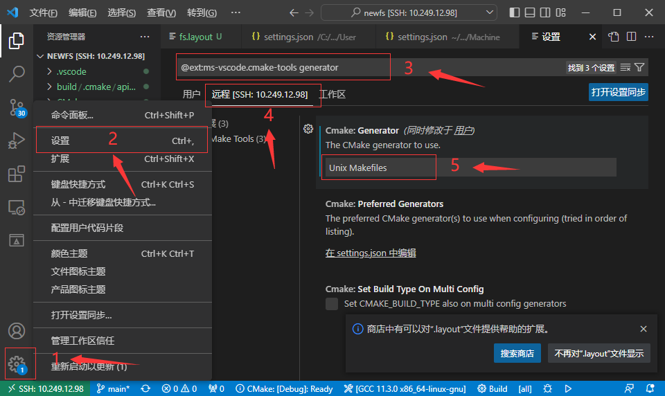
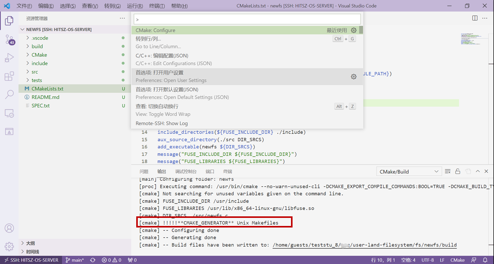
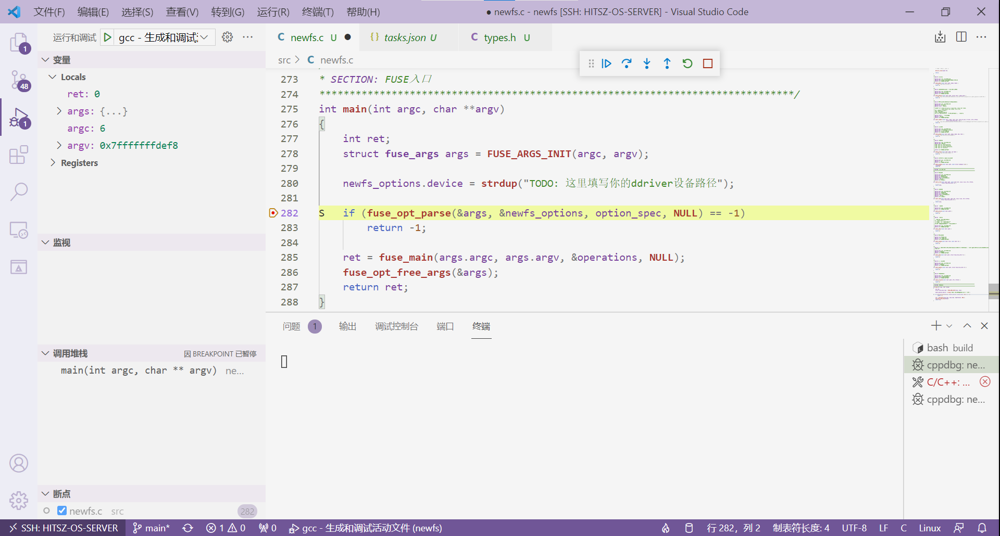
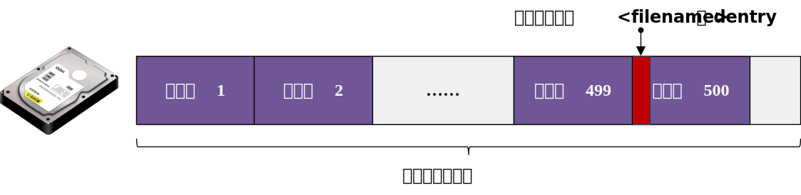
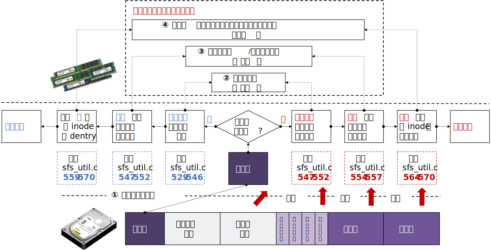
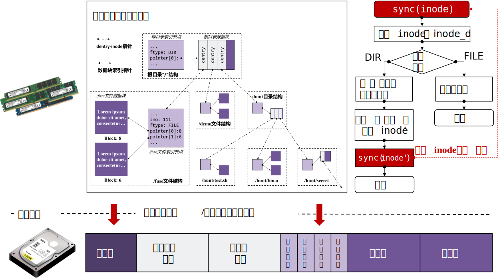
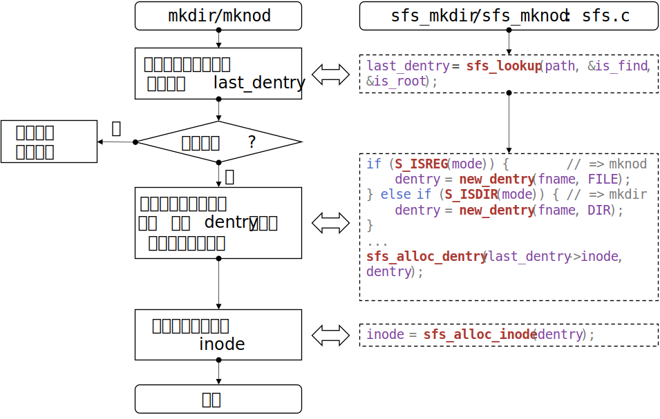

#  实验实现

!!! tip "代码量相关"
    1. 实验一：非常简单的demo。总代码量：100+行。实际编码：约10行。
        2. 实验二：较完善的文件系统。总代码量：1k+行。实际编码：若多参考SFS，要改的并不多，预估100-200行。也可自己重新完整实现。

## 1.任务零：环境搭建

为了给同学们演示如何下载、编译、运行simplefs文件系统，我们录制了两个演示视频：“HITSZ FUSE文件系统实验（本地版）”和“HITSZ FUSE文件系统（远程计算节点版）”。

如果视频不太清晰，建议到bilibili上观看。

FUSE文件系统实验（本地版）：https://www.bilibili.com/video/BV1Af4y1K7FX/

HITSZ FUSE文件系统（远程计算节点版）：https://www.bilibili.com/video/BV1TR4y1b7M3/

### 1.1 实验包结构介绍

本次实验充分考虑到 **上手成本** ，因此我们编写了简单的环境配置脚本，帮助大家一键配置开发环境。实验包代码获取途径：

```console
# git clone https://gitee.com/ftutorials/user-land-filesystem.git
```

实验包的结构如下：

```
user-land-filesystem/
├── driver
│   ├── ddriver.sh
│   ├── kernel_ddriver
│   └── user_ddriver
├── fs
│   ├── demo
│   ├── simplefs
│   └── template
├── LICENSE
├── README.md
└── setenv.sh
```

- `driver`

存放驱动代码。

- `fs`

存放 **实现的FUSE文件系统** 。其中`demo`为任务一要完成的文件系统demo，`simplefs`为类`EXT2`文件系统（缺少数据位图），供同学们参考使用，`template`用于生成文件系统的代码结构，可忽略。

- `setenv.sh`

用于配置FUSE文件系统开发环境。

### 1.2 配置开发环境

运行`./setenv.sh`后，即可按照指导一步一步来建立环境：

```console
teststu_8@OSLabExecNode0:~/user-land-filesystem$ ./setenv.sh 
请输入工作目录名称 ([工作]目录将被至于./fs目录下): newfs
...
生成工作路径:  /home/guests/teststu_8/user-land-filesystem/fs/newfs
请输入项目名称: newfs
...
```

其中，工作目录名称即开发该文件系统的 **文件夹名称** 。可以看到，它在`fs`目录下新建了一个`newfs`目录作为工作目录。

接着，项目名称即真正的文件系统名称，可以是文件系统的简写，例如：nfs（代表newfs），这里要注意项目名不能有 **特殊符号、空格** 等。

项目建立完成之后的结构`newfs`如下所示：

```
./fs/newfs/
├── .vscode
├── CMake
│   └── FindFUSE.cmake
├── CMakeLists.txt
├── include
│    ├── ddriver_ctl_user.h
│    ├── ddriver.h
│    ├── fs.layout
│    ├── newfs.h
│    └── types.h
├── README.md
├── SPEC.txt
├── src
│   └── newfs.c
└── tests
    ├── checkbm
    │   ├── checkbm.py
    │   ├── golden-sfs.json
    │   └── golden.json
    ├── mnt
    ├── stages
    │   ├── cp.sh
    │   ├── ls.sh
    │   ├── mkdir.sh
    │   ├── mount.sh
    │   ├── remount.sh
    │   ├── rw.sh
    │   └── touch.sh 
    ├── fs_test.sh
    ├── main.sh
    └── test.sh
```


### 1.3 项目编译

本次实验任务一和任务二，均需要按照下面步骤 **分别** 完成项目编译。如需编译任务一，请在`./fs/demo`文件夹下打开VSCode软件。如需编译任务二，请在`./fs/newfs`文件夹下打开VSCode软件。

项目编译的过程：

-   **Step 1** . 以任务二为例，SSH打开`./fs/newfs`。打开VSCode软件，点击左上角 "文件" → "打开文件夹"，选择实验包目录下的fs/newfs文件夹。



-   **Step 2** . 在远程实验平台上安装CMake、CMake Tools、C/C++三个插件。


-   **Step 3** . 打开CMakeLists.txt文件
-   **Step 4** . ctrl + shift + p呼出命令菜单
-   **Step 5** . 输入CMake: Configure
-   **Step 6** . 选择 **X86_64版本** 的GCC（不要选错为别的，如riscv64的）：


-   **Step 7** . 点击VSCode左下角“管理”按钮，选择“设置”，然后在弹出的窗口中输入`@ext:ms-vscode.cmake-tools generator`，再点击“远程[SSH:10.249.12.98]”选项栏，在Cmake: Generator选项框中填入`Unix Makefiles`。



-   **Step 8** . 再次用ctrl + shift + p呼出命令菜单，输入CMake: Configure，查看输出窗口是否有“Generator” (已用!!!!!标记)



-   **Step 9** . 到`newfs/src/newfs.c`目录，打断点（可选，如果需要调试可打）。
-   **Step 10** . 按下`F5`进行运行和挂载文件系统。

`F5`是方便同学直接在VSCode挂载文件系统，同学也可以自行使用命令行的方式输入命令来挂载文件系统，参考实验原理的[FUSE文件系统的挂载与卸载](../part2#32-fuse)的`F5`命令展开。

打下断点，调试运行如下图：



没有打断点，直接运行和挂载文件系统，文件系统挂载成功如下图所示：


文件系统的卸载（参考实验原理的[FUSE文件系统的挂载与卸载](../part2#32-fuse)），需要同学们在命令行手动输入命令来实现：

```console
teststu_8@OSLabExecNode0:~/user-land-filesystem/fs/newfs$ fusermount -u ./tests/mnt
teststu_8@OSLabExecNode0:~/user-land-filesystem/fs/newfs$ 
```

##  2. 任务一： 简单的文件系统demo

为了便于同学们过渡到任务二，我们在任务一要求同学们实现一个简单的文件系统小demo。通过这个简单的小demo，帮助大家理解和熟悉：

- 简单的磁盘布局。磁盘逻辑块划分的概念以及本次实验逻辑块大小。
- 简单的磁盘交互。利用本次实验提供的磁盘操作（驱动）接口读取一个磁盘块。
- 简单的文件系统接口实现。什么是文件系统接口等。
- 项目的编译和运行。通过一个简单的demo熟悉项目的编译，文件系统的挂载和卸载等操作。

### 2.1 实现内容

这个文件系统小demo的实现要求如下：

- 只需要实现`ls`命令，并且`ls`时只会在根目录显示某个的预设的普通文件名`<filename>`即可。
- 文件系统demo的一个逻辑块是两个IO块大小（和任务二一致），假设第500个逻辑块为根目录的数据块，这个数据块只有一个`dentry`，也就是名为`<filename>`的dentry。
- 出于简单示例，除了上述的块，磁盘其他块都是空的，无需做其他复杂考虑。

如下图所示：



假设`<filename>`为`pass_task1.txt`，挂载文件系统后，`ls`效果将会如下：


### 2.2 实现步骤

任务一的实现非常简单，只需要同学们根据`demo`代码中的`/* TODO */`指引填写几行代码。在完成任务一过程，同学们请参考实验原理部分的[驱动接口查阅](./part2.md#21)和[FUSE简单示例](./part2.md#31-fuse)。

- **step 0**，熟悉demo代码（不到一百行）定义的简单数据结构`demo_super`和`demo_dentry`，以及四个钩子函数`demo_mount`，`demo_umount`，`demo_getattr`和`demo_readdir`

- **step 1**，完成一个简单的全局超级块填充，维护一些后续计算需要的信息。同学可以通过`ddriver_ioctl`来获取磁盘容量和IO块大小等信息，从而得出逻辑块大小，需要在`demo_mount`函数中实现。

```c
/* 挂载文件系统 */
static int demo_mount(){
	...
	/* 填充super信息 */
    super.sz_io = /* TODO */;
    super.sz_disk = /* TODO */;
    super.sz_blks = /* TODO */;
    ...
    }
```

- **step 2**，完成遍历目录逻辑，从第500个逻辑块读取一个`demo_dentry`，将`demo_dentry`的文件名填充到filename。下面给出一个参考的`/* TODO */`指引，同学也无需严格按照这个指引。

```c
/* 遍历目录 */
static int demo_readdir(const char* path, void* buf, fuse_fill_dir_t filler, off_t offset, struct fuse_file_info* fi)
{
    char filename[128]; // 待填充的

    /* 根据超级块的信息，从第500逻辑块读取一个dentry，ls将只固定显示这个文件名 */

    /* TODO: 计算offset，并根据offset调用ddriver_seek移动磁盘头到offset处 */

    /* TODO: 调用ddriver_read读出一个磁盘块到内存，512B */

    /* TODO: 使用memcpy拷贝上述512B的前sizeof(demo_dentry)字节构建一个demo_dentry结构 */

    /* TODO: 根据demo_dentry的文件名填充filename */

    // 此处大家先不关注filler，已经帮同学写好，同学填充好filename即可
    return filler(buf, filename, NULL, 0);
}
```

还有步骤

- **step 3**，完成显示文件属性函数，将这个文件显示为普通文件。

```c
/* 显示文件属性 */
static int demo_getattr(const char* path, struct stat *stbuf)
{
	...
        stbuf->st_mode = /* TODO: 显示为普通文件 */;            // 该文件显示为普通文件
    ...
}
```

### 2.3 测试

测试脚本位于`./demo/tests`目录下

#### 2.3.1 手动测试

我们给同学提供了一个手动测试和调试用的固定文件名`pass_task1.txt`，同学按照如下方式可以验证自己实现逻辑是否正确。

先运行在`tests`目录下运行：

```shell
chmod +x start.sh && ./start.sh
```

然后挂载文件系统，VSCode按`F5`（前提是已经按照[环境搭建-项目编译](./#13)配置好任务一的编译环境）：


通过`ctrl + shift + ~`打开上述页面，然后在 **开启一个命令行** ，输入`ls`命令查看`tests`目录下的`mnt`文件夹，查看结果是否为`pass_task1.txt`，如果是，则 **手动测试通过** 。如下图：


最后一定要记得输入`fusermount`命令来卸载文件系统（参考实验原理的[FUSE文件系统的挂载与卸载](../part2#32-fuse)），**不要** 直接在VSCode终止或者按`ctrl + c`：

```
fusermount -u <挂载点>
```


#### 2.3.2 测评程序

任务一提供了测评程序，同学完成实验后，进入`./demo/tests`目录，输入如下命令通过本节任务的测评：

```shell
chmod +x test.sh && ./test.sh
```

测评通过的示意图如下：


测评未通过，请根据提示修改：


##  3. 任务二：实现青春版EXT2文件系统

在实验原理部分，我们已经宏观上知道文件系统所需要做的三件事：

1. 设计好磁盘的布局分布（layout）
2. 向下，调用驱动提供接口和磁盘进行交互
3. 向上，维护相关数据结构，实现为上层封装的各种接口

通过任务一的同学们已经对本次实验的相关内容有了初步的认识和了解。

实验的总体结构同学可以参考是实验原理部分的实验总体结构小节。

### 3.1 实现内容

在任务二，需要同学们在我们提供的实验框架下实现一个完整的EXT2文件系统，这个文件系统需要满足以下一些条件：

（1）支持 **挂载与卸载**、 **查看目录和文件**、**创建文件和目录** 。能完成挂载和卸载，并支持`ls`，`touch`、`mkdir`命令。

（2）该文件系统的 **逻辑块大小** 应该为1024B，也就是两个磁盘的IO单位（512B）。

（3）该文件系统的磁盘布局应该按顺序依次包括（如下图）：超级块、索引节点位图、数据块位图、索引节点区、数据块区。五个区域 **缺一不可**。但具体的每个区域占多少个逻辑块，同学可以自行设计。


（4）实现 **按需分配** 文件数据块，利用好数据块位图，当文件需要新的数据块来写内容的时候才分配，而不是采用预先分配。

（5）出于测评脚本考虑，本次实验 **统一规定** 不实现"."和".."两个特殊目录。此外，本次实验一个inode只对应到一个文件，无需考虑软链接和硬链接的实现（也可选做）；只用实现直接索引，无需考虑间接索引（也可选做）。

### 3.2 实现步骤

为了降低同学的上手成本，我们为提供同学们提供了一个实现了完整功能的文件系统样例，`simplefs`，供同学参考学习其部分实现。**值得注意的是**，本次任务二要实现的文件系统从磁盘布局上就和simplefs不一样，因此在有关文件系统接口的实现上也会不同。评测脚本会检查同学的磁盘布局分布，`simplefs`无法通过所有测评， **若布局监测未通过，则扣除一半分数** 。

#### 3.2.1 磁盘布局设计

首先，在 **逻辑块大小** 上，本次实验逻辑块大小为1024B，后续的布局设计和接口实现均要使用到此大小。阅读学习`simplefs`代码的同学，需要注意到`simplefs`直接将一个磁盘IO块（512B）作为了一个逻辑块，也就是其逻辑块为512B，而本次实验要实现的青春版EXT2文件系统将两个IO块作为一个逻辑块（1024B）。**后续布局检查会基于1024B逻辑块进行检查，因此同学们需要注意**。

前面提到，本次实验 **磁盘布局** 应该包括：超级块、索引节点位图、数据块位图、索引节点区、数据块区五个区域。阅读和学习`simplefs`代码的同学，也需要注意到`simplefs`的磁盘布局上和本次实验的差别，如下图：


!!! note "补充"
    **simplefs** 采用固定分配的方式来维护文件，因此无需数据块位图，一个文件固定分配1个逻辑块当索引节点，16个逻辑块当数据块，索引节点和数据块一起放置，简单便于索引，但利用率不高。**本次实验** 将一个文件的索引节点和数据进行了分离，形成索引节点区和数据块区，灵活为每个文件按需分配数据块，但也需要数据块位图来记录数据块分配情况。

**本次实验的磁盘布局设计** 要求同学根据自己对文件系统的设计，确定上述每个区域分别需要多少个逻辑块。主要是通过假设估算和自己确定大小的方式来进行设计，最终只需要让文件系统根据磁盘布局正常工作即可。

!!! note "一个设计的简单例子"

    磁盘容量为4MB，逻辑块大小为1024B，那么逻辑块数应该是4MB / 1024B = 4096。我们采用直接索引，假设每个文件最多直接索引8个逻辑块来填写文件数据，也就是每个文件数据上限是8 * 1024B = 8KB。假设一个文件的索引节点，采用一个逻辑块存储（见下面说明）。那么维护一个文件所需要的存储容量是8KB + 1KB = 9KB。那么4MB磁盘，最多可以存放的文件数是4MB / 9KB = 455。
    
    - 超级块，1个逻辑块。超级块区需要保存刷回磁盘的`struct super_block_d`，一般这个结构体的大小会小于1024B，我们用一个逻辑块作为超级块存储`struct super_block_d`即可。
    - 索引节点位图，1个逻辑块。上述文件系统最多支持455个文件维护，一个逻辑块（1024B）的位图可以管理1024 * 8 = 8192个索引节点，完全足够。
    - 数据块位图，1个逻辑块。上述文件系统总共逻辑块数才4096，一个逻辑块（1024B）的位图可以管理8092个逻辑块，足够。
    - 索引节点区，455个逻辑块。上述文件系统假设一个逻辑块放一个索引节点`struct inode_d`，455个文件需要有455索引节点，也就是455个逻辑块。
    - 数据块区，3638个逻辑块。剩下的都作为数据块，还剩4096 - 1 - 1 - 1 - 455 = 3638个逻辑块。
    
    注：`struct inode_d`的大小一般是比1024B小很多的，一个逻辑块放一个`struct inode_d`会显得有点奢侈，这里是简单起见，同学可以确定`struct inode_d`的大小后，自行决定一个逻辑块放多少个索引节点`struct inode_d`。

  设计好有关布局后，**如何在文件系统中体现和实现呢** ？仔细阅读实验原理的同学会记得，是超级块。这些布局信息会被维护在超级块`struct super_block_d`（to-Disk型）和`struct super_block`（to-Disk型）中，在文件系统 **第一次挂载** 在磁盘上的时候，文件系统会按照上述的思路计算出布局信息的各个字段，将它填写到超级块结构中进行维护。大致代码的思路如下所示：

```c
int mount(struct options opt){
    ...
    if( /* 第一次挂载 */ ){
        
        /* 将上述估算思路用代码实现 */
        
        /* 填充超级块的磁盘布局信息字段 */
        super_block_d.sb_offset = /* 估算结果 */;			// 超级块于磁盘中的偏移，默认为0
        super_block_d.sb_blks = /* 估算结果 */;				// 超级块于磁盘中的逻辑块数
            
        super_block_d.ino_map_offset = /* 估算结果 */;		// 索引节点位图于磁盘中的偏移
    	super_block_d.ino_map_blks = /* 估算结果 */;		// 索引节点位图于磁盘中的块数
        
        ... // 其他区域同理
           
    }
    ...
}
```

#### 3.2.2 磁盘交互的封装

本次实验的驱动接口（见实验原理）为我们提供了读写模拟磁盘的方法，`ddriver_read`和`ddriver_write`，利用这两个接口能够实现往模拟磁盘读取或写入一个IO块大小的数据。同时提供了`ddriver_seek`来移动要读取或写入的起始位置，也就是磁盘头。

但上述接口每次读写的数据量固定为一个磁盘IO块的大小（512B），并且移动磁盘头的位置必须和512B保持对齐。为了能够更加灵活往磁盘任何一个位置`offset`读写任意大小`size`的数据，例如从磁盘开始位置处读出或写入`struct super_block_d`超级块结构体。同学可以利用提供原始驱动接口`ddriver_read`和`ddriver_write`，完成一层封装，大概思路是先把数据所在的磁盘块都读出来，然后再从这一部分读出的数据中读写相应的数据，若是写，则要把读入修改的部分再写回磁盘。下面简要介绍实现`your_read`方法。

```c
int your_read(int offset, void *out_content, int size);
```


`your_read`根据传入的offset和size，确定要读取的数据段和512B对齐的下界down和上界up。利用`ddriver_seek`移动把磁盘头到down位置，然后用`ddriver_read`读取一个磁盘块，再移动磁盘头读取下一个磁盘块，最后将从down到up的磁盘块都读取到内存中。然后拷贝所需要的部分，从bias处开始，大小为size，进行返回。

`your_write`的封装实现类似，区别在于写需要经过 **读-修改-写** 三个阶段。先读出需要的磁盘块到内存，然后在内存覆盖指定内容，然后将读出的磁盘块再依次写回到内存。

`SimepleFS`提供了一个较完善的磁盘交互的封装，大家可以参考`simplefs`的进行代码实现。

#### 3.2.3 文件系统接口的实现

在实验原理部分，我们为同学们介绍了ext2文件系统中常用的几种数据结构，超级块`super_block`，索引节点`inode`，目录项`dentry`以及它们的两种类型（in-Mem类型和to-Disk类型）。同学们在实现下述文件系统接口的时候，根据自己的需求来添加相关字段，或者如有需要设计新的数据结构。

下面给出本次实验需要完成的接口的实现参考，同学可以对照着来帮助理解`simplefs`的代码，以及参考着完成自己的文件系统实现。

##### 3.2.3.1 挂载与卸载

在实验原理，我们已经知道超级块常包括幻数，磁盘布局信息，根目录索引等字段。

**（1）挂载函数**

文件系统的 **挂载函数**，其核心是为文件系统构建和填充一个超级块`struct super_block`（in-Mem类型）数据结构来供文件系统后续的使用。如果是 **第一次挂载**，超级块的构建需要完全重新进行。如果之前已经挂载过，这 **非第一次挂载**，超级块的构建只需要从磁盘中读取之前存储的`struct super_block_d`（to-Disk类型），然后用来填充和构建`struct super_block`（in-Mem类型）即可。

如何判断是否为第一次挂载？判断第一次挂载与否是通过尝试从磁盘预设的位置读取超级块，并判断是否存在约定的幻数`magic_number`来实现的。

挂载时构建的超级块需要维护哪些字段？在挂载构建的超级块`struct super_block`（in-Mem类型）是全局的结构，通常要包括最基本的 **磁盘布局信息** 来供全局使用，还可以 **预先读取两种位图** 到内存中来供全局使用，并需要 **维护根目录** 的作为整个文件系统入口来供全局使用。

挂载函数实现的大致示意如下图所示：



在FUSE中，挂载函数对应的钩子是`.init`，同学们实现好挂载函数后，需要将自己的挂载函数添加到`.init`钩子上。

`.init`的钩子函数原型如下：

```c
void* init(struct fuse_conn_info * conn_info);
```

同学创建的挂载函数需要和上述函数声明保持一致，本次实验同学们无需关注挂载函数的传入参数，照着声明即可。

!!! note "补充"
    实验原理提到父目录的数据块存放所有子文件的`struct dentry_d`结构。做路径解析时，解析到父目录时，会将这些`struct dentry_d`全部从父目录的数据块中读出从而得到子文件dentry结构。由于根目录不存在父目录，因此根目录的dentry比较特殊，不会保存在磁盘中，不会从父目录的数据块读出，而是每次在挂载文件系统时，为根目录新创建一个dentry，然后再和根目录的inode关联起来。

**（2）卸载函数**

本次实验要求同学实现重新挂载的功能，这意味着在卸载文件系统的时候，要实现将相关数据结构刷回磁盘的操作。

文件系统的 **卸载函数**，主要是根据磁盘布局设计，将文件系统有关的 **数据结构写回** 到磁盘指定的位置，以供文件系统下次挂载时能够再次读取和使用。本次实验，在文件系统卸载时，要考虑将几类结构写回磁盘：（1）超级块`struct super_block_d`结构；（2）两种位图，索引节点位图和数据块位图；（3）所有的文件数据及其管理结构，包括文件数据data，文件的目录项`struct dentry_d`结构和文件的索引节点`struct inode_d`结构。最后，在本次实验中，卸载函数还需要关闭在挂载时打开的磁盘。

卸载原理示意如下：


!!! note "注意"
    这里的文件既包括目录文件（dir），又包括普通文件（file）。之前提到，父目录的数据块会保存所有子文件的`struct dentry_d`结构。刷回目录文件（dir）的数据内容也就是指把所有子文件的`struct dentry_d`结构刷回到目录文件的指定数据块中。

如何刷回所有的文件？超级块和两个位图的刷回比较直接，将结构体写回到磁盘中预定的位置即可。以 **层次关系** 组织起来的文件，并且包括 **索引节点** `struct inode_d`、**目录项**` struct dentry_d`、**文件数据** data三种内容的写回，相对复杂一点。下面提供了一种 **递归写回** 的思路，这和同学们在实验一（xv6 utils）的`find`实现上有异曲同工之妙。

这个递归函数的 **核心** 是：先写传入文件的 **索引节点** `struct inode_d`，然后再写这个文件的 **文件数据** data（特别的，写目录文件的文件数据data就是在写回所有子文件的 **目录项** `struct dentry_d`），对于目录文件还会额外 **递归进入每个子文件**，从而完成全部文件的写回。

其主要流程如下图所示：



在FUSE中，挂载函数对应的钩子是`.destroy`，同学们实现好卸载函数后，需要将自己的卸载函数添加到`.destroy`钩子上。

`.destroy`的钩子函数原型如下：

```c
void* destroy(void* p);
```

同学创建的卸载函数需要和上述函数声明保持一致，本次实验同学们无需关注卸载函数的传入参数，照着声明即可。

##### 3.2.3.2 创建文件和目录

在实验原理和前面的讨论，我们知道，在文件系统中，一个文件应该包括 **索引节点** `inode`，**目录项** `dentry`（位于父目录的数据块中），以及 **文件的数据** data。创建一个文件应该要实现前两个部分的创建和维护，而文件数据为空。**目录项** `dentry`体现层级关系，索引节点`inode`用于文件自身索引。

本次实验要求同学们实现创建普通文件和创建目录文件，依次对应`mknod`和`mkdir`两个钩子函数，都会根据传入的一个路径来创建对应的文件。

普通文件和目录文件都属于文件，两者创建的实现大体上是一致的，其核心主要都包括：（1）**路径解析**（lookup），得到父目录的`dentry`；（2）创建新的 **目录项结构** `dentry`结构维护到上述得到的父目录中；（3）分配新的 **索引节点** `inode`。不同之处在于两者创建的文件类型是不一样的。

创建普通文件和创建目录文件的主要流程如下图所示：



**（1）路径解析，得到父目录的dentry**

首先介绍路径 **解析的逻辑** 。在`simplefs`中路径解析对应着`sfs_lookup`函数。以`/hunt/bin.o`为例，并假设路径存在。如下图所示，所有的路径解析都会从 **根目录** 开始，由超级块维护的根目录`dentry`，读取根目录的`inode`（在读取`inode`的时候会把数据块的内容读取进来，即所有子文件的`dentry_d`），然后依次遍历所有子文件的`dentry`，找到文件名为`hunt`的`dentry`，然后再读取`hunt`的`inode`。然后根据`hunt`的`inode`，再依次遍历所有子文件的`dentry`，找到文件名为`bin.o`的`dentry`。路径解析找到该文件，返回其`dentry`。

上述介绍的是找到文件的情况，这种情况通常会用于[查找文件和目录](./#3233)的实现。


但在创建文件和目时，**文件还不存在**，传入的路径名是无法解析到其对应的`dentry`的。相反，假设解析到存在对应的`dentry`了，则说明文件重名了，应该做异常处理。以`/hunt/YBYB`为例，并假设路径还不存在。如上图所示，只需要按照刚刚所述的路径解析逻辑，最终未找到直接返回其父目录的`dentry`即可，供实现两个钩子函数下一步使用。

然后，介绍**如何从`dentry`到`inode`**。刚刚提到由`dentry`可以读取到对应的`inode`，因为`dentry`维护有该文件对应的`inode`编号，有了编号，就可以按照磁盘布局设计，从磁盘指定的位置读取出对应的`inode_d`，如下图所示。在读取`inode`的时候可以预先读取对应文件的内容到内存中，方便文件系统的使用。特别的，对于目录文件，读取完其内容后，还应该动态的在文件系统维护好所有子文件的`dentry`。

下面为同学们提供一种用链表的方式，让文件系统在内存中来维护一个目录所有子文件的`dentry`的方式。父目录的`inode`（in-Mem型）添加一个指针，指向第一个子文件的dentry。然后子文件的`dentry`（in-Mem型）添加一个指针，指向相邻的兄弟子文件的`dentry`。如下面的结构体定义。

```c
struct inode {
    // ... 其他字段
    struct dentry* first_child; 
}
```

```c
struct dentry {
    // ... 其他字段
    struct dentry* brother; 
}
```

这样就可以通过链表串起父目录的所有的子文件了，其中`inode->first_child`指向链表头节点，`dentry->brother`指向链表下一个节点。如下图所示的链表型（`simplefs`实现所示），本次实验同学可以参考`simplefs`使用链表型。


!!! note "目录项索引"
    除了构建为链表外，现代文件系统一般通过维护哈希表、红黑树等结构索引内存中的目录项，有兴趣的同学可以阅读相关Linux代码实现。

**（2）创建新的dentry结构，添加到父目录**

这部分的逻辑在`simplefs`中对应`sfs_alloc_dentry`函数（参见上述mknod/mkdir主要流程示意图）

在路径解析，我们返回了父目录的`dentry`。并且前面我们已经介绍了一种在内存中，父目录`inode`通过链表维护所有子文件`dentry`的实现。

当需要新增加一个`dentry`到父目录时，采用头插法。只需要修改父目录`inode`中的指针指向新增的`dentry`结构，新增的`dentry`的兄弟指针指向原来第一个子文件`dentry`即可。

!!! note "注意"
    将子文件`dentry`指针添加到父目录`inode`字段中，只是在文件系统运行时，一种方便管理的位于内存的组织方式。当文件系统卸载，刷回磁盘，会按照上述方式遍历所有的父目录的所有子文件`dentry`结构，将其写回到父目录数据块的指定位置。

我们可能还需要为新增的`dentry`预先申请一个新的父目录的数据块来供对应的`dentry_d`写回磁盘时使用（如果父目录原来申请的数据块已经放满了）。本次实验中，暂不涉及文件的读写，也就是普通文件均不用申请数据块，文件大小也都是0。但对于目录文件，则需要申请数据块，来存放子文件的`dentry_d`。

申请一个数据块的流程示意图如下，通过逐个位查找数据块位图，找到第一个空闲数据块下表并返回。


**（3）分配新的索引节点inode**

这部分的逻辑在`simplefs`中对应`sfs_alloc_inode`函数（参见上述mknod/mkdir主要流程示意图）。

新创建的文件还需要为其 **分配一个索引节点** `inode`：通过逐个位遍历索引节点位图（参考上述数据块位图的遍历），找到一个空闲的索引节点编号，然后创建一个新的索引节点`inode`，绑定该编号，并填写`inode`一些字段（后续在写回的时候写回到该编号对应的索引节点位置即可）。

在[实验原理-目录项的表示](../part2#124)的介绍中，我们知道`dentry`能够索引到对应的`inode`，也就是说`dentry`会和一个`inode`进行绑定。我们创建好新的索引节点`inode`后，要和**传入的对应目录项** `dentry`进行 **绑定** 。参考代码如下：

```c
struct sfs_inode* sfs_alloc_inode(struct sfs_dentry * dentry) {
	/* 遍历索引节点位图 分配inode */
    ...
     
    /* dentry绑定该inode */
    dentry->inode = inode;
    dentry->ino   = inode->ino;
    ...
    
}
```

通过以上三大步，同学们就可以完成 **创建文件** 函数的编写，包括 **创建普通文件** 和 **创建目录文件** 。创建普通文件对应的钩子函数是`.mknod`，创建目录文件对应的钩子函数是`.mkdir`。同学们实现好创建普通文件和创建目录文件的钩子函数后，需要将自己的两个函数分别添加到`.mknod`和`.mkdir`钩子上。

`.mknod`的函数原型如下，实现的创建普通文件函数要和以下声明保持一致：

```c
int mknod(const char* path, mode_t mode, dev_t dev)
```

- `path`是要创建文件相对于文件系统的根目录`/`的绝对路径。
- `mode`可以用来判断要文件请求发来的要创建文件的类型（目录文件还是普通文件）。
- 本次实验，不需要关心`dev`参数。

`.mkdir`的函数原型如下，实现的创建目录文件函数要和以下声明保持一致：

```c
int mkdir(const char* path, mode_t mode)
```

- `path`是要创建文件相对于文件系统的根目录`/`的绝对路径。
- `mode`可以用来判断要文件请求发来的要创建文件的类型（目录文件还是普通文件）。

##### 3.2.3.3 显示文件和目录

**（1）获取文件属性**

在显示一个文件的时候，需要查看文件的属性，如文件大小、文件类型等信息。文件的属性在Linux中通过一个`stat`的结构体来维护。

获取文件属性的函数的核心就是要实现填充好对应的`stat`结构体，并向上层返回。获取文件属性的函数对应`getattr`钩子。

首先进行**路径解析的逻辑** （在创建文件一小节已经介绍过）得到传入路径对应的`dentry`结构，然后就可以根据`dentry`及其索引的`inode`结构的字段来 **填充`stat`结构体** 的字段。一个示例代码如下：

```c
int sfs_getattr(const char* path, struct stat * sfs_stat) {
    /* 路径解析 */
    struct sfs_dentry* dentry = sfs_lookup(path, &is_find, &is_root);
    
    /* 结构体填充 */
    sfs_stat->st_mode = ...
    sfs_stat->st_size = ...
}
```

`stat`结构体通常需要填充如下一些常用字段，同学们需要完成这些字段的填充：

| 结构体字段 | 字段含义                             |
| ---------- | ------------------------------------ |
| st_size    | 文件的大小                           |
| st_mode    | 文件的模式，包括文件的权限、文件类型 |
| st_nlink   | 文件的连接数，即多少硬链接           |
| st_uid     | 文件所有者的用户ID                   |
| st_gid     | 文件所有者的组ID                     |
| st_blksize | 文件所在文件系统的逻辑块大小         |
| st_blocks  | 文件所占的块数                       |
| st_atime   | 文件最近一次访问时间                 |
| st_mtime   | 文件最近一次修改时间                 |

以下有一些实现中的注意事项：

- 关于`st_nlink`。本次实验不考虑硬链接，约定链接数均为1。值得注意的是，根目录具有特殊性，为保证文件目录树的完整，一般文件系统会约定其链接数为2。

- 关于`st_mode`。本次实验可默认文件权限均为（0777）。在Linux中通过`S_IFREG`来表示普通文件，`S_IFDIR`表示目录文件。如果想表示一个默认权限为0777的普通文件，其`st_mode`应该是0777 | `S_IFDIR`。

- 关于`st_uid`和`st_gid`。可以通过`getuid()`和`getgid()`获取当前用户的用户ID和组ID。

获取文件属性对应的钩子函数是`.getattr`，同学们实现好显示文件属性的函数后，需要将该函数添加到`.getattr`钩子上。

`.getattr`的函数原型如下，实现的显示文件属性函数要和以下声明保持一致：

```c
int getattr(const char* path, struct stat * stat);
```

- `path`是要读取属性的文件路径。
- `stat`是要填充返回的文件属性结构体。

**（2）读取目录**

想要查看一个目录下有哪些文件的时候，需要用到读取目录的钩子函数。读取目录的函数主要是将 **子文件的文件名** 填充到 **指定的缓冲区** 即可。

读取目录函数主要负责的是：**解析** 父目录路径，并根据子文件偏移`offset`获取到对应的 **子文件文件名** 。

拿到结果（子文件文件名）之后如何返回给上层呢？读取目录函数 **直接调用** 上层传入的装填函数`filler`即可！上层实现并传入的装填函数`filler`决定怎么填充这个结果到缓冲区中，和文件系统的读取目录函数无关，`readdir`只需要知道有这么个装填函数`filler`，直接调用即可。 一个参考如下：

```c
int sfs_readdir(const char * path, void * buf, fuse_fill_dir_t filler, off_t offset,
			    struct fuse_file_info * fi) {
	/* 解析父目录路径 */
	struct sfs_dentry* dentry = sfs_lookup(path, &is_find, &is_root);

	if (is_find) {
		/* 根据offset获取到对应的子文件名 */
		sub_dentry = sfs_get_dentry(dentry->inode, offset);
		if (sub_dentry) {
            /* 直接调用filler来装填结果 */
			filler(buf, sub_dentry->fname, NULL, ++offset);
		}
	}
}
```
其中，调用`filler`的时候需要的`filler`钩子函数的原型如下：

```c
int filler(void *buf, const char *name, const struct stat *stbuf, off_t off);
```

- `buf`是要装填结果`name`的缓冲区。
- `name`是获取到的子文件的文件名。
- `stbuf`无需关注，设置为`NULL`即可。
- `off`是 **下一个子文件** 的偏移（第几个dentry，用于下次调用readdir的`offset`）。

读取目录对应的钩子函数是`.readdir`，同学们实现好读取目录的函数后，需要将该函数添加到`.readdir`钩子上。

`.readdir`的函数原型如下，实现的读取目录函数要和以下声明保持一致：

```c
int readdir(const char * path, void * buf, fuse_fill_dir_t filler, off_t offset, struct fuse_file_info * fi);
```

- `path`是要读取的目录的路径。
- `buf`是传入的装填返回结果的缓冲区。
- `filler`是传入的上层自定义的装填函数。
- `offset`是本次要要开始读取的子文件的偏移，`fi`无需关注。

### 3.3 测试

#### 3.3.1 手动测试

同学们完成任务二后，可以自行运行和挂载完成的文件系统来测试实现的功能的正确性。

可以选择先通过如下命令将磁盘清空：

```shell
ddriver -r
```

检查`tests`目录下有无`mnt`目录，没有需要自己`mkdir mnt`创建一个，并保证这个目录是 **空** 的，否则`F5`无法挂载成功。

挂载文件系统，VSCode按`F5`（前提是已经按照[环境搭建-项目编译](./#13)配置好任务二的编译环境）：


挂载好后，在新的一个命令行，对`tests`目录下的`mnt`目录进行`ls`、`touch`、`mkdir`操作，均能符合预期功能，如下图所示。卸载文件系统后，重新挂载文件系统，`ls`也能查看到上次的文件。


同任务一，同学们使用完文件系统后，及时通过`fusermount`命令来卸载文件系统，不要直接使用`ctrl + c`和VSCode终止的方式，避免影响下一次挂载。

#### 3.3.2 测评程序

我们为同学们提供了任务二的测评程序，位于`tests`目录下`test.sh`。同学们在`test`目录下，使用如下命令来运行测评程序：

```shell
chmod +x test.sh && ./test.sh
```

测试方式：输入`N`，选择基础功能测试。

下图为通过所有的测试用例：


测评脚本等价于运行了如下的序列的测试命令，同学可以参考如下序列检查自己的问题。

正确的序列如下（**基础分30分**）：

- **F5挂载文件系统（1分）**

- **mkdir测试（4分）**

```shell
mkdir ./tests/mnt/dir0
mkdir ./tests/mnt/dir0/dir0
mkdir ./tests/mnt/dir0/dir0/dir0
mkdir ./tests/mnt/dir1
```

 - **touch测试（5分）**

```shell
touch ./tests/mnt/file0
touch ./tests/mnt/dir0/file0
touch ./tests/mnt/dir0/dir0/file0
touch ./tests/mnt/dir0/dir0/dir0/file0
touch ./tests/mnt/dir1/file0
```

 - **ls测试（4分）**

```shell
mkdir ./tests/mnt/dir0
touch ./tests/mnt/file0
mkdir ./tests/mnt/dir0/dir1
mkdir ./tests/mnt/dir0/dir1/dir2
touch ./tests/mnt/dir0/dir1/dir2/file4
touch ./tests/mnt/dir0/dir1/dir2/file5
touch ./tests/mnt/dir0/dir1/dir2/file6
touch ./tests/mnt/dir0/dir1/file3
touch ./tests/mnt/dir0/file1
--------------
ls ./tests/mnt
ls ./tests/mnt/dir0
ls ./tests/mnt/dir0/dir1
ls ./tests/mnt/dir0/dir1/dir2
```

 - **remount测试（16分）**

```console
fusermount -u ./tests/mnt
ddriver -r
# F5再次挂载文件系统
mkdir ./tests/mnt/hello
ls ./tests/mnt
fusermount -u ./tests/mnt
python3 ./tests/checkbm/checkbm.py -l ./include/fs.layout -r ./tests/checkbm/golden.json
```

以上命令均测试成功（**ls输出正常**），则测试通过。

