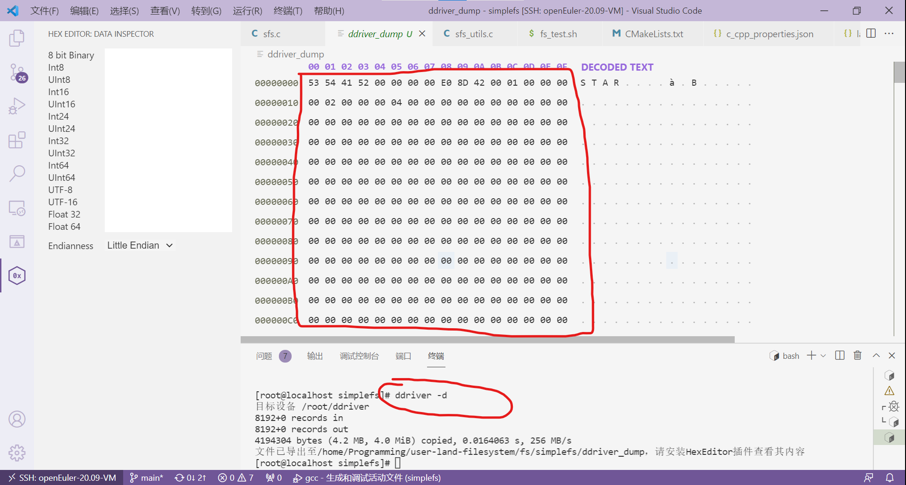

# 实验提示

## 1. 如何调试？

按下F5后，文件系统运行为前台模式，那么如何输入命令呢？事实上，可以ctrl + shift +｀呼出另一个终端，然后在另一个终端操作。


另外，如下图所示，可以按这个 **拆分键** ，就可以同时显示两个终端了。


## 2. 挂载失败？

提示"fuse: bad mount point" 如下图所示：


这种情况就是不正常的卸载文件系统，我们显式地调用 **卸载文件系统** 即可：

```sh
teststu_8@OSLabExecNode0:~/pyq/user-land-filesystem/fs/newfs$ fusermount -u ./tests/mnt
teststu_8@OSLabExecNode0:~/pyq/user-land-filesystem/fs/newfs$ 
```

## 3. 挂载点不空？

提示"mountpoint is not empty" 如下图所示：


这种情况就是在测试的时候，不小心给`mnt`文件夹下创建了一个文件，导致错误发生，把 **文件删除** 就行。

## 4. 如何解读EXT2文件系统布局？

可以查看`dump`文件系统镜像，对镜像进行解读：



利用 `ddriver -d` 生成ddriver镜像命令查看镜像。

以simplefs镜像为例：

```console
~/user-land-filesystem/fs/simplefs$ ddriver -d
[sudo] password for test_19:
目标设备 /home/students/test_19/ddriver
8192+0 records in
8192+0 records out
4194304 bytes (4.2 MB, 4.0 MiB) copied, 0.0632482 s, 66.3 MB/s
文件已导出至/home/students/test_19/user-land-filesystem/fs/simplefs/ddriver_dump，请安装HexEditor插件查看其内容
```

在VSCode上安装HexEditor插件，即可查看`ddriver_dump`镜像的内容。

## 5. 实验评测中的位图检查原理

为避免大家照搬Simple File System代码，实验评测脚本`./tests/checkbm/check_bm.py`会根据大家填写的fs.layout文件，确定ddriver磁盘布局，检查super、inode_map、data_map各项内容，如果检查失败，check_bm.py会返回相应的错误，大家依错自行查改即可。

具体检查原理可以查看：https://gitee.com/ftutorials/user-land-filesystem/blob/main/fs/template/tests/checkbm/README.md
