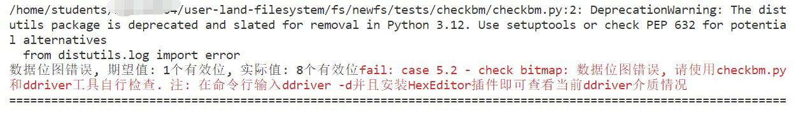

# 常见问题

## 1. 如何新开一个命令行

&emsp;&emsp;按下`F5`（或`Fn+F5`）后，文件系统运行为 **前台模式** 。想要输入命令，如执行`ls`，则需要新开一个命令行。可以通过`ctrl + shift +｀`呼出一个新的命令行，然后在命令行操作。


&emsp;&emsp;另外，如下图所示，可以按这个 **拆分键** ，就可以同时显示两个终端了。


## 2. 挂载点没连接上

&emsp;&emsp;提示"fuse: bad mount point ... Transports end point is not connected" 如下图所示：


&emsp;&emsp;这种情况就是不正常的卸载文件系统，同学们直接`ctrl + c`或者在VSCode直接关掉程序，导致上次的挂载点仍被占用。我们需要完成 **文件系统的卸载** ，释放上次占用的挂载点：

```sh
fusermount -u ./tests/mnt
```

## 3. 挂载点不空

&emsp;&emsp;提示"mountpoint is not empty" 如下图所示：


&emsp;&emsp;这种情况就是在测试的时候，不小心给`mnt`文件夹下创建了一个文件，导致`mnt`目录不是空的，把`mnt`下的 **文件删除** 即可，保证`mnt`目录在挂载时是空的 。

## 4.挂载点不存在

&emsp;&emsp;提示"fuse: bad mount point ... No such file or directory" 如下图所示：


这种情况是，文件系统挂载的挂载点，如`./tests/mnt`不存在。需要同学们提前创建好一个空的文件夹`./tests/mnt`。

## 5.挂载点忙碌

&emsp;&emsp;同学们在执行任务一的测评脚本时，如果遇到`fusermount: failed to umount xxx : Device or resource busy`的问题，请使用`git pull`命令更新实验包的任务一测评程序即可。

## 6.S_IFxxx标红


&emsp;&emsp;这个问题包括任务一和任务二，上图以`simplefs`为例展示。

&emsp;&emsp;这个标红不会影响同学们项目的编译（`F5`或`Fn + F5`），可以选择直接无视。如果你项目编译失败，不是因为这个问题。

&emsp;&emsp;当然如果看着不习惯，想取消掉标红，可以在这个文件的 **第一行** （注意是第一行），添加以下这个宏定义。

```c
#define _XOPEN_SOURCE 700
```

[一个帖子](https://cloud.tencent.com/developer/ask/sof/107977855?from=16139)给出的参考解释：


## 7.F5编译失败

### 7.1 spawn ... 但出现错误

&emsp;&emsp;终端界面出现spawn /bin/bash ENOENT生成已完成，但出现错误的错误提示，如下图所示：


&emsp;&emsp;这个原因是同学们的项目还没通过`ctrl + shift + p`进行项目编译环境的配置（见指导书[项目编译](../part3#13)）。编译环境配置完成后，会生成一个`build`目录的，这个时候再按`F5`编译即可。

### 7.2 #error Please ... flags

&emsp;&emsp;问题界面出现#error Please add -D_FILE_OFFSET_BITS=64 to your compile flags!，如下图所示：


&emsp;&emsp;请检查`VSCode`打开的目录，是不是正确的。不要直接打开`user-land-filesystem`目录或其他目录。

&emsp;&emsp;如果想做任务一，请用`VSCode`打开`demo`文件夹。如果想做任务二，请用`VSCode`打开`newfs`（你自己的fs）文件夹。如果想调试`simplefs`，请用`VSCode`打开`simplefs`文件夹。

&emsp;&emsp;打开正确的目录后按照指导书[项目编译](../part3#13)进行即可。

### 7.3 multiple definition ... first defined here

&emsp;&emsp;编译时出现`xxx_super`、`xxx_options`的multiple definition ... first defined here报错，如下图所示：


&emsp;&emsp;原因是没有正确的进行全局变量(`xxx_super`、`xxx_options`)的跨文件使用

&emsp;&emsp;如何对全局变量，如`sfs_super`和`sfs_options`（以`simplefs`为例），进行跨文件使用？答案是借助好`extern`关键字（在`xv6 lab2 syscall`实验应该已经接触过它）。

&emsp;&emsp;以`simplefs`为例，在`sfs.c`文件声明好全局变量，然后在其他需要使用的文件，如`sfs_utils.c`和`sfs_debug.c`使用`extern`关键字告诉编译器去别的文件找，这里直接使用。


### 7.4 找不到任务“C/C++: gcc生成活动文件”


&emsp;&emsp;可能是因为扩展安装不成功导致.json的解析有问题，请确认CMake、CMake Tools、C/C++三个扩展已成功安装到远程实验平台。如果还是无法解决，可以进入build目录，`make`手动编译可执行文件，之后点击“仍要调试”应该可以进行调试。也可在编译后手动输入launch.json中的命令（以任务一的demo为例，build/demo -f -d -s tests/mnt）进行挂载和手动测试，但是这样不能使用vscode的调试功能。

## 8.位图不通过或没写回数据区

&emsp;&emsp;运行测评脚本时，在`case 5.2 - check bitmap`中显示，索引节点位图错误，数据位图错误，没有写回到数据区等。

### 8.1 索引节点位图错误

&emsp;&emsp;如下图所示：


&emsp;&emsp;测试场景是：清空磁盘重新挂载文件系统后，在根目录下创建了一个文件，根目录有一个`inode`，文件有一个`inode`，总计两个`inode`。也就是`inode`位图应该是两个有效位。而你的有效位是21个（以上图为例）。

&emsp;&emsp;请通过打印位图或者使用Hex Editor查看磁盘等方式查看`inode`位图，辅助检查一下自己的`inode`位图修改逻辑是否正确。

### 8.2 数据位图错误

&emsp;&emsp;如下图所示：



&emsp;&emsp;测试场景是：清空磁盘重新挂载文件系统后，在根目录下创建了一个空文件，根目录有一个数据块，空文件没有数据块，总计一个数据块。也就是数据位图的只有一个有效位。而你的有效位有八个（以上图为例）。

&emsp;&emsp;额外注意的是，参考[任务二实验内容](../part3#31)的第四点，同学们需要按需分配，不能预先分配数据块。

&emsp;&emsp;请通过打印位图或者使用Hex Editor查看磁盘等方式查看数据位图，辅助检查一下自己的数据位图修改逻辑是否正确。

### 8.3 没写回到数据区


&emsp;&emsp;这个是文件对应的内容，没写到对应的数据块中。

&emsp;&emsp;以根目录的内容为例，根目录对应的数据块应该是第一个数据块（假设是逻辑块500），那么逻辑块500应该要出现根目录的子内容，即所有文件的`dentry_d`结构体。

## 9.Operation not permitted

&emsp;&emsp;文件系统挂载成功了，但执行操作，例如`mkdir`时，显示`Operation not permitted`，如下图的命令行处所示：


&emsp;&emsp;一个可能的原因是，在一些钩子函数处，例如在`getattr`处（如上图代码处所示）， 处理异常流使用了`-1`。在`Linux`错误号中，`-1`就表示`Operation not permitted`。

&emsp;&emsp;处理的办法是在处理异常流的时候正确的使用`Linux`错误号，下面以`simplefs`使用到的错误号定义简单做讲解。

```c
/* 上述示例 */
EPERM /* 值为1, Operation not permitted */

/* 下面是simplefs的错误号定义 */
#define SFS_ERROR_NONE          0
#define SFS_ERROR_ACCESS        EACCES /* 值为13, Permission denied */
#define SFS_ERROR_SEEK          ESPIPE /* 值为29, Illegal seek */    
#define SFS_ERROR_ISDIR         EISDIR /* 值为21, Is a directory */
#define SFS_ERROR_NOSPACE       ENOSPC /* 值为13, No space left on device */
#define SFS_ERROR_EXISTS        EEXIST /* 值为17, File exists */
#define SFS_ERROR_NOTFOUND      ENOENT /* 值为2, No such file or directory */
#define SFS_ERROR_UNSUPPORTED   ENXIO /* 值为6, No such device or address */
#define SFS_ERROR_IO            EIO   /* 值为5, I/O Error */
#define SFS_ERROR_INVAL         EINVAL /* 值为22, Invalid argument */
```

&emsp;&emsp;同学们可以参考`simplefs`的错误号使用，正确的使用相关错误号。

## 10.其他问题 & debug

&emsp;&emsp;很大概率是自身代码实现的问题。

&emsp;&emsp;请灵活`F5`挂载文件系统，通过使用包括但不限于如下的debug手段：

- `printf`大法

&emsp;&emsp;例如每个函数都打印其函数名，`printf("### %s ###\n", __func__);`，看看最终在哪个函数出的问题。打印可能导致错误的变量，数据位图大小或偏移等，看看是否符合自己的预期。多打印几条不同的`printf`语句，看最后打印在了哪一条，从而来定位问题出现在哪个区间等等。

- `VSCode`设置断点

&emsp;&emsp;单步调试，在左侧窗口看看各个变量的值是否合理，或者找到crash的地方等等。


- 注释掉部分代码

&emsp;&emsp;通过注释掉部分代码，来重新运行文件系统，看文件系统是否会发生crash，来定位到最终发生问题的地方。可以采用二分的思想来不断缩小注释的区间来定位。

- 使用Hex Editor查看磁盘镜像

&emsp;&emsp;对磁盘镜像进行查看，检查一下例如数据位图、索引节点位图的具体数值，数据写回位置是否和预期的相符等。同学可以参考实验原理中[磁盘镜像查看](../part2#22)的例子。
