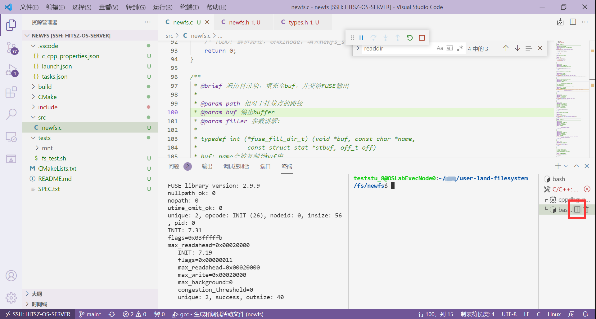
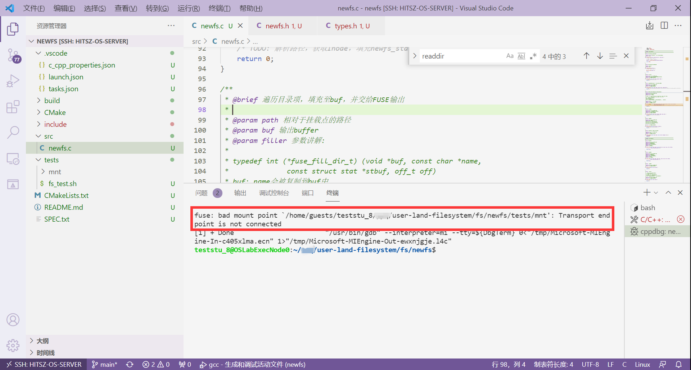
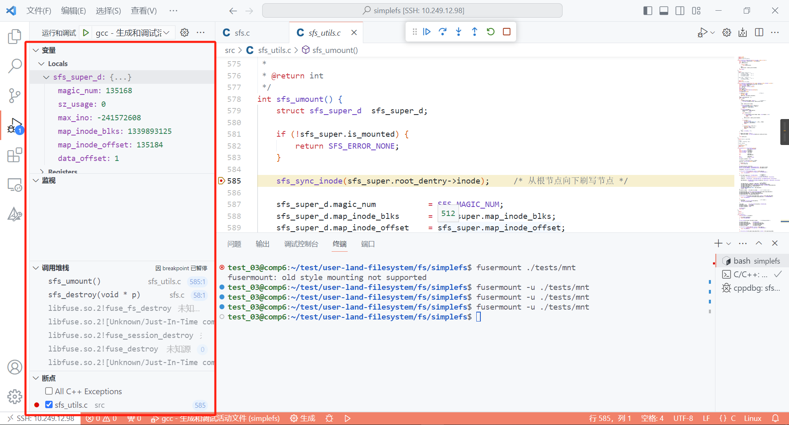

# 常见问题

## 1. 如何新开一个命令行

按下`F5`（或`Fn+F5`）后，文件系统运行为 **前台模式** 。想要输入命令，如执行`ls`，则需要新开一个命令行。可以通过`ctrl + shift +｀`呼出一个新的命令行，然后在命令行操作。


另外，如下图所示，可以按这个 **拆分键** ，就可以同时显示两个终端了。



## 2. 挂载点没连接上

提示"fuse: bad mount point ... Transports end point is not connected" 如下图所示：



这种情况就是不正常的卸载文件系统，同学们直接`ctrl + c`或者在VSCode直接关掉程序，导致上次的挂载点仍被占用。我们需要完成 **文件系统的卸载** ，释放上次占用的挂载点：

```sh
fusermount -u ./tests/mnt
```

## 3. 挂载点不空

提示"mountpoint is not empty" 如下图所示：


这种情况就是在测试的时候，不小心给`mnt`文件夹下创建了一个文件，导致`mnt`目录不是空的，把`mnt`下的 **文件删除** 即可，保证`mnt`目录在挂载时是空的 。

## 4.挂载点不存在

提示"fuse: bad mount point ... No such file or directory" 如下图所示：


这种情况是，文件系统挂载的挂载点，如`./tests/mnt`不存在。需要同学们提前创建好一个空的文件夹`./tests/mnt`。

## 5.挂载点忙碌

同学们在执行任务一的测评脚本时，如果遇到`fusermount: failed to umount xxx : Device or resource busy`的问题，请使用`git pull`命令更新实验包的任务一测评程序即可。

## 6.S_IFxxx标红


这个问题包括任务一和任务二，上图以`simplefs`为例展示。

这个标红不会影响同学们项目的编译（`F5`或`Fn + F5`），可以选择直接无视。如果你项目编译失败，不是因为这个问题。

当然如果看着不习惯，想取消掉标红，可以在这个文件的 **第一行** （注意是第一行），添加以下这个宏定义。

```c
#define _XOPEN_SOURCE 700
```

[一个帖子](https://cloud.tencent.com/developer/ask/sof/107977855?from=16139)给出的参考解释：


## 7.F5编译失败

### 7.1 spawn ... 但出现错误

终端界面出现spawn /bin/bash ENOENT生成已完成，但出现错误的错误提示，如下图所示：


这个原因是同学们的项目还没通过`ctrl + shift + p`进行项目编译环境的配置（见指导书[项目编译](../part3#13)）。编译环境配置完成后，会生成一个`build`目录的，这个时候再按`F5`编译即可。

### 7.2 #error Please ... flags

问题界面出现#error Please add -D_FILE_OFFSET_BITS=64 to your compile flags!，如下图所示：


请检查`VSCode`打开的目录，是不是正确的。不要直接打开`user-land-filesystem`目录或其他目录。

如果想做任务一，请用`VSCode`打开`demo`文件夹。如果想做任务二，请用`VSCode`打开`newfs`（你自己的fs）文件夹。如果想调试`simplefs`，请用`VSCode`打开`simplefs`文件夹。

打开正确的目录后按照指导书[项目编译](../part3#13)进行即可。

## 8.其他问题 & debug

很大概率是自身代码实现的问题。

请灵活`F5`挂载文件系统，通过使用包括但不限于如下的debug手段：

- `printf`大法

例如每个函数都打印其函数名，`printf("### %s ###\n", __func__);`，看看最终在哪个函数出的问题。打印可能导致错误的变量，数据位图大小或偏移等，看看是否符合自己的预期。

- `VSCode`设置断点

单步调试，在左侧窗口看看各个变量的值是否合理，或者找到crash的地方等等。



- 注释掉部分代码

通过注释掉部分代码，来重新运行文件系统，看文件系统是否会发生crash，来定位到最终发生问题的地方。可以采用二分的思想来不断缩小注释的区间来定位。

