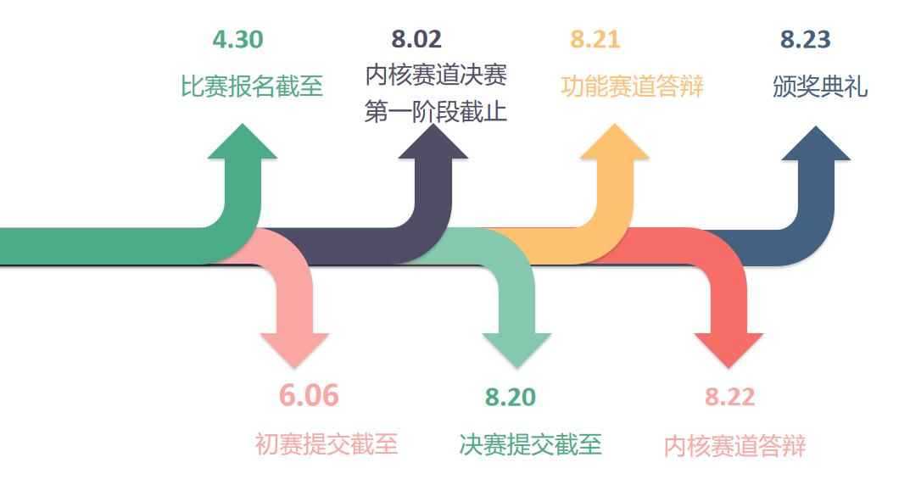

# 2023年“全国大学生计算机系统能力大赛操作系统设计赛”火热报名中！

# 1. 操作系统设计赛简介

!!! tip   "📢 什么是操作系统设计赛?"

    -  **全称** ： **全国大学生计算机系统能力大赛操作系统设计大赛** 
    
        - 由教育部高等学校计算机类专业教学指导委员会和系统能力培养研究专家组共同发起，目前已经举办2届。
    
        - 第一届于2021年举办，**近200支队伍** 参赛。第二届的参赛队伍增加到了 **300余支** 。
    
        - 比赛分为两个赛道：**内核赛道** 和 **功能赛道**
        - 大赛官网：https://os.educg.net
    
    -  **内核赛道** ：
    
        - 制作一个 **完整的内核** ，通过赛方提供的用户测试，有余力的队伍还可以去支持python，rust，redis......
        - **功能** 与 **性能** 的比拼
    
    -  **功能赛道** ：
    
        - 实现系统中的 **某项** 前沿功能
        - **多种课题** 任选，涉及调度、通信、存储、安全、应用等不同领域
    
    -  **关于比赛组队** ：
        - 不限制学校的参赛队伍数，一支队伍最多三人
    
    -  **第二届（2022年）比赛重要时间点**   ：
      
    

    -  **比赛奖项设置** ： 
           
        | 赛道     | 一等奖  | 二等奖  | 三等奖   |
        | -------- | ------- | ------- | -------- |
        | 内核赛道 | 6支队伍 | 9支队伍 | 11支队伍 |
        | 功能赛道 | 6支队伍 | 9支队伍 | 15支队伍 |
    
    - 注：入围决赛即获得优胜奖，**几乎所有队伍都能拿到** ~   ​​    
    
    

    

# 2. 参赛要求
!!! tip        "📢 哪些同学适合参赛?"
    
    - {--==**写个操作系统** 而已，有手就行==--}；  
    - 对操作系统的 **完整体系** 充满兴趣；
    - 对内核 **优化** 充满想法
    
        -  **内核赛道欢迎你！** 
    
        
    
    - 希望尝试 **科研** or 提前接触 **工业界** 
    - 希望对 **前沿、未知** 的技术进行探索
    
        -  **功能赛道欢迎你！** 

# 3. 参赛收获
## 3.1 校内收获
!!! info   "📢 在学校内，你能收获什么?"

    - 接触并亲自尝试 **前沿** 的技术
    
    - **结识** 很多行业大佬、同龄大佬
    
    
    
    - 获得对操作系统整个体系或某个领域的深刻 **理解**
    - 快速提升动手能力和创新能力，丰富自己的软硬件 **技术栈**
    - 难得的机会：把大胆的 **想法变为现实**
    - 获得 **综测加分** 机会，奖学金++
    - 对未来的 **升学** 有非常大的帮助
    - ( 一笔非常可观的奖金：参加比赛，顺便挣个W，妈妈再也不用担心我生活过得不好了

## 3.2 校外收获
!!! info   "📢 在学校外，你又能收获什么?"
    - 实习Offer率++：暑期华为实习Offer率直升 **十几个** 百分点（华为急缺系统性人才）
    - 顶级Offer率++：某几个队长一不小心就收割了华为的{==**研究生才能拿到的顶级Offer**==}

# 4. 比赛准备

!!! warning    "📢 这个比赛难吗?"
    
    **难** ，难得很
    
    - 想要取得好成绩，面对的一切都是 **新** 的
        - 新的知识，新的语言，新的测评，新的工具，新的要求 ...
    - 系统的 **调试** 常常涉及硬件架构，难度大大提升
      
    - **赛程很长** ，最重要的是 **兴趣和坚持** ，很多队伍到后面会放弃，肝到胜利
    
        - 事实上，大部分队伍从 **年初** 就开始备赛， **一些队伍甚至前一年就有所准备，还有参加了两届的队员**
    
    
    
    最关键的是，**系统的设计没有上限** ，想要做好就必须有所付出

# 5. 往届战绩
!!! danger     "📢 我们的战绩"
    
    第一届：
    
    - “ UltraOS ”队获得 **内核实现赛道一等奖（赛道排名第一）** ;
    - “ HoitFS ”队获得 **功能设计赛道一等奖（赛道排名第一）** ;
    - “ 压缩鸭 ”队获得 **功能设计赛道二等奖** ;
    - “ 啊普鲁派哒哒哒;DROP DATABASE teams;”队获得 **内核实现赛道三等奖** 。
      
    第二届：
    
    - “ FTL OS ”队获得 **内核实现赛道一等奖** ;
    - “ OopS ”队获得 **内核实现赛道一等奖** ;
    - “ LMY ”队获得 **功能设计赛道一等奖** ;
    - “ 健康向上好青年 ”队获得 **内核实现赛道二等奖** ;
    - “ 编译通过求求了 ”队获得 **功能设计赛道二等奖** ;
    - “ F-Tutorials ”队获得 **功能设计赛道二等奖** ；
    - “ 随便取名不队 ”获得 **内核实现赛道优胜奖** ;
    - “ 追光者队”获得 **功能设计赛道初赛优胜奖** 。

    大赛获奖团队将获得丰厚奖金，其中一等奖团队获得30000元奖金，二等奖团队获10000元奖金，三等奖团队获得3000元奖金。
    
    第二届获奖新闻详见哈工大（深圳）计算机科学与技术学院-重要新闻：[获奖数量全国居首！哈工大（深圳）学子在全国大学生操作系统设计总赛中表现优异](http://cs.hitsz.edu.cn/info/1114/6261.htm)
    
    第一届获奖新闻详见[获奖总数全国第一！哈工大（深圳）学子在全国大学生计算机系统能力大赛中收获四项大奖](https://www.hitsz.edu.cn/article/view/id-123535.html)
    

## 5.1 获奖队伍介绍：UltraOS
!!! danger   "📢 第一届内核赛道一等奖：UltraOS"
    
    团队成员：李程浩，18级本科；宫浩辰，18级本科；任翔宇，18级本科
    
    “项目历时216天，在此期间编写代码149天，UltraOS团队最终产出了约一万行Rust语言代码（不包括迭代代码）。UltraOS成长是迅速的，从支持13条非标准系统调用到59条系统调用，从只支持一个简易的文件系统到FAT32-VFS和可拓展设备接口等具有可拓展的抽象，从单核到多核，从缓慢迈向高性能。每一件事都是挑战，但每一件事都是成长。”
    
    
    

## 5.2 获奖队伍介绍: HoitFS
!!! danger   "📢 第一届功能赛道一等奖：HoitFS"
    
    团队成员：潘延麒，18级本科；胡智胜，18级本科；张楠，18级本科
    
    “我们的项目以JFFS2文件系统为原型，对其SylixOS上进行二次开发，并针对JFFS2存在的一些问题进行针对性优化(优化策略比较简单)，形成了HoitFS，最后通过与SPIFFS文件系统做对比，发现我们HoitFS的性能相对SPIFFS来说有明显的优势。本项目历时近一年，期间一度感到力不从心，但在老师的指导下，团队成员的互相鼓励下，最后都咬牙坚持到了决赛。”
    
    
    

## 5.3 获奖队伍介绍: FTL OS
!!! danger   "📢 第二届内核赛道一等奖：FTL OS"
    
    团队成员：叶自立，19级本科；樊博，20级本科；李羿廷，19级本科
    
    “非常荣幸能够获得大赛一等奖，这次比赛中我们一路披荆斩棘，通过了全部的功能测试，并在决赛第二阶段全程保持性能分第一。
    
    我们充满梦想，FTL意为Faster Than Light，它蕴含了操作系统对性能的渴望。为了实现这一目标，我们用了与众不同的开发方式：我们从零开始，先编写文档，从起步就进行大量优化。我们乐观地认为只要应用了一切可能的优化，FTLOS就能达到极致的、后无来者的性能。从结果来看，此方案大体成功，我们全程性能分第一，但因为调研不足的原因，文件系统的错误设计影响了重构，FTLOS无法在全部的测试点上获得第一，也让我们没有太多时间去移植真实应用程序。
    
    这是我们第一次参加系统能力大赛，它让我们接触到了大量无法从课本上学到的知识，使我们了解了现代操作系统的运行方式，对操作系统有了更深层次的理解，还显著提升了工程实践能力。感谢全部队员、伙伴队伍的努力，感谢夏文、仇洁婷老师的倾力帮助，也感谢所有在比赛中实时开源代码、展示文档的参赛队伍。愿比赛在未来更加完善，越来越好。”
    
    
    

## 5.4 获奖队伍介绍: OopS

!!! danger   "📢 第二届内核赛道一等奖：OopS"

    团队成员：张艺枫，19级本科；李诺舟，19级本科；刘嘉琛，19级本科
    
    “OopS是一个用Rust编写的RISC-V64多核操作系统，项目总历时约7个月。我们团队从今年的寒假期间就开始学习rust及操作系统相关知识，为该比赛做准备。
    
    在开发前，我们考虑到从0开始设计一个内核会带来大量的bug和时间开销，所以我们决定参考rCore-Tutorial快速开发出一个基本的内核。之后，我们比较顺利地通过了初赛的测试，这给了我们信心，于是我们对原本的基础架构做了大量修改。通过不断地踩坑和重构，并结合其他内核的设计和我们的思考，最终打造出了现在的OopS内核。
    
    通过这次比赛，加深了我们对操作系统的理解，提升了我们的工程能力。此外，本次比赛让我们更加理解了开源的精神，我们的心态也从相互竞争转变为了相互学习。我们发现，与第一届参赛作品相比，本届参赛作品在功能和性能方面都有了不小的提升。这要感谢组委会和主办方为选手提供了一个平台，让我们有机会吸取往届参赛作品的经验，踩在巨人的肩膀上并更进一步。以后的参赛作品无疑也会比我们这届的作品要更加优秀。
    
    在这里，还要感谢同校的参赛队伍和指导老师的帮助和指导，特别是第一届参赛选手黎庚祉学长给我们传授了大量的经验和灵感。”
    
    
    

## 5.5 获奖队伍介绍: LMY

!!! danger   "📢 第二届功能赛道一等奖：LMY"

    团队成员：于伯淳，20级本科；满洋，20级本科；李怡凯，19级本科
    
    “很荣幸能够在本次操作系统设计赛功能赛道中获得一等奖，在大赛结束之际，回想参赛以来的点点滴滴，我们感概颇多。
    
    最初决定参赛，是偶然在学校的Linux交流群看到老师对操作系统功能赛的宣传。那时我和满洋没有完整学习过操作系统，但凭着对OS的兴趣，我们决定试着参赛。
    
    选定赛题时，经验不足的我们本想选取一个较为简单的题目；但两位指导老师鼓励我们选择更为复杂的题目proj120——智能化的操作系统异常检测，同时李怡凯学长的加入也为我们带来更多信心，我们最终接受了挑战。
    
    初期，我们凭借老师悉心的指导，与华为专家的沟通，努力寻找赛题的切入点，之后便是按部就班地实现。由于项目经验不足，后期时间安排得很紧张，但也跌跌撞撞进入了决赛。决赛阶段，我们实现了老师建议的创新点，并把20多页的文档完善至近80页。为了准备答辩，PPT也在老师的指导下更新了一版又一版。
    
    最终的结果出乎我们的意料，但回顾一路以来付出的心血和老师的耳提面授，却又显得理所应当。在大赛中，我们的专业素养得到了锻炼，文档编写和交流合作的能力也得到了提高。虽然辛苦，但也为今后的专业道路倾注了更深厚的力量。”
    
    
    

# 6. 报名方式

!!! tip   "📢 如何报名？"
    我校OS比赛将预计在元旦节前后（具体时间待确定）开放报名，现在参加操作系统大赛，将获得退休选手的宝贵参赛经验，机会难得！感兴趣的同学欢迎入群：
    
    

    
    

    
    

------

操作系统是计算机领域的一大核心，  
深入理解操作系统，不管以后参与到哪个方向的工作中，都会从中获益。  
欢迎参加操作系统设计赛，体验系统设计的独特魅力。

