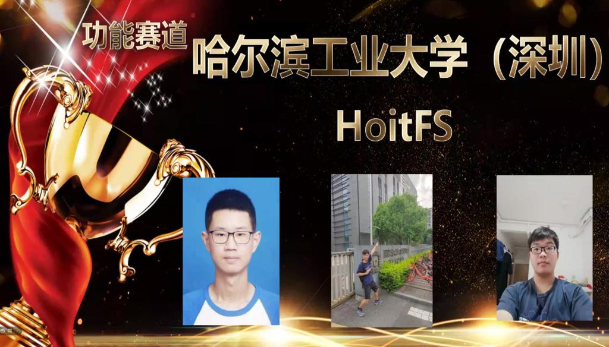
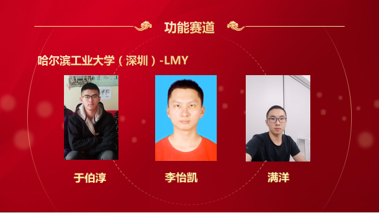

# 2024年“全国大学生计算机系统能力大赛操作系统设计赛”火热报名中！

# 1. 操作系统设计赛简介

!!! tip   "📢 什么是操作系统设计赛?"

    -  **全称** ： **全国大学生计算机系统能力大赛操作系统设计大赛** 
    
        - 由教育部高等学校计算机类专业教学指导委员会和系统能力培养研究专家组共同发起，目前已经举办2届。
    
        - 第一届于2021年举办，**近200支队伍** 参赛。第二届/第三届的参赛队伍增加到了 **300余支** 。
    
        - 比赛分为两个赛道：**内核赛道** 和 **功能赛道**
        - 大赛官网：https://os.educg.net
    
    -  **内核赛道** ：
    
        - 制作一个 **完整的内核** ，通过赛方提供的用户测试，有余力的队伍还可以去支持python，rust，redis......
        - **功能** 与 **性能** 的比拼
    
    -  **功能赛道** ：
    
        - 实现系统中的 **某项** 前沿功能
        - **多种课题** 任选，涉及调度、通信、存储、安全、应用等不同领域
    
    -  **关于比赛组队** ：
        - 不限制学校的参赛队伍数，一支队伍最多三人
    
    -  **第三届（2023年）比赛重要时间点**   ：
      
    

    -  **比赛奖项设置** ： 
           
          - 特等奖，1队，颁发团队奖金及获奖证书。（该奖项可空缺）
          - 一等奖，不少于2队，颁发团队奖金及获奖证书。     
          - 二等奖，不少于4队，颁发团队奖金及获奖证书。 
          - 三等奖，不少于8队，颁发团队奖金及获奖证书。 
    
    - 注：入围决赛即获得优胜奖，**几乎所有队伍都能拿到** ~   ​​    
    
    

    

# 2. 参赛要求
!!! tip        "📢 哪些同学适合参赛?"
    
    - {--==**写个操作系统** 而已，有手就行==--}；  
    - 对操作系统的 **完整体系** 充满兴趣；
    - 对内核 **优化** 充满想法
    
        -  **内核赛道欢迎你！** 
    
        
    
    - 希望尝试 **科研** or 提前接触 **工业界** 
    - 希望对 **前沿、未知** 的技术进行探索
    
        -  **功能赛道欢迎你！** 

# 3. 参赛收获
## 3.1 校内收获
!!! info   "📢 在学校内，你能收获什么?"

    - 接触并亲自尝试 **前沿** 的技术
    
    - **结识** 很多行业大佬、同龄大佬
    
    
    
    - 获得对操作系统整个体系或某个领域的深刻 **理解**
    - 快速提升动手能力和创新能力，丰富自己的软硬件 **技术栈**
    - 难得的机会：把大胆的 **想法变为现实**
    - 获得 **综测加分** 机会，奖学金++
    - 对未来的 **升学** 有非常大的帮助
    - ( 一笔非常可观的奖金：参加比赛，顺便挣个W，妈妈再也不用担心我生活过得不好了

## 3.2 校外收获
!!! info   "📢 在学校外，你又能收获什么?"
    - 实习Offer率++：暑期华为实习Offer率直升 **十几个** 百分点（华为急缺系统性人才）
    - 顶级Offer率++：某几个队长一不小心就收割了华为的{==**研究生才能拿到的顶级Offer**==}

# 4. 比赛准备

!!! warning    "📢 这个比赛难吗?"
    
    **难** ，难得很
    
    - 想要取得好成绩，面对的一切都是 **新** 的
        - 新的知识，新的语言，新的测评，新的工具，新的要求 ...
    - 系统的 **调试** 常常涉及硬件架构，难度大大提升
      
    - **赛程很长** ，最重要的是 **兴趣和坚持** ，很多队伍到后面会放弃，肝到胜利
    
        - 事实上，大部分队伍从 **年初** 就开始备赛， **一些队伍甚至前一年就有所准备，还有参加了两届的队员**
    
    
    
    最关键的是，**系统的设计没有上限** ，想要做好就必须有所付出

# 5. 往届战绩
!!! danger     "📢 我们的战绩"
    
    第一届（2021）：
    
    - “ UltraOS ”队获得 **内核实现赛道一等奖（赛道排名第一）** ;
    - “ HoitFS ”队获得 **功能设计赛道一等奖（赛道排名第一）** ;
    - “ 压缩鸭 ”队获得 **功能设计赛道二等奖** ;
    - “ 啊普鲁派哒哒哒;DROP DATABASE teams;”队获得 **内核实现赛道三等奖** 。
      
    第二届（2022）：
    
    - “ FTL OS ”队获得 **内核实现赛道一等奖** ;
    - “ OopS ”队获得 **内核实现赛道一等奖** ;
    - “ LMY ”队获得 **功能设计赛道一等奖** ;
    - “ 健康向上好青年 ”队获得 **内核实现赛道二等奖** ;
    - “ 编译通过求求了 ”队获得 **功能设计赛道二等奖** ;
    - “ F-Tutorials ”队获得 **功能设计赛道二等奖** ；
    - “ 随便取名不队 ”获得 **内核实现赛道优胜奖** ;
    - “ 追光者队”获得 **功能设计赛道初赛优胜奖** 。

    第三届（2023）：
    
    - “ Titanix ”队获得 **内核实现赛道一等奖** ;
    - “ BoesFS ”队获得 **功能设计赛道一等奖** ;
    - “ COS ”队获得 **功能设计赛道一等奖** ;
    - “ BugMaker ”队获得 **功能设计赛道一等奖** ;
    - “ MankorOS ”队获得 **内核实现赛道二等奖** ;
    - “ 刘航志强 ”队获得 **功能设计赛道二等奖** ；
    - “ MoOS ”获得 **内核实现赛道三等奖** ;
    - “ 嘉然今天吃OS ”获得 **功能设计赛道三等奖** ；
    - “ RethinkFS ”获得 **功能设计赛道三等奖** 。

    大赛获奖团队将获得丰厚奖金，其中一等奖团队获得30000元奖金，二等奖团队获10000元奖金，三等奖团队获得3000元奖金:)

    - 内核实现赛道决赛作品开源：[点这里](https://os.educg.net/#/index?name=2022%E5%85%A8%E5%9B%BD%E5%A4%A7%E5%AD%A6%E7%94%9F%E8%AE%A1%E7%AE%97%E6%9C%BA%E7%B3%BB%E7%BB%9F%E8%83%BD%E5%8A%9B%E5%A4%A7%E8%B5%9B%E6%93%8D%E4%BD%9C%E7%B3%BB%E7%BB%9F%E8%AE%BE%E8%AE%A1%E8%B5%9B-%E5%86%85%E6%A0%B8%E5%AE%9E%E7%8E%B0%E8%B5%9B&index=1&img=2)
    - 功能设计赛道决赛作品开源：[点这里](https://os.educg.net/#/index?name=2022%E5%85%A8%E5%9B%BD%E5%A4%A7%E5%AD%A6%E7%94%9F%E8%AE%A1%E7%AE%97%E6%9C%BA%E7%B3%BB%E7%BB%9F%E8%83%BD%E5%8A%9B%E5%A4%A7%E8%B5%9B%E6%93%8D%E4%BD%9C%E7%B3%BB%E7%BB%9F%E8%AE%BE%E8%AE%A1%E8%B5%9B-%E5%8A%9F%E8%83%BD%E6%8C%91%E6%88%98%E8%B5%9B&index=1&img=0)    

    获奖新闻报道：
    
    - 第一届：[获奖总数全国第一！哈工大（深圳）学子在全国大学生计算机系统能力大赛中收获四项大奖](https://www.hitsz.edu.cn/article/view/id-123535.html)
    - 第二届：[获奖数量全国居首！哈工大（深圳）学子在全国大学生操作系统设计总赛中表现优异](https://www.hitsz.edu.cn/article/view/id-135468.html)
    - 第三届：[一等奖+4！深圳校区学子在全国大学生操作系统设计赛中创历史最佳战绩](https://www.hitsz.edu.cn/article/view/id-142937.html)
    
    

## 5.1 获奖队伍介绍：UltraOS
!!! danger   "📢 第一届内核赛道一等奖：UltraOS"
    
    团队成员：李程浩，18级本科；宫浩辰，18级本科；任翔宇，18级本科
    
    “项目历时216天，在此期间编写代码149天，UltraOS团队最终产出了约一万行Rust语言代码（不包括迭代代码）。UltraOS成长是迅速的，从支持13条非标准系统调用到59条系统调用，从只支持一个简易的文件系统到FAT32-VFS和可拓展设备接口等具有可拓展的抽象，从单核到多核，从缓慢迈向高性能。每一件事都是挑战，但每一件事都是成长。”

    作品开源：[点这里](https://gitlab.eduxiji.net/ultrateam/ultraos)
    
    
    

## 5.2 获奖队伍介绍: HoitFS
!!! danger   "📢 第一届功能赛道一等奖：HoitFS"
    
    团队成员：潘延麒，18级本科；胡智胜，18级本科；张楠，18级本科
    
    “我们的项目以JFFS2文件系统为原型，对其SylixOS上进行二次开发，并针对JFFS2存在的一些问题进行针对性优化(优化策略比较简单)，形成了HoitFS，最后通过与SPIFFS文件系统做对比，发现我们HoitFS的性能相对SPIFFS来说有明显的优势。本项目历时近一年，期间一度感到力不从心，但在老师的指导下，团队成员的互相鼓励下，最后都咬牙坚持到了决赛。”

    作品开源：[点这里](https://gitlab.eduxiji.net/Deadpool/project325618-47064)
    
    
    

## 5.3 获奖队伍介绍: FTL OS
!!! danger   "📢 第二届内核赛道一等奖：FTL OS"
    
    团队成员：叶自立，19级本科；樊博，20级本科；李羿廷，19级本科
    
    “非常荣幸能够获得大赛一等奖，这次比赛中我们一路披荆斩棘，通过了全部的功能测试，并在决赛第二阶段全程保持性能分第一。
    
    我们充满梦想，FTL意为Faster Than Light，它蕴含了操作系统对性能的渴望。为了实现这一目标，我们用了与众不同的开发方式：我们从零开始，先编写文档，从起步就进行大量优化。我们乐观地认为只要应用了一切可能的优化，FTLOS就能达到极致的、后无来者的性能。从结果来看，此方案大体成功，我们全程性能分第一，但因为调研不足的原因，文件系统的错误设计影响了重构，FTLOS无法在全部的测试点上获得第一，也让我们没有太多时间去移植真实应用程序。
    
    这是我们第一次参加系统能力大赛，它让我们接触到了大量无法从课本上学到的知识，使我们了解了现代操作系统的运行方式，对操作系统有了更深层次的理解，还显著提升了工程实践能力。感谢全部队员、伙伴队伍的努力，感谢夏文、仇洁婷老师的倾力帮助，也感谢所有在比赛中实时开源代码、展示文档的参赛队伍。愿比赛在未来更加完善，越来越好。”

    作品开源：[点这里](https://gitlab.eduxiji.net/DarkAngelEX/oskernel2022-ftlos)
    
    

    
    

    

## 5.4 获奖队伍介绍: OopS

!!! danger   "📢 第二届内核赛道一等奖：OopS"

    团队成员：张艺枫，19级本科；李诺舟，19级本科；刘嘉琛，19级本科
    
    “OopS是一个用Rust编写的RISC-V64多核操作系统，项目总历时约7个月。我们团队从今年的寒假期间就开始学习rust及操作系统相关知识，为该比赛做准备。
    
    在开发前，我们考虑到从0开始设计一个内核会带来大量的bug和时间开销，所以我们决定参考rCore-Tutorial快速开发出一个基本的内核。之后，我们比较顺利地通过了初赛的测试，这给了我们信心，于是我们对原本的基础架构做了大量修改。通过不断地踩坑和重构，并结合其他内核的设计和我们的思考，最终打造出了现在的OopS内核。
    
    通过这次比赛，加深了我们对操作系统的理解，提升了我们的工程能力。此外，本次比赛让我们更加理解了开源的精神，我们的心态也从相互竞争转变为了相互学习。我们发现，与第一届参赛作品相比，本届参赛作品在功能和性能方面都有了不小的提升。这要感谢组委会和主办方为选手提供了一个平台，让我们有机会吸取往届参赛作品的经验，踩在巨人的肩膀上并更进一步。以后的参赛作品无疑也会比我们这届的作品要更加优秀。
    
    在这里，还要感谢同校的参赛队伍和指导老师的帮助和指导，特别是第一届参赛选手黎庚祉学长给我们传授了大量的经验和灵感。”

    作品开源：[点这里](https://gitlab.eduxiji.net/ZYF_2001/oskernel2022-oops)
    
    

    
    

    

## 5.5 获奖队伍介绍: LMY

!!! danger   "📢 第二届功能赛道一等奖：LMY"

    团队成员：于伯淳，20级本科；满洋，20级本科；李怡凯，19级本科
    
    “很荣幸能够在本次操作系统设计赛功能赛道中获得一等奖，在大赛结束之际，回想参赛以来的点点滴滴，我们感概颇多。
    
    最初决定参赛，是偶然在学校的Linux交流群看到老师对操作系统功能赛的宣传。那时我和满洋没有完整学习过操作系统，但凭着对OS的兴趣，我们决定试着参赛。
    
    选定赛题时，经验不足的我们本想选取一个较为简单的题目；但两位指导老师鼓励我们选择更为复杂的题目proj120——智能化的操作系统异常检测，同时李怡凯学长的加入也为我们带来更多信心，我们最终接受了挑战。
    
    初期，我们凭借老师悉心的指导，与华为专家的沟通，努力寻找赛题的切入点，之后便是按部就班地实现。由于项目经验不足，后期时间安排得很紧张，但也跌跌撞撞进入了决赛。决赛阶段，我们实现了老师建议的创新点，并把20多页的文档完善至近80页。为了准备答辩，PPT也在老师的指导下更新了一版又一版。
    
    最终的结果出乎我们的意料，但回顾一路以来付出的心血和老师的耳提面授，却又显得理所应当。在大赛中，我们的专业素养得到了锻炼，文档编写和交流合作的能力也得到了提高。虽然辛苦，但也为今后的专业道路倾注了更深厚的力量。”

    作品开源：[点这里](https://gitlab.eduxiji.net/CH3CHOHCH3/project788067-124730)
    
    

    
    

    

## 5.6 获奖队伍介绍: Titanix

!!! danger   "📢 第三届内核赛道一等奖：Titanix"

    团队成员：曾培鑫，20级本科；陈佳豪，20级本科；任秦江，20级本科
    
    “非常荣幸获得了内核赛道的一等奖，在参赛的六个月里，我们对内核不断地重构与扩展，通过了所有的测试用例，在决赛的现场赛榜单上取得了第一名的成绩。

    Titanix（Titanic-nix），意味着我们希望编写出一个如泰坦般健壮、尽可能支持更多的功能、同时符合POSIX规范的类Unix操作系统。我们以无栈协程为调度基础，结合Rust的异步机制实现了一个高效的分时多任务异步内核；在此基础上实现了许多模块，如内存、文件系统、网络、驱动等；另外，我们的内核立足现实，能够运行gcc、redis、vi、http服务器等现实应用；我们的内核具有丰富的功能与较高的可扩展性。

    这次比赛给了我们团队成员一次编写较为大型的项目（约两万四千行代码）的机会。我们在开发中合理分工、规范不同分支的提交合并；我们查阅了大量资料，学习业界黄金标准linux，在课内基础上不断拓宽，大大加深了对操作系统的理解；我们深度使用了许多开发调试工具（gdb、objdump、strace等），结合规范的分级日志，提高了工程能力与编程能力。

    最后，感谢几位指导老师的倾力帮助、往届学长的经验传授以及同校参赛队伍的交流分享。”

    作品开源：[点这里](https://gitlab.eduxiji.net/202318123101314/oskernel2023-Titanix)
    
    
    

## 5.7 获奖队伍介绍: BoesFS

!!! danger   "📢 第三届功能赛道一等奖：BoesFS"

    团队成员：杨大荣，20级本科；林颀聪，20级本科；孙赫辰，20级本科
    
    “很荣幸能够获得本次操作系统设计赛功能挑战赛道的一等奖，这离不开五个月来老师们的耐心指导以及队友之间的相互支持。

    BoesFS, Based on eBPF Sandboxing Filesystem。BoesFS项目围绕eBPF、可堆叠文件系统、FaaS应用几个领域展开探索。我们团队经过五个月的项目开发，贡献了近2w行代码，12w字维护文档，推出了一个轻量级的文件安全沙盒层，并尝试应用到FaaS等业务场景中，取得了很好的效果。

    考虑到eBPF近年来的大火，并能和传统的文件系统结合，两者结合或许能有不一样的花火，这个创新的角度一下就吸引了我们。经过和老师研究实现难度后，我们决定选择这个赛题。我们和校内老师和项目老师经过深入讨论，确定了整个项目的大致方向后，开始学习各个模块所需的知识，例如完整阅读了有关eBPF、VFS层、可堆叠文件系统、FaaS开源项目等大量源码等等。然后按部就班的进行设计和开发，从顶层设计整个项目架构，并逐渐从开发简单的demo验证想法，最终到完整完善整个项目。

    通过本次大赛，极大丰富了我们对操作系统一些前沿技术的了解，并针对新的场景能设计出自己的解决方案，促进了我们对这些领域的兴趣，想继续在相关领域做更多的有关探索和研究。最后感谢校内老师夏老师、李老师、仇老师以及校外老师施老师和郑老师的耐心指导和帮助，祝愿大赛能越办越好。”

    作品开源：[点这里](https://gitlab.eduxiji.net/202318123111316/project1466467-176078)
    
    
    

## 5.8 获奖队伍介绍: COS

!!! danger   "📢 第三届功能赛道一等奖：COS"

    团队成员：段子豪，20级本科；谢岸峰，20级本科；黄雯萱，21级本科
    
    “非常荣幸能够获得一等奖，比赛中我们一起克服挫折，团队成员各自发挥长处，这是团队的胜利。

    赛题对顶会与代码阅读，编程能力提出了极高的要求。我们先后阅读了顶会ghost（sosp），几万行的ghost与ext源代码。完成后我们开始在方向上迷茫：从零开始修改linux调度难度太大，千万行的庞大系统；基于他人成果没有创新。最后我们两方面都抓：一部分队员基于他人成果优化，队长修改linux的调度机制。在团队成员的一起努力下成功地完成了预期目标。最后的开发难度与亮眼的优化效果折服了评委。

    参加操作系统大赛让我们接触到业界最新操作系统的研究方向，并且极大地提升了我们的代码能力（魔改linux，修改顶会论文代码）。让我们印象深刻的是指导老师的负责，感谢三位老师！最后也希望大赛越办越好！”

    作品开源：[点这里](https://gitlab.eduxiji.net/202318123111334/proj134-cfs-based-userspace-scheduler)
    
    
    

## 5.9 获奖队伍介绍: BugMaker

!!! danger   "📢 第三届功能赛道一等奖：BugMaker"

    团队成员：孙铎，20级本科；俞文博，20级本科；赖嘉欣，20级本科
    
    “很荣幸取得操作系统功能赛道一等奖，感谢老师们的耐心指导，感谢队员们的不懈努力。

    我们的项目是基于SPDK用户态存储驱动构建多路径软件，设计实现了路径聚合、路径选择、故障处理和负载均衡等功能，可以用于虚拟化与存储区域网络结合的应用场景。

    我们之前并不熟悉操作系统存储开发相关的技术，基于用户态驱动的开发又不同于我们比较熟悉的Linux内核态驱动，这需要我们去阅读大量的SPDK源码，才摸索清楚了SPDK进行I/O操作的大致流程，找到了多路径模块的切入点，接下来才开始核心的开发工作。在开发多路径方案时，为了适配SPDK用户态驱动，我们需要使用gdb进行多轮的调试工作，一行代码要修改很多次才能保证模块的正常运行。最后，我们还要细心搭建合理的测试场景，才能发挥出多路径软件的作用。

    这次操作系统功能赛让我们收获了很多，除了学习到用户态存储相关知识以外，还提升了我们面对陌生领域时的探索能力，这是一次很宝贵的参赛经历。祝愿全国大学生计算机系统能力大赛越办越好！”

    作品开源：[点这里](https://gitlab.eduxiji.net/202318123111333/project1466467-176092)

    
    
    

# 6. 报名方式

!!! tip   "📢 如何报名？"
    我校OS比赛将预计在元旦节前后（具体时间待确定）开放报名。现在参加操作系统大赛，将获得退休选手的宝贵参赛经验，机会难得！感兴趣的同学欢迎入群：
    
    

    
    

    
    

------

操作系统是计算机领域的一大核心，  
深入理解操作系统，不管以后参与到哪个方向的工作中，都会从中获益。  
欢迎参加操作系统设计赛，体验系统设计的独特魅力。

