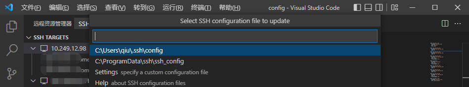
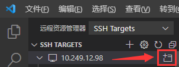
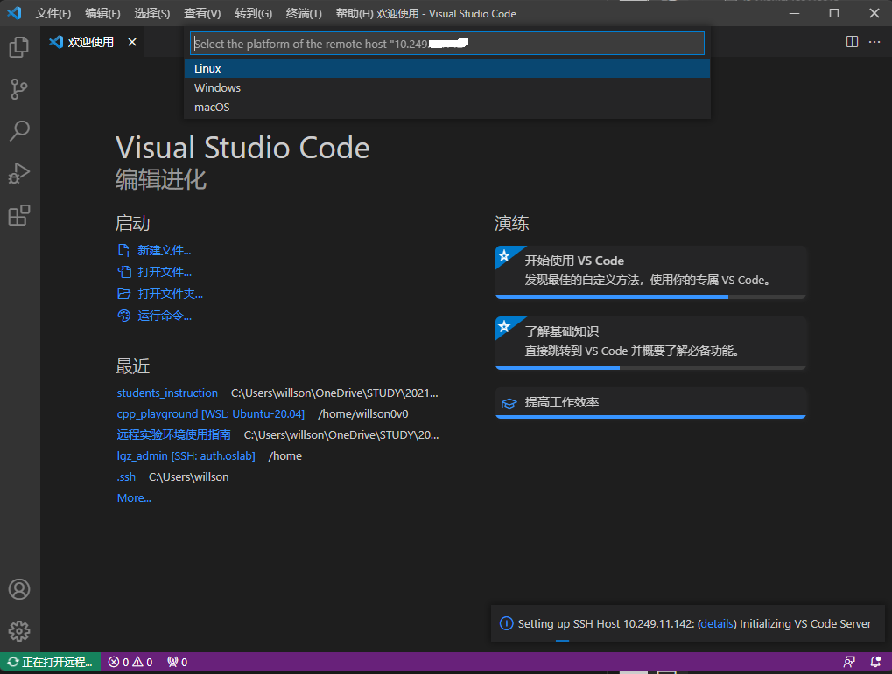
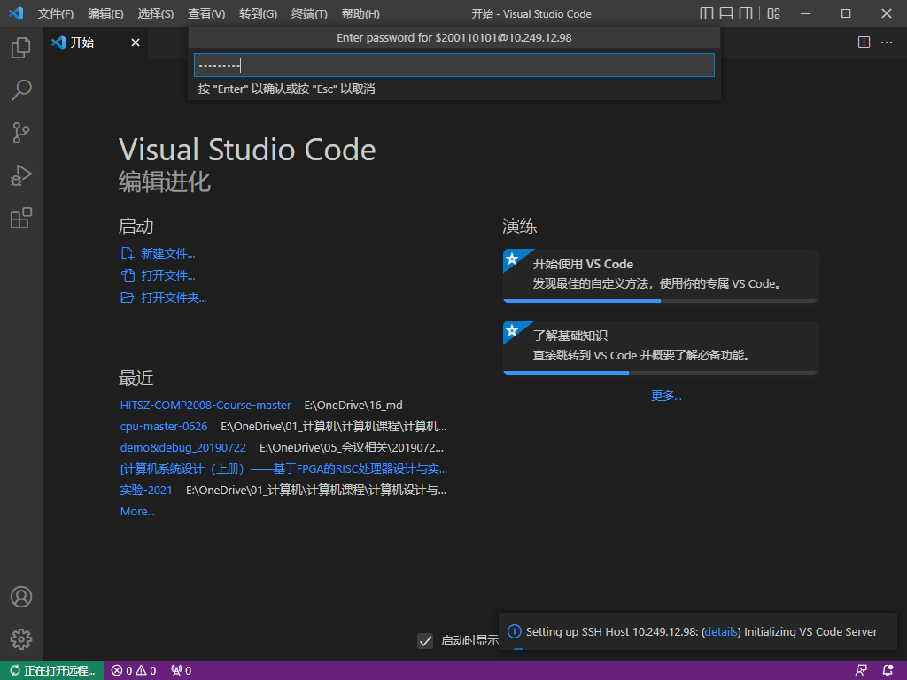
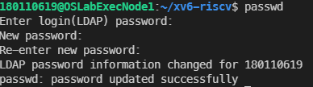

# 远程实验环境使用指南

!!! warning "通知"
    严禁使用远程实验环境做与教学无关事宜，杜绝使用公共资源挖矿等，一经发现将严肃处理，感谢配合！

## 0 速查信息

远程实验平台IP地址： `10.249.12.98` ，端口号： `6666`

!!! info ""
    没错: ) 本课程与《计算机设计与实践》共用同一个远程实验平台。我们已经在远程实验平台上部署了XV6的运行环境，你只需要登录后下载实验代码就可以做实验。
    
    用户名和初始密码都是`你的学号`，出于安全考虑，建议你初次登录后修改初始密码。如果遇到问题，请寻求助教或老师的帮助。

远程实验平台共有8个计算节点，每一个计算节点都提供相同的服务，可能你每次登录的计算节点会不一样，但无须担心，你看到的文件都是一样的。

<div align="center">  </div>

## 1 快速入门

### 1.1 环境准备

需要配合远程实验平台使用的软件：

- Visual Studio Code（必须）
- MobaXterm（推荐）

#### 1.1.1 如何安装Visual Studio Code？

打开Visual Studio Code的[官方网站](https://code.visualstudio.com/)，点击中间的“Download for Windows”下载它的安装包。双击运行安装包，并完成安装即可。你可以从开始菜单找到新安装上的Visual Studio Code。

### 1.2 连接到实验平台

#### 1.2.1 将Visual Studio Code连接到实验平台

Visual Studio Code安装完成后，从开始菜单打开它。我们需要安装Remote - SSH插件。点击VSCode左侧扩展(extension)按钮，在搜索框中键入“remote ssh”，点击Remote - SSH插件，并安装。


左侧边栏应该会多出一个这样的图标：
点击这个图标，选择SSH TARGETS右侧的`+`号：


<div align="center">  </div>

这会在屏幕上方中央弹出输入框，要求输入ssh指令。在这里输入`ssh 你的学号@远程实验平台IP`，例如`ssh 200110101@10.249.12.98 -p 6666`就是学号为200110101的同学希望连接到远程实验平台。


输入完成后，按下回车。如果弹出下图所示的界面，则再次按下回车：



现在，SSH Target添加成功，左侧SSH Target中应该增加了一栏。将鼠标移上去，点击这一栏右侧的小图标：

<div align="center">  </div>


这会打开一个新的VSCode窗口。新打开的窗口会要求你选择目标机器的平台，选择Linux，按下回车：



如果如下图所示要求你确认是否连接，则再次按下回车：


接下来，它会要求你输入密码。**初始密码即学号**。



最后一次按下回车。如果没有更多提示，左下角显示`SSH: 实验平台的IP地址`，说明连接成功。


现在，点击下方的“终端”按钮，打开终端：


出于安全考虑，我们首先修改默认密码。
点击终端，在其中键入以下内容，并回车：

```bash
passwd
```

此时，它会要求你输入旧密码。旧密码（即默认密码）为你的学号。完成后回车。
随后，它会要求你输入新密码，并进行确认。


<div align="center">  </div>

接下来，我们将存放xv6-oslab23-hitsz复制到自己的工作空间。
在终端中键入以下内容，并回车：

```bash
git clone https://gitee.com/greenhandzpx/xv6-oslab23-hitsz.git
```

你应该会看到这样的输出：

```none
Cloning into 'xv6-oslab23-hitsz'...
done.
```

这代表你已经将xv6的副本下载到自己的工作空间了。接下来，你可以点击左侧边栏最上面的按钮，并打开文件夹：


在弹出的菜单中，选择`xv6-oslab23-hitsz`，并按下“确认”：


再次输入密码，按下回车确认，并信任作者。


你初步完成了对工作区的设置。接下来，我们可以测试xv6能否正常编译、执行。
如果下方未显示终端，点击上方菜单“查看”-“终端”，或者按下Ctrl-\`（**注意：\`不是‘（单引号），是键盘左上角的那个按键。**）以打开终端界面。在新弹出的终端中，输入下面的命令，以编译并在QEMU中运行xv6：

```bash
make qemu
```

如果看到许多输出，并最终停留在这个输出上：

```none
xv6 kernel is booting

hart 2 starting
hart 1 starting
init: starting sh
$
```

那么说明你的环境已经配置完成。**同时按下Ctrl + A，全部松开，再按下x以退出QEMU**。
如果遇到问题，请询问老师或助教。


## 附录

### 一些进阶指引

#### 使用ssh密钥快捷认证

有没有感觉每次都要输入密码非常麻烦？ssh密钥可以让认证流程自动化，大大解放双手。在 **本地** windows下，以管理员身份打开CMD，输入

```bat
ssh-keygen
```

跟随指引，一路回车，便可完成ssh密钥的生成。**请务必保存好自己的私钥，不要泄露！**


接下来，我们将私钥加入到自己的身份认证中。在终端继续输入：

```bat
ssh-add 你的私钥的完整路径
# 例如，如上图所示，我应该键入ssh-add C:\Users\willson\.ssh\id_rsa_priv_20210909
```

在你的Windows上将公钥文件打开（用你喜欢的纯文本编辑器，比如记事本或者VSCode），复制其中的内容。

最后，登录你想要快捷认证的远程实验平台终端，并执行下面的命令：

```bash
mkdir -p ~/.ssh
vi ~/.ssh/authorized_keys
```

这会打开一个文件编辑界面。按下`i`按键，进入编辑模式，并粘贴到上面远程实验平台终端中编辑界面的一个新行里。按下`Esc`，按下`:wq`可保存并退出。如果不放心，可以`cat ~/.ssh/authorized_keys`并检查输出和你刚才贴进去的是不是一样的。
配置完成后，下次你从Windows登陆时，应该就无需密码认证了。

#### Visual Studio Code：进阶使用

有没有怀念Visual Studio、CodeBlock等IDE中便捷的一键运行功能？没关系，完备的插件市场配合自动化脚本可以完成你的一切功能需求！
*下略：感兴趣的话可以了解一下Intelli Sense、MakeFile以及VSCode中的Task。*

### Q&A

#### 为何要使用远程实验平台？

主要是实验搭起来比较麻烦。有几个选项可以选择，1是搭建一台Linux虚拟机，2是在自己电脑上启用WSL（Windows Subsystem for Linux），3是整一台运行Linux的电脑——都可以，但是都挺麻烦。我们帮你把配置的麻烦事先做完了，于是你就可以专心于实验本身。无论你的电脑性能如何，无论你是在宿舍、实验室还是自习室，只要你还能连上校园网，你就能完成你的实验。

### Troubleshooting

#### 我不是Windows 10系统，这会带来什么问题吗？

##### 我在使用Linux/macOS？

Visual Studio Code也有Linux版和macOS版，具体操作大同小异，毕竟环境主要在服务器上。

##### 我正在使用旧的Windows版本/我没有更新我的Windows 10系统？

请更新你的系统。使用过时的系统有各种各样的风险，其中最大的是与时代脱轨。

##### 我正在使用Windows 11？

这篇教程完全兼容Windows 11。笔者正在用的就是Windows 11。

#### 我输入的所有命令看起来都是对的，但是为什么运行失败了？

##### 全角标点符号/英文字符？

确保你输入的是正常的半角英文字符与英文标点符号，如图所示：

<div align="center">  </div>

这可以通过一起按下shift+空格，或者切换到英文输入法解决。**永远不要在中文输入法下输入命令！**

#### 如何退出XV6？

同时按下`Ctrl + A`，接着全部松开，再按下`x`以退出QEMU。

#### VSCode连接远程实验平台时出现bad owner or permission报错？

解决方法：进入路径C:\Users\用户名\.ssh，右击config文件进入属性中高级安全管理，选择禁止继承，并且删除所有此对象中继承的权限。

具体可以查看：https://www.cnblogs.com/Akkuman/p/11187776.html