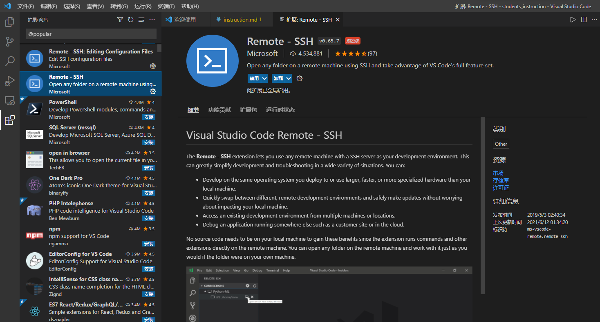
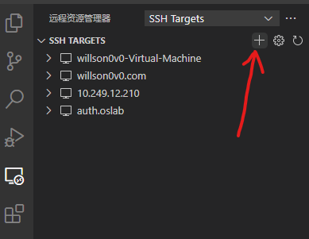
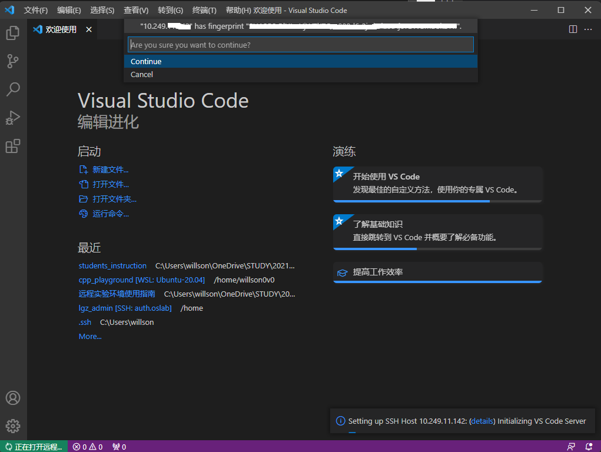
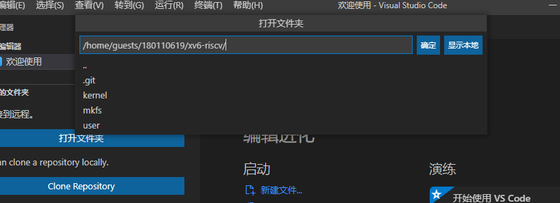

# 远程实验环境使用指南

!!! warning "通知"
    严禁使用远程实验环境做与教学无关事宜，杜绝使用公共资源挖矿等，一经发现将严肃处理，感谢配合！

## 0 速查信息

远程实验平台IP地址： `10.249.12.98` ，端口号： `6666`

!!! info ""
    - **登录与认证** ：用户名和初始密码都是 **你的学号** 。出于安全考虑，建议你初次登录后修改初始密码。
    - **实验资源** ：平台已为每位同学分配了专属的4GB存储空间，专用于本课程实验。请注意，你只有非root权限，这意味着你不能执行需要root权限的操作，例如安装未经许可的软件。请务必遵守使用规定，勿将平台用于与本课程无关的其他操作。
    - **实验准备** ：登录平台后，下载实验所需的代码，即可开始你的实践之旅。请仔细阅读实验指导，确保实验过程顺利进行。
  
    如果遇到问题，请寻求助教或老师的帮助。


&emsp;&emsp;远程实验平台共有8个计算节点，每一个计算节点都提供相同的服务，可能你每次登录的计算节点会不一样，但无须担心，你看到的文件都是一样的。

<div align="center">  </div>

## 1 快速入门

### 1.1 环境准备

&emsp;&emsp;需要配合远程实验平台使用的软件：

- Visual Studio Code（必须）
- MobaXterm（推荐）

#### 1.1.1 如何安装Visual Studio Code？

&emsp;&emsp;打开Visual Studio Code的[官方网站](https://code.visualstudio.com/)，点击中间的“Download for Windows”下载它的安装包。双击运行安装包，并完成安装即可。你可以从开始菜单找到新安装上的Visual Studio Code。

### 1.2 连接到实验平台

#### 1.2.1 将Visual Studio Code连接到实验平台

&emsp;&emsp;Visual Studio Code安装完成后，从开始菜单打开它。我们需要安装Remote - SSH插件。点击VSCode左侧扩展(extension)按钮，在搜索框中键入“remote ssh”，点击Remote - SSH插件，并安装。



&emsp;&emsp;左侧边栏应该会多出一个这样的图标：
点击这个图标，选择SSH TARGETS右侧的`+`号：


<div align="center">  </div>

&emsp;&emsp;这会在屏幕上方中央弹出输入框，要求输入ssh指令。在这里输入`ssh 你的学号@远程实验平台IP -p 端口号`，例如`ssh 200110101@10.249.12.98 -p 6666`就是学号为200110101的同学希望连接到远程实验平台。


&emsp;&emsp;输入完成后，按下回车。如果弹出下图所示的界面，则再次按下回车：


&emsp;&emsp;现在，SSH Target添加成功，左侧SSH Target中应该增加了一栏。将鼠标移上去，点击这一栏右侧的小图标：

<div align="center">  </div>


&emsp;&emsp;这会打开一个新的VSCode窗口。新打开的窗口会要求你选择目标机器的平台，选择Linux，按下回车：


&emsp;&emsp;如果如下图所示要求你确认是否连接，则再次按下回车：



&emsp;&emsp;接下来，它会要求你输入密码。**初始密码即学号**。


&emsp;&emsp;最后一次按下回车。如果没有更多提示，左下角显示`SSH: 实验平台的IP地址`，说明连接成功。


&emsp;&emsp;现在，点击下方的“终端”按钮，打开终端：


&emsp;&emsp;出于安全考虑，我们首先修改默认密码。点击终端，在其中键入以下内容，并回车：

```bash
passwd
```

&emsp;&emsp;此时，它会要求你输入旧密码。旧密码（即默认密码）为你的学号。完成后回车。
随后，它会要求你输入新密码，并进行确认。


<div align="center">  </div>

&emsp;&emsp;接下来，我们将存放xv6-oslab24-hitsz复制到自己的工作空间。
在终端中键入以下内容，并回车：

```bash
git clone https://gitee.com/ftutorials/xv6-oslab24-hitsz.git
```

&emsp;&emsp;你应该会看到这样的输出：

```none
Cloning into 'xv6-oslab24-hitsz'...
done.
```

&emsp;&emsp;这代表你已经将xv6的副本下载到自己的工作空间了。接下来，你可以点击左侧边栏最上面的按钮，并打开文件夹：


&emsp;&emsp;在弹出的菜单中，选择`xv6-oslab24-hitsz`，并按下“确认”：



&emsp;&emsp;再次输入密码，按下回车确认，并信任作者。


&emsp;&emsp;你初步完成了对工作区的设置。接下来，我们可以测试xv6能否正常编译、执行。
如果下方未显示终端，点击上方菜单“查看”-“终端”，或者按下Ctrl-\`（**注意：\`不是‘（单引号），是键盘左上角的那个按键。**）以打开终端界面。


&emsp;&emsp;由于每个实验项目都在不同的分支上完成，请同学们 **注意切换分支** ，例如，实验一需切换到util分支后进行开发。在新弹出的终端中，输入下面的命令，

```bash
git checkout util
```


然后，输入下面的命令，以编译并在QEMU中运行xv6：

```bash
make qemu
```

&emsp;&emsp;如果看到许多输出，并最终停留在这个输出上：

```none
xv6 kernel is booting

hart 2 starting
hart 1 starting
init: starting sh
$
```

&emsp;&emsp;那么说明你的环境已经配置完成。

!!! tip "请记住QEMU的退出方法"
    **先按“`Ctrl+a`”组合键，接着松开所有按键。再按下“`x`”键** 。

    &emsp;&emsp;命令解释：
    “`Ctrl+a`”组合键，用于激活QEMU的全局命令模式。松开所有按键。然后，按下x键，这样将直接终止QEMU进程，返回到你启动QEMU的Shell或命令行界面。

    &emsp;&emsp;如果在退出QEMU时遇到任何问题（如QEMU进程无法终止），你可能需要使用kill命令来强制结束QEMU进程。你需要重新开启一个Linux Terminal命令行终端界面，输入如下命令，把与自己有关的进程全kill：

    ```shell
    $ killall -u id
    ```

    &emsp;&emsp;`killall -u id`中的`id`应该替换为`你的学号`。


#### 1.2.2 实验常用git命令

&emsp;&emsp;之后同学们每次实验的打开方式可能就是：打开VSCode，登录远程实验平台（或者登录自己搭建的环境），打开终端，进入 `xv6-oslab24-hitsz` 文件夹，然后输入以下的命令:

```bash
git pull    # 将远程仓库的进度同步到本地
git checkout 本次实验对应的分支名称    # 切换到本次实验对应的分支
```

&emsp;&emsp;中间可以check一下git的状态(确保在 `xv6-oslab24-hitsz` 文件夹下)

```bash
git status  # 会显示哪些文件被修改了，被修改的文件是否加入了暂存区等信息
```

&emsp;&emsp;写完代码之后,

```bash
进入到xv6-oslab24-hitsz文件夹
git add .    # 将当前文件夹及其子文件夹下所有被修改或添加的文件加入到暂存区。如果想单独加入某些文件，可以将 . 替换为具体的文件名或路径
git commit -m 做了哪些工作和改动（记得用""括起来）  # 将暂存区的修改进行提交
make diff   # 生成commit.patch，记得和实验报告一起提交哦
```

&emsp;&emsp;如果遇到问题，请询问老师或助教。


## 附录

### 一些进阶指引

#### 使用ssh密钥快捷认证

&emsp;&emsp;有没有感觉每次都要输入密码非常麻烦？ssh密钥可以让认证流程自动化，大大解放双手。在 **本地** windows下，以管理员身份打开CMD，输入

```bat
ssh-keygen
```

&emsp;&emsp;跟随指引，一路回车，便可完成ssh密钥的生成。**请务必保存好自己的私钥，不要泄露！**


&emsp;&emsp;接下来，我们将私钥加入到自己的身份认证中。在终端继续输入：

```bat
ssh-add 你的私钥的完整路径
# 例如，如上图所示，我应该键入ssh-add C:\Users\willson\.ssh\id_rsa_priv_20210909
```

&emsp;&emsp;在你的Windows上将公钥文件打开（用你喜欢的纯文本编辑器，比如记事本或者VSCode），复制其中的内容。

&emsp;&emsp;最后，登录你想要快捷认证的远程实验平台终端，并执行下面的命令：

```bash
mkdir -p ~/.ssh
vi ~/.ssh/authorized_keys
```

&emsp;&emsp;这会打开一个文件编辑界面。按下`i`按键，进入编辑模式，并粘贴到上面远程实验平台终端中编辑界面的一个新行里。按下`Esc`，按下`:wq`可保存并退出。如果不放心，可以`cat ~/.ssh/authorized_keys`并检查输出和你刚才贴进去的是不是一样的。
配置完成后，下次你从Windows登陆时，应该就无需密码认证了。

#### Visual Studio Code：进阶使用

&emsp;&emsp;有没有怀念Visual Studio、CodeBlock等IDE中便捷的一键运行功能？没关系，完备的插件市场配合自动化脚本可以完成你的一切功能需求！
*下略：感兴趣的话可以了解一下Intelli Sense、MakeFile以及VSCode中的Task。*

### Q&A

#### 为何要使用远程实验平台？

&emsp;&emsp;主要是实验搭起来比较麻烦。有几个选项可以选择：

1. 搭建一台Linux虚拟机。
2. 在自己电脑上启用WSL（Windows Subsystem for Linux）。
3. 整一台运行Linux的电脑——都可以。
   
   但是都挺麻烦。我们帮你把配置的麻烦事先做完了，于是你就可以专心于实验本身。无论你的电脑性能如何，无论你是在宿舍、实验室还是自习室，只要你还能连上校园网，你就能完成你的实验。

### Troubleshooting

#### 我不是Windows 10系统，这会带来什么问题吗？

##### 我在使用Linux/macOS？

&emsp;&emsp;Visual Studio Code也有Linux版和macOS版，具体操作大同小异，毕竟环境主要在服务器上。

##### 我正在使用旧的Windows版本/我没有更新我的Windows 10系统？

&emsp;&emsp;请更新你的系统。使用过时的系统有各种各样的风险，其中最大的是与时代脱轨。

##### 我正在使用Windows 11？

&emsp;&emsp;这篇教程完全兼容Windows 11。笔者正在用的就是Windows 11。

#### 我输入的所有命令看起来都是对的，但是为什么运行失败了？

##### 全角标点符号/英文字符？

&emsp;&emsp;确保你输入的是正常的半角英文字符与英文标点符号，如图所示：

<div align="center">  </div>

&emsp;&emsp;这可以通过一起按下shift+空格，或者切换到英文输入法解决。**永远不要在中文输入法下输入命令！**

#### 如何退出XV6？

&emsp;&emsp;同时按下`Ctrl + A`，接着全部松开，再按下`x`以退出QEMU。

#### VSCode连接远程实验平台时出现bad owner or permission报错？

&emsp;&emsp;解决方法：进入路径C:\Users\用户名\.ssh，右击config文件进入属性中高级安全管理，选择禁止继承，并且删除所有此对象中继承的权限。

&emsp;&emsp;具体可以查看：https://www.cnblogs.com/Akkuman/p/11187776.html
