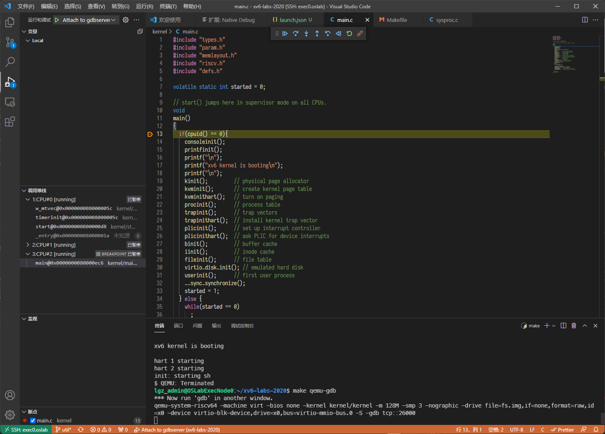
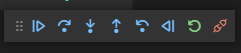
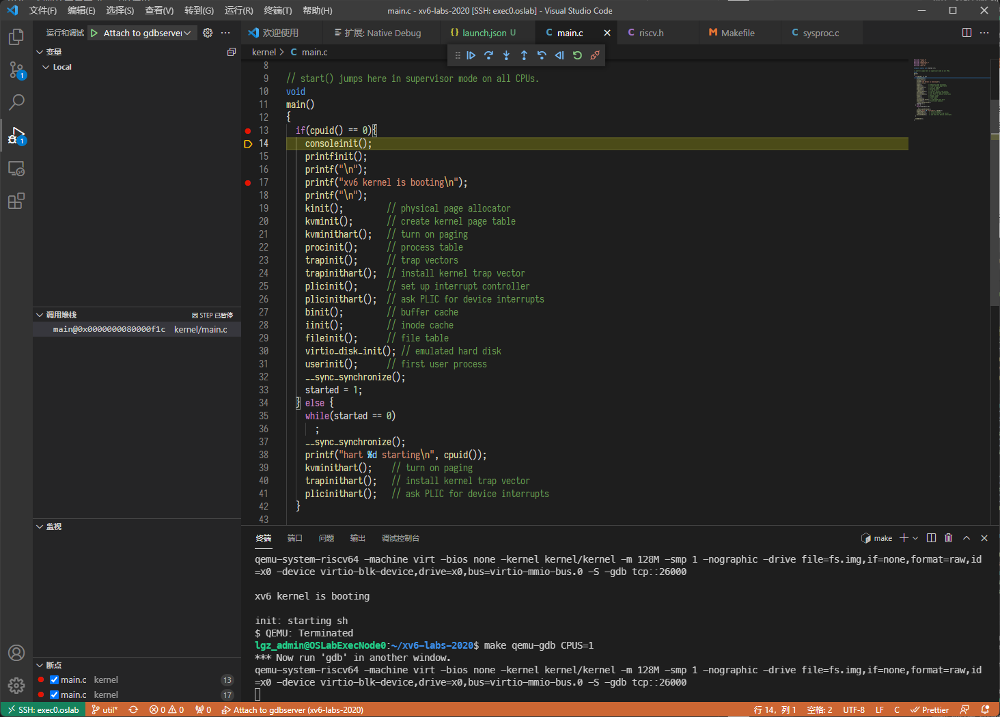
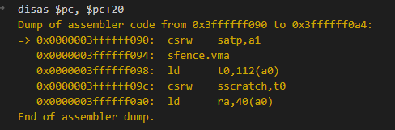
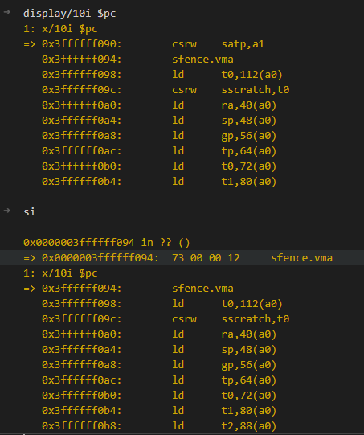
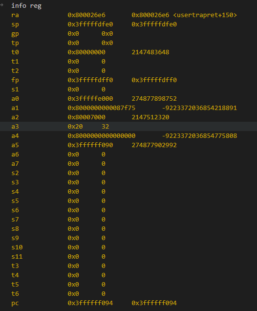
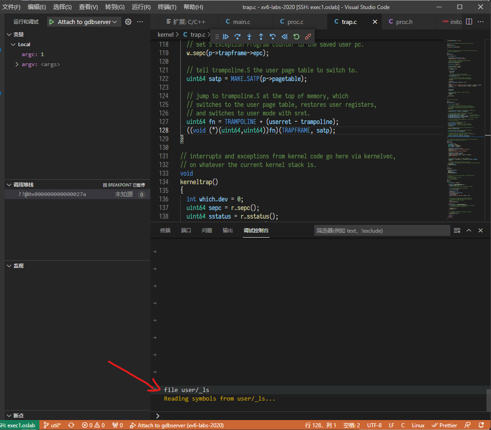

# 远程实验平台环境图形化调试指南

!!! note "调试说明"
    通常来说，使用简单粗暴的`printf大法`（在特定的地方打印日志）就能够处理绝大多数的bug。但是对于大型的项目开发或数量超多的源码，printf大法就不能快速地去定位问题所在。功能强大的GDB调试是Linux系统下的一个程序调试利器，使用GDB调试可以说是作为Linux下的程序员应当要掌握的一大技能。然而，GDB因其命令行的方式想必会挡住了一大波同学，默默地继续使用printf。那有没有带图形化调试界面的调试方法呢？

    接下来，我们为同学们介绍调试手段的重头戏：使用VS Code来调试xv6 ：）  


!!! warning "注意事项"
    如果不想使用VS Code调试，还是想在远程实验环境使用gdb命令行的同学，请使用可以支持多种硬件体系架构的“gdb-multiarch”而非“gdb”或者“riscv64-unknown-elf-gdb”。

    1. 打开终端，到xv6-labs-2020目录下输入：
    
    ```bash
    make qemu-gdb
    ```
    
    1. 打开另外一个终端，到xv6-labs-2020目录下输入
    
    ```bash
    gdb-multiarch
    ```    
    
    


使用远程实验平台和VS Code，可以方便快捷地使用图形化界面完成调试功能。以下是设置步骤。

## 1. 设置GDB信任

在终端中，输入：

```bash
echo "set auto-load safe-path /" >>  ~/.gdbinit
```

这会关闭gdb的autoload信任机制——别担心，你们没有管理员权限，搞不坏远程环境的。

## 2. 获取专属GDB端口号

接下来，获取你专属的GDB端口号。在控制台输入`expr $(id -u) % 5000 + 25000`并回车，你应该能得到一串数字：

```shell
ldap_example@OSLabExecNode0:~$ expr $(id -u) % 5000 + 25000
25001    // ← 这个
```

请记好这串数字，后面会用到。

## 3. 设置VS Code

首先 **确认你的VS Code工作区路径是否是你的xv6路径，没有额外嵌套一层文件夹** 。按下`` Ctrl+` ``，呼出终端，输入`ls`。你应该会看到如下情景：

```console
ldap_example@OSLabExecNode0:~/xv6-labs-2020$ ls
conf  fs.img  grade-lab-util  gradelib.py  gradelib.pyc  kernel  LICENSE  Makefile  mkfs  README  user
```

如果不是，打开新的工作区，选择xv6所在的文件夹打开即可。

**在VS Code左侧，点击扩展选项，搜索、安装`Native Debug`插件** ，点击安装：


!!! note "插件推荐"
    同时，我们也强烈推荐你安装VS Code的C/C++插件。这会给你带来自动补全、Ctrl-点击跳转等各种方便的功能。

在VS Code左侧，点击“运行和调试”选项，如图：


选择`创建launch.json文件`，选择GDB。


这会打开一个名为`launch.json`的文件。将其中内容全部替换为如下：

```json
{
    "version": "0.2.0",
    "configurations": [
        {
            "type": "gdb",
            "request": "attach",
            "name": "Attach to gdbserver",
            "executable": "${workspaceRoot}/kernel/kernel",
            "gdbpath": "gdb-multiarch",
            "remote": true,            
            "target": "127.0.0.1:此前你得到的GDB端口号",
            "cwd": "${workspaceRoot}",
            "setupCommands": {
                "text": "source ${workspaceFolder}/.gdbinit"
            }
        }
    ]
}

```

其中，第十行`"target": "127.0.0.1:此前你得到的GDB端口号",`第二个冒号后中文内容 **替换** 为此前你通过`expr $(id -u) % 5000 + 25000`得到的数字，比如25001。Ctrl+S以保存。

如此，配置便宣告完成，可以使用。

## 4. 基础使用教学

!!! warning "注意"
    默认启用的是xv6内核的调试。若要调试用户程序，方法参见下方[4.4.4 用户态程序调试](#444)节。

为演示起见，我们在`kernel/main.c`的第13行打下一个断点，如图。

断点可以靠使用鼠标点击行号左侧设置。

在下方命令行输入`make qemu-gdb`。qemu会自动启动，gdb开始等待接入。按下F5， **或者** 点击左侧按钮运行与调试，并点击左上角绿色三角（Attach to gdb)：


现在，内核成功运行，并且停止在了断点处，如图所示：

这证明了我们的配置与GDB运行正常。

上方的数个按键，分别是“运行”、“单步跳过（下一行）”，“单步调试（步入函数）”，“单步跳出（跳出函数）”，“回退（不支持）”，“反向（不支持）”，“重启（不支持）”，“断开”，如下所示：


!!! tip "注意"
    每次调试完成，务必使用红色按钮 **断开** GDB调试，并在命令行中 `Ctrl-A, X`以停止qemu。

!!! note "注意"
    运行时不应对源文件进行任何修改。此时修改并无任何意义。如果需要更改程序，请停止调试、完成修改再重新开始调试。

点击单步，你可能会发现语句飞的到处都是。这是因为，xv6实验时默认是开启多核处理的。如下图左侧所示，现在有三个线程在同时运行，代表三颗CPU核心：


!!! warning "注意"
    如果不想开启多核心，可以在运行`make qemu-gdb`时使用`CPUS=1`，以单核模式启动，即输入命令变为`make qemu-gdb CPUS=1`。

!!! tip "注意"
    开启多核心是许多lab检查的必要条件，因为有些lab下需要处理多核心之间竞争问题。手动指定CPUS仅用于调试用途，如果你提交的代码仅可在单核下运行、而不能在通常情况下运行，你将无法得到分数或只能得到部分分数。此时你应当关注锁与竞争相关的问题。

为了便于演示起见，后续以单核模式执行。

### 4.1 单步跳过

左侧第二个按钮为单步跳过（向下一行）按钮。点击它可以让程序向下运行一行。如下所示为初态：


按下单步跳过按钮，则程序向下执行一行：



### 4.2 断点功能

运行时也可设置断点。程序将在运行到断点时停止。点击行号左侧即可设置断点。以该状态为初态，我们可以发现在17行处有一个未触发的断点：


点击“运行”（左侧第一个按钮），程序将自动运行到下一个断点并停止：


从输出可见其输出了一个回车，并停止在了该语句执行之前。

### 4.3 单步调试（步入函数）、单步跳出与局部变量

上回我们停在了一个`printf`处。我们现在将进入`printf`函数内部进行研究。我们点击单步调试按钮（左数第3个），这会带我们进入`printf`函数的第一条可执行语句：


此时，左上角会显示当前的局部变量。`<optimized out>`表明其已被优化掉不可见，这有可能因为其 **暂时尚未被初始化** 。如图，继续使用单步跳过（下一行），进入第78行，我们会发现部分此前显示`<optimized out>`的变量已经可见：


复杂的变量（如结构体）可以展开以查看内容。

当你完成该函数处的调试与研究，可以点击单步跳出（左侧第4个按钮）以跳出该函数。如图，命令行处显示对应信息，表明该函数已被执行完成；调试器现在停在了函数外：


### 4.4 略微高级一点的技巧

以上内容皆可依靠GUI完成，并且已经可以覆盖绝大多数需求。如果你需要其他一些高级功能，或者仅仅只是想要了解更多——欢迎。
这部分将更为简短，并且默认你们拥有一定程度的前置知识。
以下内容均需要通过调试控制台操作。


#### 4.4.1 单步汇编调试、汇编显示

我们以Trampoline处的调试作为示例。我们可以进入userret处：


单步跳过该指令，进入trampoline的userret。通过`disas $pc, $pc+20`，可以显示接下来20byte的汇编指令，可以发现我们确实进入了userret处：



或者使用`display/10i $pc`可以让gdb持续自动显示从pc起的10条指令。



!!! tip "注意"
    这里直接`b uservec`是不可行的，这是由Trampoline的特殊性导致的。可以自行阅读、理解一下为什么。

#### 4.4.2 寄存器内容分析

使用`info reg`可以显示当前CPU的寄存器。



#### 4.4.3 内存内容

使用`x/字节数b *地址`可以展示内存内容：


#### 4.4.4 用户态程序调试

xv6的内核态和用户态并不共享页表，调试符号也完全不同。调试用户程序需要加载对应的用户程序调试符号，我们将通过调试控制台完成这一项操作。我们以调试自带的用户程序“ls"为例。  

首先，我们需要确认对应xv6的用户程序入口点，我们有两种方法可以确认应用程序的入口点：

1. 通过readelf确认应用程序入口点。
2. 在VSCode上直接打开该应用程序的源代码，找打main()函数，并在main()函数里打上断点。

以下分别介绍两种方法：

!!! summary  "**方法一:**  通过readelf确认应用程序入口点"
    ls的elf文件位于`user/_ls`：

    ```console
    lgz_stu@OSLabExecNode1:~/xv6-labs-2020$ readelf -h user/_ls
    ELF Header:
      Magic:   7f 45 4c 46 02 01 01 00 00 00 00 00 00 00 00 00 
      Class:                             ELF64
      Data:                              2's complement, little endian
      Version:                           1 (current)
      OS/ABI:                            UNIX - System V
      ABI Version:                       0
      Type:                              EXEC (Executable file)
      Machine:                           RISC-V
      Version:                           0x1
      Entry point address:               0x27a
      Start of program headers:          64 (bytes into file)
      Start of section headers:          25064 (bytes into file)
      Flags:                             0x5, RVC, double-float ABI
      Size of this header:               64 (bytes)
      Size of program headers:           56 (bytes)
      Number of program headers:         1
      Size of section headers:           64 (bytes)
      Number of section headers:         18
      Section header string table index: 17
    ```
    
    可见其中显示`Entry point address: 0x27a`，应用程序入口点位于`0x27a`处。随后，我们用上面的方法开始调试，并将断点打在即将返回用户态处。
    检查当前即将被运行的进程名，在即将进入对应用户程序（ls）的时候，准备进行用户态程序调试。我们知道，在进入Trampoline切换前最后一行C代码位于`kernel/trap.c:128`处，我们将断点打在此处，并通过局部变量`p`监视当前进程   的进程名`p.name`，如图所示：
    
    
    
    如左下角所示，我们可以发现，xv6第一个执行的用户程序为`initcode`，并非我们正在寻找的`ls`。我们可以继续执行，并在xv6的shell中输入`ls`，以启动`ls`程序；持续执行，直到我们将首次进入`ls`执行：
    
    
    
    由此可见，内核即将首次返回并执行用户程序`ls`。我们前往调试控制台，在其中输入`b *0x27a`，即将断点置于`ls`程序入口处：
    
    

    接下来，继续执行，qemu将从内核态返回到用户态并停止在`ls`的入口点处。

!!! info  "**方法二:**  在应用程序的源代码main()函数打断点"
    在VSCode中，打开user/ls.c文件，找到main()函数，在第76行打上断点。
    
    
    
    在进入Trampoline切换前最后一行C代码位于kernel/trap.c:128处，我们将断点打在此处。xv6第一个执行的用户程序为initcode，并非我们正在寻找的ls。我们可以继续执行，直到在xv6的shell中输入ls，以启动ls程序。

    


通过上述两个方法都可以确认应用程序的入口点，将断点打在应用程序的main()上。
接下来，我们需要在调试窗口左下角删除原有的内核态断点，并通过调试控制台，加载`ls`的调试符号。在其中输入`file user/_ls`：




此时，可以在user/ls.c文件中直接打上断点，下图是在user/ls.c中的第78行打断点。


接下来，继续执行。qemu将停止在`ls`程序的第78行。


输入`disas $pc, $pc+24`检查当前正在执行的汇编指令，并与`ls.asm`反编译结果相对照，我们可以确认，我们已经成功进入`ls`程序的用户态调试流程；输入`p argv[0]`可见其内容为`ls`：


点击上方的单步调试按钮，我们发现vscode的GUI调试工具现也以可以正常工作。


此后的各种调试流程与调试内核时相同。

#### 4.4.5 其他...

剩下的可以自行寻找GDB的手册。此外，由于我们的实验运行在qemu上，且使用的是较为新颖的RISC-V架构，故而常常会有不支持或者错误的情况发生，这是正常的。同学们可以试试自行解决问题。

